# Dataset-scale checkpoint-sweep evaluation visualizations

This folder contains report-ready visualizations for the v020–v024 real-robot checkpoint-sweep evaluations. Each checkpoint-sweep cell uses 20 episodes, so Wilson 95% confidence intervals are intentionally shown where the figure supports statistical interpretation.

## Canonical mapping

| Version | Dataset | E2 | E4 | E6 | E8 | E10 | E12 |
|---|---:|---:|---:|---:|---:|---:|---:|
| v021 | 48 ep | `3619` 0/20 (0%) | `7238` 0/20 (0%) | `10857` 1/20 (5%) | `14476` 0/20 (0%) | `18095` 0/20 (0%) | `21716` 2/20 (10%) |
| v022 | 96 ep | `7032` 0/20 (0%) | `14064` 2/20 (10%) | `21096` 1/20 (5%) | `28128` 4/20 (20%) | `35160` 4/20 (20%) | `42197` 2/20 (10%) |
| v023 | 192 ep | `14043` 4/20 (20%) | `28086` 4/20 (20%) | `42129` 6/20 (30%) | `56172` 6/20 (30%) | `70215` 6/20 (30%) | `84258` 7/20 (35%) |
| v024 | 383 ep | `27990` 6/20 (30%) | `55980` 12/20 (60%) | `83970` 11/20 (55%) | `111960` 13/20 (65%) | `139950` 13/20 (65%) | `167940` 14/20 (70%) |
| v020 | 765 ep | `80000` 12/20 (60%) | `110000` 13/20 (65%) | `170000` 18/20 (90%) | `220000` 18/20 (90%) | `280000` 19/20 (95%) | `336940` 19/20 (95%) |

All canonical heatmap cells are backed by parsed checkpoint-sweep entries. The v020 80k run is included as 12/20 (60%).

## Figures and report captions

### Main overview heatmap

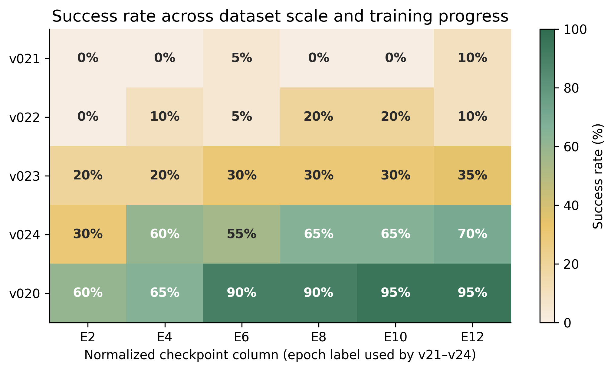

**Why this representation matters.** Shows success rate by dataset scale and normalized checkpoint. This is the clearest thesis figure: increasing dataset coverage produces a strong performance jump, and v020 full data dominates.

### Heatmap with Wilson intervals

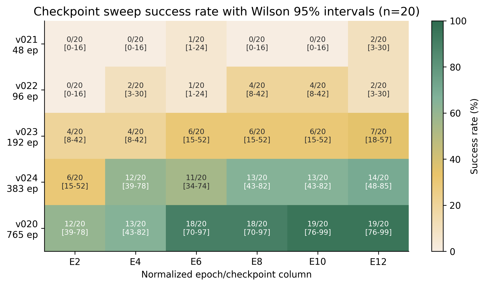

**Why this representation matters.** Adds the n=20 uncertainty directly in each cell. It matters because adjacent differences can be visually tempting but statistically weak; the broad v020 vs subsample gap is the robust message.

### Normalized learning curves

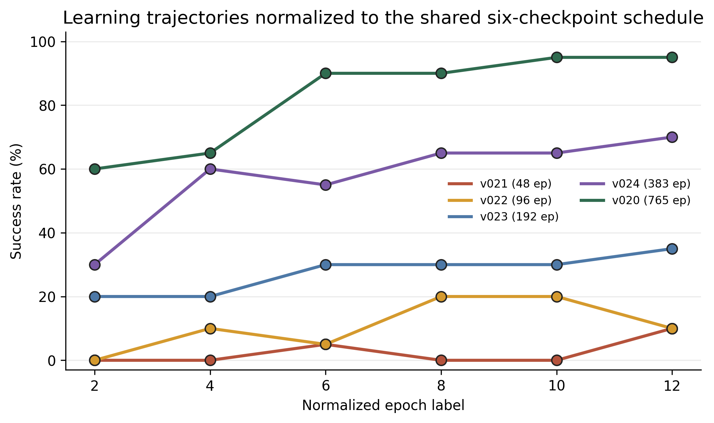

**Why this representation matters.** Compares learning dynamics on the shared six-column schedule. It emphasizes that v020 is already strong early and that v024 continues improving, while v021–v023 remain lower.

### Raw-step learning curves

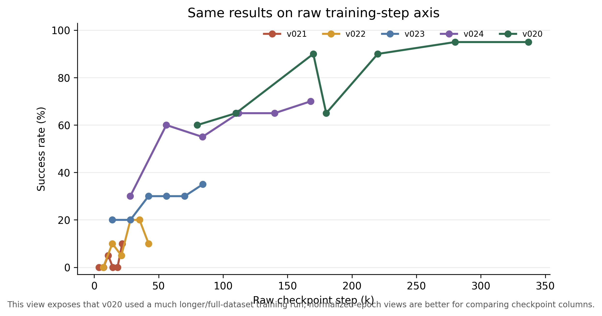

**Why this representation matters.** Shows the same data without epoch normalization. It matters as a transparency figure: v020 used much larger raw step counts, so normalized and raw views answer different questions.

### Best SR versus dataset size

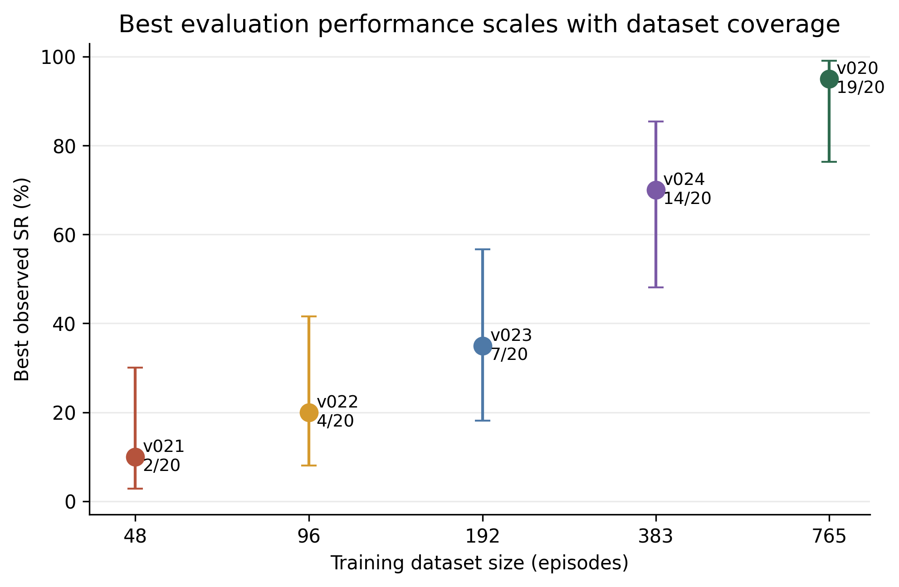

**Why this representation matters.** Tests the dataset-scaling hypothesis directly. The log-scaled x-axis highlights that performance improves with more demonstrations, with the full dataset reaching 95%.

### Final versus best checkpoint

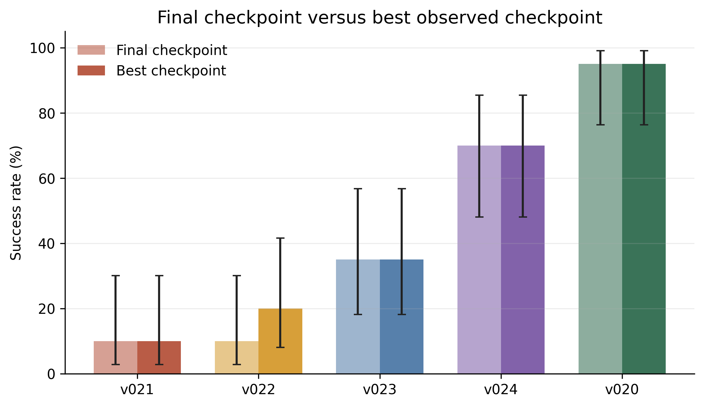

**Why this representation matters.** Separates final checkpoint performance from peak observed performance. This prevents over-claiming when a model peaks before the final saved checkpoint.

### Improvement after first checkpoint

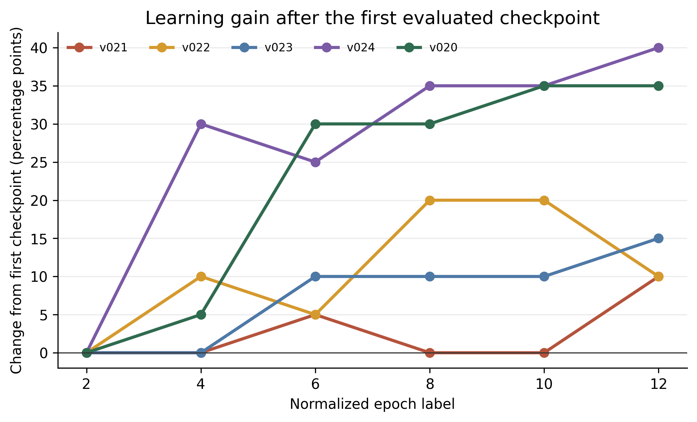

**Why this representation matters.** Shows whether performance comes from more training or from dataset coverage. Large gains in v020/v024 suggest continued training helps once enough data exists.

### Scene-type robustness

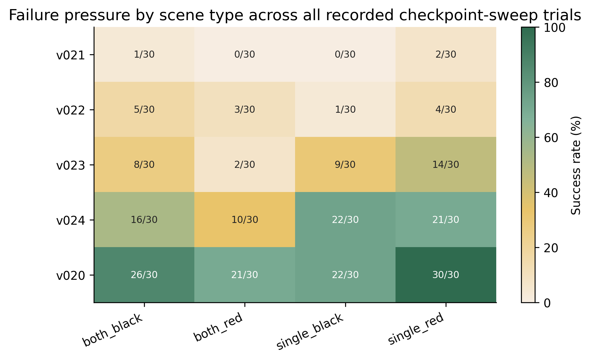

**Why this representation matters.** Aggregates failures by single-cup versus dual-cup scene. This probes whether errors are language/color selection failures or lower-level manipulation failures.

### Episode duration by outcome

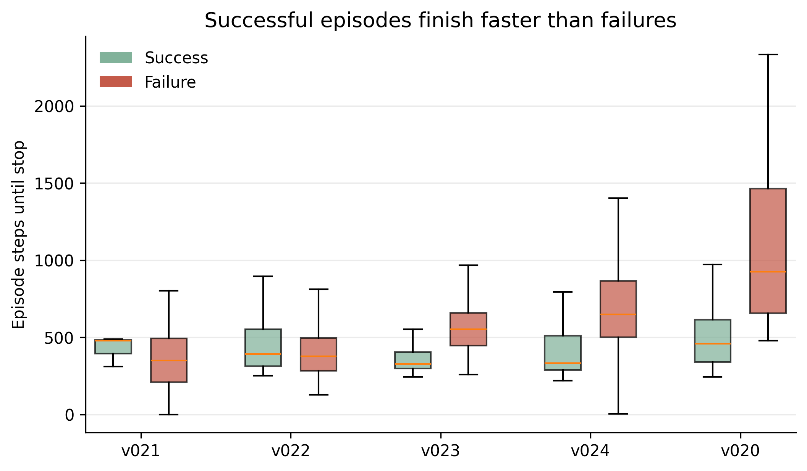

**Why this representation matters.** Compares steps taken for successes and failures. Longer failures indicate retry/placement difficulty rather than immediate perception collapse.

### Fixed-trial outcome matrix

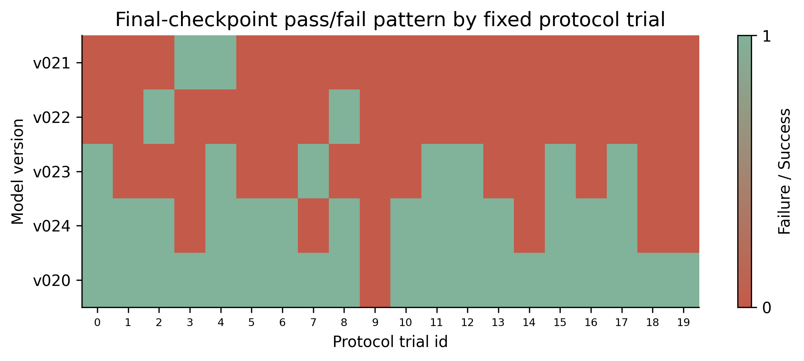

**Why this representation matters.** Shows which protocol trials fail at final checkpoints. Since the protocol is fixed, recurring columns identify hard cases rather than random noise.

### Spatial outcome scatter

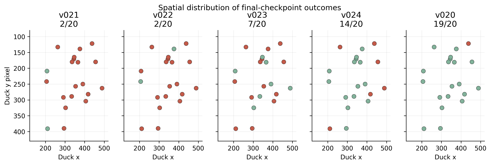

**Why this representation matters.** Maps failures onto initial duck positions. This tests for workspace-region bias and helps diagnose spatial generalization limits.

### Orientation sensitivity

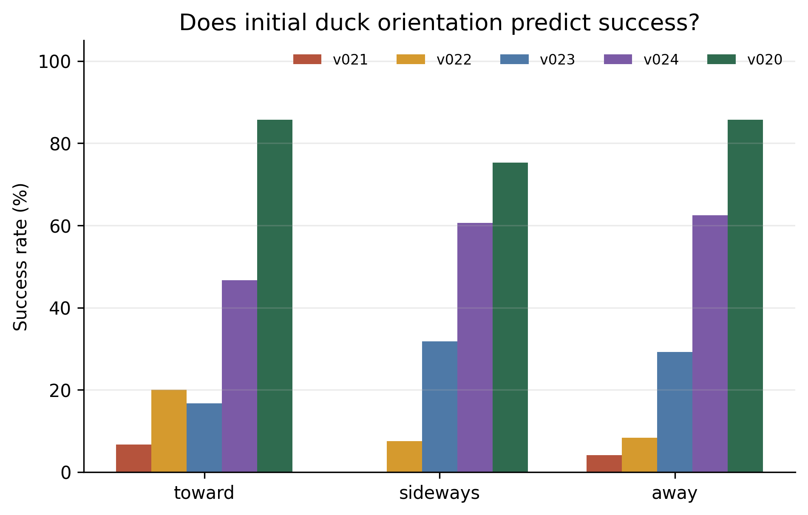

**Why this representation matters.** Groups trials by whether the duck initially points toward, sideways, or away from the target cup. This probes an orientation-dependent manipulation hypothesis.

### Target side robustness

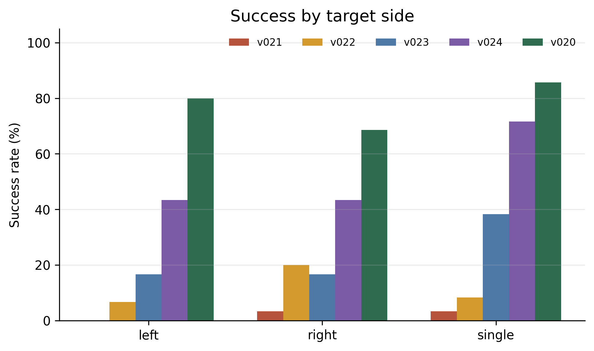

**Why this representation matters.** Tests whether left/right target position affects performance in dual-cup scenes.

### Closer/farther target robustness

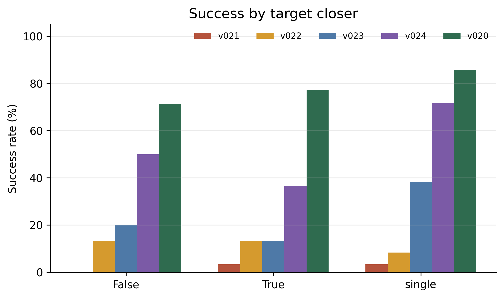

**Why this representation matters.** Tests whether the closer cup creates ambiguity or easier/harder reaches.

## Statistical caution

Each checkpoint-sweep cell has n=20. Wilson intervals are therefore wide: a 5–10 percentage-point difference should not be treated as meaningful by itself. The report should emphasize large, repeated patterns: full-data v020 greatly outperforms small subsamples; v024 is the strongest subsampled model; and many failures persist as manipulation/placement difficulty rather than simple scene recognition failure.
