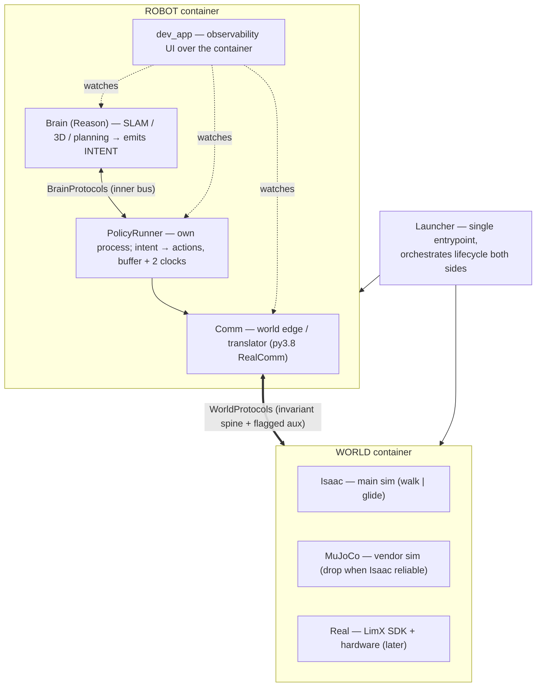
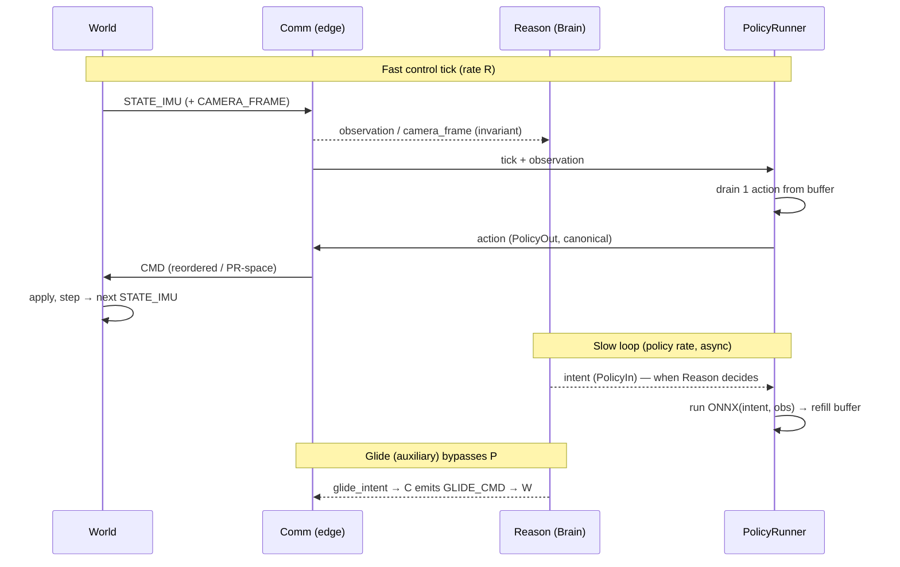

# Humanoid (Oli) — Architecture

## 1. Overview

The system splits into two independent containers that talk **only** through a Communication Protocol: the **World** — where the robot's body lives and acts (Isaac, MuJoCo, or the real robot) — and the **Robot** — the software that senses, decides, and acts (Communication, Brain, PolicyRunner). The guiding rule is **world-invariance**: the Robot's decision-making has zero knowledge of which World it runs in. Build the intelligence once; deploy it unchanged across sim and real.

## 2. The core principle — World/Robot invariance

The Robot decides on a **fixed set of inputs** and emits a **fixed set of outputs**, identical in every World. It never assumes a coordinate frame, joint order, or unit — it emits its intent, and the **Communication layer performs semantics-preserving transforms** so that intent is reliably executed in whichever World is attached. All world-specific work (reordering joints, unit conversion, PR-space mapping) lives in Communication; the World only *applies* what Communication prepares.

Two classes of contract enforce this:

- **BrainProtocols** — inner, fully fixed and world-invariant: the data the Brain consumes to decide (images, joints, sensors) and the decisions it emits (actions, commands, speech).
- **WorldProtocols** — the Robot↔World edge: an **invariant spine** (In/Out signals kept identical across all Worlds) plus **explicitly-flagged auxiliary** interfaces (e.g. glide) that are *not* invariant and must never be mistaken for the spine.

A violation — the Brain importing anything world-specific, or reading data one World has but another can't — is a **test failure**, not a style note.

## 3. Container map

**World container** — the body and its physics. One World is attached at a time: Isaac (primary; two modes, walk and glide), MuJoCo (vendor reference; dropped once Isaac is reliable), or Real (LimX SDK + hardware, later). A World only *applies* prepared commands and reports raw state.

**Robot container** — the software, run as separate processes over an inner **dataflow bus** (specific bus TBD — see §7):

- **Comm** — the only world-aware layer; translates between the invariant Robot side and whatever World is attached. RealComm is py3.8 (the `limxsdk` ABI), so Comm is a forced-separate process.
- **Brain (Reason)** — the world-invariant decision layer (SLAM, 3D reconstruction, planning). Emits *intent*, never joint commands.
- **PolicyRunner** — its own process; turns intent into executable actions, owning the action buffer and the two clocks (§6).
- **dev_app** — a front-end that watches every node and bus edge; the UI over the whole Robot container, not a runtime peer.

**Launcher** — one command boots and supervises both containers; its flags set the initial run configuration (§9).

## 4. The outer contract — WorldProtocols (World ↔ Robot)

Everything crossing the World↔Robot edge travels one of **two physical channels**, and Communication is the only place they're produced/consumed on the Robot side:

- **Control channel** — `AF_UNIX` SEQPACKET, fixed-size frames (≤1 KB) — `logic/oli/comm/protocol.py`. Per-tick control + state.
- **Frame channel** — `AF_UNIX` SOCK_STREAM, length-prefixed variable frames — `logic/oli/comm/frame_protocol.py`. Large camera payloads (720p RGB ≈ 2.8 MB).

Messages (semantic contract name; `codec.py` maps dataclass ↔ wire):

| Wire msg | Contract | Dir | Class | Channel | Payload |
|---|---|---|---|---|---|
| `STATE_IMU` | `Observation` | World→Robot | **spine** | control | stamp; q/dq/tau ×31 (PR-space); acc[3]; gyro[3]; quat_wxyz[4] |
| `CAMERA_FRAME` | `CameraFrame` | World→Robot | **spine** | frame | stamp; name; w/h; intrinsics fx,fy,cx,cy; rgb; depth |
| `CMD` | `PolicyOut` | Robot→World | **spine** | control | stamp; mode/q/dq/tau/kp/kd ×31; parallel_solve_required ×31 |
| `GLIDE_CMD` | — | Robot→World | **aux (flagged)** | control | stamp; base twist v_x, v_y, w_z (body frame) |
| `HELLO` | — | Robot→World | handshake | control | 31 DOF names (World's joint order), once at startup |

- **The spine is world-invariant.** `STATE_IMU`/`CAMERA_FRAME` in, `CMD` out — identical for Isaac, MuJoCo, Real. Comm does the per-World transforms (joint reorder, unit/PR-space mapping) so the Robot side never varies.
- **`GLIDE_CMD` is the flagged auxiliary** (MAY-172): additive, glide-only, a base twist that *bypasses the joint policy* — the World integrates it into base motion. Explicitly **not** part of the spine.
- **`HELLO` is a startup handshake**, not per-tick traffic: the World declares its DOF names so Comm builds the joint-order map once.
- **`STATE_IMU` doubles as the control tick** — it arrives per physics tick, and its arrival is the pull signal that clocks PolicyRunner's fast drain (§6): sim-step in sim, wall-timer on real.
- **Schema-invariance across py3.8/py3.11:** all control frames are fixed `struct.pack` layouts (stdlib only, no isaacsim/limxsdk), so the RealComm edge (py3.8) and SimComm/brain (py3.11) produce byte-identical wire. `struct.pack` is the canonical layer.
- **Extensible by design.** The wire is versioned (2-bit version in the header) and the message set is **additive** — `GLIDE_CMD` was added this way without touching the walk frames. Future needs (voice/text I/O, new sensors, new command modes) get **new message types in the same style**: small fixed-size payloads on the control channel, large/variable ones (e.g. audio) on the frame channel. Each new message must be classified up front as **spine** (world-invariant — every World must satisfy it) or **flagged auxiliary** (not invariant, like glide).

## 5. The Worlds

Every World is an **independent process** that speaks WorldProtocols (§4): it *applies* incoming commands and reports raw state. One World is attached per run (`--world`, §9), and the Robot side is identical for all three — only the Communication *realization* differs.

**Isaac** (`logic/simulation/isaacsim/`) — the primary simulation. Runs py3.11 with a direct `SimComm` server (no `limxsdk`), speaking the AF_UNIX protocol natively. Cameras (D435i chest/head) are baked into the USD sensor layer and streamed on the frame channel (MAY-149). Two locomotion modes:

- **walk** — the LimX ONNX locomotion policy drives the joints (`PolicyOut`, the spine).
- **glide** — kinematic base-velocity locomotion (`GLIDE_CMD`, the flagged auxiliary): the World integrates the base twist directly, bypassing the joint policy.

**MuJoCo** (`logic/simulation/mujoco/`) — the LimX vendor sim, full contact fidelity; the reference for sim-to-sim fidelity checks (walkmatch). Reached through the py3.8 `limxsdk`/MROS Comm edge. Intended to be retired once Isaac covers walk.

**Real** (`logic/simulation/real/`) — the physical Oli, later. Just another World satisfying WorldProtocols: `RealComm` (py3.8 `limxsdk`) emits `Observation`/`CameraFrame` and applies `PolicyOut`. No special path in the Robot — by invariance, the Brain runs unchanged from sim to real. We wire only its Communication + hardware I/O; we can't code its physics.

**Communication realization per World.** Isaac speaks the AF_UNIX protocol directly (py3.11 `SimComm`); MuJoCo and Real both go through the py3.8 `limxsdk` edge (MuJoCo's edge *is* the proto-RealComm). So the py3.8/py3.11 version split lives entirely inside Communication — exactly where world-specifics belong. The Brain never sees it.

## 6. The Brain and the PolicyRunner

The Robot's intelligence is split into two processes on the inner bus, along a **WHAT / HOW** seam.

### Brain (Reason)

The world-invariant decision layer — perception and planning (SLAM, 3D reconstruction, motion planning, teleoperation). It consumes the inbound BrainProtocols (`Observation`, `CameraFrame`) and emits **intent** — the `PolicyIn` contract, the "WHAT" (a target, a direction, a task). It is lazy/bursty: it thinks at its own pace and never produces joint commands. Its internal submodule structure is **deliberately left open** (§11) and shaped as the reasoning stack is built.

### PolicyRunner

Its **own process** (`logic/oli/action/policy_runner.py`), the "HOW". It turns intent into executable joint actions and owns all action-execution timing via an **action buffer + two clocks**:

- **Slow clock** — runs the ONNX policy on the current intent + observation to produce a *chunk* of future actions, refilling the buffer. Runs at the policy's natural (lower) rate.
- **Fast clock** — drains one action from the buffer per control tick and emits it as `PolicyOut` → Comm → World. It is **clocked by the arrival of `STATE_IMU`** (§4), so control rate R is honored whether the tick source is a sim step or a real wall-timer.

Owning the buffer + clocks is *why* PolicyRunner is a separate process: the fast drain must tick reliably at R and must not be starved by a heavy Brain burst — crash-isolation and independent lifecycle follow for free.

### Policy selection and the glide bypass

- **Selection is Reason's job; execution is PolicyRunner's.** Reason decides *what* to do (and which policy that implies); PolicyRunner owns the model bank and *runs* it.
- **Glide bypasses the policy path.** In glide mode, teleoperation intent routes straight to Comm as `GLIDE_CMD` (flagged auxiliary), never entering the buffer/clock loop — which is exactly why glide is auxiliary, not spine.

## 7. The inner contract — BrainProtocols (on the dataflow bus)

Inside the Robot container the nodes — Reason, PolicyRunner, Comm, dev_app — talk over an **inner dataflow bus**: each publishes/subscribes on named topics. The bus is **brokerless/decentralized** — there is no central hub, and Comm is *not* one. Comm is only the World edge: it **bridges** outer WorldProtocols (§4) to/from invariant inner topics, and carries nothing else.

`BrainProtocols` are those inner topics — all world-invariant by construction:

| Topic | Contract | Producer → Consumer | Notes |
|---|---|---|---|
| `observation` | `Observation` | Comm → Reason, PolicyRunner | decoded from `STATE_IMU`, republished invariant |
| `camera_frame` | `CameraFrame` | Comm → Reason | decoded from `CAMERA_FRAME` |
| `tick` | — | Comm → PolicyRunner | control tick (from `STATE_IMU` arrival) that clocks the fast drain (§6) |
| `intent` | `PolicyIn` | Reason → PolicyRunner | the "WHAT" — target / direction / task |
| `action` | `PolicyOut` | PolicyRunner → Comm | canonical joint actions; Comm translates to `CMD` for the World |
| `glide_intent` | — | Reason/Teleop → Comm | glide-mode base twist; Comm emits it as the `GLIDE_CMD` auxiliary |

- **dev_app subscribes to every topic** — that's how it observes the whole container without sitting in the data path (§8).
- **Extensible like WorldProtocols.** New brain submodules add new topics; because the inner side is always invariant, every inner topic is invariant by construction (the spine/aux distinction only exists at the World edge).
- **The bus implementation is not yet chosen** (dora-rs / Zenoh+MCAP / custom) — see §11. The contract above holds regardless of which bus carries it.

## 8. dev_app

`dev_app` (`logic/oli/devapp/`) is the **front-end for the whole Robot container** — its window, not a runtime peer. It subscribes to every inner-bus topic (§7) and renders the container's live state: which data arrived on which topic, how each node processed it, the data-flow between nodes, and the artifacts of intermediate processing (detections, reconstructions, etc.). The Robot runs identically with or without it — it is the human window, not a required node.

- **Observer, outside the data path.** It reads the bus rather than tapping each module, so any new node/topic (§7) appears automatically — dev_app scales without changes.
- **Operator console.** It also hosts the interactive controls (teleoperation, mode) that publish onto the bus like any other producer.
- **Seeded by the Launcher.** Its initial configuration comes from the Launcher flags (§9) and can be changed live in the UI.

## 9. Launcher & lifecycle

A single command (`logic/oli/launcher.py`) boots and supervises the entire stack — both containers, every process, and the **scene** they run in. **Single entrypoint, always**: every subsystem — current or added later — boots through this one command; nothing gets its own entrypoint and there is never a multi-terminal dance.

**Flags** (extensible):

- `--world {isaac,mujoco,real}` — selects the attached World.
- `--scene <name>` — the environment/scene loaded into the World (ground-truth geometry + collision the robot navigates).
- `--mode {stand,walk,forward,glide}` — the run / locomotion mode.
- `--devapp {on,off}` — whether to launch the dev_app front-end.

**Process model.** A generic **Supervisor** spawns the World (with its scene) and the Robot-container processes (Comm, Reason, PolicyRunner, and dev_app if enabled), wires them onto the bus, supervises them, and on shutdown **reaps orphans** (a `limxsdk` crash can otherwise leave a subprocess holding a port — the launcher scans `/proc` to clean up). Per-World differences sit behind backend plugins; **new subsystems plug into the Supervisor**, so adding a capability extends this one boot rather than creating a new launch path.

**Args → initial state.** The Launcher flags pass straight through as the dev_app's initial configuration (§8), which the operator can change live.

## 10. The control tick, end-to-end

The **fast loop** runs at control rate R, pulled by each `STATE_IMU`:

1. The World reports `STATE_IMU` (and camera frames); Comm decodes them and publishes invariant `observation` / `camera_frame` / `tick` onto the bus.
2. On each `tick`, PolicyRunner drains one action from its buffer and emits `action` (`PolicyOut`).
3. Comm translates `action` into a world-specific `CMD` (joint reorder, PR-space) and sends it to the World, which applies it and steps — producing the next `STATE_IMU`.

Asynchronously, at the policy's own slower rate, Reason emits `intent` when it has a new decision and PolicyRunner's slow clock runs the ONNX policy to refill the buffer. In **glide** mode the loop is shorter: teleop `glide_intent` goes straight to Comm as `GLIDE_CMD`, bypassing PolicyRunner.

Every crossing into the World is where invariance becomes world-specific: the Robot side is identical for all Worlds; only Comm's translation differs.

## 11. Open questions / not-yet-decided

These are deliberately unsettled — treat anything below as provisional, not contract:

- **Inner bus implementation.** The dataflow-bus *direction* is decided (§7); the specific bus — **dora-rs** vs **Zenoh + MCAP** vs a **custom** in-process/socket bus — is not. The BrainProtocols contract holds regardless of which is chosen.
- **Brain internal structure.** The submodules of Reason (SLAM, 3D reconstruction, motion planning, and how they compose) are intentionally unshaped, and will be defined as that stack is built (§6).
- **Intent granularity.** The semantics of `PolicyIn` — how abstract "intent" is (a base velocity vs a navigation waypoint vs a task) — is open, and depends on the reasoning stack above.
- **Inner topic names.** The topic names in §7 are proposed, not final; they settle when the bus lands.
- **Observability stack.** Tracing is orthogonal to the bus (MCAP logs + rerun/Foxglove) and will be wired regardless of the bus choice; the exact tooling is not yet pinned.
