<div id="document-preview-preview" class="md-editor-preview default-theme md-editor-scrn">

# Oli EDU SDK Development Guide

| **Version** | **Date**   | **Description of Changes** | **Compatible Software** （If incompatible, update to the latest version via the Official Download Center） |
|-------------|------------|----------------------------|------------------------------------------------------------------------------------------------------------|
| V1.0        | 2026-02-27 | Initial Release            | V2.1.21 or later                                                                                           |
| V1.1        | 2026-04-22 | Added Audio Interface      | V2.2.11 or later                                                                                           |

# 1 Large Model API Interface

## 1.1 Built-in Models

| **Model**            | **Description**                                                                                                                                                                                                            |
|----------------------|----------------------------------------------------------------------------------------------------------------------------------------------------------------------------------------------------------------------------|
| **qwen2.5:3b**       | Developed by Alibaba Cloud, the Qwen 2.5 series model features 3 billion parameters, offering robust language understanding and generation capabilities, suitable for text generation and dialogue interaction.            |
| **qwen2.5:1.5b**     | A lighter 1.5 billion-parameter model from the Qwen 2.5 series, providing solid performance in resource-efficient scenarios with moderate computational demands.                                                           |
| **qwen2.5:0.5b**     | A lightweight 0.5 billion-parameter model optimized for terminal devices or environments with limited computational resources.                                                                                             |
| **llama3.2:3b**      | A 3 billion-parameter model from Meta’s LLaMA 3.2 series. It excels across a wide range of natural language processing tasks. Its open-source nature allows developers to perform secondary development and customization. |
| **llama3.2:1b**      | A 1 billion-parameter model from the LLaMA 3.2 series, offering faster training and inference speed due to its smaller model size.                                                                                         |
| **deepseek-r1:1.5b** | Developed by DeepSeek, this 1.5 billion-parameter model delivers competitive performance across multiple language processing tasks.                                                                                        |

## 1.2 Model invocation

> Oli has pre-deployed the above large models locally via **Ollama**. To invoke them, connect your device to the same network as the robot and follow the instructions below.

### 1.2.1 Invoke via Curl

```
curl http://10.192.1.3:11434/api/generate \
  -H "Content-Type: application/json" \
  -d '{
        "model": "qwen2.5:3b",
        "prompt": "Please write a quatrain describing spring?",
        "temperature": 0.7,
        "max_tokens": 200,
        "stream": false
      }'
```

### 1.2.2 Invoke via Python

```
import requests

url = "http://10.192.1.3:11434/api/generate"
data = {
    "model": "qwen2.5:3b",
    "prompt": "Please write a quatrain describing spring?",
    "temperature": 0.7,
    "max_tokens": 200,
    "stream": False
}

response = requests.post(url, json=data)
if response.status_code == 200:
    print(str(response.json()['response']))
else:
    print(f"Request failed with status code: {response.status_code}, Error: {response.text}")
```

### 1.2.3 Invoke via C++

Using **Ubuntu 20.04** or later as an example:

- **Install Dependencies**

```
sudo apt-get install libcurl4-openssl-dev nlohmann-json3-dev 
```

- **Implement Code** (llm_demo.cpp)

```
#include <iostream>
#include <string>
#include <curl/curl.h>      // HTTP client library
#include <nlohmann/json.hpp> // JSON parsing

using json = nlohmann::json;

// Callback to handle HTTP response data
static size_t WriteCallback(void* data, size_t size, size_t nmemb, std::string* buf) {
    buf->append((char*)data, size * nmemb);
    return size * nmemb;
}

int main() {
    CURL* curl = curl_easy_init();
    if (!curl) {
        std::cerr << "CURL init failed" << std::endl;
        return 1;
    }

    // 1. Configure API endpoint
    const std::string url = "http://10.192.1.3:11434/api/generate";
    
    // 2. Prepare JSON payload
    json req = {
        {"model", "qwen2.5:3b"},
        {"prompt", "Please write a quatrain describing spring?"},
        {"temperature", 0.7},
        {"max_tokens", 200},
        {"stream", false}
    };
    std::string payload = req.dump();

    // 3. Set CURL options
    curl_easy_setopt(curl, CURLOPT_URL, url.c_str());
    curl_easy_setopt(curl, CURLOPT_POSTFIELDS, payload.c_str());
    curl_easy_setopt(curl, CURLOPT_POSTFIELDSIZE, payload.size());

    // 4. Add HTTP headers
    struct curl_slist* headers = nullptr;
    headers = curl_slist_append(headers, "Content-Type: application/json");
    curl_easy_setopt(curl, CURLOPT_HTTPHEADER, headers);

    // 5. Capture response
    std::string response;
    curl_easy_setopt(curl, CURLOPT_WRITEFUNCTION, WriteCallback);
    curl_easy_setopt(curl, CURLOPT_WRITEDATA, &response);

    // 6. Execute request
    CURLcode res = curl_easy_perform(curl);

    // 7. Process result
    if (res == CURLE_OK) {
        try {
            json resp_json = json::parse(response);
            std::cout << "Result: " << resp_json["response"] << std::endl;
        } catch (const json::exception& e) {
            std::cerr << "JSON error: " << e.what() << std::endl;
        }
    } else {
        std::cerr << "HTTP error: " << curl_easy_strerror(res) << std::endl;
    }

    // 8. Cleanup
    curl_slist_free_all(headers);
    curl_easy_cleanup(curl);
    return 0;
}
```

- **Compile and Run**

```
# Compile with C++11 support
g++ -std=c++11 -o llm_demo llm_demo.cpp -lcurl

# Execute
./llm_demo
```

# 2 Communication Architecture

The diagram below illustrates the system composition and interaction between the developer's computer and the robot.

The development computer includes the motion control algorithm node and software business logic implementation module, which control the robot's motion via the high-level application protocol interface and `limxsdk-lowlevel` data communication interface.

The robot consists of a data switch, a main control computer, and various hardware components. The main control computer is responsible for coordinating the operation of all components and ensuring synchronized performance..

<figure data-line="160">
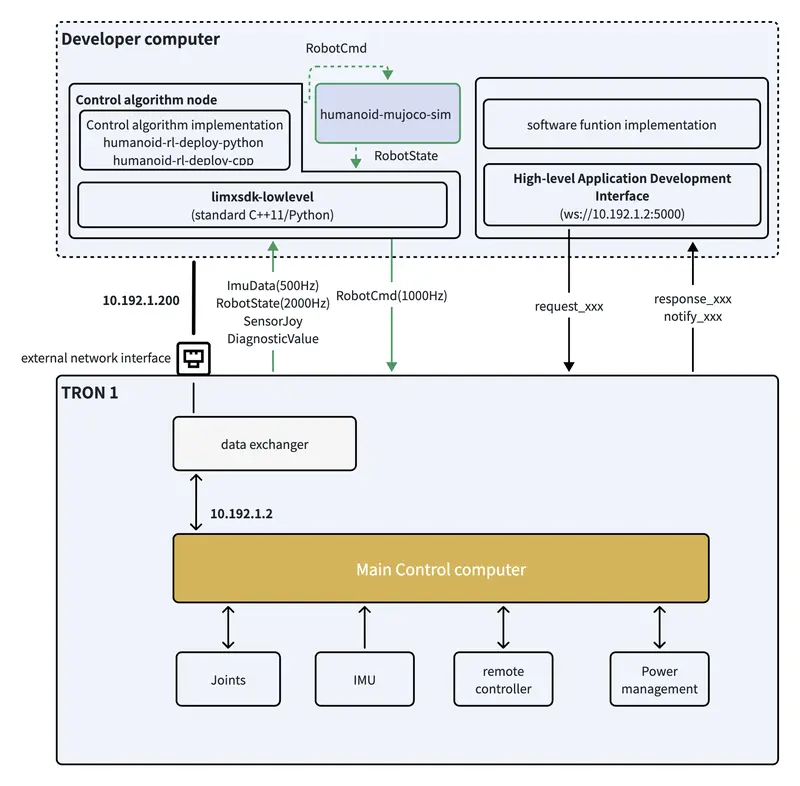
</figure>

# 3 MCP Server Interface

## 3.1 Overview

**[MCP（Model Context Protocol）](https://modelcontextprotocol.io/docs/getting-started/intro)** is a unified protocol introduced by Anthropic (the company behind *Claude*) in 2024. It enables large language models (LLMs) to interact securely and consistently with external tools, data sources, and services.

Oli MCP Server is a robot control service built on this standard protocol. Through the MCP interface, AI assistants such as Claude, Cursor, and others can directly control Oli to perform a wide range of actions and tasks.

## 3.2 Connecting to the MCP Service

### 3.2.1 Service Address

The MCP service is provided via an HTTP interface. The default service address is:

> [http://10.192.1.2/mcp](http://10.192.1.2:18080/mcp)

### 3.2.2 Configure the MCP Client

In an MCP-supported tool, modify the MCP configuration file as follows:

``` json
{
  "mcpServers": {
    "oli-mcp-server": {
      "url": "http://10.192.1.2:18080/mcp",
      "disabled": false,
      "autoApprove": [],
      "headers": {
        "Accept": "application/json, text/event-stream",
        "Content-Type": "application/json"
      }
    }
  }
}
```

- Example (in Cursor)：

<figure data-line="200">
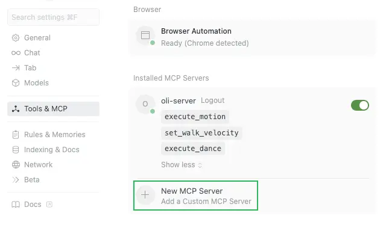
</figure>

## 3.3 MCP Tool Interface Description

| Tool Name | Function | Main Parameters |
|---|---|---|
| execute_motion | Executes predefined robot actions. The robot automatically enters and exits Motion Engine Mode. | - motion_name (Required): <br> - stand <br> - this_way_please <br> - bow <br> - wave_greet_bye <br> - nod <br> - shake_head <br> - curtain_bow <br> - blow_kisses_multi <br> - left_hand_side_heart <br> - right_hand_side_heart <br> - raised_hand_heart <br> - high_five <br> - clap <br> - warm_up_dance <br> - swag_dance <br> - idol_dance_1 <br> - idol_dance_2 <br> - power_up_dance |
| set_walk_velocity | Controls the robot’s walking velocity and automatically switches to Walking Mode. | - x (Required, [-1,1]): Forward/backward velocity (positive = forward, negative = backward) <br> - y (Required, [-1,1]): Lateral velocity (positive = right, negative = left) <br> - yaw (Required, [-1,1]): Rotational velocity (positive = counterclockwise, negative = clockwise) |
| get_dances | Available Dance Information |  |
| execute_dance | Executes a predefined robot dance action. | - dance_name (Required, retrieve from the get_dances API) |

# 4 High-Level Application Protocol Interface

The robot communicates with the user terminal through a WebSocket connection on port 5000 to receive user commands such as stand, sit, walk, and other motion instructions.

WebSocket is a real-time communication protocol that establishes a persistent connection between the robot and the user terminal, enabling fast and efficient transmission of control commands and data.

The communication structure is illustrated in the diagram below:

<figure data-line="219">
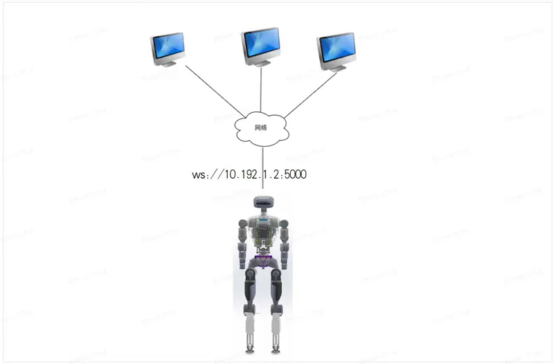
</figure>

------------------------------------------------------------------------

## 4.1 Coordinate System Description

- Unless otherwise specified, the position and orientation of both arm end-effectors are defined with respect to the robot’s base coordinate system.
- The base coordinate system is defined for humanoid robots with serial numbers starting with “HU”.
- The origin of the base coordinate system corresponds to the `base_link` defined in the URDF file. The coordinate system follows the right-hand rule ([REP-103](https://www.ros.org/reps/rep-0103.html) standard).

## 4.2 Communication Protocol Format

When the robot receives commands from the client via WebSocket, data is transmitted using the JSON communication protocol.

### 4.2.1 Request Data

| **Fields in the request data format** | **Description**                                                                                                                                                                                 |
|---------------------------------------|-------------------------------------------------------------------------------------------------------------------------------------------------------------------------------------------------|
| `accid`                               | The robot's unique serial number identifies its identity.                                                                                                                                       |
| `title`                               | The command name, prefixed with "`request_`".                                                                                                                                                   |
| `timestamp`                           | The timestamp when the command is sent, in milliseconds.                                                                                                                                        |
| `guid`                                | A unique command identifier. For synchronous interfaces, the `"response_xxx"` message includes the same `guid`, allowing the client to confirm command completion by matching values            |
| `data`                                | Contains the content of the request. Depending on the command, it may include multiple sub-fields, such as parameters for motion execution, text content for messaging, or other required data. |

**Request Data Example:**

```
{
  "accid": "HU_D02_001", # Robot’s unique serial number
  "title": "request_xxx",   # Command name, prefixed with "request_"
  "timestamp": 1672373633989, # Timestamp (in milliseconds) when the response was generated.
  "guid": "746d937cd8094f6a98c9577aaf213d98", # Unique identifier for the request. Used to match the response for synchronous operations
  "data": {}  # Contains command-specific parameters
}
```

### 4.2.2 Response Data

| **Fields in the response data format** | **Description**                                                                                                                                                                                                                           |
|----------------------------------------|-------------------------------------------------------------------------------------------------------------------------------------------------------------------------------------------------------------------------------------------|
| `accid`                                | The robot's unique serial number identifies its identity.                                                                                                                                                                                 |
| `title`                                | The command name, prefixed with "`response_`".                                                                                                                                                                                            |
| `timestamp`                            | The timestamp when the command is issued, in milliseconds.                                                                                                                                                                                |
| `guid`                                 | Matches the `guid` value from the corresponding request command.                                                                                                                                                                          |
| `data`                                 | The response data must include at least a "result" subfield to store the request's execution result. Additional subfields, such as error code or error message, may be included as needed to provide details about the operation outcome. |

**Response Data Example:**

``` json
{
  "accid": "HU_D02_001",   # Robot’s unique serial number
  "title": "response_xxx",  # Command name, prefixed with "response_"
  "timestamp": 1672373633989, # Timestamp (in milliseconds) when the response was generated.
  "guid": "746d937cd8094f6a98c9577aaf213d98", # Must match the guid value from the corresponding request command.
  "data": { # Used to store the specific data content of the response command.
    "result": "success"  # “result” Indicates whether the request was processed successfully, the value can be: "success or fail_xxx"
  }
}
```

### 4.2.3 Message Push

The message push process refers to the robot actively sending information to the client. These messages may include the robot’s serial number, current operational status, executed actions, and other relevant data.

By providing real-time updates, the robot enables the client to understand its working status better and make more effective use of its services.

| **Fields in the message push format** | **Description**                                                                                                       |
|---------------------------------------|-----------------------------------------------------------------------------------------------------------------------|
| `accid`                               | The robot's unique serial number identifies its identity.                                                             |
| `title`                               | The command name, prefixed with "`notify_`".                                                                          |
| `timestamp`                           | The message timestamp, in milliseconds.                                                                               |
| `guid`                                | The unique identifier of the message.                                                                                 |
| `data`                                | Contains the message data. May include multiple subfields depending on the specific requirements of the notification. |

**Message Push Example:**

``` json
{
  "accid": "HU_D02_001",   # Robot’s unique serial number
  "title": "notify_xxx",  # notification command name, prefixed with "notify_"
  "timestamp": 1672373633989, # The time the message was sent, in milliseconds.
  "guid": "746d937cd8094f6a98c9577aaf213d98", # The unique identifier for this notification message.
  "data": { } # Contains detailed status data
}
```

## 4.3 Communication Testing Method

Postman is a popular API development environment that can be used to test WebSocket interfaces.

**Steps to Test the WebSocket Interface Using Postman:**

1.  **Install Postman:** Download address: [https://www.postman.com/downloads/](https://www.postman.com/downloads/?utm_source=postman-home)
2.  **Create a WebSocket Request:** Launch Postman and create a new WebSocket request.
3.  **Connect to the Robot’s Wi-Fi Network:** 1. After the robot powers on successfully, connect your computer to the robot’s Wi-Fi network. The network name typically follows the format:「HU_D02_xxx」
4.  Enter the Wi-Fi password: `12345678`
5.  **Enter the WebSocket URL:** In the request URL field, input the robot’s WebSocket address, e.g.:  
    "ws://10.192.1.2:5000"
6.  **Input the Command Request:** In the **“Message”** field, enter the JSON-formatted command request.
7.  **Send the Command:** Click **“Send”** to transmit the request to the robot.
8.  **View the Response:** After sending the command, the robot will return a response message. Review the response in Postman’s output window to verify whether the result matches the expected outcome.

<figure data-line="321">
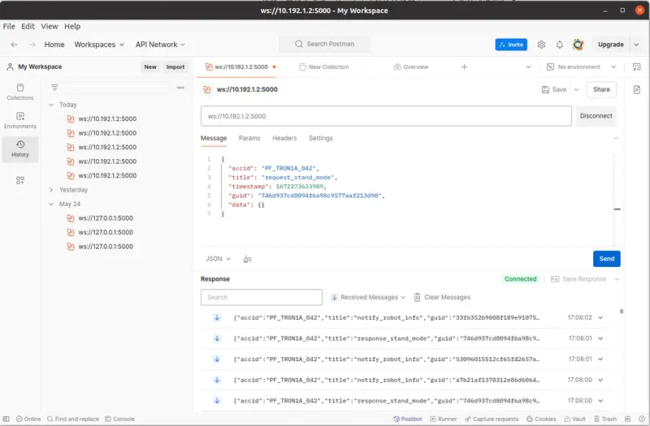
</figure>

## 4.4 Basic Function Protocol Interfaces

### 4.4.1 Connect to Wi-Fi Hotspot

> This protocol is used to send a request to the robot router to connect to a specified Wi-Fi SSID and return the connection result. Supported robot versions: **v2.1.3 and later**.

#### 4.4.1.1 Request: request_connect_wifi

``` json
{
  "accid": "HU_D04_01_001",
  "title": "request_connect_wifi",
  "timestamp": 1672373633989,
  "guid": "746d937cd8094f6a98c9577aaf213d98",
  "data": { 
      "wifi_band": "0",  # WiFi band：0=5GHz，1=2.4GHz
      "wifi_ssid": "Limx-Guests",  # Target Wi-Fi SSID (network name) — case-sensitive and must match the actual hotspot name
      "wifi_password": "LimX2024",  # Target Wi-Fi password — password for a WPA2-PSK–encrypted network
      "router_admin_password": "12345678"  # Robot router administrator password
  }
}
```

#### 4.4.1.2 Response: response_connect_wifi

``` json
{
  "accid": "HU_D04_01_001",
  "title": "response_connect_wifi",
  "timestamp": 1672373633989,
  "guid": "746d937cd8094f6a98c9577aaf213d98",
  "data": {
      "result": "success"  # success
                           # fail_no_wifi_band
                           # fail_no_wifi_ssid
                           # fail_no_wifi_password
                           # fail_no_router_admin_password
  }
}
```

#### 4.4.1.3 Message Push: none

### 4.4.2 Query Wi-Fi Connection Status

> This protocol allows the client to query the Wi-Fi connection status of the robot router. The system returns the SSID, signal strength, and connection status for real-time monitoring.

#### 4.4.2.1 Request: request_wifi_connection_status

``` json
{
  "accid": "HU_D04_01_001",
  "title": "request_wifi_connection_status",
  "timestamp": 1672373633989,
  "guid": "746d937cd8094f6a98c9577aaf213d98",
  "data": {
      "router_admin_password": "12345678"  # Robot router administrator password
  }
}
```

#### 4.4.2.2 Response: response_wifi_connection_status

> The router returns the current Wi-Fi status for client-side parsing and real-time display.

``` json
{
  "accid": "HU_D04_01_001",
  "title": "response_wifi_connection_status",
  "timestamp": 1672373633989,
  "guid": "746d937cd8094f6a98c9577aaf213d98",
  "data": {
      "ssid": "Limx-Guests",
      "signal": -56,        # Signal strength (dBm)
      "result": "success"   # success
                            # fail_disconnected
  }
}
```

#### 4.4.2.3 Message Push: none

### 4.4.3 Enter Ready State

> The robot slowly moves into a ready position.

#### 4.4.3.1 Request: request_prepare

> Controls the robot to enter the "Standing State", enabling it to receive velocity commands for walking control.

``` json
{
  "accid": "HU_D04_01_001",
  "title": "request_prepare",
  "timestamp": 1672373633989,
  "guid": "746d937cd8094f6a98c9577aaf213d98",
  "data": { }
}
```

#### 4.4.3.2 Response: response_prepare

``` json
{
  "accid": "HU_D04_01_001",
  "title": "response_prepare",
  "timestamp": 1672373633989,
  "guid": "746d937cd8094f6a98c9577aaf213d98",
  "data": {
      "result": "success"  # success, fail_motor
  }
}
```

#### 4.4.3.3 Message Push: none

### 4.4.4 Enter Walking Mode

> Sets the robot to Walking Mode, enabling it to receive velocity commands.

#### 4.4.4.1 Request: request_set_walk_mode

``` json
{
  "accid": "HU_D04_01_001",
  "title": "request_set_walk_mode",
  "timestamp": 1672373633989,
  "guid": "746d937cd8094f6a98c9577aaf213d98",
  "data": {}
}
```

#### 4.4.4.2 Response: response_set_walk_mode

``` json
{
  "accid": "HU_D04_01_001",
  "title": "response_set_walk_mode",
  "timestamp": 1672373633989,
  "guid": "746d937cd8094f6a98c9577aaf213d98",
  "data": {
      "result": "success"  # success, fail_motor: Motor Error
  }
}
```

#### 4.4.4.3 Message Push: none

### 4.4.5 Control Robot Walking

> In Motion Operation Mode, use this protocol to control the robot’s walking.

> **Note:** This interface is invalid in Full-Body Operation Mode.

#### 4.4.5.1 Request: request_set_walk_vel

``` json
{
  "accid": "HU_D04_01_001",
  "title": "request_set_walk_vel",
  "timestamp": 1672373633989,
  "guid": "746d937cd8094f6a98c9577aaf213d98",
  "data": {
    "x": 0.0,   #  Forward/Backwards Speed Ratio, range[-1, 1]
    "y": 0.0,   #  Lateral Speed Ratio, range[-1, 1]
    "yaw": 0.0  #  Rotational Angular Velocity Ratio, range[-1, 1]
  }
}
```

#### 4.4.5.2 Response: response_set_walk_vel

> Returned only if the command execution fails; no response on success.

``` json
{
  "accid": "HU_D04_01_001",
  "title": "response_set_walk_vel",
  "timestamp": 1672373633989,
  "guid": "746d937cd8094f6a98c9577aaf213d98",
  "data": {
    "result": "fail_motor"  # fail_imu: IMU Error, fail_motor: Motor Error
  }
}
```

#### 4.4.5.3 Message Push: none

### 4.4.6 Control Robot Walking (Synchronous Interface)

> **提示：**
>
> 1.  This protocol controls locomotion in Mobile Operation or Action Library modes. Not supported in Full-Body Control mode.
> 2.  Commands are accepted in Standing or Action Library modes. However, commands will be ignored if an action is already in progress.
> 3.  Supported on main controller firmware v2.1.9 and later.

#### 4.4.6.1 Request: request_set_walk_vel_sync

``` json
{
  "accid": "HU_D04_01_001",
  "title": "request_set_walk_vel_sync",
  "timestamp": 1672373633989,
  "guid": "746d937cd8094f6a98c9577aaf213d98",
  "data": {
    "x": 0.0,   #  Forward/Backward speed ratio, range: [-1, 1]
    "y": 0.0,   #  Lateral (sideways) speed ratio, range: [-1, 1]
    "yaw": 0.0  #  Rotational angular velocity ratio, range: [-1, 1]
  }
}
```

#### 4.4.6.2 Response: response_set_walk_vel_sync

> This message is returned when command execution fails. No response is returned upon successful execution.

``` json
{
  "accid": "HU_D04_01_001",
  "title": "response_set_walk_vel_sync",
  "timestamp": 1672373633989,
  "guid": "746d937cd8094f6a98c9577aaf213d98",
  "data": {
    "result": "fail_motor"  # fail_imu, fail_motor 
                            #"fail_invalid_cmd": Invalid parameters
                            #"fail_invalid_mode": Operation not permitted in the current state
                            #"fail_timeout": State transition timeout
  }
}
```

### 4.4.7 Enter Damping State

> All motors stop active control and exhibit resistance when moved.

#### 4.4.7.1 Request: request_damping

``` json
{
  "accid": "HU_D04_01_001",
  "title": "request_damping",
  "timestamp": 1672373633989,
  "guid": "746d937cd8094f6a98c9577aaf213d98",
  "data": {}
}
```

#### 4.4.7.2 Response: response_damping

``` json
{
  "accid": "HU_D04_01_001",
  "title": "response_damping",
  "timestamp": 1672373633989,
  "guid": "746d937cd8094f6a98c9577aaf213d98",
  "data": {
      "result": "success" # fail_motor: Motor Error
  }
}
```

#### 4.4.7.3 Message Push: none

### 4.4.8 Enter Zero-Torque State

> All motors stop active control and move freely without resistance.

#### 4.4.8.1 Request: request_zero_torque

``` json
{
  "accid": "HU_D04_01_001",
  "title": "request_zero_torque",
  "timestamp": 1672373633989,
  "guid": "746d937cd8094f6a98c9577aaf213d98",
  "data": {}
}
```

#### 4.4.8.2 Response: response_zero_torque

``` json
{
  "accid": "HU_D04_01_001",
  "title": "response_zero_torque",
  "timestamp": 1672373633989,
  "guid": "746d937cd8094f6a98c9577aaf213d98",
  "data": {
      "result": "success" # fail_motor: Motor Error
  }
}
```

#### 4.4.8.3 Message Push: none

### 4.4.9 Enter Sitting Command

#### 4.4.9.1 Request: request_from_stand_to_sit

``` json
{
  "accid": "HU_D04_01_001",
  "title": "request_from_stand_to_sit",
  "timestamp": 1672373633989,
  "guid": "746d937cd8094f6a98c9577aaf213d98",
  "data": {}
}
```

#### 4.4.9.2 Response: response_from_stand_to_sit

``` json
{
  "accid": "HU_D04_01_001",
  "title": "response_from_stand_to_sit",
  "timestamp": 1672373633989,
  "guid": "746d937cd8094f6a98c9577aaf213d98",
  "data": {
      "result": "success" # fail_motor
  }
}
```

#### 4.4.9.3 Message Push: none

### 4.4.10 Enter Standing Command

> **提示：**  
> Interface Function: Starts robot operation. After the robot is powered on, calling this interface transitions the robot into the standing state.  
> Parameter mode: lying — robot is lying on the ground, hanging — robot is suspended, sit — robot is sitting  
> Return: Returns after the robot has successfully stood up.

#### 4.4.10.1 Request: request_standup

``` json
{
  "accid": "HU_D04_01_001",
  "title": "request_standup",
  "timestamp": 1672373633989,
  "guid": "746d937cd8094f6a98c9577aaf213d98",
  "data": {
      "mode": "lying" // "lying"/"sitting"：The robot is currently lying or sitting.  or 
                      // "hanging"：The robot is currently hanging.
                      // If the "mode" field is not provided, the robot state defaults to "sitting".
}
```

#### 4.4.10.2 Response: response_standup

``` json
{
  "accid": "HU_D04_01_001",
  "title": "response_standup",
  "timestamp": 1672373633989,
  "guid": "746d937cd8094f6a98c9577aaf213d98",
  "data": {
      "result": "success" # fail_motor: Motor error
                          # fail_invalid_cmd: Invalid parameter
                          # fail_invalid_mode: Invalid robot state
                          # fail_timeout: Execution timeout error
  }
}
```

#### 4.4.10.3 Message Push: none

### 4.4.11 Enter Lying Command

#### 4.4.11.1 Request: request_lie_down

> **This interface is available when the robot is in the Walk state.**

``` json
{
  "accid": "HU_D04_01_001",
  "title": "request_lie_down",
  "timestamp": 1672373633989,
  "guid": "746d937cd8094f6a98c9577aaf213d98",
  "data": {}
}
```

#### 4.4.11.2 Response: response_lie_down

``` json
{
  "accid": "HU_D04_01_001",
  "title": "response_lie_down",
  "timestamp": 1672373633989,
  "guid": "746d937cd8094f6a98c9577aaf213d98",
  "data": {
      "result": "success" # fail_motor
  }
}
```

#### 4.4.11.3 Message Push: none

### 4.4.12 Zero-Point Calibration Command

#### 4.4.12.1 Request: request_calibrate

``` json
{
  "accid": "HU_D04_01_001",
  "title": "request_calibrate",
  "timestamp": 1672373633989,
  "guid": "746d937cd8094f6a98c9577aaf213d98",
  "data": {}
}
```

#### 4.4.12.2 Response: response_calibrate

``` json
{
  "accid": "HU_D04_01_001",
  "title": "response_calibrate",
  "timestamp": 1672373633989,
  "guid": "746d937cd8094f6a98c9577aaf213d98",
  "data": {
      "result": "success" # fail_motor: Motor Error
  }
}
```

#### 4.4.12.3 Message Push: notify_calibrate

> Pushed after calibration is completed.

``` python
{
  "accid": "HU_D04_01_001",
  "title": "notify_calibrate",
  "timestamp": 1672373633989,
  "guid": "746d937cd8094f6a98c9577aaf213d98",
  "data": {
      "result": "success"
  }
}
```

### 4.4.13 Robot Dance

#### 4.4.13.1 Switch to Dance Mode

##### 4.4.13.1.1 Request: request_enter_dance_mode

``` json
{
  "accid": "HU_D04_01_001",
  "title": "request_enter_dance_mode",
  "timestamp": 1672373633989,
  "guid": "746d937cd8094f6a98c9577aaf213d98",
  "data": {
    # 0：exit dance mode
    # 1：enter dance mode
    "mode": 0
  }
}
```

##### 4.4.13.1.2 Response: response_enter_dance_mode

``` json
{
  "accid": "HU_D04_01_001",
  "title": "response_enter_dance_mode",
  "timestamp": 1672373633989,
  "guid": "746d937cd8094f6a98c9577aaf213d98",
  "data": {
      "result": "success" # fail_motor
  }
}
```

##### 4.4.13.1.3 Message Push: none

#### 4.4.13.2 Get Dance List

##### 4.4.13.2.1 Request: request_get_dance_list

``` json
{
  "accid": "HU_D04_01_001",
  "title": "request_get_dance_list",
  "timestamp": 1672373633989,
  "guid": "746d937cd8094f6a98c9577aaf213d98",
  "data": {}
}
```

##### 4.4.13.2.2 Response: response_get_dance_list

``` json
{
    "accid": "HU_D04_01_001",
    "title": "response_get_dance_list",
    "guid": "746d937cd8094f6a98c9577aaf213d98",
    "timestamp": 1672373633989,
    "data": {
        "result": "success",
        "code": 0,
        "dances": [
            {
                "id": "DAN-14",
                "index": 0,
                "name": "\u70ed\u70c8",
                "english_name": "One and Only Dance",
                "rc_mapping": "one_and_only_dance"
            },
            {
                "id": "DAN-08",
                "index": 1,
                "name": "\u4f4e\u4fd7\u5c0f\u8bf4",
                "english_name": "Pulp Fiction Dance",
                "rc_mapping": "pulp_fiction_dance"
            }
        ]
    }
}
```

#### 4.4.13.3 Robot Dancing

##### 4.4.13.3.1 Request: request_dance

> **提示：**
>
> 1.  **Precondition:** The robot must be in Action Library Mode.
> 2.  \*\*Supported on: \*\*Main controller firmware v2.1.21 and later.

``` json
{
  "accid": "HU_D04_01_001",
  "title": "request_dance",
  "timestamp": 1672373633989,
  "guid": "746d937cd8094f6a98c9577aaf213d98",
  "data": {
    "name": "one_and_only_dance"  # rc_mapping Dance name
  }
}
```

##### 4.4.13.3.2 Response: response_dance

``` json
{
  "accid": "HU_D04_01_001",
  "title": "response_set_motion_engine",
  "timestamp": 1672373633989,
  "guid": "746d937cd8094f6a98c9577aaf213d98",
  "data": {
      "result": "success" # fail_motor
  }
}
```

##### 4.4.13.3.3 Message Push: notify_dance

> Pushed when the dance completes or execution fails.

``` json
{
  "accid": "HU_D04_01_001",
  "title": "notify_dance",
  "timestamp": 1672373633989,
  "guid": "746d937cd8094f6a98c9577aaf213d98",
  "data": {
      "result": "success" # fail_motor
  }
}
```

### 4.4.14 Robot Marching in Place

#### 4.4.14.1 Enable March-in-Place

##### 4.4.14.1.1 Request: request_start_walktoggle

``` json
{
  "accid": "HU_D04_01_001",
  "title": "request_start_walktoggle",
  "timestamp": 1672373633989,
  "guid": "746d937cd8094f6a98c9577aaf213d98",
  "data": {}
}
```

##### 4.4.14.1.2 Response: response_start_walktoggle

``` json
{
  "accid": "HU_D04_01_001",
  "title": "response_start_walktoggle",
  "timestamp": 1672373633989,
  "guid": "746d937cd8094f6a98c9577aaf213d98",
  "data": {
      "result": "success" # fail_motor
  }
}
```

##### 4.4.14.1.3 Message Push: notify_dance

#### 4.4.14.2 Stop March-in-Place

##### 4.4.14.2.1 Request: request_stop_walktoggle

``` json
{
  "accid": "HU_D04_01_001",
  "title": "request_stop_walktoggle",
  "timestamp": 1672373633989,
  "guid": "746d937cd8094f6a98c9577aaf213d98",
  "data": {}
}
```

##### 4.4.14.2.2 Response: response_stop_walktoggle

``` json
{
  "accid": "HU_D04_01_001",
  "title": "response_stop_walktoggle",
  "timestamp": 1672373633989,
  "guid": "746d937cd8094f6a98c9577aaf213d98",
  "data": {
      "result": "success" # fail_motor
  }
}
```

### 4.4.15 Robot Action Library

#### 4.4.15.1 Get Action Library Status

> **提示：**  
> Interface Description:
>
> 1.  When the robot has entered the Action Library, and is in Action Library Mode, Atomic Action Execution, or Dance, the following field is returned: "action_library_mode": "action_library"
> 2.  When the robot is executing an atomic action or a dance routine, the following field is returned: "action_library_state": "running"

##### 4.4.15.1.1 Request: request_get_action_library_status

``` json
{
  "accid": "HU_D04_01_001",
  "title": "request_get_action_library_status",
  "timestamp": 1672373633989,
  "guid": "746d937cd8094f6a98c9577aaf213d98",
  "data": {}
}
```

##### 4.4.15.1.2 Response: response_get_action_library_status

``` json
{
  "accid": "HU_D04_01_001",
  "title": "get_action_library_status",
  "timestamp": 1672373633989,
  "guid": "746d937cd8094f6a98c9577aaf213d98",
  "data": {
      "action_library_mode": "action_library" //"remote_control"
      "action_library_state": "running"       //"idle"
      "result": "success" # fail_motor
  }
}
```

#### 4.4.15.2 Execute Action Library (Synchronous Interface)

> **提示：**  
> Interface Description:
>
> 1.  If the robot is in a state where the Action Library cannot be executed, a failure response is returned within 100ms.
> 2.  If the robot is in a state where the Action Library can be executed (walk/motion library), the response is returned after the action library execution is completed.

##### 4.4.15.2.1 Request: request_action_sync

``` json
{
  "accid": "HU_D04_01_001",
  "title": "request_action_sync",
  "timestamp": 1672373633989,
  "guid": "746d937cd8094f6a98c9577aaf213d98",
  "data": {
      "name": "one_and_only_dance,this_way_please"  
                                    # name:Multiple dances, multiple actions, or a mix of dances and actions, separated by commas (,).
  }
}
```

##### 4.4.15.2.2 Response: response_action_sync

``` json
{
  "accid": "HU_D04_01_001",
  "title": "response_action_sync",
  "timestamp": 1672373633989,
  "guid": "746d937cd8094f6a98c9577aaf213d98",
  "data": {
      "result": "success" # fail_motor
  }
}
```

#### 4.4.15.3 Switching the Robot to Action Library Mode

##### 4.4.15.3.1 Request: request_set_motion_engine

``` json
{
  "accid": "HU_D04_01_001",
  "title": "request_set_motion_engine",
  "timestamp": 1672373633989,
  "guid": "746d937cd8094f6a98c9577aaf213d98",
  "data": {
    # 0：Exit Motion Library Mode
    # 1：Enter Motion Library Mode
    "mode": 0
  }
}
```

##### 4.4.15.3.2 Response: response_set_motion_engine

``` json
{
  "accid": "HU_D04_01_001",
  "title": "response_set_motion_engine",
  "timestamp": 1672373633989,
  "guid": "746d937cd8094f6a98c9577aaf213d98",
  "data": {
      "result": "success" # fail_motor
  }
}
```

##### 4.4.15.3.3 Message Push: none

#### 4.4.15.4 Get Action Library List

##### 4.4.15.4.1 Request: request_get_atomic_motion_list

``` json
{
  "accid": "HU_D04_01_001",
  "title": "request_get_atomic_motion_list",
  "timestamp": 1672373633989,
  "guid": "746d937cd8094f6a98c9577aaf213d98",
  "data": {}
}
```

##### 4.4.15.4.2 Response: response_get_atomic_motion_list

``` json
{
    "accid": "HU_D04_01_001",
    "title": "response_get_atomic_motion_list",
    "guid": "746d937cd8094f6a98c9577aaf213d98",
    "timestamp": 287883835,
    "data": {
        "result": "success",
        "motion_list": [
            {
                "motion_index": 0,
                "motion_name_en": "stand"
            },
            {
                "motion_index": 1,
                "motion_name_en": "this_way_please"
            }
            ......
        ],
        "count": 2
    }
}
```

#### 4.4.15.5 Executing Actions

Actions can be executed once the robot is in Action Library Mode. Supported atomic actions include:

| **Motion ID** | **Motion Name**       | \*\*Description \*\* |
|---------------|-----------------------|----------------------|
| 0             | stand_still           | Stand                |
| 1             | this_way_please       | This way, please     |
| 2             | bow                   | Bow                  |
| 3             | wave_greet_bye        | Wave(Greet/Bye)      |
| 4             | nod                   | Nod                  |
| 5             | shake_head            | Shake one's head     |
| 6             | curtain_bow           | Take a bow           |
| 7             | blow_kisses_multi     | Blow kisses          |
| 8             | left_hand_side_heart  | Left-hand heart      |
| 9             | right_hand_side_heart | Right-hand heart     |
| 10            | hand_heart            | Hand Heart           |
| 11            | high_five             | High-five Someone    |
| 12            | clap                  | Clap                 |
| 13            | warm_up_dance         | Warm-up Dance        |
| 14            | swag_dance            | Swag Dance           |
| 15            | idol_dance_1          | Idol Dance1          |
| 16            | idol_dance_2          | Idol Dance2          |
| 17            | power_up_dance        | Power-up Dance       |

##### 4.4.15.5.1 Request: request_execute_atomic_motion

``` json
{
  "accid": "HU_D04_01_001",
  "title": "request_execute_atomic_motion",
  "timestamp": 1672373633989,
  "guid": "746d937cd8094f6a98c9577aaf213d98",
  "data": {
    # Motion Name
    "motion_name": "wave_greet_bye"
  }
}
```

##### 4.4.15.5.2 Response: response_execute_atomic_motion

``` json
{
  "accid": "HU_D04_01_001",
  "title": "response_execute_atomic_motion",
  "timestamp": 1672373633989,
  "guid": "746d937cd8094f6a98c9577aaf213d98",
  "data": {
      "result": "success" # fail_motor
  }
}
```

##### 4.4.15.5.3 Message Push: notify_execute_atomic_motion

> Pushed when an action is completed, or execution fails.

``` json
{
  "accid": "HU_D04_01_001",
  "title": "notify_execute_atomic_motion",
  "timestamp": 1672373633989,
  "guid": "746d937cd8094f6a98c9577aaf213d98",
  "data": {
      "result": "success" # fail_motor
  }
}
```

### 4.4.16 Motion Control

#### 4.4.16.1 Switching to Motion Operation Mode

In Motion Operation Mode, walking can be controlled, while height and waist movements remain disabled.

<figure data-line="1184">
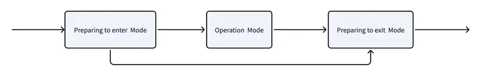
</figure>

##### 4.4.16.1.1 Request: request_set_ub_manip_mode

``` json
{
  "accid": "HU_D04_01_001",
  "title": "request_set_ub_manip_mode",
  "timestamp": 1672373633989,
  "guid": "746d937cd8094f6a98c9577aaf213d98",
  "data": {
      "mode": 0  # 0: Preparing to enter Mode 1: Operation Mode, start tracking end-effector position 2: Ready to Exit Mode
  }
}
```

##### 4.4.16.1.2 Response: response_set_ub_manip_mode

``` json
{
  "accid": "HU_D04_01_001",
  "title": "response_set_ub_manip_mode",
  "timestamp": 1672373633989,
  "guid": "746d937cd8094f6a98c9577aaf213d98",
  "data": {
      "result": "success"  # success, fail_motor
  }
}
```

##### 4.4.16.1.3 Message Push: none

#### 4.4.16.2 Motion Operation Control

> Activated only via the `request_set_ub_manip_mode` interface.

- **Reference Coordinate Frame Diagram:** - **Position:** The origin of *base_link* (located at the center beneath the hip).
  - **Axis Definitions:** - **Red (X-axis):** Forward direction of the robot
    - **Green (Y-axis):** Positive direction to the left
    - **Blue (Z-axis):** Vertical upward direction

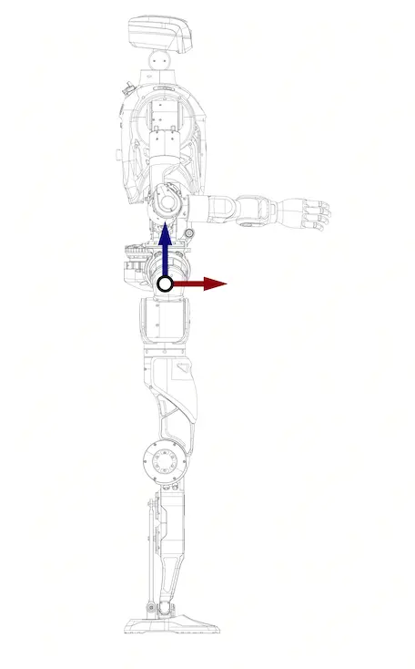  
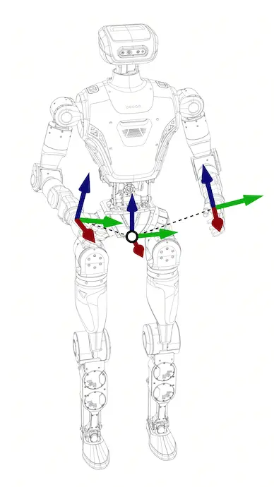

##### 4.4.16.2.1 Request: request_set_ub_manip_ee_pose

``` json
{
  "accid": "HU_D04_01_001",
  "title": "request_set_ub_manip_ee_pose",
  "timestamp": 1672373633989,
  "guid": "746d937cd8094f6a98c9577aaf213d98",
  "data": {
      # Coordinate System Definition Reference：
      # Origin：base_link coordinate frame
      # Axes: X-axis aligned with the robot’s forward direction, Y-axis pointing to the robot’s left, Z-axis pointing upward
      #
      # Parameter Definition：
      # Head orientation relative to the reference frame, represented as a quaternion[x,y,z,w]
      "head_quat": [0.0, 0.0, 0.0, 1.0],
    
      # Left-hand position relative to the reference frame, in meters
      "left_hand_pos": [0.0, 0.0, 0.0],
      
      # Left-hand orientation relative to the reference frame, represented as a quaternion[x,y,z,w]
      "left_hand_quat": [0.0, 0.0, 0.0, 1.0],
      
      # Right-hand position relative to the reference frame, in meters
      "right_hand_pos": [0.0, 0.0, 0.0],
      
      # Right-hand orientation relative to the reference frame, represented as a quaternion[x,y,z,w]
      "right_hand_quat": [0.0, 0.0, 0.0, 1.0]
  }
}
```

##### 4.4.16.2.2 Response: response_set_ub_manip_ee_pose

``` json
{
  "accid": "HU_D04_01_001",
  "title": "response_set_ub_manip_ee_pose",
  "timestamp": 1672373633989,
  "guid": "746d937cd8094f6a98c9577aaf213d98",
  "data": {
    "result": "success"  # success, fail_motor, fail_invalid_cmd: Invalid Command
  }
}
```

##### 4.4.16.2.3 Message Push: none

#### 4.4.16.3 Get Motion Operation Pose Information

##### 4.4.16.3.1 Request: request_get_ub_manip_ee_pose

``` json
{
  "accid": "HU_D04_01_001",
  "title": "request_get_ub_manip_ee_pose",
  "timestamp": 1672373633989,
  "guid": "746d937cd8094f6a98c9577aaf213d98",
  "data": {
  }
}
```

##### 4.4.16.3.2 Response: response_get_ub_manip_ee_pose

``` json
{
  "accid": "HU_D04_01_001",
  "title": "response_get_ub_manip_ee_pose",
  "timestamp": 1672373633989,
  "guid": "746d937cd8094f6a98c9577aaf213d98",
  "data": {
    # Coordinate System Definition Reference：
    # Origin：base_link coordinate frame
    # Axes: X-axis aligned with the robot’s forward direction, Y-axis pointing to the robot’s left, Z-axis pointing upward
    #
    # Parameter Definition：
    # Head position relative to the reference frame, in meters
    "head_pos": [0.0, 0.0, 0.0],
      
    # Head orientation relative to the reference frame, represented as a quaternion[x,y,z,w]
    "head_quat": [0.0, 0.0, 0.0, 1.0],
    
    # Left hand position relative to the reference frame, in meters.
    "left_hand_pos": [0.0, 0.0, 0.0],
      
    # Left-hand orientation relative to the reference frame, represented as a quaternion[x,y,z,w]
    "left_hand_quat": [0.0, 0.0, 0.0,1.0],
      
    # Right-hand position relative to the reference frame, in meters.
    "right_hand_pos": [0.0, 0.0, 0.0],
      
    # Right-hand orientation relative to the reference frame, represented as a quaternion[x,y,z,w]
    "right_hand_quat": [0.0, 0.0, 0.0,1.0],
    "result": "success"  # success, fail_motor, fail_invalid_cmd
  }
}
```

### 4.4.17 In-Place Operation

#### 4.4.17.1 Enter In-Place Operation Mode

In this mode, you can control the robot's body movements while walking control is disabled.

##### 4.4.17.1.1 Request: request_set_wb_manip_mode

``` json
{
  "accid": "HU_D04_01_001",
  "title": "request_set_wb_manip_mode",
  "timestamp": 1672373633989,
  "guid": "746d937cd8094f6a98c9577aaf213d98",
  "data": {
      "mode": 0  # 0: Preparing to enter Mode 1: Operation Mode, start tracking end-effector position 2: Ready to Exit Mode
  }
}
```

##### 4.4.17.1.2 Response: response_set_wb_manip_mode

``` json
{
  "accid": "HU_D04_01_001",
  "title": "response_set_wb_manip_mode",
  "timestamp": 1672373633989,
  "guid": "746d937cd8094f6a98c9577aaf213d98",
  "data": {
      "result": "success"  # success, fail_motor
  }
}
```

##### 4.4.17.1.3 Message Push: none

#### 4.4.17.2 In-Place Operation Control

> The function takes effect only when In-Place Operation Mode is activated via the protocol interface `request_set_wb_manip_mode` with mode set to 1.

- **Reference Coordinate Frame Diagram:** - **Position:** Midpoint of the line connecting the origins of *left_ankle_roll_link* and *right_ankle_roll_link*
  - **Orientation:** The yaw angle is the midpoint of the yaw orientations of *left_ankle_roll_link* and *right_ankle_roll_link*
  - **Axis Definitions:** - **Red (X-axis):** Determined by the forward-facing direction of the robot’s feet
    - **Green (Y-axis):** Determined according to the right-hand coordinate system rule
    - **Blue (Z-axis):** Vertical upward direction

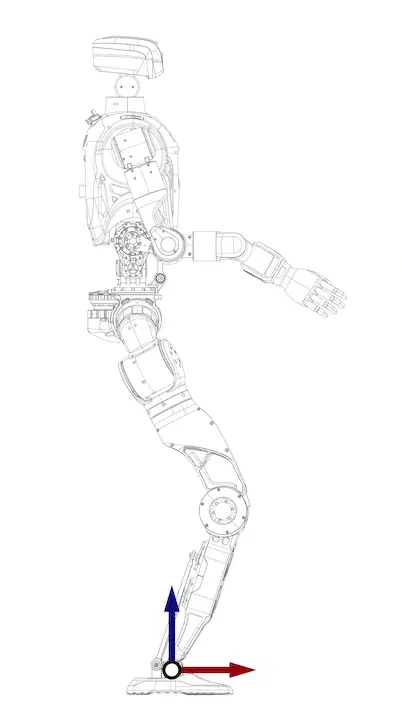  
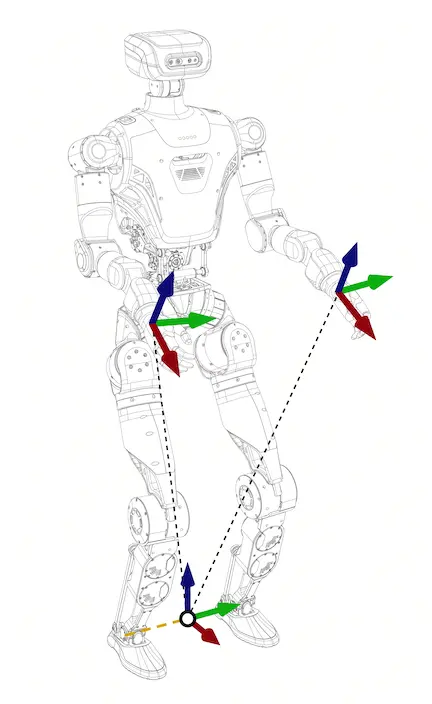

##### 4.4.17.2.1 Request: request_set_wb_manip_ee_pose

``` json
{
  "accid": "HU_D04_01_001",
  "title": "request_set_wb_manip_ee_pose",
  "timestamp": 1672373633989,
  "guid": "746d937cd8094f6a98c9577aaf213d98",
  "data": {
      # Reference Frame Definition:
      # Origin: The projection on the ground (z=0) of the midpoint between the left and right feet.
      # Axes: X-axis aligned with the robot’s forward direction, Y-axis pointing to the robot’s left, Z-axis pointing upward
      #
      # Parameter Definition：
      # Left hand position relative to the reference frame, in meters.
      "left_hand_pos": [0.0, 0.3, 0.8],
      
      # Left-hand orientation relative to the reference frame, represented as a quaternion[x,y,z,w]
      "left_hand_quat": [0.0, 0.0, 0.0, 1.0],
      
      # Right-hand position relative to the reference frame, in meters.
      "right_hand_pos": [0.0, -0.3, 0.8],
      
      # Right-hand orientation relative to the reference frame, represented as a quaternion[x,y,z,w]
      "right_hand_quat": [0.0, 0.0, 0.0, 1.0]
  }
}
```

##### 4.4.17.2.2 Response：response_set_wb_manip_ee_pose

``` json
{
  "accid": "HU_D04_01_001",
  "title": "response_set_wb_ee_pose",
  "timestamp": 1672373633989,
  "guid": "746d937cd8094f6a98c9577aaf213d98",
  "data": {
    "result": "success"  # success, fail_motor, fail_invalid_cmd
  }
}
```

##### 4.4.17.2.3 Message Push: none

#### 4.4.17.3 Get In-Place Operation Pose Information

##### 4.4.17.3.1 Request: request_get_wb_manip_ee_pose

``` json
{
  "accid": "HU_D04_01_001",
  "title": "request_get_wb_manip_ee_pose",
  "timestamp": 1672373633989,
  "guid": "746d937cd8094f6a98c9577aaf213d98",
  "data": {
  }
}
```

##### 4.4.17.3.2 Response: response_get_wb_manip_ee_pose

``` json
{
  "accid": "HU_D04_01_001",
  "title": "response_get_wb_manip_ee_pose",
  "timestamp": 1672373633989,
  "guid": "746d937cd8094f6a98c9577aaf213d98",
  "data": {
    # Reference Frame Definition:
    # Origin: The projection on the ground (z=0) of the midpoint between the left and right feet.
    # Axes: X-axis aligned with the robot’s forward direction, Y-axis pointing to the robot’s left, Z-axis pointing upward
    #
    # Parameter Definition：
    # Left-hand position relative to the reference frame, in meters.
    "left_hand_pos": [0.0, 0.0, 0.0],
      
    # Left-hand orientation relative to the reference frame, represented as a quaternion[x,y,z,w]
    "left_hand_quat": [0.0, 0.0, 0.0, 1.0],
      
    # Right-hand position relative to the reference frame, in meters.
    "right_hand_pos": [0.0, 0.0, 0.0],
      
    # Right-hand orientation relative to the reference frame, represented as a quaternion[x,y,z,w]
    "right_hand_quat": [0.0, 0.0, 0.0, 1.0],
    "result": "success"  # success, fail_motor, fail_invalid_cmd
  }
}
```

##### 4.4.17.3.3 Message Push: none

### 4.4.18 Dual-Arm Coordinated Move Control

#### 4.4.18.1 Switch to Move Control Mode

##### 4.4.18.1.1 Request: request_set_move_mode

``` json
{
  "accid": "HU_D04_01_001",
  "title": "request_set_move_mode",
  "timestamp": 1672373633989,
  "guid": "746d937cd8094f6a98c9577aaf213d98",
  "data": {
      # 0: Exit Move Control
      # 1: Mobile Move Mode
      # 2: In-place Move Mode
      "mode": 0 
  }
}
```

##### 4.4.18.1.2 Response: response_set_move_mode

``` json
{
  "accid": "HU_D04_01_001",
  "title": "response_set_move_mode",
  "timestamp": 1672373633989,
  "guid": "746d937cd8094f6a98c9577aaf213d98",
  "data": {
      "result": "success"  # success, fail_motor
  }
}
```

##### 4.4.18.1.3 Message Push: none

#### 4.4.18.2 MoveJ Control Command

##### 4.4.18.2.1 Request: request_moveJ

``` python
{
  "accid": "HU_D04_01_001",
  "title": "request_moveJ",
  "timestamp": 1672373633989,
  "guid": "746d937cd8094f6a98c9577aaf213d98",
  "data": {
      # Joint position ranges are defined by the corresponding robot model's URDF file
      # Model File Download Address: https://github.com/limxdynamics/humanoid-description
      
      # If the following data are provided simultaneously, both arms will be controlled (target positions in radians)
      # Left Arm Joint Order：  
      # - "left_shoulder_pitch_joint"
      # - "left_shoulder_roll_joint"
      # - "left_shoulder_yaw_joint"
      # - "left_elbow_joint"
      # - "left_wrist_yaw_joint"
      # - "left_wrist_pitch_joint"
      # - "left_wrist_roll_joint"
      "left": [0.0, 0.0, 0.0, 0.0, 0.0, 0.0, 0.0],
      
      # Right Arm Joint Order：  
      # - "right_shoulder_pitch_joint"
      # - "right_shoulder_roll_joint"
      # - "right_shoulder_yaw_joint"
      # - "right_elbow_joint"
      # - "right_wrist_yaw_joint"
      # - "right_wrist_pitch_joint"
      # - "right_wrist_roll_joint"
      "right": [0.0, 0.0, 0.0, 0.0, 0.0, 0.0, 0.0],
      
      # In In-place MoveJ Mode only, providing the following data will control torso posture
      "torso_height": 0,  # Body height ratio: range[-1, 1]
      "torso_pitch": 0,   # Pitch motion ratio: range[-1, 1]
      "torso_roll": 0,    # Roll motion ratio: range[-1, 1]
      "torso_yaw": 0,     # Yaw motion ratio: range[-1, 1]
      
      # If the following data are provided, head motion will be controlled
      "head_pitch": 0.0,  # pitch joint target position (radians)
      "head_yaw": 0.0,    # yaw joint target position (radians)
      
      "speed": 0.2  # Motion speed: range [0, 0.5] rad/s, controlling the motion speed of both arms
  }
}
```

##### 4.4.18.2.2 Response: response_moveJ

``` python
{
  "accid": "HU_D04_01_001",
  "title": "response_moveJ",
  "timestamp": 1672373633989,
  "guid": "746d937cd8094f6a98c9577aaf213d98",
  "data": {
    "result": "success"  # success, fail_motor
  }
}
```

##### 4.4.18.2.3 Message Push: notify_moveJ

> Execution completion or failure will trigger an active message push.

``` python
{
  "accid": "HU_D04_01_001",
  "title": "notify_moveJ",
  "timestamp": 1672373633989,
  "guid": "746d937cd8094f6a98c9577aaf213d98",
  "data": {
    "result": "success"  # success, fail_motor， fail_invalid_speed: invalid speed value
  }
}
```

#### 4.4.18.3 MoveP Control Command

- **Reference Coordinate Frame Diagram:** - **Position:** Origin of the *waist_pitch_link*.
  - **Axis Definitions:** - **Red (X-axis):** Forward direction of the robot
    - **Green (Y-axis):** Positive direction to the left
    - **Blue (Z-axis):** Vertical upward direction

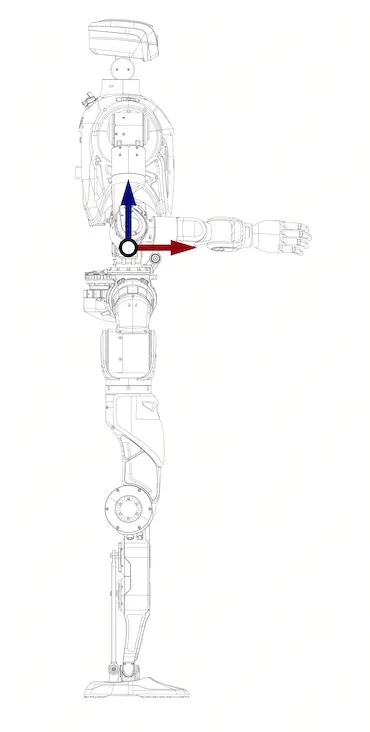  
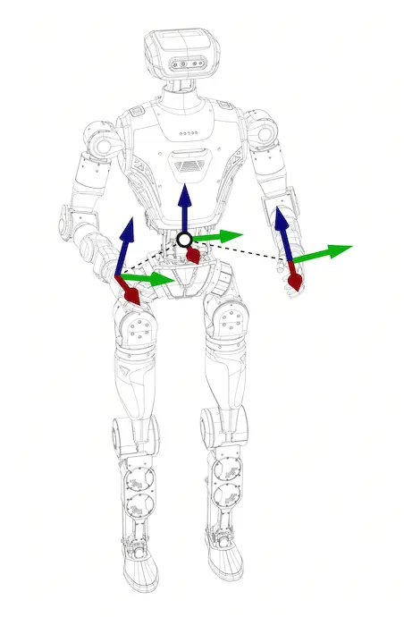

##### 4.4.18.3.1 Request: request_moveP

``` python
{
  "accid": "HU_D04_01_001",
  "title": "request_moveP",
  "timestamp": 1672373633989,
  "guid": "746d937cd8094f6a98c9577aaf213d98",
  "data": {
      # If the following data are provided simultaneously, both arms will be controlled
      "left_position": [0.0, 0.0, 0.0], # Target position of the left arm end-effector in meters, specified in the order x, y, z
      "left_quat": [0.0, 0.0, 0.0, 1.0], # Target orientation of the left arm end-effector, represented as a quaternion（x, y, z, w）
      "right_position": [0.0, 0.0, 0.0], # Target position of the right arm end-effector in meters, specified in the order x, y, z
      "right_quat": [0.0, 0.0, 0.0, 1.0], # Target orientation of the right arm end-effector, represented as a quaternion（x, y, z, w）
      
      # In In-place MoveP Mode only, providing the following data will control torso posture
      "torso_height": 0,  # Body height ratio: range[-1, 1]
      "torso_pitch": 0,   # Pitch motion ratio: range[-1, 1]
      "torso_roll": 0,    # Roll motion ratio: range[-1, 1]
      "torso_yaw": 0,     # Yaw motion ratio: range[-1, 1]
      
      # If the following data are provided simultaneously, the head will be controlled
      "head_pitch": 0.0,  # pitch joint target position (radians)
      "head_yaw": 0.0,    # yaw joint target position (radians)
      
      "speed": 0.2  # Motion speed: range [0, 0.5] rad/s, controlling the motion speed of both arms
  }
}
```

##### 4.4.18.3.2 Response: response_moveP

``` python
{
  "accid": "HU_D04_01_001",
  "title": "response_moveP",
  "timestamp": 1672373633989,
  "guid": "746d937cd8094f6a98c9577aaf213d98",
  "data": {
    "result": "success"  # success, fail_motor
  }
}
```

##### 4.4.18.3.3 Message Push: notify_moveP

> Execution completion or failure will trigger an active message push.

``` python
{
  "accid": "HU_D04_01_001",
  "title": "notify_moveP",
  "timestamp": 1672373633989,
  "guid": "746d937cd8094f6a98c9577aaf213d98",
  "data": {
    "result": "success"  # success， fail_motor， fail_invalid_speed: invalid speed value
  }
}
```

#### 4.4.18.4 Get Dual-Arm End-Effector Pose

##### 4.4.18.4.1 Request: request_get_move_pose

> This interface is used to obtain the end-effector pose information of both robot arms.

``` json
{
  "accid": "HU_D04_01_001",
  "title": "request_get_move_pose",
  "timestamp": 1672373633989,
  "guid": "746d937cd8094f6a98c9577aaf213d98",
  "data": {}
}
```

##### 4.4.18.4.2 Response: response_get_move_pose

> Upon receiving the request, the robot returns the current pose data of both arms.

```
{
  "accid": "HU_D04_01_001",
  "title": "response_get_move_pose",
  "timestamp": 1672373633989,
  "guid": "746d937cd8094f6a98c9577aaf213d98",
  "data": {
      "timestamp": 1672373633989, # Represents the data timestamp, in milliseconds
      "left_position": [0.0, 0.0, 0.0], # The position of the left arm end-effector, in meters, ordered as x, y, z
      "left_quat": [0.0, 0.0, 0.0, 1.0], # The orientation of the left arm end-effector, as a quaternion x, y, z, w
      "right_position": [0.0, 0.0, 0.0], # The position of the right arm end-effector, in meters, ordered as x, y, z
      "right_quat": [0.0, 0.0, 0.0, 1.0], # The orientation of the right arm end-effector, as a quaternion x, y, z, w
      "result": "success"  # fail_not_data
  }
}
```

### 4.4.19 Dual-Arm Coordinated Servo Control

#### 4.4.19.1 Switch to Servo Control Mode

##### 4.4.19.1.1 Request: request_set_servo_mode

``` json
{
  "accid": "HU_D04_01_001",
  "title": "request_set_servo_mode",
  "timestamp": 1672373633989,
  "guid": "746d937cd8094f6a98c9577aaf213d98",
  "data": {
      # 0: Exit Servo Control
      # 1: Mobile Servo Mode
      # 2: In-place Servo Mode
      "mode": 0
  }
}
```

##### 4.4.19.1.2 Response: response_set_servo_mode

``` json
{
  "accid": "HU_D04_01_001",
  "title": "response_set_servo_mode",
  "timestamp": 1672373633989,
  "guid": "746d937cd8094f6a98c9577aaf213d98",
  "data": {
      "result": "success"  # success, fail_motor
  }
}
```

##### 4.4.19.1.3 Message Push: none

#### 4.4.19.2 ServoJ Control Command

##### 4.4.19.2.1 Request: request_servoJ

> Recommend controlling the robotic arm at the control frequency of **≥500 Hz** in real-time systems to ensure control performance and stability.

``` json
{
  "accid": "HU_D04_01_001",
  "title": "request_servoJ",
  "timestamp": 1672373633989,
  "guid": "746d937cd8094f6a98c9577aaf213d98",
  "data": {
      # Joint position ranges are defined by the corresponding robot model's URDF file
      # Model File Download Address: https://github.com/limxdynamics/humanoid-description
      
      # If the following data are provided simultaneously, both arms will be controlled (target positions in radians)
      # Left Arm Joint Order：  
      # - "left_shoulder_pitch_joint"
      # - "left_shoulder_roll_joint"
      # - "left_shoulder_yaw_joint"
      # - "left_elbow_joint"
      # - "left_wrist_yaw_joint"
      # - "left_wrist_pitch_joint"
      # - "left_wrist_roll_joint"
      "left": [0.0, 0.0, 0.0, 0.0, 0.0, 0.0, 0.0],
      
      # Right Arm Joint Order：
      # - "right_shoulder_pitch_joint"
      # - "right_shoulder_roll_joint"
      # - "right_shoulder_yaw_joint"
      # - "right_elbow_joint"
      # - "right_wrist_yaw_joint"
      # - "right_wrist_pitch_joint"
      # - "right_wrist_roll_joint"
      "right": [0.0, 0.0, 0.0, 0.0, 0.0, 0.0, 0.0],
      
      # In In-place ServoJ Mode only, providing the following data will control torso posture
      "torso_height": 0,  # Body height ratio: range[-1, 1]
      "torso_pitch": 0,   # Pitch motion ratio: range[-1, 1]
      "torso_roll": 0,    # Roll motion ratio: range[-1, 1]
      "torso_yaw": 0,     # Yaw motion ratio: range[-1, 1]
      
      # If the following data are provided, head motion will be controlled
      "head_yaw": 0.0,    # yaw joint target position (radians)
      "head_pitch": 0.0  # pitch joint target position (radians)
  }
}
```

##### 4.4.19.2.2 Response: none

##### 4.4.19.2.3 Message Push: notify_servoJ

> The server will send this message to indicate the failure reason when a ServoJ control operation fails.

``` json
{
  "accid": "HU_D04_01_001",
  "title": "notify_servoJ",
  "timestamp": 1672373633989,
  "guid": "746d937cd8094f6a98c9577aaf213d98",
  "data": {
    "result": "fail_invalid_cmd"  # fail_invalid_cmd: fail_motor
  }
}
```

#### 4.4.19.3 ServoP Control Command

- **Reference Coordinate Frame Diagram:** - **Position:** Origin of the *waist_pitch_link*.
  - **Axis Definitions:** - **Red (X-axis):** Forward direction of the robot
    - **Green (Y-axis):** Positive direction to the left
    - **Blue (Z-axis):** Vertical upward direction

  


##### 4.4.19.3.1 Request: request_servoP

> Recommend controlling the robotic arm at the control frequency of **≥500 Hz** in real-time systems to ensure control performance and stability.

``` json
{
  "accid": "HU_D04_01_001",
  "title": "request_servoP",
  "timestamp": 1672373633989,
  "guid": "746d937cd8094f6a98c9577aaf213d98",
  "data": {
      # If the following data are provided simultaneously, both arms will be controlled
      "left_position": [0.0, 0.0, 0.0], # Target position of the left arm end-effector in meters, specified in the order x, y, z
      "left_quat": [0.0, 0.0, 0.0, 1.0], # Target orientation of the left arm end-effector, represented as a quaternion（x, y, z, w）
      "right_position": [0.0, 0.0, 0.0], # Target position of the right arm end-effector in meters, specified in the order x, y, z
      "right_quat": [0.0, 0.0, 0.0, 1.0] # Target orientation of the right arm end-effector, represented as a quaternion（x, y, z, w）
      
      # In In-place ServoP Mode only, providing the following data will control torso posture
      "torso_height": 0,  # Body height ratio: range[-1, 1]
      "torso_pitch": 0,   # Pitch motion ratio: range[-1, 1]
      "torso_roll": 0,    # Roll motion ratio: range[-1, 1]
      "torso_yaw": 0,     # Yaw motion ratio: range[-1, 1]
      
      # If the following data are provided simultaneously, the head will be controlled
      "head_yaw": 0.0,    # yaw joint target position (radians)
      "head_pitch": 0.0  # picth joint target position (radians)
  }
}
```

##### 4.4.19.3.2 Response: none

##### 4.4.19.3.3 Message Push: notify_servoP

> The server will send this message to indicate the failure reason when a ServoP control operation fails.

``` json
{
  "accid": "HU_D04_01_001",
  "title": "notify_servoP",
  "timestamp": 1672373633989,
  "guid": "746d937cd8094f6a98c9577aaf213d98",
  "data": {
    "result": "fail_invalid_cmd"  # fail_invalid_cmd, fail_motor
  }
}
```

#### 4.4.19.4 Get Dual-Arm End Pose

##### 4.4.19.4.1 Request: request_get_servo_pose

> Retrieve the end-effector pose information of both robot arms via this interface.

``` json
{
  "accid": "HU_D04_01_001",
  "title": "request_get_servo_pose",
  "timestamp": 1672373633989,
  "guid": "746d937cd8094f6a98c9577aaf213d98",
  "data": {}
}
```

##### 4.4.19.4.2 Response: response_get_servo_pose

> Upon receiving the request, the system returns the current pose data for both arms.

```
{
  "accid": "HU_D04_01_001",
  "title": "response_get_servo_pose",
  "timestamp": 1672373633989,
  "guid": "746d937cd8094f6a98c9577aaf213d98",
  "data": {
      "timestamp": 1672373633989, # Represents the data timestamp, in milliseconds
      "left_position": [0.0, 0.0, 0.0], # The position of the left arm end-effector, in meters, ordered as x, y, z
      "left_quat": [0.0, 0.0, 0.0, 1.0], # The orientation of the left arm end-effector, as a quaternion x, y, z, w
      "right_position": [0.0, 0.0, 0.0], # The position of the right arm end-effector, in meters, ordered as x, y, z
      "right_quat": [0.0, 0.0, 0.0, 1.0], # The orientation of the right arm end-effector, as a quaternion x, y, z, w
      "result": "success"  # fail_not_data
  }
}
```

##### 4.4.19.4.3 Message Push: none

### 4.4.20 Robot Joints State

#### 4.4.20.1 Request: request_get_joint_state

> This request is used to retrieve the status of all robot joints.

``` json
{
  "accid": "HU_D04_01_001",
  "title": "request_get_joint_state",
  "timestamp": 1672373633989,
  "guid": "746d937cd8094f6a98c9577aaf213d98",
  "data": {}
}
```

#### 4.4.20.2 Response: response_get_joint_state

> Upon receiving the request, the system returns the current state of all joints.

```
{
  "accid": "HU_D04_01_001",
  "title": "response_get_joint_state",
  "timestamp": 1672373633989,
  "guid": "746d937cd8094f6a98c9577aaf213d98",
  "data": {
      "names": [], # Names of each joint
      "q": [],     # Positions of each joint
      "dq": [],    # Velocities of each joint
      "tau": [],   # Torques of each joint
      "result": "success"  # fail_not_data
  }
}
```

#### 4.4.20.3 Message Push: none

### 4.4.21 Get IMU Data

#### 4.4.21.1 Request: request_get_imu_data

``` json
{
  "accid": "HU_D04_01_001",
  "title": "request_get_imu_data",
  "timestamp": 1672373633989,
  "guid": "746d937cd8094f6a98c9577aaf213d98",
  "data": {}
}
```

#### 4.4.21.2 Response: response_get_imu_data

``` json
{
  "accid": "HU_D04_01_001",
  "title": "response_get_imu_data",
  "timestamp": 1672373633989,
  "guid": "746d937cd8094f6a98c9577aaf213d98",
  "data": {
      "result": "success"， # fail_no_data
      "euler": [0.0, 0.0, 0.0],     // Euler Angles [roll, pitch, yaw] in degrees
      "acc": [0.0, 0.0, 0.0],       // Acceleration [x, y, z] in m/s²
      "gyro": [0.0, 0.0, 0.0],      // Gyroscope Angular Velocity [x, y, z] in rad/s
      "quat": [0.0, 0.0, 0.0, 0.0]  // Quaternion [w, x, y, z]
  }
}
```

#### 4.4.21.3 Message Push: none

### 4.4.22 Robot LED Control

#### 4.4.22.1 Enable/ disable LED Control

##### 4.4.22.1.1 Request: request_enable_led_control

``` json
{
  "accid": "HU_D04_01_001",
  "title": "request_enable_led_control",
  "timestamp": 1672373633989,
  "guid": "746d937cd8094f6a98c9577aaf213d98",
  "data": {
    # 1=enable
    # 0=disable
    "enable": 1
  }
}
```

##### 4.4.22.1.2 Response: response_enable_led_control

``` json
{
  "accid": "HU_D04_01_001",
  "title": "response_enable_led_control",
  "timestamp": 1672373633989,
  "guid": "746d937cd8094f6a98c9577aaf213d98",
  "data": {
      "result": "success" # fail_invalid_cmd
  }
}
```

##### 4.4.22.1.3 Message push: none

#### 4.4.22.2 LED Control Protocol

After enabling LED control using the `request_enable_led_control` interface, you can use the following interfaces to control the lighting effects.

##### 4.4.22.2.1 Request: request_led_control

``` json
{
  "accid": "HU_D04_01_001",
  "title": "request_led_control",
  "timestamp": 1672373633989,
  "guid": "746d937cd8094f6a98c9577aaf213d98",
  "data": {
      # LED Index：
      # 0= All LEDs
      # 1-5= Individual LED
      "led_index": 0,
      
      # LED status：
      # 0=Off
      # 1=On
      # 2=Fast flashing
      # 3=Slow flashing
      # 4=Flashing
      # 5=Breathing light
      # 6=Flowing
      "led_state": 1,
      
      # LED color:
      # 0=Red
      # 1=Orange
      # 2=Yellow
      # 3=Green
      # 4=Cyan
      # 5=Blue
      # 6=Purple
      # 7=White
      "led_color": 3
  }
}
```

##### 4.4.22.2.2 Response: response_led_control

``` json
{
  "accid": "HU_D04_01_001",
  "title": "response_led_control",
  "timestamp": 1672373633989,
  "guid": "746d937cd8094f6a98c9577aaf213d98",
  "data": {
      "result": "success" # fail_invalid_led_index
  }
}
```

##### 4.4.22.2.3 Message push: none

## 4.5 Dexterous Hand and Gripper Protocol Interface

### 4.5.1 LimX 2-Finger Gripper

#### 4.5.1.1 Gripper Control Command

##### 4.5.1.1.1 Request: request_set_limx_2fclaw_cmd

> This protocol controls the gripper’s grasping actions.

``` json
{
  "accid": "HU_D04_01_001",
  "title": "request_set_limx_2fclaw_cmd",
  "timestamp": 1672373633989,
  "guid": "746d937cd8094f6a98c9577aaf213d98",
  "data": {
      # If the following data are provided simultaneously, the left gripper will be controlled
      "left_opening": 50,  # Gripper Opening，0-100，dimensionless（0 represents fully closed，100 represents fully open）
      "left_speed": 50,    # Gripper Speed，0~100 dimensionless（higher values indicate faster motion）
      "left_force": 50,   # Gripper Force，0~100 dimensionless（higher values represent stronger force）
      
      # If the following data are provided simultaneously, the right gripper will be controlled
      "right_opening": 50,  # Gripper Opening，0-100，dimensionless（0 represents fully close，100 represents fully open大）
      "right_speed": 50,    # Gripper Spee，0~100 dimensionless（higher values indicate faster motion）
      "right_force": 50,   #Gripper Forc，0~100 dimensionless（higher values represent stronger force）
  }
}
```

##### 4.5.1.1.2 Response: response_set_limx_2fclaw_cmd

``` json
{
  "accid": "HU_D04_01_001",
  "title": "response_set_limx_2fclaw_cmd",
  "timestamp": 1672373633989,
  "guid": "746d937cd8094f6a98c9577aaf213d98",
  "data": {
    "result": "success"  # success, fail_motor
  }
}
```

##### 4.5.1.1.3 Message Push: none

#### 4.5.1.2 Get Gripper Status Information

##### 4.5.1.2.1 Request: request_get_limx_2fclaw_state

``` json
{
  "accid": "HU_D04_01_001",
  "title": "request_get_limx_2fclaw_state",
  "timestamp": 1672373633989,
  "guid": "746d937cd8094f6a98c9577aaf213d98",
  "data": {
  }
}
```

##### 4.5.1.2.2 Response: response_get_limx_2fclaw_state

> Return Gripper Status Information.

``` json
{
  "accid": "HU_D04_01_001",
  "title": "response_get_limx_2fclaw_state",
  "timestamp": 1672373633989,
  "guid": "746d937cd8094f6a98c9577aaf213d98",
  "data": {
      "timestamp": 1672373633989, # Represents the data timestamp, in milliseconds
      
      "left_opening": 50,  # Gripper Opening，0-100，dimensionless（0 represents fully close，100 represents fully open）
      "left_speed": 50,    # Gripper Speed，0~100 dimensionless（higher values indicate faster motion）
      "left_force": 50,   # Gripper Force，0~100 dimensionless（higher values represent stronger force）
      
      "right_opening": 50,  # Gripper Opening，0-100，dimensionless（0 represents fully close，100 represents fully open）
      "right_speed": 50,    # Gripper Speed，0~100 dimensionless（higher vahigher values represent stronger force）
      
      "result": "success"  # success, fail_motor
  }
}
```

##### 4.5.1.2.3 Message Push: none

### 4.5.2 Limx 3-Finger Gripper

#### 4.5.2.1 Gripper Control Command

##### 4.5.2.1.1 Request: request_set_limx_3fclaw_cmd

> This protocol controls the gripper’s grasping actions.

``` json
{
  "accid": "HU_D04_01_001",
  "title": "request_set_limx_3fclaw_cmd",
  "timestamp": 1672373633989,
  "guid": "746d937cd8094f6a98c9577aaf213d98",
  "data": {
      # If the following data are provided simultaneously, the left gripper will be controlled
      "left_left": 0,    # Left Finger Bend Angle，0-100，dimensionless（0 = fully closed，100 = fully open，default: 42）
      "left_middle": 0,  # Middle Finger Bend Angle，0-100，dimensionless（0 = fully closed，100 = fully open，default: 42）
      "left_right": 0,   # Right Finger Bend Angle，0-100，dimensionless（0 = fully closed，100 = fully open，default: 42）
      "left_lr_rot": 0,  # Finger Rotation Angle，0~180 degrees，（0 = fingers adjacent，180 = fingers opposed, default: 180）
      
      # If the following data are provided simultaneously, the right gripper will be controlled
      "right_left": 0,   # Left Finger Bend Angle，0-100，dimensionless（0 = fully closed，100 = fully open，default: 42）
      "right_middle": 0, # Middle Finger Bend Angle，0-100，dimensionless（0 = fully closed，100 = fully open，default: 42）
      "right_right": 0,  # Right Finger Bend Angle，0-100，dimensionless（0 = fully closed，100 = fully open，default: 42）
      "right_lr_rot": 1  # Finger Rotation Angl，0~180 degrees，（0 = fingers adjacent，180 = fingers opposed，default: 180）
  }
}
```

##### 4.5.2.1.2 Response: response_set_limx_3fclaw_cmd

``` json
{
  "accid": "HU_D04_01_001",
  "title": "response_set_limx_3fclaw_cmd",
  "timestamp": 1672373633989,
  "guid": "746d937cd8094f6a98c9577aaf213d98",
  "data": {
    "result": "success"  # success, fail_motor
  }
}
```

##### 4.5.2.1.3 Message Push: none

#### 4.5.2.2 Get Gripper Status Information

##### 4.5.2.2.1 Request: request_get_limx_3fclaw_state

``` json
{
  "accid": "HU_D04_01_001",
  "title": "request_get_limx_3fclaw_state",
  "timestamp": 1672373633989,
  "guid": "746d937cd8094f6a98c9577aaf213d98",
  "data": {
  }
}
```

##### 4.5.2.2.2 Response: esponse_get_limx_3fclaw_state

> Return Gripper Status Information.

``` json
{
  "accid": "HU_D04_01_001",
  "title": "response_get_limx_3fclaw_state",
  "timestamp": 1672373633989,
  "guid": "746d937cd8094f6a98c9577aaf213d98",
  "data": {
      "timestamp": 1672373633989, # Represents the data timestamp, in milliseconds
      "left_left": 0,    # Left Gripper Left Finger Bend Angle，0-100， dimensionless（0 = fully closed，100 = fully open, default: 42）
      "left_middle": 0,  # Left Gripper Middle Finger Bend Angle，0-100， dimensionless（0 = fully closed，100 = fully open, default: 42）
      "left_right": 0,   # Left Gripper Right Finger Bend Angle，0-100， dimensionless（0 = fully closed，100 = fully open, default: 42）
      "left_lr_rot": 0,  # Left Gripper Finger Rotation Angle，0~180 degrees,（0 = fingers adjacent贴，180 = fingers opposed，default: 180）
      "right_left": 0,   # Right Gripper Left Finger Bend Angle，0-100， dimensionless（0 = fully closed，100 = fully open, default: 42）
      "right_middle": 0, # Right Gripper Middle Finger Bend Angle，0-100， dimensionless（0 = fully closed，100= fully open, default: 42）
      "right_right": 0,  # Right Gripper Right Finger Bend Angle，0-100， dimensionless（0 = fully closed，100= fully open, default: 42）
      "right_lr_rot": 1  # Right Gripper Finger Rotation Angle，0~180 degrees，（0 = fingers adjacent，180 = fingers opposed，default: 180）
      
      "result": "success"  # success, fail_motor
  }
}
```

##### 4.5.2.2.3 Message Push: none

### 4.5.3 Inspire 2-Finger Gripper

#### 4.5.3.1 Gripper Control Command

##### 4.5.3.1.1 Request: request_set_claw_cmd

> This protocol controls the gripper’s grasping actions.

``` json
{
  "accid": "HU_D04_01_001",
  "title": "request_set_claw_cmd",
  "timestamp": 1672373633989,
  "guid": "746d937cd8094f6a98c9577aaf213d98",
  "data": {
      # If the following data are provided simultaneously, the left gripper will be controlled
      "left_opening": 100, # Left Gripper Opening, range[0, 1000], dimensionless
      "left_speed": 500,   # Left Gripper Speed，range[0, 1000], dimensionless
      "left_force": 500,   # Left Gripper Force，range[0, 1000], dimensionless
      "left_mode": 1,      # Left Gripper Control Mode（1：Grip；2：Release；3: Position Control）
      
      # 如If the following data are provided simultaneously, the right gripper will be controlled
      "right_opening": 100, # Right Gripper Opening，range[0, 1000], dimensionless
      "right_speed": 500,   # Right Gripper Speed，range[0, 1000], dimensionless
      "right_force": 500,   # Right Gripper Force，range[0, 1000], dimensionless
      "right_mode": 1       # Right Gripper Control Mode（1：Grip；2：Release；3: Position Control）
  }
}
```

##### 4.5.3.1.2 Response: response_set_claw_cmd

``` json
{
  "accid": "HU_D04_01_001",
  "title": "response_set_claw_cmd",
  "timestamp": 1672373633989,
  "guid": "746d937cd8094f6a98c9577aaf213d98",
  "data": {
    "result": "success"  # success, fail_motor
  }
}
```

##### 4.5.3.1.3 Message Push: none

#### 4.5.3.2 Get Gripper Status Information

##### 4.5.3.2.1 Request: request_get_claw_state

``` json
{
  "accid": "HU_D04_01_001",
  "title": "request_get_claw_state",
  "timestamp": 1672373633989,
  "guid": "746d937cd8094f6a98c9577aaf213d98",
  "data": {
  }
}
```

##### 4.5.3.2.2 Response: response_get_claw_state

> Return Gripper Status Information.

``` json
{
  "accid": "HU_D04_01_001",
  "title": "response_get_claw_state",
  "timestamp": 1672373633989,
  "guid": "746d937cd8094f6a98c9577aaf213d98",
  "data": {
      "timestamp": 1672373633989, # Represents the data timestamp, in milliseconds
      "left_opening": 100, # Left Gripper Opening, range[0, 1000], dimensionless
      "left_speed": 500,   # Left Gripper Speed，range[0, 1000], dimensionless
      "left_force": 500,   # Left Gripper Force, range[0, 1000], dimensionless
      
      "right_opening": 100, # Right Gripper Opening，range[0, 1000], dimensionless
      "right_speed": 500,   # Right Gripper Speed，range[0, 1000], dimensionless
      "right_force": 500,   # Right Gripper Force，range[0, 1000], dimensionless
      
      "result": "success"  # success, fail_motor
  }
}
```

##### 4.5.3.2.3 Message Push: none

### 4.5.4 BrainCo's Revo 1 Dexterous Hand

#### 4.5.4.1 Dexterous Hand Control Command

##### 4.5.4.1.1 Request: request_set_brainco_hand_cmd

``` json
{
  "accid": "HU_D04_01_001",
  "title": "request_set_brainco_hand_cmd",
  "timestamp": 1672373633989,
  "guid": "746d937cd8094f6a98c9577aaf213d98",
  "data": {
      # If the following data are provided, the left hand will be controlled
      "left_thumb": 50,       # Left Thumb Flexion Angle，0-100, dimensionless
      "left_thumb_aux": 50,   # Left Thumb Adduction Angle，0-100, dimensionless
      "left_index": 50,       # Left Index Finger Flexion Angle，0-100, dimensionless
      "left_middle": 50,      # Left Middle Finger Flexion Angle，0-100, dimensionless
      "left_ring": 50,        # Left Ring Finger Flexion Angle，0-100, dimensionless
      "left_pinky": 50,       # Left Little Finger Flexion Angle，0-100, dimensionless
      "left_mode": 3,         # Force Level 1：low 2：medium 3：high, default：2
      
      # If the following data are provided, the right hand will be controlled
      "right_thumb": 50,       # Right Thumb Flexion Angle，0-100, dimensionless
      "right_thumb_aux": 50,   # Right Thumb Adduction Angle，0-100, dimensionless
      "right_index": 50,       # Right Index Finger Flexion Angle，0-100, dimensionless
      "right_middle": 50,      # Right Middle Finger Flexion Angle，0-100, dimensionless
      "right_ring": 50,        # Right Ring Finger Flexion Angle，0-100, dimensionless
      "right_pinky": 50,       # Right Little Finger Flexion Angle，0-100, dimensionless
      "right_mode": 3          # Force Level 1：low 2：medium 3：high, default：2
  }
}
```

##### 4.5.4.1.2 Response: response_set_brainco_hand_cmd

``` json
{
  "accid": "HU_D04_01_001",
  "title": "response_set_brainco_hand_cmd",
  "timestamp": 1672373633989,
  "guid": "746d937cd8094f6a98c9577aaf213d98",
  "data": {
    "result": "success"  # success, fail_motor
  }
}
```

##### 4.5.4.1.3 Message Push: none

#### 4.5.4.2 Get Dexterous Hand Status

##### 4.5.4.2.1 Request: request_get_brainco_hand_state

``` json
{
  "accid": "HU_D04_01_001",
  "title": "request_get_brainco_hand_state",
  "timestamp": 1672373633989,
  "guid": "746d937cd8094f6a98c9577aaf213d98",
  "data": {
  }
}
```

##### 4.5.4.2.2 Response: response_get_brainco_hand_state

``` json
{
  "accid": "HU_D04_01_001",
  "title": "response_get_brainco_hand_state",
  "timestamp": 1672373633989,
  "guid": "746d937cd8094f6a98c9577aaf213d98",
  "data": {
      "timestamp": 1672373633989, # Represents the data timestamp, in milliseconds
      "left_thumb": 50,       # Left Thumb Flexion Angle，0-100, dimensionless
      "left_thumb_aux": 50,   # Left Thumb Adduction Angle，0-100, dimensionless
      "left_index": 50,       # Left Index Finger Flexion Angle，0-100, dimensionless
      "left_middle": 50,      # Left Middle Finger Flexion Angle，0-100, dimensionless
      "left_ring": 50,        # Left Ring Finger Flexion Angle，0-100, dimensionless
      "left_pinky": 50,       # Left Little Finger Flexion Angle，0-100, dimensionless
      
      "right_thumb": 50,       # Right Thumb Flexion Angle，0-100, dimensionless
      "right_thumb_aux": 50,   # Right Thumb Adduction Angle，0-100, dimensionless
      "right_index": 50,       # Right Index Finger Flexion Angle，0-100, dimensionless
      "right_middle": 50,      # Right Middle Finger Flexion Angle，0-100, dimensionless
      "right_ring": 50,        # Right Ring Finger Flexion Angle，0-100, dimensionless
      "right_pinky": 50        # Right Little Finger Flexion Angle，0-100, dimensionless
      "result": "success"  # success, fail_motor
  }
}
```

##### 4.5.4.2.3 Message Push: none

### 4.5.5 BrainCo's Revo 2 Dexterous Hand

#### 4.5.5.1 Dexterous Hand Control Command

##### 4.5.5.1.1 Request: request_set_brainco2_hand_cmd

``` json
{
  "accid": "HU_D04_01_001",
  "title": "request_set_brainco2_hand_cmd",
  "timestamp": 1672373633989,
  "guid": "746d937cd8094f6a98c9577aaf213d98",
  "data": {
      # Left Hand：
      # Finger Index Mapping (0–5): 0: Thumb Tip, 1: Thumb Base, 2: Index Finger, 3: Middle Finger, 4: Ring Finger, 5: Little Finger
      # left_mode: Control mode
      #            0：Exit control mode
      #            1：Position–Time Mode, requires specifying left_pos and left_time
      #            2：Position–Velocity Mode, requires specifying left_pos and left_vel
      #            3：Force Control Mode, requires specifying left_current
      # left_pos: Target position of each finger (unit: rad)
      #           Respective Ranges: 0-1.0297、0-1.5707、0-1.4137、0-1.4137、0-1.4137、0-1.4137
      # left_vel: Target velocity of each finger (unit: rad/s)
      #           Respective Ranges: 0-2.5367、0-2.6180、0-2.2689、0-2.2689、0-2.2689、0-2.2689
      # left_current: Target current of each finger (unit: mA), range: ±1000mA
      # left_time: Control time for each finger (unit: ms), range: 1-2000ms
      
      "left_mode": 1,
      "left_pos": [0.5, 0.5, 0.5, 0.5, 0.5, 0.5],
      "left_vel": [0.5, 0.5, 0.5, 0.5, 0.5, 0.5],
      "left_current": [500, 500, 500, 500, 500, 500],
      "left_time": [1000, 1000, 1000, 1000, 1000, 1000],
      
      # Right Hand：
      # Finger Index Mapping (0–5): 0: Thumb Tip, 1: Thumb Base, 2: Index Finger, 3: Middle Finger, 4: Ring Finger, 5: Little Finger
      # right_mode: Control mod
      #            0：Exit control mode
      #            1：Position–Time Mod, requires specifying right_pos and right_time
      #            2：Position–Velocity Mode, requires specifying right_pos and right_vel
      #            3：Force Control Mode, requires specifying right_current
      # right_pos: Target position of each finger (unit: rad)
      #           Respective Ranges: 0-1.0297、0-1.5707、0-1.4137、0-1.4137、0-1.4137、0-1.4137
      # right_vel: Target velocity of each finger (unit: rad/s)
      #           Respective Ranges: 0-2.5367、0-2.6180、0-2.2689、0-2.2689、0-2.2689、0-2.2689
      # right_current: Target current of each finger (unit: mA), range: ±1000mA
      # right_time: Control time for each finger (unit: ms), range: 1-2000ms
      
      "right_mode": 1,
      "right_pos": [0.5, 0.5, 0.5, 0.5, 0.5, 0.5],
      "right_vel": [0.5, 0.5, 0.5, 0.5, 0.5, 0.5],
      "right_current": [500, 500, 500, 500, 500, 500],
      "right_time": [1000, 1000, 1000, 1000, 1000, 1000]
  }
}
```

##### 4.5.5.1.2 Response: response_set_brainco2_hand_cmd

``` json
{
  "accid": "HU_D04_01_001",
  "title": "response_set_brainco2_hand_cmd",
  "timestamp": 1672373633989,
  "guid": "746d937cd8094f6a98c9577aaf213d98",
  "data": {
    "result": "success"  # success, fail_motor: motor error, fail_invalid_cmd: invalid command
  }
}
```

##### 4.5.5.1.3 Message Push: none

#### 4.5.5.2 Get Dexterous Hand Status

##### 4.5.5.2.1 Request: request_get_brainco2_hand_state

``` json
{
  "accid": "HU_D04_01_001",
  "title": "request_get_brainco2_hand_state",
  "timestamp": 1672373633989,
  "guid": "746d937cd8094f6a98c9577aaf213d98",
  "data": {
  }
}
```

##### 4.5.5.2.2 Response: response_get_brainco2_hand_state

``` json
{
  "accid": "HU_D04_01_001",
  "title": "response_get_brainco2_hand_state",
  "timestamp": 1672373633989,
  "guid": "746d937cd8094f6a98c9577aaf213d98",
  "data": {
      "timestamp": 1672373633989,
      "left_mode": 1,
      "left_pos": [0.5, 0.5, 0.5, 0.5, 0.5, 0.5],
      "left_vel": [0.5, 0.5, 0.5, 0.5, 0.5, 0.5],
      "left_current": [500, 500, 500, 500, 500, 500],
      "left_time": [1000, 1000, 1000, 1000, 1000, 1000],
      "right_mode": 1,
      "right_pos": [0.5, 0.5, 0.5, 0.5, 0.5, 0.5],
      "right_vel": [0.5, 0.5, 0.5, 0.5, 0.5, 0.5],
      "right_current": [500, 500, 500, 500, 500, 500],
      "right_time": [1000, 1000, 1000, 1000, 1000, 1000]
  }
}
```

##### 4.5.5.2.3 Message Push: none

## 4.6 Audio Device Interface

### 4.6.1 Overview

The robot provides WebSocket API for audio devices, supporting microphone capture, speaker playback, wake-up word detection, and volume control.

The audio service supports the following core capabilities:

- **Audio Capture**: Real-time audio stream push and one-shot recording
- **Audio Playback**: Supports PCM raw data playback and audio file playback (local files or remote URLs, supports PCM/WAV/MP3)
- **Wake-up Word Detection**: Supports voice wake-up word detection, actively pushes events when wake-up word is detected
- **Volume Control**: Global playback volume adjustment

### 4.6.2 Audio Stream Push Control

Audio stream push switch. When enabled, the system continuously pushes PCM audio data to the client via `notify_audio_capture`; when disabled, the push stops.

### 4.6.3 Audio Stream Push Control

Audio stream push switch. When enabled, the system continuously pushes PCM audio data to the client via `notify_audio_capture`; when disabled, the push stops.

#### 4.6.3.1 Request: request_audio_capture

``` json
{
    "accid": "HU_D04_01_001",
    "title": "request_audio_capture",
    "timestamp": 1672373633989,
    "guid": "746d937cd8094f6a98c9577aaf213d98",
    "data": {
        "streaming": 1
    }
} 
```

#### 4.6.3.2 Response: response_audio_capture

``` json
{
    "accid": "HU_D04_01_001",
    "title": "response_audio_capture",
    "timestamp": 1672373633989,
    "guid": "746d937cd8094f6a98c9577aaf213d98",
    "data": {
        "result": "success"
    }
}
```

#### 4.6.3.3 Message Push: notify_audio_capture

After enabling audio stream push, the system will continuously send captured PCM audio data chunks.

``` json
{
    "accid": "HU_D04_01_001",
    "title": "notify_audio_capture",
    "timestamp": 1672373633989,
    "guid": "746d937cd8094f6a98c9577aaf213d98",
    "data": {
        "sample_rate": 16000,
        "channels": 1,
        "samples": [...]
    }
}
```

#### 4.6.3.4 Code Example: audio_capture_ws.py

> audio_capture_ws.py \# Record 5 seconds by default  
> audio_capture_ws.py -d 10 -o test.wav \# Record 10 seconds, save to test.wav  
> audio_capture_ws.py --host 10.192.1.2 \# Specify IP

``` python
#!/usr/bin/env python3
"""
audio_capture_ws.py - Real-time audio capture test tool (WebSocket)

Captures audio in real-time via WebSocket and saves to WAV file.
   -> request_audio_capture (streaming:1 start)
   -> listen notify_audio_capture for PCM data
   -> request_audio_capture (streaming:0 stop)
   -> save WAV

Usage:
    audio_capture_ws.py                          # Record 5 seconds
    audio_capture_ws.py -d 10 -o test.wav        # Record 10s, save to test.wav
    audio_capture_ws.py --host 10.192.1.2        # Specify robot IP

Dependencies:
    pip install websocket-client numpy
"""

import sys
import json
import uuid
import struct
import math
import time
import argparse
import threading
import numpy as np
import websocket

ACCID = None
TAG = "AudioCapture"

_pending = {}
_pending_lock = threading.Lock()
_notify_cbs = {}

ws_client = None
_accid_event = threading.Event()

def generate_guid():
    return str(uuid.uuid4())

def send_request(title, data=None, timeout=10):
    global ACCID
    guid = generate_guid()
    msg = {
        "accid": ACCID,
        "title": title,
        "timestamp": int(time.time() * 1000),
        "guid": guid,
        "data": data or {},
    }
    evt = threading.Event()
    holder = {"resp": None}
    with _pending_lock:
        _pending[guid] = (evt, holder)

    ws_client.send(json.dumps(msg))

    if not evt.wait(timeout):
        with _pending_lock:
            _pending.pop(guid, None)
        raise TimeoutError("Request %s timed out after %ds" % (title, timeout))

    with _pending_lock:
        _pending.pop(guid, None)
    return holder["resp"] or {}

def on_ws_message(ws, message):
    global ACCID
    root = json.loads(message)
    title = root.get("title", "")
    if root.get("accid"):
        ACCID = root.get("accid")
        _accid_event.set()

    if title.startswith("response_"):
        guid = root.get("guid", "")
        with _pending_lock:
            entry = _pending.get(guid)
        if entry:
            evt, holder = entry
            holder["resp"] = root.get("data", {})
            evt.set()
    elif title.startswith("notify_"):
        if title == "notify_audio_capture":
            data = root.get("data", {})
            n = len(data.get("samples", []))
        cb = _notify_cbs.get(title)
        if cb:
            try:
                cb(root.get("data", {}))
            except Exception:
                pass

def on_ws_open(ws):
    print("[%s] WebSocket connected." % TAG)

def on_ws_close(ws, code, msg):
    print("[%s] WebSocket closed." % TAG)

def write_wav(filepath, pcm_data, sample_rate, channels, bits_per_sample=16):
    num_samples = len(pcm_data)
    data_bytes = pcm_data.astype(np.int16).tobytes()
    data_size = len(data_bytes)
    byte_rate = sample_rate * channels * (bits_per_sample // 8)
    block_align = channels * (bits_per_sample // 8)

    with open(filepath, "wb") as f:
        f.write(b"RIFF")
        f.write(struct.pack("<I", 4 + (8 + 16) + (8 + data_size)))
        f.write(b"WAVE")
        f.write(b"fmt ")
        f.write(struct.pack("<I", 16))
        f.write(struct.pack("<HHIIHH", 1, channels, sample_rate,
                            byte_rate, block_align, bits_per_sample))
        f.write(b"data")
        f.write(struct.pack("<I", data_size))
        f.write(data_bytes)

    duration = num_samples / (sample_rate * channels)
    print("[%s] Saved %s (%d samples, %.1fs)" % (TAG, filepath, num_samples, duration))

class AudioCaptureTest:
    def __init__(self, output, duration):
        self.output = output
        self.duration = duration
        self.lock = threading.Lock()
        self.pcm_buffer = np.array([], dtype=np.int16)
        self.sample_rate = 16000
        self.channels = 1
        self.done = False
        self.last_rms_db = -96

    def on_capture(self, data):
        if self.done:
            return
        try:
            self.sample_rate = data.get("sample_rate", 16000)
            self.channels = data.get("channels", 1)
            samples = np.array(data.get("samples", []), dtype=np.int16)
            if len(samples) == 0:
                return

            rms = np.sqrt(np.mean(samples.astype(np.float64) ** 2))
            self.last_rms_db = int(20 * math.log10(rms / 32768.0)) if rms > 0 else -96

            target = int(self.duration * self.sample_rate * self.channels)
            with self.lock:
                remaining = target - len(self.pcm_buffer)
                to_copy = min(len(samples), remaining)
                self.pcm_buffer = np.concatenate([self.pcm_buffer, samples[:to_copy]])
                if len(self.pcm_buffer) >= target:
                    self.done = True
        except Exception as e:
            print("\n[%s] Error in callback: %s" % (TAG, e))

    def run(self):
        print("[%s] Config:" % TAG)
        print("  Output:   %s" % self.output)
        print("  Duration: %ds" % self.duration)
        print()

        _notify_cbs["notify_audio_capture"] = self.on_capture

        print("[%s] Enabling capture control ..." % TAG)

        print("[%s] Starting capture stream ..." % TAG)
        resp = send_request("request_audio_capture", {"streaming": 1})
        print("[%s] capture stream: %s" % (TAG, resp.get("result", "?")))
        print()

        print("[%s] Recording ..." % TAG)
        bar_width = 30
        try:
            while not self.done:
                time.sleep(0.05)
                with self.lock:
                    current = len(self.pcm_buffer)
                target = int(self.duration * self.sample_rate * self.channels)
                elapsed = current / max(self.sample_rate * self.channels, 1)
                filled = min(int(bar_width * current / max(target, 1)), bar_width)
                bar = "#" * filled + "-" * (bar_width - filled)
                sys.stdout.write("\r  [%s] %.1f/%ds  RMS: %d dB   "
                                 % (bar, elapsed, self.duration, self.last_rms_db))
                sys.stdout.flush()
        except KeyboardInterrupt:
            print("\n[%s] Interrupted by user." % TAG)

        print()

        send_request("request_audio_capture", {"streaming": 0})
        _notify_cbs.pop("notify_audio_capture", None)

        with self.lock:
            collected = len(self.pcm_buffer)
        if collected > 0:
            write_wav(self.output, self.pcm_buffer, self.sample_rate, self.channels)
        else:
            print("[%s] No audio data received!" % TAG)

        print("[%s] Done." % TAG)

def main():
    global ws_client

    parser = argparse.ArgumentParser(description="Audio Capture Test Tool (WebSocket)")
    parser.add_argument("-o", "--output", default="capture_test.wav",
                        help="Output WAV file path (default: capture_test.wav)")
    parser.add_argument("-d", "--duration", type=int, default=5,
                        help="Recording duration in seconds (default: 5)")
    parser.add_argument("--host", default="10.192.1.2",
                        help="Robot IP address (default: 10.192.1.2)")
    parser.add_argument("--port", type=int, default=5000,
                        help="WebSocket port (default: 5000)")
    args = parser.parse_args()

    print("[%s] ==========================================" % TAG)
    print("[%s]  Audio Capture (WebSocket)" % TAG)
    print("[%s] ==========================================" % TAG)

    test = AudioCaptureTest(args.output, args.duration)
    ready = threading.Event()

    def _on_open(ws):
        on_ws_open(ws)
        ready.set()

    ws_client = websocket.WebSocketApp(
        "ws://%s:%d" % (args.host, args.port),
        on_open=_on_open,
        on_message=on_ws_message,
        on_close=on_ws_close,
    )

    ws_thread = threading.Thread(target=ws_client.run_forever, daemon=True)
    ws_thread.start()

    print("[%s] Connecting to %s:%d ..." % (TAG, args.host, args.port))
    if not ready.wait(timeout=10):
        print("[%s] Connection timeout!" % TAG)
        return

    print("[%s] Waiting for ACCID ..." % TAG)
    if not _accid_event.wait(timeout=10):
        print("[%s] ACCID not received, timeout!" % TAG)
        return
    print("[%s] ACCID: %s" % (TAG, ACCID))

    try:
        test.run()
    finally:
        ws_client.close()

if __name__ == "__main__":
    main()
```

### 4.6.4 One-Shot Recording

One-shot recording function. The system records audio for a specified duration and returns the complete PCM data in the response after recording is finished.

#### 4.6.4.1 Request: request_audio_capture_record

``` json
{
    "accid": "HU_D04_01_001",
    "title": "request_audio_capture_record",
    "timestamp": 1672373633989,
    "guid": "746d937cd8094f6a98c9577aaf213d98",
    "data": {
        "duration": 5.0
    }
}
```

#### 4.6.4.2 Response: response_audio_capture_record

Returns complete PCM audio data after recording is finished.

``` json
{
    "accid": "HU_D04_01_001",
    "title": "response_audio_capture_record",
    "timestamp": 1672373633989,
    "guid": "746d937cd8094f6a98c9577aaf213d98",
    "data": {
        "result": "success",
        "sample_rate": 16000,
        "channels": 1,
        "samples": [...]
    }
}
```

#### 4.6.4.3 Message Push: none

#### 4.6.4.4 Code Example: audio_capture_record_ws.py

> audio_capture_record_ws.py \# Record 5 seconds  
> audio_capture_record_ws.py -d 10 \# Record 10 seconds  
> audio_capture_record_ws.py -d 3 -o test.wav \# Record 3s, save to test.wav

``` python
#!/usr/bin/env python3
"""
audio_capture_record_ws.py - One-shot audio capture record test tool (WebSocket)

Requests a one-shot recording via request_audio_capture_record,
receives PCM data in the response and saves to WAV file.

Usage:
    audio_capture_record_ws.py                    # Record 5 seconds
    audio_capture_record_ws.py -d 10              # Record 10 seconds
    audio_capture_record_ws.py -d 3 -o test.wav   # Record 3s, save to test.wav
    audio_capture_record_ws.py --host 10.192.1.2

Dependencies:
    pip install websocket-client
"""

import json
import uuid
import struct
import time
import argparse
import threading
import websocket

ACCID = None
TAG = "AudioCaptureRecord"

_pending = {}
_pending_lock = threading.Lock()

ws_client = None
_accid_event = threading.Event()

def generate_guid():
    return str(uuid.uuid4())

def send_request(title, data=None, timeout=10):
    global ACCID
    guid = generate_guid()
    msg = {
        "accid": ACCID,
        "title": title,
        "timestamp": int(time.time() * 1000),
        "guid": guid,
        "data": data or {},
    }
    evt = threading.Event()
    holder = {"resp": None}
    with _pending_lock:
        _pending[guid] = (evt, holder)

    ws_client.send(json.dumps(msg))

    if not evt.wait(timeout):
        with _pending_lock:
            _pending.pop(guid, None)
        raise TimeoutError("Request %s timed out after %ds" % (title, timeout))

    with _pending_lock:
        _pending.pop(guid, None)
    return holder["resp"] or {}

def on_ws_message(ws, message):
    global ACCID
    root = json.loads(message)
    title = root.get("title", "")
    if root.get("accid"):
        ACCID = root.get("accid")
        _accid_event.set()

    if title.startswith("response_"):
        guid = root.get("guid", "")
        with _pending_lock:
            entry = _pending.get(guid)
        if entry:
            evt, holder = entry
            holder["resp"] = root.get("data", {})
            evt.set()

def on_ws_open(ws):
    print("[%s] WebSocket connected." % TAG)

def on_ws_close(ws, code, msg):
    print("[%s] WebSocket closed." % TAG)

def write_wav(filepath, pcm_bytes, sample_rate, channels, bits_per_sample=16):
    block_align = channels * (bits_per_sample // 8)
    byte_rate = sample_rate * block_align
    data_size = len(pcm_bytes)
    file_size = 4 + (8 + 16) + (8 + data_size)

    with open(filepath, 'wb') as f:
        f.write(b'RIFF')
        f.write(struct.pack('<I', file_size))
        f.write(b'WAVE')
        f.write(b'fmt ')
        f.write(struct.pack('<I', 16))
        f.write(struct.pack('<H', 1))
        f.write(struct.pack('<H', channels))
        f.write(struct.pack('<I', sample_rate))
        f.write(struct.pack('<I', byte_rate))
        f.write(struct.pack('<H', block_align))
        f.write(struct.pack('<H', bits_per_sample))
        f.write(b'data')
        f.write(struct.pack('<I', data_size))
        f.write(pcm_bytes)

def capture_record(duration, output_path):
    print("[%s] Requesting capture_record (duration=%.1fs) ..." % (TAG, duration))

    timeout = int(duration + 15)
    resp = send_request("request_audio_capture_record",
                        {"duration": duration}, timeout=timeout)

    result = resp.get("result", "fail")
    if result != "success":
        print("[%s] FAIL: %s" % (TAG, resp.get("message", result)))
        return False

    sample_rate = int(resp.get("sample_rate", 16000))
    channels = int(resp.get("channels", 1))
    samples = resp.get("samples", [])

    pcm_bytes = b""
    for s in samples:
        pcm_bytes += struct.pack('<h', int(s))

    num_samples = len(samples)
    actual_dur = num_samples / max(sample_rate * channels, 1)

    print("[%s] OK: received %d samples (%.1fs, rate=%d, ch=%d)" % (
        TAG, num_samples, actual_dur, sample_rate, channels))

    write_wav(output_path, pcm_bytes, sample_rate, channels)
    print("[%s] Saved to: %s" % (TAG, output_path))
    return True

def main():
    global ws_client

    parser = argparse.ArgumentParser(description="Audio Capture Record Test Tool (WebSocket)")
    parser.add_argument("-d", "--duration", type=float, default=5.0,
                        help="Recording duration in seconds (default: 5.0)")
    parser.add_argument("-o", "--output", type=str, default="capture_record.wav",
                        help="Output WAV file path (default: capture_record.wav)")
    parser.add_argument("--host", default="10.192.1.2",
                        help="Robot IP address (default: 10.192.1.2)")
    parser.add_argument("--port", type=int, default=5000,
                        help="WebSocket port (default: 5000)")
    args = parser.parse_args()

    print("[%s] ==========================================" % TAG)
    print("[%s]  Audio Capture Record (WebSocket)" % TAG)
    print("[%s] ==========================================" % TAG)

    ready = threading.Event()

    def _on_open(ws):
        on_ws_open(ws)
        ready.set()

    ws_client = websocket.WebSocketApp(
        "ws://%s:%d" % (args.host, args.port),
        on_open=_on_open,
        on_message=on_ws_message,
        on_close=on_ws_close,
    )

    ws_thread = threading.Thread(target=ws_client.run_forever, daemon=True)
    ws_thread.start()

    print("[%s] Connecting to %s:%d ..." % (TAG, args.host, args.port))
    if not ready.wait(timeout=10):
        print("[%s] Connection timeout!" % TAG)
        return

    print("[%s] Waiting for ACCID ..." % TAG)
    if not _accid_event.wait(timeout=10):
        print("[%s] ACCID not received, timeout!" % TAG)
        return
    print("[%s] ACCID: %s" % (TAG, ACCID))

    try:
        capture_record(args.duration, args.output)
    finally:
        ws_client.close()

    print("[%s] Done." % TAG)

if __name__ == "__main__":
    main()
```

### 4.6.5 Playback Control

Speaker playback global switch. When enabled, it initializes the playback device and starts consuming the playback queue; when disabled, it stops playback and clears the queue.

> After system startup, speaker playback is **disabled** by default and needs to be manually enabled via this interface.

#### 4.6.5.1 Request: request_audio_playback_control

``` json
{
    "accid": "HU_D04_01_001",
    "title": "request_audio_playback_control",
    "timestamp": 1672373633989,
    "guid": "746d937cd8094f6a98c9577aaf213d98",
    "data": {
        "enable": 1
    }
}
```

#### 4.6.5.2 Response: response_audio_playback_control

``` json
{
    "accid": "HU_D04_01_001",
    "title": "response_audio_playback_control",
    "timestamp": 1672373633989,
    "guid": "746d937cd8094f6a98c9577aaf213d98",
    "data": {
        "result": "success"
    }
}
```

#### 4.6.5.3 Message Push: none

### 4.6.6 Play PCM Data

Send PCM raw data chunks to the playback queue. Supports continuous chunked sending, and the system plays them in sequence.

> Note: You must enable playback via `request_audio_playback_control` before calling this.

#### 4.6.6.1 Request: request_audio_play_data

``` json
{
    "accid": "HU_D04_01_001",
    "title": "request_audio_play_data",
    "timestamp": 1672373633989,
    "guid": "746d937cd8094f6a98c9577aaf213d98",
    "data": {
        "sample_rate": 16000,
        "channels": 1,
        "samples": [...]
    }
}
```

#### 4.6.6.2 Response: response_audio_play_data

``` json
{
    "accid": "HU_D04_01_001",
    "title": "response_audio_play_data",
    "timestamp": 1672373633989,
    "guid": "746d937cd8094f6a98c9577aaf213d98",
    "data": {
        "result": "success"
    }
}
```

#### 4.6.6.3 Message Push: none

#### 4.6.6.4 Code Example: audio_playback_ws.py

> audio_playback_ws.py test.wav \# Play WAV file  
> audio_playback_ws.py --tone 1000 -d 3 \# Play 1000Hz sine wave 3s  
> audio_playback_ws.py --sweep -d 5 \# Play 200~8000Hz sweep 5s  
> audio_playback_ws.py --noise -d 3 \# Play white noise 3s  
> audio_playback_ws.py --tone 1000 -v 50 \# Play at 50% volume  
> audio_playback_ws.py --tone 1000 -a 0.1 \# Play at 10% amplitude (speaker protection)

``` python
#!/usr/bin/env python3
"""
audio_playback_ws.py - Audio playback test tool (WebSocket)

Reads a WAV file or generates test tones, sends PCM data via
request_audio_play_data for playback. Automatically calls
request_audio_playback_control to start/stop the playback queue.

Usage:
    audio_playback_ws.py test.wav                # Play WAV file
    audio_playback_ws.py --tone 1000 -d 3        # Play 1000Hz sine wave 3s
    audio_playback_ws.py --sweep -d 5            # Play 200~8000Hz sweep 5s
    audio_playback_ws.py --noise -d 3            # Play white noise 3s
    audio_playback_ws.py --host 10.192.1.2 --tone 440
    audio_playback_ws.py --tone 1000 -v 50       # Play at 50% volume

Dependencies:
    pip install websocket-client numpy
"""

import sys
import json
import uuid
import struct
import time
import argparse
import threading
import numpy as np
import websocket

ACCID = None
TAG = "AudioPlayback"

_pending = {}
_pending_lock = threading.Lock()

ws_client = None
_accid_event = threading.Event()

def generate_guid():
    return str(uuid.uuid4())

def send_request(title, data=None, timeout=10):
    global ACCID
    guid = generate_guid()
    msg = {
        "accid": ACCID,
        "title": title,
        "timestamp": int(time.time() * 1000),
        "guid": guid,
        "data": data or {},
    }
    evt = threading.Event()
    holder = {"resp": None}
    with _pending_lock:
        _pending[guid] = (evt, holder)

    ws_client.send(json.dumps(msg))

    if not evt.wait(timeout):
        with _pending_lock:
            _pending.pop(guid, None)
        raise TimeoutError("Request %s timed out after %ds" % (title, timeout))

    with _pending_lock:
        _pending.pop(guid, None)
    return holder["resp"] or {}

def on_ws_message(ws, message):
    global ACCID
    root = json.loads(message)
    title = root.get("title", "")
    if root.get("accid"):
        ACCID = root.get("accid")
        _accid_event.set()

    if title.startswith("response_"):
        guid = root.get("guid", "")
        with _pending_lock:
            entry = _pending.get(guid)
        if entry:
            evt, holder = entry
            holder["resp"] = root.get("data", {})
            evt.set()

def on_ws_open(ws):
    print("[%s] WebSocket connected." % TAG)

def on_ws_close(ws, code, msg):
    print("[%s] WebSocket closed." % TAG)

def read_wav(filepath):
    PCM_GUID = b'\x01\x00\x00\x00\x00\x00\x10\x00\x80\x00\x00\xaa\x00\x38\x9b\x71'

    with open(filepath, "rb") as f:
        riff = f.read(4)
        if riff != b"RIFF":
            raise ValueError("Not a RIFF file")
        f.read(4)
        wave = f.read(4)
        if wave != b"WAVE":
            raise ValueError("Not a WAVE file")

        sample_rate = 0
        channels = 0
        bits_per_sample = 0
        pcm_data = None

        while True:
            chunk_header = f.read(8)
            if len(chunk_header) < 8:
                break
            chunk_id = chunk_header[:4]
            chunk_size = struct.unpack("<I", chunk_header[4:8])[0]

            if chunk_id == b"fmt ":
                fmt_data = f.read(chunk_size)
                audio_format = struct.unpack("<H", fmt_data[0:2])[0]
                channels = struct.unpack("<H", fmt_data[2:4])[0]
                sample_rate = struct.unpack("<I", fmt_data[4:8])[0]
                bits_per_sample = struct.unpack("<H", fmt_data[14:16])[0]

                if audio_format == 65534 and len(fmt_data) >= 40:
                    valid_bits = struct.unpack("<H", fmt_data[18:20])[0]
                    sub_format = fmt_data[24:40]
                    if sub_format == PCM_GUID:
                        audio_format = 1
                    if valid_bits > 0:
                        bits_per_sample = valid_bits

                if audio_format != 1:
                    raise ValueError("Unsupported audio format: %d" % audio_format)

            elif chunk_id == b"data":
                raw = f.read(chunk_size)
                if bits_per_sample == 16:
                    pcm_data = np.frombuffer(raw, dtype=np.int16)
                elif bits_per_sample == 8:
                    pcm_data = (np.frombuffer(raw, dtype=np.uint8).astype(np.int16) - 128) * 256
                elif bits_per_sample == 24:
                    num_samples = len(raw) // 3
                    pcm_data = np.zeros(num_samples, dtype=np.int16)
                    for i in range(num_samples):
                        b0, b1, b2 = raw[i*3], raw[i*3+1], raw[i*3+2]
                        sample32 = (b2 << 24) | (b1 << 16) | (b0 << 8)
                        if sample32 >= 0x80000000:
                            sample32 -= 0x100000000
                        pcm_data[i] = np.int16(sample32 >> 16)
                elif bits_per_sample == 32:
                    raw32 = np.frombuffer(raw, dtype=np.int32)
                    pcm_data = (raw32 >> 16).astype(np.int16)
                else:
                    raise ValueError("Unsupported bits_per_sample: %d" % bits_per_sample)
                break
            else:
                skip = chunk_size
                if skip & 1:
                    skip += 1
                f.seek(skip, 1)

    if pcm_data is None:
        raise ValueError("No data chunk found in WAV file")
    return pcm_data, sample_rate, channels

def generate_tone(freq, duration, sample_rate, channels, amplitude=0.2):
    num_samples = int(duration * sample_rate)
    t = np.arange(num_samples, dtype=np.float64) / sample_rate
    mono = (amplitude * 32767 * np.sin(2 * np.pi * freq * t)).astype(np.int16)
    if channels > 1:
        pcm = np.zeros(num_samples * channels, dtype=np.int16)
        for ch in range(channels):
            pcm[ch::channels] = mono
        return pcm
    return mono

def generate_sweep(duration, sample_rate, channels, freq_start=200, freq_end=8000, amplitude=0.2):
    num_samples = int(duration * sample_rate)
    t = np.arange(num_samples, dtype=np.float64) / sample_rate
    phase = 2 * np.pi * (freq_start * t + (freq_end - freq_start) * t * t / (2 * duration))
    mono = (amplitude * 32767 * np.sin(phase)).astype(np.int16)
    if channels > 1:
        pcm = np.zeros(num_samples * channels, dtype=np.int16)
        for ch in range(channels):
            pcm[ch::channels] = mono
        return pcm
    return mono

def generate_noise(duration, sample_rate, channels, amplitude=0.2):
    num_samples = int(duration * sample_rate * channels)
    noise = (amplitude * 32767 * np.random.uniform(-1.0, 1.0, num_samples)).astype(np.int16)
    return noise

class AudioPlaybackTest:
    def __init__(self, pcm_data, sample_rate, channels, chunk_ms=64):
        self.pcm_data = pcm_data
        self.sample_rate = sample_rate
        self.channels = channels
        self.total_samples = len(pcm_data)
        self.duration = self.total_samples / (sample_rate * channels)
        self.chunk_samples = int(sample_rate * channels * chunk_ms / 1000)

    def run(self):
        print("[%s] Config:" % TAG)
        print("  Duration:    %.1fs" % self.duration)
        print("  Sample rate: %d Hz" % self.sample_rate)
        print("  Channels:    %d" % self.channels)
        print("  Total:       %d samples" % self.total_samples)
        print("  Chunk:       %d samples (%.0fms)"
              % (self.chunk_samples,
                 self.chunk_samples * 1000.0 / (self.sample_rate * self.channels)))
        print()

        print("[%s] Enabling playback control ..." % TAG)
        resp = send_request("request_audio_playback_control", {"enable": 1})
        print("[%s] playback_control: %s" % (TAG, resp.get("result", "?")))
        print()

        print("[%s] Playing ..." % TAG)
        offset = 0
        bar_width = 30
        chunk_duration = self.chunk_samples / (self.sample_rate * self.channels)

        try:
            while offset < self.total_samples:
                end = min(offset + self.chunk_samples, self.total_samples)
                chunk = self.pcm_data[offset:end]

                samples_list = chunk.tolist()
                send_request("request_audio_play_data", {
                    "sample_rate": self.sample_rate,
                    "channels": self.channels,
                    "samples": samples_list,
                }, timeout=5)

                elapsed = end / (self.sample_rate * self.channels)
                filled = min(int(bar_width * end / self.total_samples), bar_width)
                bar = "#" * filled + "-" * (bar_width - filled)
                sys.stdout.write("\r  [%s] %.1f/%.1fs  "
                                 % (bar, elapsed, self.duration))
                sys.stdout.flush()

                offset = end
                time.sleep(chunk_duration)

        except KeyboardInterrupt:
            print("\n[%s] Interrupted by user." % TAG)

        sys.stdout.write("\r  [%s] %.1f/%.1fs  \n"
                         % ("#" * bar_width, self.duration, self.duration))
        sys.stdout.flush()

        print("[%s] Waiting for playback to finish ..." % TAG)
        time.sleep(1.0)

        send_request("request_audio_playback_control", {"enable": 0})
        print("[%s] Done." % TAG)

def main():
    global ws_client

    parser = argparse.ArgumentParser(description="Audio Playback Test Tool (WebSocket)")
    parser.add_argument("file", nargs="?", default=None,
                        help="WAV file to play")
    parser.add_argument("--tone", type=int, default=0, metavar="FREQ",
                        help="Generate sine wave at FREQ Hz (e.g. --tone 1000)")
    parser.add_argument("--sweep", action="store_true",
                        help="Generate sweep signal 200~8000Hz")
    parser.add_argument("--noise", action="store_true",
                        help="Generate white noise")
    parser.add_argument("-d", "--duration", type=float, default=0,
                        help="Duration in seconds (default: 3 for generated signals)")
    parser.add_argument("-r", "--rate", type=int, default=16000,
                        help="Sample rate in Hz (default: 16000)")
    parser.add_argument("-c", "--channels", type=int, default=1,
                        help="Number of channels (default: 1)")
    parser.add_argument("-v", "--volume", type=int, default=100,
                        help="Playback volume 0~100 (default: 100)")
    parser.add_argument("--host", default="10.192.1.2",
                        help="Robot IP address (default: 10.192.1.2)")
    parser.add_argument("--port", type=int, default=5000,
                        help="WebSocket port (default: 5000)")
    args = parser.parse_args()

    modes = sum([bool(args.file), bool(args.tone), args.sweep, args.noise])
    if modes == 0:
        parser.error("Specify a WAV file, --tone FREQ, --sweep, or --noise")
    if modes > 1:
        parser.error("Cannot combine multiple playback modes")

    print("[%s] ==========================================" % TAG)
    print("[%s]  Audio Playback (WebSocket)" % TAG)
    print("[%s] ==========================================" % TAG)

    ready = threading.Event()

    def _on_open(ws):
        on_ws_open(ws)
        ready.set()

    ws_client = websocket.WebSocketApp(
        "ws://%s:%d" % (args.host, args.port),
        on_open=_on_open,
        on_message=on_ws_message,
        on_close=on_ws_close,
    )

    ws_thread = threading.Thread(target=ws_client.run_forever, daemon=True)
    ws_thread.start()

    print("[%s] Connecting to %s:%d ..." % (TAG, args.host, args.port))
    if not ready.wait(timeout=10):
        print("[%s] Connection timeout!" % TAG)
        return

    print("[%s] Waiting for ACCID ..." % TAG)
    if not _accid_event.wait(timeout=10):
        print("[%s] ACCID not received, timeout!" % TAG)
        return
    print("[%s] ACCID: %s" % (TAG, ACCID))

    if args.volume <= 100:
        print("[%s] Setting volume to %d ..." % (TAG, args.volume))
        resp = send_request("request_audio_set_volume", {"volume": args.volume})
        print("[%s] set_volume: %s" % (TAG, resp.get("result", "?")))

    try:
        if args.tone:
            duration = args.duration if args.duration > 0 else 3.0
            print("[%s] Generating %d Hz tone (%.1fs, %d Hz, %dch) ..."
                  % (TAG, args.tone, duration, args.rate, args.channels))
            pcm_data = generate_tone(args.tone, duration, args.rate, args.channels)
            test = AudioPlaybackTest(pcm_data, args.rate, args.channels)
            test.run()

        elif args.sweep:
            duration = args.duration if args.duration > 0 else 3.0
            print("[%s] Generating sweep 200~8000 Hz (%.1fs, %d Hz, %dch) ..."
                  % (TAG, duration, args.rate, args.channels))
            pcm_data = generate_sweep(duration, args.rate, args.channels)
            test = AudioPlaybackTest(pcm_data, args.rate, args.channels)
            test.run()

        elif args.noise:
            duration = args.duration if args.duration > 0 else 3.0
            print("[%s] Generating white noise (%.1fs, %d Hz, %dch) ..."
                  % (TAG, duration, args.rate, args.channels))
            pcm_data = generate_noise(duration, args.rate, args.channels)
            test = AudioPlaybackTest(pcm_data, args.rate, args.channels)
            test.run()

        else:
            print("[%s] Loading %s ..." % (TAG, args.file))
            pcm_data, sample_rate, channels = read_wav(args.file)
            print("[%s] Loaded: %d samples, %d Hz, %d ch"
                  % (TAG, len(pcm_data), sample_rate, channels))
            test = AudioPlaybackTest(pcm_data, sample_rate, channels)
            test.run()
    finally:
        ws_client.close()

if __name__ == "__main__":
    main()
```

### 4.6.7 Play Audio File

Request to play an audio file. Supports robot local file paths or remote HTTP URLs, supports WAV, MP3, PCM formats.

#### 4.6.7.1 Request: request_audio_play_file

``` json
{
    "accid": "HU_D04_01_001",
    "title": "request_audio_play_file",
    "timestamp": 1672373633989,
    "guid": "746d937cd8094f6a98c9577aaf213d98",
    "data": {
        "file_path": "/path/to/audio.wav"
    }
}
```

#### 4.6.7.2 Response: response_audio_play_file

``` json
{
    "accid": "HU_D04_01_001",
    "title": "response_audio_play_file",
    "timestamp": 1672373633989,
    "guid": "746d937cd8094f6a98c9577aaf213d98",
    "data": {
        "result": "success"
    }
}
```

#### 4.6.7.3 Message Push: none

#### 4.6.7.4 Code Example: audio_file_player_ws.py

> audio_file_player_ws.py /path/to/audio.wav  
> audio_file_player_ws.py <https://example.com/audio.wav>

``` python
#!/usr/bin/env python3
"""
audio_file_player_ws.py - File playback test tool (WebSocket)

Requests the backend to play a WAV file (local path or URL)
via request_audio_play_file.

Usage:
    audio_file_player_ws.py /path/to/audio.wav
    audio_file_player_ws.py https://download.samplelib.com/wav/sample-3s.wav
    audio_file_player_ws.py --host 10.192.1.2 /path/to/audio.wav
    audio_file_player_ws.py -v 30 /path/to/audio.wav   # Play at 30% volume

Dependencies:
    pip install websocket-client
"""

import json
import uuid
import time
import argparse
import threading
import websocket

ACCID = None
TAG = "AudioFilePlayer"

_pending = {}
_pending_lock = threading.Lock()

ws_client = None
_accid_event = threading.Event()

def generate_guid():
    return str(uuid.uuid4())

def send_request(title, data=None, timeout=10):
    global ACCID
    guid = generate_guid()
    msg = {
        "accid": ACCID,
        "title": title,
        "timestamp": int(time.time() * 1000),
        "guid": guid,
        "data": data or {},
    }
    evt = threading.Event()
    holder = {"resp": None}
    with _pending_lock:
        _pending[guid] = (evt, holder)

    ws_client.send(json.dumps(msg))

    if not evt.wait(timeout):
        with _pending_lock:
            _pending.pop(guid, None)
        raise TimeoutError("Request %s timed out after %ds" % (title, timeout))

    with _pending_lock:
        _pending.pop(guid, None)
    return holder["resp"] or {}

def on_ws_message(ws, message):
    global ACCID
    root = json.loads(message)
    title = root.get("title", "")
    if root.get("accid"):
        ACCID = root.get("accid")
        _accid_event.set()

    if title.startswith("response_"):
        guid = root.get("guid", "")
        with _pending_lock:
            entry = _pending.get(guid)
        if entry:
            evt, holder = entry
            holder["resp"] = root.get("data", {})
            evt.set()

def on_ws_open(ws):
    print("[%s] WebSocket connected." % TAG)

def on_ws_close(ws, code, msg):
    print("[%s] WebSocket closed." % TAG)

def play_file(path_or_url):
    print("[%s] Calling request_audio_play_file ..." % TAG)
    print("[%s]   path: %s" % (TAG, path_or_url))

    resp = send_request("request_audio_play_file",
                        {"file_path": path_or_url}, timeout=180)

    result = resp.get("result", "fail")
    if result == "success":
        print("[%s] OK" % TAG)
    else:
        print("[%s] FAIL: %s" % (TAG, resp.get("message", result)))
    return result == "success"

def main():
    global ws_client

    parser = argparse.ArgumentParser(description="Audio File Player Test Tool (WebSocket)")
    parser.add_argument("file", help="WAV file path or URL to play")
    parser.add_argument("-v", "--volume", type=int, default=100,
                        help="Playback volume 0~100 (default: 100)")
    parser.add_argument("--host", default="10.192.1.2",
                        help="Robot IP address (default: 10.192.1.2)")
    parser.add_argument("--port", type=int, default=5000,
                        help="WebSocket port (default: 5000)")
    args = parser.parse_args()

    print("[%s] ==========================================" % TAG)
    print("[%s]  Audio File Player (WebSocket)" % TAG)
    print("[%s] ==========================================" % TAG)

    ready = threading.Event()

    def _on_open(ws):
        on_ws_open(ws)
        ready.set()

    ws_client = websocket.WebSocketApp(
        "ws://%s:%d" % (args.host, args.port),
        on_open=_on_open,
        on_message=on_ws_message,
        on_close=on_ws_close,
    )

    ws_thread = threading.Thread(target=ws_client.run_forever, daemon=True)
    ws_thread.start()

    print("[%s] Connecting to %s:%d ..." % (TAG, args.host, args.port))
    if not ready.wait(timeout=10):
        print("[%s] Connection timeout!" % TAG)
        return

    print("[%s] Waiting for ACCID ..." % TAG)
    if not _accid_event.wait(timeout=10):
        print("[%s] ACCID not received, timeout!" % TAG)
        return
    print("[%s] ACCID: %s" % (TAG, ACCID))

    if args.volume <= 100:
        print("[%s] Setting volume to %d ..." % (TAG, args.volume))
        resp = send_request("request_audio_set_volume", {"volume": args.volume})
        print("[%s] set_volume: %s" % (TAG, resp.get("result", "?")))

    try:
        play_file(args.file)
    finally:
        ws_client.close()

    print("[%s] Done." % TAG)

if __name__ == "__main__":
    main()
```

### 4.6.8 Wake-up Word Detection Control

Wake-up word detection enable/disable switch. When enabled, the system continuously detects wake-up words in the audio stream and pushes `notify_audio_wakeup` events to the client when a match is detected.

#### 4.6.8.1 Request: request_audio_wakeup_control

``` json
{
    "accid": "HU_D04_01_001",
    "title": "request_audio_wakeup_control",
    "timestamp": 1672373633989,
    "guid": "746d937cd8094f6a98c9577aaf213d98",
    "data": {
        "enable": 1
    }
}
```

#### 4.6.8.2 Response: response_audio_wakeup_control

``` json
{
    "accid": "HU_D04_01_001",
    "title": "response_audio_wakeup_control",
    "timestamp": 1672373633989,
    "guid": "746d937cd8094f6a98c9577aaf213d98",
    "data": {
        "result": "success"
    }
}
```

#### 4.6.8.3 Message Push: notify_audio_wakeup

When wake-up detection is enabled, this event is triggered when a user wake-up word is detected.

``` json
{
    "accid": "HU_D04_01_001",
    "title": "notify_audio_wakeup",
    "timestamp": 1672373633989,
    "guid": "746d937cd8094f6a98c9577aaf213d98",
    "data": {
        "word": "hai4 o1 li3",
        "doa": 180
    }
}
```

### 4.6.9 Set Wake-up Word

Dynamically set the wake-up word. Takes effect immediately after successful setting and is persistently stored, automatically restored after restart.

> This feature requires the robot to be equipped with a voice wake-up module.

#### 4.6.9.1 Request: request_audio_set_wakeup_word

| **Field** | **Description**                                                                    | **Required**          |
|-----------|------------------------------------------------------------------------------------|-----------------------|
| word      | Oli robot: Pinyin with tones (homophone) Oli Lite: Wake-up word (Chinese), English | Required              |
| pinyin    | Pinyin (no tones, space separated)                                                 | Required for Oli Lite |
| thresh    | Wake-up threshold (default 0.38)                                                   | Optional              |
| greeting  | Wake-up response                                                                   | Optional              |
| subsets   | Wake-up word subsets (                                                             | separated)            |

##### 4.6.9.1.1 Oli Robot

``` json
{
    "accid": "HU_D04_01_001",
    "title": "request_audio_set_wakeup_word",
    "timestamp": 1672373633989,
    "guid": "746d937cd8094f6a98c9577aaf213d98",
    "data": {
        "word": "ni3 hao3 zhu2 ji4"
    }
}
```

##### 4.6.9.1.2 Oli Lite Robot

``` json
{
    "accid": "HU_D04_01_001",
    "title": "request_audio_set_wakeup_word",
    "timestamp": 1672373633989,
    "guid": "746d937cd8094f6a98c9577aaf213d98",
    "data": {
        "word": "你好逐际",
        "pinyin": "ni hao zhu ji",
        "thresh": "0.38",
        "greeting": "我在,有什么可以帮您",
        "subsets": "你好逐际|好逐际|逐际|际"
    }
}
```

#### 4.6.9.2 Response: response_audio_set_wakeup_word

``` json
{
    "accid": "HU_D04_01_001",
    "title": "response_audio_set_wakeup_word",
    "timestamp": 1672373633989,
    "guid": "746d937cd8094f6a98c9577aaf213d98",
    "data": {
        "result": "success"
    }
}
```

#### 4.6.9.3 Message Push: none

#### 4.6.9.4 Code Example: audio_wakeup_ws.py

> audio_wakeup_ws.py set "ni3 hao3 zhu2 ji4" \# Oli (simple word, pinyin with tones)  
> audio_wakeup_ws.py set "你好逐际" --pinyin "ni hao zhu ji" --thresh 0.38 --greeting "我在,有什么可以帮您"  
> audio_wakeup_ws.py get \# Get current wakeup word  
> audio_wakeup_ws.py enable \# Enable wakeup detection  
> audio_wakeup_ws.py disable \# Disable wakeup detection  
> audio_wakeup_ws.py listen \# Listen for events (Ctrl+C)  
> audio_wakeup_ws.py listen -d 30 \# Listen for 30 seconds  
> audio_wakeup_ws.py --host 10.192.1.4 listen

``` python
#!/usr/bin/env python3
"""
audio_wakeup_ws.py - Wakeup word test tool (WebSocket)

Provides wakeup feature control and testing:
  - Set wakeup word (with optional pinyin/thresh/greeting for aispeech)
  - Enable/disable wakeup detection
  - Listen for wakeup events

Usage:
    # Oli (simple word, pinyin with tones):
    audio_wakeup_ws.py set "ni3 hao3 zhu2 ji4"

    # Oli Lite (full format with pinyin, threshold, greeting):
    audio_wakeup_ws.py set "你好逐际" --pinyin "ni hao zhu ji" --thresh 0.38 --greeting "我在,有什么可以帮您"

    # Other commands:
    audio_wakeup_ws.py get                        # Get current wakeup word
    audio_wakeup_ws.py enable                     # Enable wakeup detection
    audio_wakeup_ws.py disable                    # Disable wakeup detection
    audio_wakeup_ws.py listen                     # Listen for events (Ctrl+C)
    audio_wakeup_ws.py listen -d 30               # Listen for 30 seconds
    audio_wakeup_ws.py --host 10.192.1.4 listen

Dependencies:
    pip install websocket-client
"""

import json
import uuid
import time
import argparse
import threading
import websocket

ACCID = None
TAG = "AudioWakeup"

_pending = {}
_pending_lock = threading.Lock()

_notify_cbs = {}

ws_client = None
_accid_event = threading.Event()

def generate_guid():
    return str(uuid.uuid4())

def send_request(title, data=None, timeout=10):
    global ACCID
    guid = generate_guid()
    msg = {
        "accid": ACCID,
        "title": title,
        "timestamp": int(time.time() * 1000),
        "guid": guid,
        "data": data or {},
    }
    evt = threading.Event()
    holder = {"resp": None}
    with _pending_lock:
        _pending[guid] = (evt, holder)

    ws_client.send(json.dumps(msg))

    if not evt.wait(timeout):
        with _pending_lock:
            _pending.pop(guid, None)
        raise TimeoutError("Request %s timed out after %ds" % (title, timeout))

    with _pending_lock:
        _pending.pop(guid, None)
    return holder["resp"] or {}

def on_ws_message(ws, message):
    global ACCID
    root = json.loads(message)
    title = root.get("title", "")
    if root.get("accid"):
        ACCID = root.get("accid")
        _accid_event.set()

    if title.startswith("response_"):
        guid = root.get("guid", "")
        with _pending_lock:
            entry = _pending.get(guid)
        if entry:
            evt, holder = entry
            holder["resp"] = root.get("data", {})
            evt.set()
    elif title.startswith("notify_"):
        cb = _notify_cbs.get(title)
        if cb:
            try:
                cb(root.get("data", {}))
            except Exception:
                pass

def on_ws_open(ws):
    print("[%s] WebSocket connected." % TAG)

def on_ws_close(ws, code, msg):
    print("[%s] WebSocket closed." % TAG)

def set_wakeup_word(word, pinyin="", thresh="", greeting="", subsets=""):
    """Set wakeup word. For aispeech, pinyin/thresh/greeting are recommended."""
    data = {"word": word}
    if pinyin:
        data["pinyin"] = pinyin
    if thresh:
        data["thresh"] = thresh
    if greeting:
        data["greeting"] = greeting
    if subsets:
        data["subsets"] = subsets

    if pinyin:
        print("[%s] Setting wakeup word: %s (pinyin=%s)" % (TAG, word, pinyin))
    else:
        print("[%s] Setting wakeup word: %s" % (TAG, word))

    resp = send_request("request_audio_set_wakeup_word", data)
    result = resp.get("result", "fail")
    if result == "success":
        print("[%s] OK: %s" % (TAG, resp.get("message", "")))
    else:
        print("[%s] FAIL: %s" % (TAG, resp.get("message", result)))
    return result == "success"

def get_wakeup_word():
    print("[%s] Getting current wakeup word ..." % TAG)
    resp = send_request("request_audio_get_wakeup_word")
    result = resp.get("result", "fail")
    if result == "success":
        word = resp.get("word", "")
        backend = resp.get("backend", "")
        print("[%s] Word:     %s" % (TAG, word if word else "(not set)"))
        if backend:
            print("[%s] Backend:  %s" % (TAG, backend))
        if resp.get("pinyin"):
            print("[%s] Pinyin:   %s" % (TAG, resp["pinyin"]))
        if resp.get("thresh"):
            print("[%s] Thresh:   %s" % (TAG, resp["thresh"]))
        if resp.get("greeting"):
            print("[%s] Greeting: %s" % (TAG, resp["greeting"]))
        if resp.get("subsets"):
            print("[%s] Subsets:  %s" % (TAG, resp["subsets"]))
    else:
        print("[%s] FAIL: %s" % (TAG, resp.get("message", result)))

def wakeup_control(enable):
    action = "enable" if enable else "disable"
    print("[%s] %s wakeup detection ..." % (TAG, action.capitalize()))
    resp = send_request("request_audio_wakeup_control", {"enable": 1 if enable else 0})
    result = resp.get("result", "fail")
    if result == "success":
        print("[%s] OK" % TAG)
    else:
        print("[%s] FAIL: %s" % (TAG, resp.get("message", result)))
    return result == "success"

def listen_wakeup(duration):
    count = [0]

    def on_wakeup(data):
        count[0] += 1
        word = data.get("word", "?")
        doa = data.get("doa", "?")
        print("[%s] [#%d] Wakeup event: word=%s, doa=%s" % (TAG, count[0], word, doa))

    _notify_cbs["notify_audio_wakeup"] = on_wakeup

    if duration > 0:
        print("[%s] Listening for wakeup events (%ds) ..." % (TAG, duration))
        print("[%s] Press Ctrl+C to stop early." % TAG)
        try:
            time.sleep(duration)
        except KeyboardInterrupt:
            pass
    else:
        print("[%s] Listening for wakeup events (Ctrl+C to stop) ..." % TAG)
        try:
            while True:
                time.sleep(1)
        except KeyboardInterrupt:
            pass

    _notify_cbs.pop("notify_audio_wakeup", None)
    print("[%s] Stopped. Total events: %d" % (TAG, count[0]))

def main():
    global ws_client

    parser = argparse.ArgumentParser(description="Audio Wakeup Test Tool (WebSocket)")
    parser.add_argument("--host", default="10.192.1.2",
                        help="Robot IP address (default: 10.192.1.2)")
    parser.add_argument("--port", type=int, default=5000,
                        help="WebSocket port (default: 5000)")

    subparsers = parser.add_subparsers(dest="command", help="command")

    p_set = subparsers.add_parser("set", help="Set wakeup word")
    p_set.add_argument("word", help="Wakeup word to set")
    p_set.add_argument("--pinyin", default="", help="Pinyin (aispeech: required, e.g. 'ni hao zhu ji')")
    p_set.add_argument("--thresh", default="", help="Wakeup threshold (default: 0.38)")
    p_set.add_argument("--greeting", default="", help="Greeting response text")
    p_set.add_argument("--subsets", default="", help="Wakeup word subsets (e.g. '你好逐际|好逐际|逐际')")

    subparsers.add_parser("get", help="Get current wakeup word")
    subparsers.add_parser("enable", help="Enable wakeup detection")
    subparsers.add_parser("disable", help="Disable wakeup detection")

    p_listen = subparsers.add_parser("listen", help="Listen for wakeup events")
    p_listen.add_argument("-d", "--duration", type=int, default=0,
                          help="Listen duration in seconds (0=forever, default: 0)")

    args = parser.parse_args()

    if not args.command:
        parser.print_help()
        return

    print("[%s] ==========================================" % TAG)
    print("[%s]  Audio Wakeup (WebSocket)" % TAG)
    print("[%s] ==========================================" % TAG)

    ready = threading.Event()

    def _on_open(ws):
        on_ws_open(ws)
        ready.set()

    ws_client = websocket.WebSocketApp(
        "ws://%s:%d" % (args.host, args.port),
        on_open=_on_open,
        on_message=on_ws_message,
        on_close=on_ws_close,
    )

    ws_thread = threading.Thread(target=ws_client.run_forever, daemon=True)
    ws_thread.start()

    print("[%s] Connecting to %s:%d ..." % (TAG, args.host, args.port))
    if not ready.wait(timeout=10):
        print("[%s] Connection timeout!" % TAG)
        return

    print("[%s] Waiting for ACCID ..." % TAG)
    if not _accid_event.wait(timeout=10):
        print("[%s] ACCID not received, timeout!" % TAG)
        return
    print("[%s] ACCID: %s" % (TAG, ACCID))

    try:
        if args.command == "get":
            get_wakeup_word()
        elif args.command == "set":
            set_wakeup_word(args.word, args.pinyin, args.thresh, args.greeting, args.subsets)
        elif args.command == "enable":
            wakeup_control(True)
        elif args.command == "disable":
            wakeup_control(False)
        elif args.command == "listen":
            listen_wakeup(args.duration)
    finally:
        ws_client.close()

    print("[%s] Done." % TAG)

if __name__ == "__main__":
    main()
```

### 4.6.10 Get Wake-up Word

Query the currently set wake-up word.

#### 4.6.10.1 Request: request_audio_get_wakeup_word

``` json
{
    "accid": "HU_D04_01_001",
    "title": "request_audio_get_wakeup_word",
    "timestamp": 1672373633989,
    "guid": "746d937cd8094f6a98c9577aaf213d98",
    "data": {}
}
```

#### 4.6.10.2 Response: response_audio_get_wakeup_word

``` json
{
    "accid": "HU_D04_01_001",
    "title": "response_audio_get_wakeup_word",
    "timestamp": 1672373633989,
    "guid": "746d937cd8094f6a98c9577aaf213d98",
    "data": {
        "result": "success",
        "word": "你好逐际",
        "backend": "aispeech",
        "pinyin": "ni hao zhu ji",
        "thresh": "0.38",
        "greeting": "我在,有什么可以帮您",
        "subsets": "你好逐际|好逐际|逐际|际"
    }
}
```

#### 4.6.10.3 Message Push: none

### 4.6.11 Set Volume

Set the global playback volume.

#### 4.6.11.1 Request: request_audio_set_volume

``` json
{
    "accid": "HU_D04_01_001",
    "title": "request_audio_set_volume",
    "timestamp": 1672373633989,
    "guid": "746d937cd8094f6a98c9577aaf213d98",
    "data": {
        "volume": 50
    }
}
```

#### 4.6.11.2 Response: response_audio_set_volume

``` json
{
    "accid": "HU_D04_01_001",
    "title": "response_audio_set_volume",
    "timestamp": 1672373633989,
    "guid": "746d937cd8094f6a98c9577aaf213d98",
    "data": {
        "result": "success"
    }
}
```

#### 4.6.11.3 Message Push: none

### 4.6.12 Remote Audio Injection

External devices (such as mobile phones, tablets) inject captured PCM audio data into the robot system, and the robot service forwards this data to all other connected WebSocket clients except the sender.

Typical scenario: After the mobile phone captures audio, it sends the audio data to the robot, and other applications running on the robot (such as speech recognition, dialogue systems) receive and process the audio stream via WebSocket, thereby replacing local microphone capture.

<figure data-line="4270">
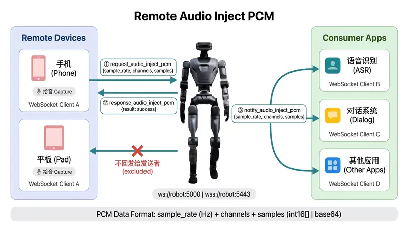
</figure>

#### 4.6.12.1 Request: request_audio_inject_pcm

``` json
{
    "accid": "HU_D04_01_001",
    "title": "request_audio_inject_pcm",
    "timestamp": 1672373633989,
    "guid": "746d937cd8094f6a98c9577aaf213d98",
    "data": {
        "sample_rate": 16000,
        "channels": 1,
        "samples": "<Data format agreed upon by sender and receiver, e.g.: PCM int16 or base64>"
    }
}
```

#### 4.6.12.2 Response: response_audio_inject_pcm

``` json
{
    "accid": "HU_D04_01_001",
    "title": "response_audio_inject_pcm",
    "timestamp": 1672373633989,
    "guid": "746d937cd8094f6a98c9577aaf213d98",
    "data": {
        "result": "success"
    }
}
```

Error code description:

| result              | Description               |
|---------------------|---------------------------|
| success             | Success                   |
| fail_no_sample_rate | Missing sample_rate field |
| fail_no_channels    | Missing channels field    |
| fail_no_samples     | Missing samples field     |

#### 4.6.12.3 Message Push: notify_audio_inject_pcm

After the request succeeds, Signaling will push the audio data to all other connected WebSocket clients except the sender.

``` json
{
    "accid": "HU_D04_01_001",
    "title": "notify_audio_inject_pcm",
    "timestamp": 1672373633989,
    "guid": "746d937cd8094f6a98c9577aaf213d98",
    "data": {
        "sample_rate": 16000,
        "channels": 1,
        "samples": "<Exactly the same as in the request>"
    }
}
```

#### 4.6.12.4 Code Example: audio_inject_pcm_ws.py

##### Inject 1s 440Hz Sine Wave (int16 array format, default)

python3 audio_inject_pcm_ws.py --host 10.192.1.2

##### Inject Base64 Encoded Audio

python3 audio_inject_pcm_ws.py --host 10.192.1.2 --format base64

##### Inject Local WAV File

python3 audio_inject_pcm_ws.py --host 10.192.1.2 --wav /path/to/audio.wav

##### Listen for notify_audio_inject_pcm Broadcasts and Save as WAV

python3 audio_inject_pcm_ws.py --host 10.192.1.2 --listen -o received.wav

``` python
#!/usr/bin/env python3
"""
audio_inject_pcm_ws.py - Audio PCM inject test tool (WebSocket)

Tests request_audio_inject_pcm with PCM data (int16 array or base64).
The server does NOT parse the samples value — it validates field existence
and forwards root["data"] as-is to all other clients via notify_audio_inject_pcm.

Usage:
    # Inject 1s 440Hz sine wave (int16 array, default)
    python3 audio_inject_pcm_ws.py --host 10.192.1.2

    # Inject with base64 encoding
    python3 audio_inject_pcm_ws.py --host 10.192.1.2 --format base64

    # Inject from WAV file
    python3 audio_inject_pcm_ws.py --host 10.192.1.2 --wav /path/to/audio.wav

    # Listen for notify_audio_inject_pcm broadcasts and save to WAV
    python3 audio_inject_pcm_ws.py --host 10.192.1.2 --listen -o received.wav

Dependencies:
    pip install websocket-client numpy
"""

import sys
import json
import uuid
import struct
import math
import time
import base64
import signal
import argparse
import threading

try:
    import numpy as np
except ImportError:
    print("pip install numpy")
    sys.exit(1)

try:
    import websocket
except ImportError:
    print("pip install websocket-client")
    sys.exit(1)

TAG = "AudioInjectPCM"
ACCID = None

_pending = {}
_pending_lock = threading.Lock()
_notify_cbs = {}

ws_client = None
_accid_event = threading.Event()

def generate_guid():
    return str(uuid.uuid4())

def send_request(title, data=None, timeout=10):
    global ACCID
    guid = generate_guid()
    msg = {
        "accid": ACCID or "",
        "title": title,
        "timestamp": int(time.time() * 1000),
        "guid": guid,
        "data": data or {},
    }
    evt = threading.Event()
    holder = {"resp": None}
    with _pending_lock:
        _pending[guid] = (evt, holder)

    ws_client.send(json.dumps(msg))

    if not evt.wait(timeout):
        with _pending_lock:
            _pending.pop(guid, None)
        raise TimeoutError("Request %s timed out after %ds" % (title, timeout))

    with _pending_lock:
        _pending.pop(guid, None)
    return holder["resp"] or {}

def on_ws_message(ws, message):
    global ACCID
    try:
        root = json.loads(message)
    except json.JSONDecodeError:
        return
    title = root.get("title", "")

    if root.get("accid"):
        ACCID = root.get("accid")
        _accid_event.set()

    if title.startswith("response_"):
        guid = root.get("guid", "")
        with _pending_lock:
            entry = _pending.get(guid)
        if entry:
            evt, holder = entry
            holder["resp"] = root.get("data", {})
            evt.set()
    elif title.startswith("notify_"):
        cb = _notify_cbs.get(title)
        if cb:
            try:
                cb(root.get("data", {}))
            except Exception as e:
                print("\n[%s] Notify callback error: %s" % (TAG, e))

def on_ws_open(ws):
    print("[%s] WebSocket connected." % TAG)

def on_ws_close(ws, code, msg):
    print("[%s] WebSocket closed (code=%s)." % (TAG, code))

def on_ws_error(ws, error):
    print("[%s] WebSocket error: %s" % (TAG, error))

def connect_ws(host, port, timeout=10):
    global ws_client
    ready = threading.Event()

    def _on_open(ws):
        on_ws_open(ws)
        ready.set()

    ws_client = websocket.WebSocketApp(
        "ws://%s:%d" % (host, port),
        on_open=_on_open,
        on_message=on_ws_message,
        on_close=on_ws_close,
        on_error=on_ws_error,
    )

    ws_thread = threading.Thread(target=ws_client.run_forever, daemon=True)
    ws_thread.start()

    print("[%s] Connecting to %s:%d ..." % (TAG, host, port))
    if not ready.wait(timeout=timeout):
        print("[%s] Connection timeout!" % TAG)
        sys.exit(1)

    print("[%s] Waiting for ACCID ..." % TAG)
    if not _accid_event.wait(timeout=timeout):
        print("[%s] ACCID not received, using empty string." % TAG)
    else:
        print("[%s] ACCID: %s" % (TAG, ACCID))

def generate_sine_pcm(freq, duration, sample_rate=16000):
    n = int(sample_rate * duration)
    t = np.arange(n, dtype=np.float64) / sample_rate
    return (32767 * 0.8 * np.sin(2 * np.pi * freq * t)).astype(np.int16)

def load_wav_pcm(wav_path):
    import wave
    with wave.open(wav_path, "rb") as wf:
        if wf.getsampwidth() != 2:
            raise ValueError("Only 16-bit WAV supported, got %d-bit" % (wf.getsampwidth() * 8))
        sr = wf.getframerate()
        ch = wf.getnchannels()
        pcm_bytes = wf.readframes(wf.getnframes())
    return np.frombuffer(pcm_bytes, dtype=np.int16), sr, ch

def write_wav(filepath, pcm_int16_array, sample_rate, channels, bits_per_sample=16):
    data_bytes = pcm_int16_array.astype(np.int16).tobytes()
    num_samples = len(pcm_int16_array)
    data_size = len(data_bytes)
    byte_rate = sample_rate * channels * (bits_per_sample // 8)
    block_align = channels * (bits_per_sample // 8)

    with open(filepath, "wb") as f:
        f.write(b"RIFF")
        f.write(struct.pack("<I", 4 + (8 + 16) + (8 + data_size)))
        f.write(b"WAVE")
        f.write(b"fmt ")
        f.write(struct.pack("<I", 16))
        f.write(struct.pack("<HHIIHH", 1, channels, sample_rate,
                            byte_rate, block_align, bits_per_sample))
        f.write(b"data")
        f.write(struct.pack("<I", data_size))
        f.write(data_bytes)

    duration = num_samples / max(sample_rate * channels, 1)
    print("[%s] Saved %s (%d samples, %.1fs)" % (TAG, filepath, num_samples, duration))

def pcm_rms_db(samples_int16):
    if len(samples_int16) == 0:
        return -96
    rms = np.sqrt(np.mean(samples_int16.astype(np.float64) ** 2))
    return int(20 * math.log10(rms / 32768.0)) if rms > 0 else -96

def encode_samples(samples_int16, fmt):
    """Encode int16 numpy array to the chosen wire format."""
    if fmt == "base64":
        return base64.b64encode(samples_int16.tobytes()).decode("ascii")
    else:
        return samples_int16.tolist()

def decode_samples(samples_val):
    """Decode samples from either int16 JSON array or base64 string -> numpy int16 array."""
    if isinstance(samples_val, list):
        return np.array(samples_val, dtype=np.int16)
    elif isinstance(samples_val, str):
        return np.frombuffer(base64.b64decode(samples_val), dtype=np.int16)
    return np.array([], dtype=np.int16)

def run_inject(args):
    if args.wav:
        samples, sample_rate, channels = load_wav_pcm(args.wav)
        print("[%s] Loaded WAV: %s" % (TAG, args.wav))
    else:
        sample_rate = args.sample_rate
        channels = 1
        samples = generate_sine_pcm(args.freq, args.duration, sample_rate)
        print("[%s] Generated sine: %.0fHz, %.1fs" % (TAG, args.freq, args.duration))

    num_samples = len(samples)
    rms = pcm_rms_db(samples)
    encoded = encode_samples(samples, args.format)

    if args.format == "base64":
        payload_size = len(encoded)
    else:
        payload_size = len(json.dumps(encoded))
    raw_size = num_samples * 2

    print("[%s] PCM: %d samples, %d raw bytes, RMS: %d dB" % (TAG, num_samples, raw_size, rms))
    print("[%s] Format: %s, payload: %d bytes" % (TAG, args.format, payload_size))

    connect_ws(args.host, args.port)

    print("[%s] Sending request_audio_inject_pcm ..." % TAG)
    try:
        resp = send_request("request_audio_inject_pcm", {
            "sample_rate": sample_rate,
            "channels": channels,
            "samples": encoded,
        }, timeout=10)
        result = resp.get("result", "unknown")
        print("[%s] Result: %s" % (TAG, result))
        if result != "success":
            print("[%s] Response: %s" % (TAG, json.dumps(resp, indent=2, ensure_ascii=False)))
    except TimeoutError as e:
        print("[%s] %s" % (TAG, e))
    finally:
        ws_client.close()

def run_listen(args):
    connect_ws(args.host, args.port)

    received_chunks = []
    chunk_lock = threading.Lock()
    chunk_info = {"sample_rate": 16000, "channels": 1}
    count = [0]
    stop_event = threading.Event()

    def on_notify(data):
        chunk_info["sample_rate"] = data.get("sample_rate", 16000)
        chunk_info["channels"] = data.get("channels", 1)
        samples_val = data.get("samples")
        if samples_val is None:
            return

        samples = decode_samples(samples_val)
        if len(samples) == 0:
            return

        fmt = "base64" if isinstance(samples_val, str) else "int16[]"
        count[0] += 1
        with chunk_lock:
            received_chunks.append(samples)
        rms = pcm_rms_db(samples)
        print("\r[%s] #%d: %d samples, rate=%d, ch=%d, RMS=%d dB, fmt=%s   " %
              (TAG, count[0], len(samples),
               chunk_info["sample_rate"], chunk_info["channels"], rms, fmt), end="")
        sys.stdout.flush()

    def _save_and_exit():
        _notify_cbs.pop("notify_audio_inject_pcm", None)
        print("\n[%s] Stopped. Received %d broadcasts." % (TAG, count[0]))
        with chunk_lock:
            chunks = list(received_chunks)
        if chunks and args.output:
            all_pcm = np.concatenate(chunks)
            write_wav(args.output, all_pcm,
                      chunk_info["sample_rate"], chunk_info["channels"])
        elif not chunks:
            print("[%s] No audio data received!" % TAG)
        ws_client.close()

    def _signal_handler(signum, frame):
        stop_event.set()

    _notify_cbs["notify_audio_inject_pcm"] = on_notify
    signal.signal(signal.SIGINT, _signal_handler)
    signal.signal(signal.SIGTERM, _signal_handler)

    print("[%s] Listening for notify_audio_inject_pcm ... (Ctrl+C to stop)" % TAG)
    try:
        while not stop_event.is_set():
            stop_event.wait(0.5)
    except KeyboardInterrupt:
        pass

    _save_and_exit()

def main():
    parser = argparse.ArgumentParser(
        description="Audio PCM inject test tool (WebSocket)",
        formatter_class=argparse.RawDescriptionHelpFormatter,
        epilog="""
Examples:
  %(prog)s --host 10.192.1.2                              # Inject 1s 440Hz (int16[])
  %(prog)s --host 10.192.1.2 --format base64              # Inject 1s 440Hz (base64)
  %(prog)s --host 10.192.1.2 --wav hello.wav              # Inject from WAV
  %(prog)s --host 10.192.1.2 --listen -o out.wav          # Listen broadcasts
  %(prog)s --host 10.192.1.2 --freq 880 -d 2              # Inject 2s 880Hz
""")
    parser.add_argument("--host", default="10.192.1.2",
                        help="WebSocket server address (default: 10.192.1.2)")
    parser.add_argument("--port", type=int, default=5000,
                        help="WebSocket port (default: 5000)")
    parser.add_argument("--sample-rate", type=int, default=16000,
                        help="Sample rate in Hz (default: 16000)")
    parser.add_argument("--freq", type=float, default=440.0,
                        help="Sine wave frequency in Hz (default: 440)")
    parser.add_argument("-d", "--duration", type=float, default=1.0,
                        help="Duration in seconds (default: 1.0)")
    parser.add_argument("--wav", type=str,
                        help="Load PCM from WAV file instead of generating sine")
    parser.add_argument("-o", "--output", type=str,
                        help="Output WAV path (for --listen)")
    parser.add_argument("--format", choices=["int16", "base64"], default="int16",
                        help="samples encoding format (default: int16)")

    parser.add_argument("--listen", action="store_true",
                        help="Listen for notify_audio_inject_pcm broadcasts")

    args = parser.parse_args()

    print("[%s] ==========================================" % TAG)
    print("[%s]  Audio PCM Inject Test" % TAG)
    print("[%s] ==========================================" % TAG)

    if args.listen:
        run_listen(args)
    else:
        run_inject(args)

    print("[%s] Done." % TAG)

if __name__ == "__main__":
    main()
```

## 4.7 Exclusive Control Interface

### 4.7.1 Set Exclusive Lock

> **Note:**  
> Can only lock when not already locked

#### 4.7.1.1 Request: request_lock_robot_control

``` json
{
    "accid": "HU_D04_01_001",
    "title": "request_lock_robot_control",
    "timestamp": 1672373633989,
    "guid": "746d937cd8094f6a98c9577aaf213d98",
    "data": {
        "user_name": "name",
        "user_id":"xxxxx",
        "device_id":"xxxxx"
    }
}
```

#### 4.7.1.2 Response: response_lock_robot_control

``` json
{
    "accid": "HU_D04_01_001",
    "title": "response_lock_robot_control",
    "timestamp": 1672373633989,
    "guid": "746d937cd8094f6a98c9577aaf213d98",
    "data": {
        "result": "success"
    }
}
```

### 4.7.2 Release Exclusive Lock

> **Note:**  
> Only the locker has the right to release

#### 4.7.2.1 Request: request_unlock_robot_control

``` json
{
    "accid": "HU_D04_01_001",
    "title": "request_unlock_robot_control",
    "timestamp": 1672373633989,
    "guid": "746d937cd8094f6a98c9577aaf213d98",
    "data": {
    }
}
```

#### 4.7.2.2 Response: response_unlock_robot_control

``` json
{
    "accid": "HU_D04_01_001",
    "title": "response_unlock_robot_control",
    "timestamp": 1672373633989,
    "guid": "746d937cd8094f6a98c9577aaf213d98",
    "data": {
        "result": "success"
    }
}
```

### 4.7.3 Get Locker Information

#### 4.7.3.1 Request: request_get_locker_info

``` json
{
    "accid": "HU_D04_01_001",
    "title": "request_get_locker_info",
    "timestamp": 1672373633989,
    "guid": "746d937cd8094f6a98c9577aaf213d98",
    "data": {}
}
```

#### 4.7.3.2 Response: response_get_locker_info

``` json
{
    "accid": "HU_D04_01_001",
    "title": "response_get_locker_info",
    "timestamp": 1672373633989,
    "guid": "746d937cd8094f6a98c9577aaf213d98",
    "data": {
        "result": "success" ,
        "user_name": "name",
        "user_id":"xxxxx",
        "device_id":"xxxxx",
        "client_ip":"0.0.0.0"
    }
}
```

## 4.8 Global Message Protocol Interface

### 4.8.1 Robot Status Information

> This protocol periodically reports the robot’s status information.

| Status Infomation | **Description**                                          |
|-------------------|----------------------------------------------------------|
| `accid`           | The robot's unique serial number.                        |
| `title`           | notify_robot_info                                        |
| `timestamp`       | The timestamp when the command is sent, in milliseconds. |
| `guid`            | The unique identifier of the message.                    |
| `data`            | Contains the message data.                               |

**Example:**

``` json
{
  "accid": "HU_D04_01_001", 
  "title": "notify_robot_info", 
  "timestamp": 1672373633989,
  "guid": "746d937cd8094f6a98c9577aaf213d98",
  "data": {
    "result": []
  }
}
```

#### 4.8.1.1 Battery Data

``` json
{
  "accid": "HU_D04_01_001", 
  "title": "notify_robot_info", 
  "timestamp": 1672373633989,
  "guid": "746d937cd8094f6a98c9577aaf213d98",
  "data": {
    "result": [
        ......
        {
                "level": 0,
                "name": "peripheral",
                "message": "OK",
                "hardware_id": "peripheral",
                "values": [
                    {
                        "key": "bmsconn",
                        "value": "ON"
                    },
                    {
                        "key": "bat_chg",
                        "value": "OFF"
                    },
                    {
                        "key": "bat_off",
                        "value": "OFF"
                    },
                    {
                        "key": "bat_prt",
                        "value": "0"
                    },
                    {
                        "key": "bat_vol",
                        "value": "48830"
                    },
                    {
                        "key": "bat_cur",
                        "value": "2870"
                    },
                    {
                        "key": "battery",
                        "value": "29"
                    },
                    {
                        "key": "bat_temp0",
                        "value": "430"
                    },
                    {
                        "key": "bat_temp2",
                        "value": "430"
                    },
                    {
                        "key": "bat_temp4",
                        "value": "400"
                    },
                    {
                        "key": "battery_capacity",
                        "value": "9000mAh"
                    }
                ]
            },
    ]
  }
}
```

| Field     | Description                                                                     |
|-----------|---------------------------------------------------------------------------------|
| bmsconn   | Battery connection status: **OFF** = not connected, **ON** = connected          |
| bat_chg   | Battery charger status: **OFF** = not connected, **ON** = connected             |
| bat_off   | Battery pre-shutdown status: OFF = power will be cut off after 1 s, ON = normal |
| bat_prt   | Battery fault code: 0 = normal, non-zero = fault                                |
| bat_vol   | Real-time battery voltage (unit: mV)                                            |
| bat_cur   | Real-time battery current (unit: mA)                                            |
| battery   | Battery level percentage (0–100)                                                |
| bat_temp0 | Battery temperature sensor 0 (range: 0–100, unit: ×10 °C)                       |
| bat_temp2 | Battery temperature sensor 2 (range: 0–100, unit: ×10 °C)                       |
| bat_temp4 | Battery temperature sensor 4 (range: 0–100, unit: ×10 °C)                       |

#### 4.8.1.2 System Information

``` json
{
  "accid": "HU_D04_01_001", 
  "title": "notify_robot_info", 
  "timestamp": 1672373633989,
  "guid": "746d937cd8094f6a98c9577aaf213d98",
  "data": {
      "result": [
          {
              "level": 0,
              "name": "system_info",
              "message": "system info",
              "hardware_id": "system_info",
              "values": [
                {
                  "key": "ability_running",
                  "value": "ZeroTorque"
                },
                {
                  "key": "ecm_version",
                  "value": "1.1.2"
                },
                {
                  "key": "mode",
                  "value": "Remote"
                },
                {
                  "key": "motor_version",
                  "value": "1: 0.0.9; 2: 0.0.9; 3: 0.0.9; 4: 0.0.9; 5: 0.0.9; 6: 0.0.9; 7: 0.0.9; 8: 0.0.9; 9: 0.0.9; 10: 0.0.9; 11: 0.0.9; 12: 0.0.9; 13: 0.0.9; 14: 0.0.9; 15: 0.0.9; 16: 0.0.9; "
                },
                {
                  "key": "pms_version",
                  "value": "2.1.8"
                },
                {
                  "key": "robot_status",
                  "value": "ZeroTorque"
                },
                {
                  "key": "version",
                  "value": "robot-hu-d-2.1.0.20251225062343"
                },
                {
                  "key": "sn",
                  "value": "HU_D04_01_131"
                }
              ]
        }
    ]
  }
}
```

| **Field**       | **Description**                  |
|-----------------|----------------------------------|
| version         | Main controller firmware version |
| ecm_version     | Master station version           |
| pms_version     | Power distribution board version |
| motor_version   | Motor firmware version           |
| sn              | Robot serial number              |
| robot_status    | Current robot status             |
| ability_running | Currently active controller      |

#### 4.8.1.3 Motor Status Information

``` json
{
  "accid": "HU_D04_01_001", 
  "title": "notify_robot_info", 
  "timestamp": 1672373633989,
  "guid": "746d937cd8094f6a98c9577aaf213d98",
  "data": {
      "result": [
          {
                "level": 1,
                "name": "ethercatCommunicationExp",
                "message": "WARN",
                "hardware_id": "ethercat",
                "values": [
                    {
                        "key": "ethercatCommunicationExp",
                        "value": "motor 17 MOTOR_LOST triggered HALF_STAND"
                    },
                    {
                        "key": "ethercatResetNormal",
                        "value": "ok!"
                    }
                ]
          }
    ]
  }
}
```

| **Field**   | **Description**                                            |
|-------------|------------------------------------------------------------|
| level       | Fault severity level: 0 = OK, 1 = Warning, 2 = Error       |
| name        | Fault type                                                 |
| message     | Severity description string                                |
| hardware_id | Hardware ID                                                |
| values      | Collection of all fault entries for the specified hardware |

### 4.8.2 The Remote Controller Data

> This protocol reports the robot’s remote controller data.

| Data Information | Description                                              |
|------------------|----------------------------------------------------------|
| `accid`          | The robot's unique serial number.                        |
| `title`          | notify_joy_data                                          |
| `timestamp`      | The timestamp when the command is sent, in milliseconds. |
| `guid`           | The unique identifier of the message.                    |
| `data`           | Contains the message data.                               |

**Example:**

``` json
{
  "accid": "HU_D04_01_001", 
  "title": "notify_joy_data", 
  "timestamp": 1672373633989,
  "guid": "746d937cd8094f6a98c9577aaf213d98",
  "data": {
    "axes": [],     # joystick data
    "buttons": []   # button data
  }
}
```

## 4.9 Protocol Interface Usage Example

### 4.9.1 Python Example

- Environment Setup: using Ubuntu 20.04 as an example, install the required dependencies

``` bash
sudo apt install python3-dev python3-pip
sudo pip install websocket-client==1.8.0
```

- Execute the Script

``` bash
python humanoid.py
```

- [humanoid.py](http://humanoid.py) Implementation
  - ACCID: Replace with the actual software serial number (SN).
  - ROBOT_IP: Usually, use 127.0.0.1 for simulation and 10.192.1.2 for real hardware.

``` python
import json
import uuid
import threading
import time
import websocket
from datetime import datetime

# Replace this ACCID value with your robot's actual serial number (SN)
ACCID = None

# Replace it with the real IP address of the robot.
# Usually, for simulation, it is: 127.0.0.1
# for a real machine, it is: 10.192.1.2
ROBOT_IP = "10.192.1.2"

# Atomic flag for graceful exit
should_exit = False

# WebSocket client instance
ws_client = None

# Generate dynamic GUID
def generate_guid():
    return str(uuid.uuid4())

# Send WebSocket request with title and data
def send_request(title, data=None):
    global ACCID
    if data is None:
        data = {}
    
    # Create message structure with necessary fields
    message = {
        "accid": ACCID,
        "title": title,
        "timestamp": int(time.time() * 1000),  # Current timestamp in milliseconds
        "guid": generate_guid(),
        "data": data
    }

    message_str = json.dumps(message)
    
    # Send the message through WebSocket if client is connected
    if ws_client:
        ws_client.send(message_str)

# Handle user commands
def handle_commands():
    global should_exit
    while not should_exit:
        command = input("Enter command ('prepare', 'servo', 'movej', 'movel', 'movep', 'head', 'waist', 'state', 'claw_cmd', 'claw_state', 'damping', 'zero') or 'exit' to quit:\n")
        
        if command == "exit":
            should_exit = True  # Set exit flag to stop the loop
            break
        elif command == "prepare":
            send_request("request_prepare")  # request_prepare
        elif command == "servo":
            # Servo control mode flag from user
            mode_input = input("Enable mode (0/1/2):").strip()
            mode_value = int(mode_input) if mode_input in ('0','1','2') else 0
            send_request("request_set_move_mode", {"mode": mode_value})
        elif command == "movej":
            send_request("request_moveJ", { # request_moveJ
              "left": [-1.44532, 0.0987686, 0.179059, -1.64716, -0.0537614, 0.200834, -0.236136],
              "right": [0.10103,-0.0987769,-0.179462,-1.64705,0.0527488,0.198867,0.235933],
              "speed": 0.2
            })
        elif command == "movep":
            send_request("request_moveP", { # request_moveP
              "left_position": [0.089644,0.428712,0.0519788],
              "left_quat": [0.269296,-0.119683,-0.489868,0.820478],
              "right_position": [0.0835307,-0.531453,0.13568],
              "right_quat": [-0.436152,-0.285065,0.265969,0.81103],
              "speed": 0.1
            })
        elif command == "head":
            send_request("request_moveJ", { # request_moveJ
              "head_pitch": 0.5854,
              "head_yaw": 0.5854,
              "speed": 0.1
            })
        elif command == "waist":
            send_request("request_moveJ", { # request_set_waist_and_height
              "torso_height": 0.0,
              "torso_pitch": 0.0,
              "torso_roll": 0.0,
              "torso_yaw": 0.0
            })
        elif command == "claw_cmd":
            send_request("request_set_claw_cmd", { # request_set_claw_cmd
              "left_opening": 100,
              "left_speed": 500,
              "left_force": 500,
              "left_mode": 1,
              "right_opening": 100,
              "right_speed": 500,
              "right_force": 500,
              "right_mode": 1
            })
        elif command == "claw_state":
            send_request("request_get_claw_state")
        elif command == "state":
            send_request("request_get_move_pose")  # request_get_move_pose
        elif command == "damping":
            send_request("request_damping")  # request_damping
        elif command == "zero":
            send_request("request_zero_torque")  # request_zero_torque

# WebSocket on_open callback
def on_open(ws):
    print("Connected!")
    # Start handling commands in a separate thread
    threading.Thread(target=handle_commands, daemon=True).start()

# WebSocket on_message callback
def on_message(ws, message):
    global ACCID
    root = json.loads(message)
    title = root.get("title", "")
    ACCID = root.get("accid", None)

    if title != "notify_robot_info":
        print(f"Received message: {message}")  # Print the received message

# WebSocket on_close callback
def on_close(ws, close_status_code, close_msg):
    print("Connection closed.")

# Close WebSocket connection
def close_connection(ws):
    ws.close()

def main():
    global ws_client
    
    # Create WebSocket client instance
    ws_client = websocket.WebSocketApp(
        f"ws://{ROBOT_IP}:5000",  # WebSocket server URI
        on_open=on_open,
        on_message=on_message,
        on_close=on_close
    )
    
    # Configure socket send and receive buffer sizes
    # Increase send buffer size to 2MB (default is typically much smaller)
    # This helps prevent data loss when sending large messages or high-frequency data
    ws_client.sock_opt = [("socket", "SO_SNDBUF", 2 * 1024 * 1024)]
    
    # Increase receive buffer size to 2MB
    # This allows handling larger incoming messages without truncation
    ws_client.sock_opt.append(("socket", "SO_RCVBUF", 2 * 1024 * 1024))
    
    # Run WebSocket client loop
    print("Press Ctrl+C to exit.")
    ws_client.run_forever()

if __name__ == "__main__":
    main()
```

### 4.9.2 Linux C++ Example

- **Environment Setup**: using Ubuntu 20.04 as an example, install `websocketpp`, `nlohmann/json` and `boost` dependencies:

``` bash
sudo apt-get install libboost-all-dev libwebsocketpp-dev nlohmann-json3-dev
```

- **Compile the Code**

``` bash
g++ -std=c++11 humanoid.cpp -o humanoid -lssl -lcrypto -lboost_system -lpthread
```

- **Execute the Program**

``` bash
./humanoid
```

- **`humanoid.cpp` Implementation**

``` cpp
#include <iostream>
#include <atomic>
#include <string>
#include <thread>
#include <chrono>
#include <websocketpp/client.hpp>
#include <websocketpp/config/asio.hpp>
#include <nlohmann/json.hpp>
#include <boost/uuid/uuid.hpp>
#include <boost/uuid/uuid_generators.hpp>
#include <boost/uuid/uuid_io.hpp>

using json = nlohmann::json;
using websocketpp::client;
using websocketpp::connection_hdl;

// Replace this value with the actual serial number (SN) of the robot.
static std::string ACCID = "";

// Replace it with the real IP address of the robot.
// Usually, for simulation, it is: 127.0.0.1
// for a real machine, it is: 10.192.1.2
const std::string ROBOT_IP = "10.192.1.2";

// WebSocket client instance
static client<websocketpp::config::asio> ws_client;

// Atomic flag for graceful exit
static std::atomic<bool> should_exit(false);

// Connection handle for sending messages
static connection_hdl current_hdl;

// Generate dynamic GUID
static std::string generate_guid() {
  boost::uuids::random_generator gen;
  boost::uuids::uuid u = gen();
  return boost::uuids::to_string(u);
}

// Send WebSocket request with title and data
static void send_request(const std::string& title, const json& data = json::object()) {
  json message;
  
  // Adding necessary fields to the message
  message["accid"] = ACCID;
  message["title"] = title;
  message["timestamp"] = std::chrono::duration_cast<std::chrono::milliseconds>(
                              std::chrono::system_clock::now().time_since_epoch()).count();
  message["guid"] = generate_guid();
  message["data"] = data;

  std::string message_str = message.dump();
  
  // Send the message through WebSocket
  ws_client.send(current_hdl, message_str, websocketpp::frame::opcode::text);
}

// Handle user commands
void handle_commands() {
  std::cout << "Enter command ('prepare', 'servo', 'movej', 'movel', 'movep', 'head', 'waist', 'claw_cmd', 'claw_state', 'damping', 'zero') or 'exit' to quit:\n";
  while (!should_exit) {
      std::string command;
      std::cin >> command;

      if (command == "exit") {
          should_exit = true;
          return;
      } else if (command == "prepare") {
          send_request("request_prepare");
      } else if (command == "servo") {
          int mode_value;
          std::cout << "Enable mode (0/1/2): ";
          if (!(std::cin >> mode_value)) {
              std::cerr << "Error: Invalid input. Please enter 0, 1, or 2." << std::endl;
              return;
          }
          if (mode_value < 0 || mode_value > 2) {
              std::cerr << "Error: Invalid input. Please enter 0, 1, or 2." << std::endl;
              return;
          }
          
          nlohmann::json data = {{"mode", mode_value}};
          send_request("request_set_move_mode", data);
      } else if (command == "movej") {
          nlohmann::json data = {
              {"left", {-1.44532, 0.0987686, 0.179059, -1.64716, -0.0537614, 0.200834, -0.236136}},
              {"right", {0.10103,-0.0987769,-0.179462,-1.64705,0.0527488,0.198867,0.235933}},
              {"speed", 0.2}
          };
          send_request("request_moveJ", data);
      } else if (command == "movep") {
          nlohmann::json data = {
              {"left_position", {0.089644,0.428712,0.0519788}},
              {"left_quat", {0.269296,-0.119683,-0.489868,0.820478}},
              {"right_position", {0.0835307,-0.531453,0.13568}},
              {"right_quat", {-0.436152,-0.285065,0.265969,0.81103}},
              {"speed", 0.1}
          };
          send_request("request_moveP", data);
      } else if (command == "head") {
          nlohmann::json data = {
              {"head_yaw", 0.5854},
              {"head_pitch", 0.5854},
              {"speed", 0.1}
          };
          send_request("request_moveJ", data);
      } else if (command == "waist") {
          nlohmann::json data = {
              {"torso_height", 0.0},
              {"torso_pitch", 0.0},
              {"torso_roll", 0.0},
              {"torso_yaw", 0.0}
          };
          send_request("request_moveJ", data);
      } else if (command == "claw_cmd") {
          nlohmann::json data = {
              {"left_opening", 100},
              {"left_speed", 500},
              {"left_force", 500},
              {"left_mode", 1},
              {"right_opening", 100},
              {"right_speed", 500},
              {"right_force", 500},
              {"right_mode", 1}
          };
          send_request("request_set_claw_cmd", data);
      } else if (command == "claw_state") {
          send_request("request_get_claw_state");
      } else if (command == "state") {
          send_request("request_get_move_pose");
      } else if (command == "damping") {
          send_request("request_damping");
      } else if (command == "zero") {
          send_request("request_zero_torque");
      }

      sleep(1);

      std::cout << "\nEnter command ('prepare', 'servo', 'movej', 'movel', 'movep', 'servop', 'head', 'waist', 'state', 'damping', 'zero') or 'exit' to quit:\n";
  }
}

// WebSocket open callback
static void on_open(connection_hdl hdl) {
  std::cout << "Connected!" << std::endl;
  
  // Save connection handle for sending messages later
  current_hdl = hdl;

  // Start handling commands in a separate thread
  std::thread(handle_commands).detach();
}

// WebSocket TCP initialization handler
static void on_tcp_init(connection_hdl hdl)
{
auto con = ws_client.get_con_from_hdl(hdl);

// Obtain the underlying TCP socket
auto& socket = con->get_socket().lowest_layer();

// Configure socket options
try {
  boost::system::error_code ec;
  
  // Set send buffer size (e.g., 2MB)
  const size_t sendBufferSize = 2 * 1024 * 1024;
  socket.set_option(websocketpp::lib::asio::socket_base::send_buffer_size(sendBufferSize), ec);
  
  if (ec) 
  { 
    printf("Failed to set send buffer size: %s", ec.message().c_str()); 
  }

  // Set receive buffer size (e.g., 2MB)
  const size_t recvBufferSize = 2 * 1024 * 1024;
  socket.set_option(websocketpp::lib::asio::socket_base::receive_buffer_size(recvBufferSize), ec);

  if (ec) 
  { 
    printf("Failed to set receive buffer size: %s", ec.message().c_str()); 
  }

  // Disable Nagle's algorithm to reduce latency
  socket.set_option(websocketpp::lib::asio::ip::tcp::no_delay(true), ec);
  
  if (ec) 
  { 
    printf("Failed to disable Nagle's algorithm: %s", ec.message().c_str()); 
  }
} catch (const std::exception& e) {
  printf("Socket configuration exception: %s", e.what());
}
}

// WebSocket message callback
static void on_message(connection_hdl hdl, client<websocketpp::config::asio>::message_ptr msg) {
// Parse JSON data from message payload
json data = json::parse(msg->get_payload());
      
// Extract 'accid' field if present
if (data.contains("accid") && data["accid"].is_string() && ACCID.empty()) {
    ACCID = data["accid"].get<std::string>();
}

if (msg->get_payload().find("notify_robot_info") == std::string::npos) {
    std::cout << "Received message: " << msg->get_payload() << std::endl;
}
}

// WebSocket close callback
static void on_close(connection_hdl hdl) {
  std::cout << "Connection closed." << std::endl;
}

// Close WebSocket connection
static void close_connection(connection_hdl hdl) {
  ws_client.close(hdl, websocketpp::close::status::normal, "Normal closure");  // Close connection normally
}

int main() {
  ws_client.init_asio();  // Initialize ASIO for WebSocket client

  ws_client.set_access_channels(websocketpp::log::alevel::none);
  
  // Set WebSocket event handlers
  ws_client.set_open_handler(&on_open);  // Set open handler
  ws_client.set_message_handler(&on_message);  // Set message handler
  ws_client.set_close_handler(&on_close);  // Set close handler
  ws_client.set_tcp_init_handler(&on_tcp_init); // Set tcp init handler

  std::string server_uri = "ws://" + ROBOT_IP + ":5000";  // WebSocket server URI

  websocketpp::lib::error_code ec;
  client<websocketpp::config::asio>::connection_ptr con = ws_client.get_connection(server_uri, ec);  // Get connection pointer

  if (ec) {
      std::cout << "Error: " << ec.message() << std::endl;
      return 1;  // Exit if connection error occurs
  }

  connection_hdl hdl = con->get_handle();  // Get connection handle
  ws_client.connect(con);  // Connect to server
  std::cout << "Press Ctrl+C to exit." << std::endl;
  
  // Run the WebSocket client loop
  ws_client.run();

  return 0;
}
```

### 4.9.3 JavaScript Example

- **Execute `humanoid.html`:** Save the `humanoid.html` file to your computer and open it in a browser to run the demo.

<figure data-line="5531">
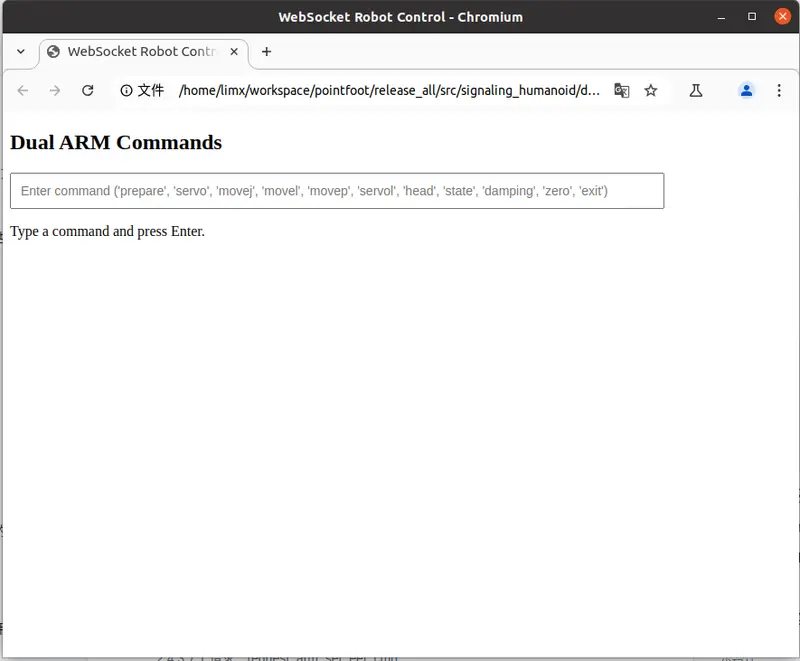
</figure>

- **`humanoid.html`** **Implementation**

``` html
<!DOCTYPE html>
<html lang="en">
<head>
    <meta charset="UTF-8">
    <meta name="viewport" content="width=device-width, initial-scale=1.0">
    <title>WebSocket Robot Control</title>
    <style>
        #commandInput {
            width: 700px; 
            padding: 10px;
            font-size: 14px;
        }
    </style>
</head>
<body>
    <h2>Dual ARM Commands</h2>
    <input type="text" id="commandInput" placeholder="Enter command ('prepare', 'servo', 'movej', 'movel', 'movep', 'head', 'waist', 'claw_cmd', 'claw_state', 'state', 'damping', 'zero', 'exit')">
    <p>Type a command and press Enter.</p>

    <script>
        // Replace this ACCID value with your robot's actual serial number (SN)
        let ACCID = "";

        // WebSocket client instance
        let wsClient = null;

        // Generate dynamic GUID
        function generateGuid() {
            return 'xxxxxxxx-xxxx-4xxx-yxxx-xxxxxxxxxxxx'.replace(/[xy]/g, function(c) {
                const r = Math.random() * 16 | 0,
                      v = c === 'x' ? r : (r & 0x3 | 0x8);
                return v.toString(16);
            });
        }

        // Send WebSocket request with title and data
        function sendRequest(title, data = {}) {
            const message = {
                accid: ACCID,
                title: title,
                timestamp: Date.now(),
                guid: generateGuid(),
                data: data
            };

            if (wsClient && wsClient.readyState === WebSocket.OPEN) {
                wsClient.send(JSON.stringify(message));
            }
        }

        // Handle user commands
        function handleCommands() {
            const commandInput = document.getElementById('commandInput');
            commandInput.addEventListener('keydown', function(event) {
                if (event.key === 'Enter') {
                    const command = commandInput.value.trim();
                    commandInput.value = '';

                    switch (command) {
                        case 'prepare':
                            sendRequest('request_prepare');
                            break;
                        case 'servo':
                            const modeInput = prompt("Enable Servo (0/1/2):").trim();
                            let modeValue = 0;
                            
                            // Attempt to parse the input as an integer
                            const n = parseInt(modeInput, 10);
                            if (!Number.isNaN(n) && (n === 0 || n === 1 || n === 2)) {
                              modeValue = n;
                            } else {
                              // If the input is invalid, return an error
                              alert("Error: Invalid input. Please enter 0, 1, or 2.");
                              return;
                            }
                            sendRequest('request_set_move_mode', { mode: modeValue });
                            break;
                        case 'movej':
                            sendRequest('request_moveJ', {
                                left: [-1.44532, 0.0987686, 0.179059, -1.64716, -0.0537614, 0.200834, -0.236136],
                                right: [0.10103,-0.0987769,-0.179462,-1.64705,0.0527488,0.198867,0.235933],
                                speed: 0.2
                            });
                            break;
                        case 'movep':
                            sendRequest('request_moveP', {
                                left_position: [0.089644,0.428712,0.0519788],
                                left_quat: [0.269296,-0.119683,-0.489868,0.820478],
                                right_position: [0.0835307,-0.531453,0.13568],
                                right_quat: [-0.436152,-0.285065,0.265969,0.81103],
                                speed: 0.1
                            });
                            break;
                        case 'head':
                            sendRequest('request_moveJ', {
                                head_yaw: 0.5854,
                                head_pitch: 0.5854,
                                speed: 0.1
                            });
                            break;
                        case 'waist':
                            sendRequest('request_moveJ', {
                                torso_height: 0.0,
                                torso_pitch: 0.0,
                                torso_roll: 0.0,
                                torso_yaw: 0.0
                            });
                            break;
                        case 'claw_cmd':
                            sendRequest('request_set_claw_cmd', {
                                left_opening: 100,
                                left_speed: 500,
                                left_force: 500,
                                left_mode: 1,
                                right_opening: 100,
                                right_speed: 500,
                                right_force: 500,
                                right_mode: 1
                            });
                            break;
                        case 'claw_state':
                            sendRequest('request_get_claw_state');
                            break;
                        case 'state':
                            sendRequest('request_get_move_pose');
                            break;
                        case 'damping':
                            sendRequest('request_damping');
                            break;
                        case 'zero':
                            sendRequest('request_zero_torque');
                            break;
                        case 'exit':
                            wsClient.close();
                            break;
                        default:
                            alert("Invalid command. Try again.");
                    }
                }
            });
        }

        // WebSocket onOpen callback
        function onOpen() {
            console.log("Connected!");
            handleCommands();
        }

        // WebSocket onMessage callback
        function onMessage(event) {
            try {
                const message = JSON.parse(event.data);

                // Dynamically set ACCID from message if not already set
                if (!ACCID && message.accid) {
                    ACCID = message.accid;
                    console.log(`ACCID set to: ${ACCID}`);
                }
            } catch (error) {
                console.log("Failed to parse message:", error);
            }
            
            if (event.data.includes('notify_robot_info')) return;
            console.log("Received message:", event.data);
        }

        // WebSocket onClose callback
        function onClose(event) {
            console.log("Connection closed.");
        }

        // Initialize WebSocket client
        function initWebSocket() {
            // Replace it with the real IP address of the robot. 
            // Usually, for simulation, it is: 127.0.0.1 
            // for a real machine, it is: 10.192.1.2
            wsClient = new WebSocket('ws://10.192.1.2:5000');
            wsClient.onopen = onOpen;
            wsClient.onmessage = onMessage;
            wsClient.onclose = onClose;
            console.log("Press Ctrl+C to exit.");
        }

        // Start WebSocket connection when the page loads
        window.onload = initWebSocket;
    </script>
</body>
</html>
```

# 5 Low-Level Motion Control Development Interface

The **cross-platform low-level motion control API** provides a unified C++/Python interface, compatible with ROS1, ROS2, and non-ROS systems, enabling rapid migration and deployment of motion control algorithms. Through a hardware abstraction layer and standardized communication protocols, developers can seamlessly switch between simulation and real hardware environments, significantly reducing multi-platform adaptation costs.

> **Notes:**
>
> 1.  To use the low-level control API, press `R1 + START` to switch to **Developer Mode**. In this mode, high-level control interfaces are disabled, and the robot only responds to power-on/power-off and zeroing remote controller commands.
> 2.  Example code for the low-level interface can be found in the RL deployment and training section.
> 3.  When switched to Developer Mode, the robot will retain the power state. To exit Developer Mode, press `L2 + ○`.

## 5.1 C++ Motion Control Development Interface

### 5.1.1 getInstance Interface

| Function Name      | **getInstance**                                                                                           |
|--------------------|-----------------------------------------------------------------------------------------------------------|
| Function Prototype | static Humanoid\* getInstance();                                                                          |
| Description        | Retrieves the singleton instance pointer of the Humanoid robot class.                                     |
| Parameters         | None                                                                                                      |
| Return Value       | Humanoid\*, Pointer to the Humanoid instance                                                              |
| Remarks            | Implements the singleton pattern to ensure only one instance of the Humanoid class exists in the program. |

Code Example：

``` cpp
#include <thread>

// include the limxsdk: Humanoid header file to import the Humanoid class
#include "limxsdk/humanoid.h"

// use the limxsdk namespace to simplify references to the Humanoid class
using namespace limxsdk;

int main(int argc, char *argv[]){
  //obtain the singleton instance of the Humanoid class
  Humanoid* robot = Humanoid::getInstance();
  
  // Enter an infinite loop to keep the program running
  while (true)
  {
    // sleep for 1000 milliseconds
    std::this_thread::sleep_for(std::chrono::milliseconds(1000));
  }
   
  return 0;
}
```

### 5.1.2 init Interface

| Function Name      | **init**                                                                                                                                               |
|--------------------|--------------------------------------------------------------------------------------------------------------------------------------------------------|
| Function Prototype | bool init(const std::string& robot_ip_address = "127.0.0.1");                                                                                          |
| Description        | Initializes the communication and runtime environment for the motion control algorithm, typically called before other interfaces in the main function. |
| Parameters         | robot_ip_address: The IP address of the robot. Use "127.0.0.1" for simulation and "10.192.1.2" for real robots.                                        |
| Return Value       | true if initialization succeeds; otherwise false.                                                                                                      |
| Remarks            | None                                                                                                                                                   |

Code Example：

``` cpp
#include <thread>

// include the limxsdk: Humanoid header file to import the Humanoid class
#include "limxsdk/humanoid.h"  

// use the limxsdk namespace to simplify references to the Humanoid class
using namespace limxsdk;  

int main(int argc, char *argv[]){
  // obtain the singleton instance of the Humanoid class
  Humanoid* robot = Humanoid::getInstance();  
  
  // default IP address of the robot
  std::string robot_ip = "127.0.0.1";
  if (argc > 1)
  {
    // If a command-line argument is provided, use it as the robot’s IP address
    robot_ip = argv[1];
  }
  
  // Initialize the communication environment for the motion control algorithm program
  if (!robot->init(robot_ip))
  {
    // If initialization fails, terminate the program
    exit(1); 
  }
  
  // Enter an infinite loop to keep the program running
  while (true)
  {
    // sleep for 1000 milliseconds
    std::this_thread::sleep_for(std::chrono::milliseconds(1000)); 
  }
  return 0;
}
```

### 5.1.3 getMotorNumber Interface

| Function Name      | **getMotorNumber**                                                                |
|--------------------|-----------------------------------------------------------------------------------|
| Function Prototype | uint32_t getMotorNumber();                                                        |
| Description        | Retrieves the motor number in the robot.                                          |
| Parameters         | None                                                                              |
| Return Value       | Returns an unsigned integer representing the total number of motors in the robot. |
| Remarks            | None                                                                              |

Code Example：

``` cpp
#include <thread>

// include the limxsdk: Humanoid header file to import the Humanoid class
#include "limxsdk/humanoid.h"  

// use the limxsdk namespace to simplify references to the Humanoid class
using namespace limxsdk;  

int main(int argc, char *argv[]){
  // obtain the singleton instance of the Humanoid class
  Humanoid* robot = Humanoid::getInstance();  
  
  // default IP address of the robot
  std::string robot_ip = "127.0.0.1";
  if (argc > 1)
  {
    // If a command-line argument is provided, use it as the robot’s IP address
    robot_ip = argv[1];
  }
  
  // Initialize the communication environment for the motion control algorithm program
  if (!robot->init(robot_ip))
  {
    // If initialization fails, terminate the program
    exit(1); 
  }
  
  // Obtain the motor number of the robot
  uint32_t motor_num = robot->getMotorNumber();
  
  // Enter an infinite loop to keep the program running
  while (true)
  {
    // sleep for 1000 milliseconds
    std::this_thread::sleep_for(std::chrono::milliseconds(1000)); 
  }
  return 0;
}
```

### 5.1.4 subscribeImuData Interface

| Function Name      | **subscribeImuData**                                                                                               |
|--------------------|--------------------------------------------------------------------------------------------------------------------|
| Function Prototype | void subscribeImuData(std::function\<void(const ImuDataConstPtr&)\> cb);                                           |
| Description        | Subscribes to the robot’s IMU data and triggers the specified callback function whenever new IMU data is received. |
| Parameters         | cb: Callback function to process the incoming IMU data.                                                            |
| Return Value       | None                                                                                                               |
| Remarks            | \- IMU Data structure prototype defined as follows:                                                                |

``` cpp
/**
 * @struct ImuData
 *
 * @brief Represents a data structure for robot IMU information based on sensor feedback.
 *
 * This structure encapsulates IMU data, including the accelerometer, gyroscope, and quaternion information.
 */
struct ImuData {
  uint64_t stamp; // Timestamp: Recorded in nanoseconds, indicating the time at which the data was recorded or generated.
  float acc[3];   // Stores IMU accelerometer data to track linear acceleration along the X, Y, and Z axes.
  float gyro[3];  // Stores IMU gyroscope data to track angular velocity (rotational speed) along the X, Y, and Z axes.
  float quat[4];  // Stores IMU quaternion values representing the robot’s orientation in 3D space (w, x, y, z).
};

// Smart Pointer Type Alias
typedef std::shared_ptr<ImuData> ImuDataPtr;
typedef std::shared_ptr<ImuData const> ImuDataConstPtr;
```

Code Example：

``` cpp
#include <thread>

// include the limxsdk: Humanoid header file to import the Humanoid class
#include "limxsdk/humanoid.h"  

// use the limxsdk namespace to simplify references to the Humanoid class
using namespace limxsdk;  

int main(int argc, char *argv[]){
  // obtain the singleton instance of the Humanoid class
  Humanoid* robot = Humanoid::getInstance();  
  
  // default IP address of the robot
  std::string robot_ip = "127.0.0.1";
  if (argc > 1)
  {
    // If a command-line argument is provided, use it as the robot’s IP address
    robot_ip = argv[1];
  }
  
  // Initialize the communication environment for the motion control algorithm program
  if (!robot->init(robot_ip))
  {
    // If initialization fails, terminate the program
    exit(1); 
  }
  
  // Subscribe to robot state updates and specify a callback function
  robot->subscribeImuData([&](const ImuDataConstPtr& msg) {
    // Handle the received ImuData within this callback
    // Note: The callback function is invoked when new ImuData is received
  });
  
  // Enter an infinite loop to keep the program running
  while (true)
  {
    // sleep for 1000 milliseconds
    std::this_thread::sleep_for(std::chrono::milliseconds(1000)); 
  }
  return 0;
}
```

### 5.1.5 subscribeRobotState Interface

| Function Name | subscribeRobotState |
|---|---|
| Function Prototype | void subscribeRobotState(std::function<void(const RobotStateConstPtr&)> cb); |
| Description | Subscribes to receive updates on robot status. <br> <br> Note: This interface returns joint states based on the robot's serial URDF model. <br> This robot adopts a hybrid serial-parallel configuration, where some joints use parallel actuation. Unlike traditional serial joints (where one DOF is directly driven by a single actuator), parallel joints have the following characteristics: <br> - Multiple actuators collaboratively drive one joint DOF <br> - Higher load capacity, stiffness, and dynamic response performance <br> - More compact mechanical structure with higher achievable joint torque output <br> - Maintains partial motion capability even when a single actuator fails (redundant design) <br> Although parallel joints provide significant mechanical advantages, directly controlling and programming them introduces the following challenges: <br> - Complex kinematic and dynamic models with high computational cost <br> - Inability to directly reuse mature serial-robot control algorithms and toolchains <br> - Users must understand specialized parallel mechanism knowledge, increasing learning cost <br> - Poor compatibility with existing robotics ecosystems (e.g., ROS, MoveIt!) <br> To address these issues, we implement a transparent equivalent conversion from parallel joints to serial joints in the low-level robot control system, fully shielding upper-layer users from parallel mechanism complexity. <br> During state feedback: <br> Collect position, velocity, and current/torque information from all parallel-joint actuators -> Compute equivalent serial-joint position, velocity, and torque -> Feed back to users |
| Parameters | cb: callback function, invoked upon receiving a state update, with a constant pointer to a RobotState object as its parameter. |
| Return Value | None |
| Remarks | - RobotState data structure prototype defined as follows: |

``` cpp
/**
 * @struct RobotState
 *
 * @brief Represents a data structure for robot state based on sensor feedback.
 *
 * This structure encapsulates various data points used for monitoring and controlling the robot, including IMU data (accelerometer, gyroscope, quaternion), output torques, current joint angles, velocities, and more.
 */
struct RobotState {
  // Default constructor
  RobotState() { } 
  // Parameterized constructor, initializes vectors tau, q, and dq with size motor_num, all elements set to 0.0.
  RobotState(int motor_num)
  : tau(motor_num, 0.0)
  , q(motor_num, 0.0)
  , dq(motor_num, 0.0) { }
  , motor_names(motor_num, "") { }
  uint64_t stamp;              // Timestamp （in nanoseconds）, typically indicates the time at which the data was recorded or generated.
  std::vector<float> tau;      //  A vector for storing the current estimated output torques of the joints (unit: N·m).
  std::vector<float> q;        // A vector for storing the current joint angles (unit: radians)
  std::vector<float> dq;       // A vector for storing the current joint velocities (unit: radians per second)
   std::vector<std::string> motor_names; // A vector for storing the names of all joints.
};

// Smart Pointer Type Alias
typedef std::shared_ptr<RobotState> RobotStatePtr;
typedef std::shared_ptr<RobotState const> RobotStateConstPtr;
```

Code Example：

``` cpp
#include <thread>

// include the limxsdk: Humanoid header file to import the Humanoid class
#include "limxsdk/humanoid.h"  

// use the limxsdk namespace to simplify references to the Humanoid class
using namespace limxsdk;  

int main(int argc, char *argv[]){
  // obtain the singleton instance of the Humanoid class
  Humanoid* robot = Humanoid::getInstance();  
  
  // default IP address of the robot
  std::string robot_ip = "127.0.0.1";
  if (argc > 1)
  {
    // If a command-line argument is provided, use it as the robot’s IP address
    robot_ip = argv[1];
  }
  
  // Initialize the communication environment for the motion control algorithm program
  if (!robot->init(robot_ip))
  {
    // If initialization fails, terminate the program
    exit(1); 
  }
  
  // Subscribe to robot state updates and specify a callback function
  robot->subscribeRobotState([&](const RobotStateConstPtr& msg) {
    // Handle the received ImuData within this callback
    // Note: The callback function is invoked when new ImuData is received
  });
  
  // Enter an infinite loop to keep the program running
  while (true)
  {
    // sleep for 1000 milliseconds
    std::this_thread::sleep_for(std::chrono::milliseconds(1000)); 
  }
  return 0;
}
```

### 5.1.6 publishRobotCmd Interface

| Function Name | publishRobotCmd |
|---|---|
| Function Prototype | bool publishRobotCmd(const RobotCmd& cmd); |
| Description | Publishes a command to control the robot's actions. <br> <br> Note: This interface sends joint commands based on the robot's serial URDF model. <br> This robot adopts a hybrid serial-parallel configuration, where some joints use parallel actuation. Unlike traditional serial joints (where one DOF is directly driven by a single actuator), parallel joints have the following characteristics: <br> - Multiple actuators collaboratively drive one joint DOF <br> - Higher load capacity, stiffness, and dynamic response performance <br> - More compact mechanical structure with higher achievable joint torque output <br> - Maintains partial motion capability even when a single actuator fails (redundant design) <br> Although parallel joints provide significant mechanical advantages, directly controlling and programming them introduces the following challenges: <br> - Complex kinematic and dynamic models with high computational cost <br> - Inability to directly reuse mature serial-robot control algorithms and toolchains <br> - Users must understand specialized parallel mechanism knowledge, increasing learning cost <br> - Poor compatibility with existing robotics ecosystems (e.g., ROS, MoveIt!) <br> To address these issues, we implement a transparent equivalent conversion from parallel joints to serial joints in the low-level robot control system, fully shielding upper-layer users from parallel mechanism complexity. <br> During command dispatch: <br> Receive equivalent serial-joint commands from users (position/velocity/torque) -> Compute target commands for each parallel actuator -> Send them to actuators for execution <br> (Because Kp and Kd commands cannot be converted efficiently, if users require force control, it is recommended to directly send torque commands (tau) instead of indirectly achieving force control via PD control. In controller implementations, PD commands are often converted to torque commands, which commonly occurs when RL policies output position/velocity actions.) |
| Parameters | cmd: a RobotCmd object specifying the desired robot command |
| Return Value | None |
| Remarks | - RobotCmd data structure prototype defined as follows: |

``` cpp
/**
 * @struct RobotCmd
 *
 * @brief Represents a data structure for robot state based on sensor feedback.
 *
 * This structure contains various commands that can be used to control the robot, including the desired operating mode, target joint angles, target velocities, target output torques, desired position stiffness, and desired velocity stiffness.
 */
struct RobotCmd {
  RobotCmd() { }
  RobotCmd(int motor_num)
  : mode(motor_num, 0)
  , q(motor_num, 0.0)
  , dq(motor_num, 0.0)
  , tau(motor_num, 0.0)
  , Kp(motor_num, 0.0)
  , Kd(motor_num, 0.0) { }
  , motor_names(motor_num, "") { }
  uint64_t stamp;             // Timestamp （in nanoseconds）, typically indicates the time at which the data was recorded or generated.
  std::vector<uint8_t> mode;  // 0: Torque control mode；1：Velocity control mode；2：Position control mode，default setting：0
  std::vector<float> q;       // A vector for storing desired joint angles (unit: radians)
  std::vector<float> dq;      // A vector for storing desired joint velocities (unit: radians per second)
  std::vector<float> tau;     // A vector for storing desired output torques (unit: N·m)
  std::vector<float> Kp;      // A vector for storing desired position stiffness values (unit: N·m per radian)
  std::vector<float> Kd;      // A vector for storing desired velocity stiffness values (unit: N·m per radian per second)
  std::vector<std::string> motor_names;   // Stores the names of the robot joints to be controlled
};

// Smart Pointer Type Alias     
typedef std::shared_ptr<RobotCmd> RobotCmdPtr;
typedef std::shared_ptr<RobotCmd const> RobotCmdConstPtr;  
```

Code Example：

``` cpp
#include <thread>

// include the limxsdk: Humanoid header file to import the Humanoid class
#include "limxsdk/humanoid.h"  

// use the limxsdk namespace to simplify references to the Humanoid class
using namespace limxsdk;  

int main(int argc, char *argv[]){
  // obtain the singleton instance of the Humanoid class
  Humanoid* robot = Humanoid::getInstance();  
  
  // default IP address of the robot
  std::string robot_ip = "127.0.0.1";
  if (argc > 1)
  {
    // If a command-line argument is provided, use it as the robot’s IP address
    robot_ip = argv[1];
  }
  
  // Initialize the communication environment for the motion control algorithm program
  if (!robot->init(robot_ip))
  {
    // If initialization fails, terminate the program
    exit(1); 
  }
  
  // Obtain the motor number of the robot
  uint32_t motor_num = robot->getMotorNumber();
  
  // Create a RobotCmd object that includes the number of robot motors
  RobotCmd cmd(motor_num);
  
  // Publish the control command
  robot->publishRobotCmd(cmd);
  
  // Enter an infinite loop to keep the program running
  while (true)
  {
    // sleep for 1000 milliseconds
    std::this_thread::sleep_for(std::chrono::milliseconds(1000)); 
  }
  return 0;
}
```

### 5.1.7 subscribeSensorJoy Interface

| Function Name      | **subscribeSensorJoy**                                                                                                                                                                                                           |
|--------------------|----------------------------------------------------------------------------------------------------------------------------------------------------------------------------------------------------------------------------------|
| Function Prototype | void subscribeSensorJoy(std::function\<void(const SensorJoyConstPtr&)\> cb);                                                                                                                                                     |
| Description        | Subscribes to the robot’s remote controller data during real-machine deployment. When data is received, the specified callback function is invoked and provided with a constant pointer to a SensorJoy structure for processing. |
| Parameters         | cb: Callback Function for receiving remote controller data. The parameter type is SensorJoyConstPtr, a shared pointer to a constant SensorJoy structure.                                                                         |
| Return Value       | None                                                                                                                                                                                                                             |
| Remarks            | \- SensorJoy data structure prototype defined as follows:                                                                                                                                                                        |

``` cpp
/**
 * @struct SensorJoy
 *
 * @brief The structure of the robot remote controller data
 *
 * This structure contains timestamp information related to the controller, as well as joystick and button values.
 */
struct SensorJoy {
    uint64_t stamp;                     // Timestamp corresponding to the sensor input time, in nanoseconds
    std::vector<float> axes;            //  Values representing controller joystick manipulation
    std::vector<int32_t> buttons;       // Values representing controller button operation states
};       

// SensorJoy Smart Pointer Type Alias
typedef std::shared_ptr<SensorJoy> SensorJoyPtr;
typedef std::shared_ptr<const SensorJoy> SensorJoyConstPtr;
```

Code Example：

``` cpp
#include <thread>

// include the limxsdk: Humanoid header file to import the Humanoid class
#include "limxsdk/humanoid.h"  

// use the limxsdk namespace to simplify references to the Humanoid class
using namespace limxsdk;  

int main(int argc, char *argv[]){
  // obtain the singleton instance of the Humanoid class
  Humanoid* robot = Humanoid::getInstance();  
  
  // default IP address of the robot
  std::string robot_ip = "127.0.0.1";
  if (argc > 1)
  {
    // If a command-line argument is provided, use it as the robot’s IP address
    robot_ip = argv[1];
  }
  
  // Initialize the communication environment for the motion control algorithm program
  if (!robot->init(robot_ip))
  {
    // If initialization fails, terminate the program
    exit(1); 
  }
  
  // Subscribe to the remote controller data of the robot
  robot->subscribeSensorJoy([&](const limxsdk::SensorJoyConstPtr &joy) {
    // L1 & R1 press
    if (joy->buttons[4] == 1 && joy->buttons[7] == 1)
    {
      // Perform the corresponding operations here
    }

    // Process the joystick data
    double axes_left_horizontal = joy->axes[0];
    double axes_left_vertical = joy->axes[1];
    double axes_right_horizontal = joy->axes[2];
    double axes_right_vertical = joy->axes[3];
  });
  
  // Enter an infinite loop to keep the program running
  while (true)
  {
    // sleep for 1000 milliseconds
    std::this_thread::sleep_for(std::chrono::milliseconds(1000)); 
  }
  return 0;
}
```

### 5.1.8 subscribeDiagnosticValue Interface

| Function Name      | **subscribeDiagnosticValue**                                                                                                                                                                                                                                                                                                      |
|--------------------|-----------------------------------------------------------------------------------------------------------------------------------------------------------------------------------------------------------------------------------------------------------------------------------------------------------------------------------|
| Function Prototype | void subscribeDiagnosticValue(std::function\<void(const DiagnosticValueConstPtr&)\> cb);                                                                                                                                                                                                                                          |
| Description        | Subscribes to the robots' diagnostic value and status information. When a diagnostic message is issued, the specified callback function is triggered and receives a constant pointer to a DiagnosticValue structure, enabling real-time monitoring of the robot’s health status and allowing timely handling of potential issues. |
| Parameters         | cb: Callback function for receiving diagnostic data. The parameter type is DiagnosticValueConstPtr, a shared pointer to a constant DiagnosticValue structure containing fields such as timestamp, level, name, code, and message.                                                                                                 |
| Return Value       | None                                                                                                                                                                                                                                                                                                                              |
| Remarks            | \- DiagnosticValue data structure prototype defined as follows:                                                                                                                                                                                                                                                                   |

``` cpp
/**
 * @struct DiagnosticValue
 *
 * @brief Structure representing diagnostic values
 *
 * This structure contains information about the diagnostic level, name, code, and message.
 */
struct DiagnosticValue {
  enum { OK = 0 };         // Diagnostic level for normal status
  enum { WARN = 1 };       // Diagnostic level for warning status
  enum { ERROR = 2 };      // Diagnostic level for error status

  uint64_t stamp;          // Timestamp, in nanoseconds
  int32_t level;           // Diagnostic level associated with the diagnostic value
  std::string name;        // Name identifying the diagnostic value
  int32_t code;            // Code corresponding to the diagnostic value
  std::string message;     // Detailed message related to the diagnostic value
};

// DiagnosticValue Smart pointer type definition
typedef std::shared_ptr<DiagnosticValue> DiagnosticValuePtr;
typedef std::shared_ptr<DiagnosticValue const> DiagnosticValueConstPtr;
```

Code Example：

``` cpp
#include <thread>

// include the limxsdk: Humanoid header file to import the Humanoid class
#include "limxsdk/humanoid.h"  

// use the limxsdk namespace to simplify references to the Humanoid class
using namespace limxsdk;  

int main(int argc, char *argv[]){
  // obtain the singleton instance of the Humanoid class
  Humanoid* robot = Humanoid::getInstance();  
  
  // default IP address of the robot
  std::string robot_ip = "127.0.0.1";
  if (argc > 1)
  {
    // If a command-line argument is provided, use it as the robot’s IP address
    robot_ip = argv[1];
  }
  
  // Initialize the communication environment for the motion control algorithm program
  if (!robot->init(robot_ip))
  {
    // If initialization fails, terminate the program
    exit(1); 
  }
  
  // Subscribe to robot diagnostic data
  robot->subscribeDiagnosticValue([&](const DiagnosticValueConstPtr& msg) {
    // Handle the robot diagnostic value here
    // For example, actions can be taken based on the diagnostic level and message
    std::cout << "Diagnostic Value: " << msg->name << std::endl;
    std::cout << "Level: " << msg->level << std::endl;
    std::cout << "Code: " << msg->code << std::endl;
    std::cout << "Message: " << msg->message << std::endl;
  });
  
  // Enter an infinite loop to keep the program running
  while (true)
  {
    // sleep for 1000 milliseconds
    std::this_thread::sleep_for(std::chrono::milliseconds(1000)); 
  }
  return 0;
}
```

### 5.1.9 publishJsonMessage Interface

| Function Name      | **publishJsonMessage**                                                                                                                                                                      |
|--------------------|---------------------------------------------------------------------------------------------------------------------------------------------------------------------------------------------|
| Function Prototype | void publishJsonMessage(const std::string &json_payload);                                                                                                                                   |
| Description        | Sends a JSON-formatted message to the robot following the High-Level Application Protocol Interface.                                                                                        |
| Parameters         | JSON_payload: A JSON string conforming to the High-Level Application Protocol specification. Example: {"accid": "xxx", "title": "request_xxx", "timestamp": xxx, "guid": "xxx", "data": {}} |
| Return Value       | None                                                                                                                                                                                        |
| Remarks            | Valid only in high-level development mode.                                                                                                                                                  |

Code Example：

``` cpp
#include <thread>

// include the limxsdk: Humanoid header file to import the Humanoid class
#include "limxsdk/humanoid.h"  

// use the limxsdk namespace to simplify references to the Humanoid class
using namespace limxsdk;  

int main(int argc, char *argv[]){
  // obtain the singleton instance of the Humanoid class
  Humanoid* robot = Humanoid::getInstance();  
  
  // default IP address of the robot
  std::string robot_ip = "10.192.1.2";
  if (argc > 1)
  {
    // If a command-line argument is provided, use it as the robot’s IP address
    robot_ip = argv[1];
  }
  
  // Initialize the communication runtime environment
  if (!robot->init(robot_ip))
  {
    // If initialization fails, terminate the program
    exit(1); 
  }
  
   // The JSON protocol content to be sent
  std::string json_payload = R"({
    "accid": "HU_D03_01",   # Replace with the real robot serial number (SN)
    "title": "request_get_joint_state",
    "timestamp": 1672373633989,
    "guid": "746d937cd8094f6a98c9577aaf213d98",
    "data": {}
  })";
  
  // Publish control command
  robot->publishJsonMessage(json_payload);
  
  // Enter an infinite loop to keep the program running
  while (true)
  {
    // sleep for 1000 milliseconds
    std::this_thread::sleep_for(std::chrono::milliseconds(1000)); 
  }
  return 0;
}
```

### 5.1.10 subscribeJsonMessage Interface

| Function Name      | **subscribeJsonMessage**                                                                                                                                                                                                                                                                                                                     |
|--------------------|----------------------------------------------------------------------------------------------------------------------------------------------------------------------------------------------------------------------------------------------------------------------------------------------------------------------------------------------|
| Function Prototype | void subscribeJsonMessage(std::function\<void(const std::string &)\> cb);                                                                                                                                                                                                                                                                    |
| Description        | Registers a callback function to handle responses and notifications from the robot’s High-Level Application Protocol Interface. The callback is triggered in the following cases: 1. When the robot returns a response to a previously sent JSON command (publishJsonMessage). 2. When the robot actively sends an unsolicited notification. |
| Parameters         | cb: callback function, prototype as void(const std::string &json_payload) json_payload includes： - Command response: {"accid": "xxx", "title": "response_xxx", "timestamp": xxx, "guid": "xxx", "data": {}} - Notification: {"accid": "xxx", "title": "notify_xxx", "timestamp": xxx, "guid": "xxx", "data": {}}                            |
| Return Value       | None                                                                                                                                                                                                                                                                                                                                         |
| Remarks            | Valid only in high-level development mode                                                                                                                                                                                                                                                                                                    |

Code Example：

``` cpp
#include <thread>

// include the limxsdk: Humanoid header file to import the Humanoid class
#include "limxsdk/humanoid.h"  

// use the limxsdk namespace to simplify references to the Humanoid class
using namespace limxsdk;  

int main(int argc, char *argv[]){
  // obtain the singleton instance of the Humanoid class
  Humanoid* robot = Humanoid::getInstance();  
  
  // default IP address of the robot
  std::string robot_ip = "10.192.1.2";
  if (argc > 1)
  {
    // If a command-line argument is provided, use it as the robot’s IP address
    robot_ip = argv[1];
  }
  
  // Initialize the communication runtime environment
  if (!robot->init(robot_ip))
  {
    // If initialization fails, terminate the program
    exit(1); 
  }
  
  // Handle responses and notifications from the robot’s “High-Level Application Protocol Interface” calls.
  robot->subscribeJsonMessage([&](const std::string & json_payload) {
    std::cout << json_payload << std::endl;
  });
  
  // Enter an infinite loop to keep the program running
  while (true)
  {
    // sleep for 1000 milliseconds
    std::this_thread::sleep_for(std::chrono::milliseconds(1000)); 
  }
  return 0;
}
```

### 5.1.11 Reference Example

Github: `https://github.com/limxdynamics/humanoid-rl-deploy-ros`

## 5.2 Python Motion Control API

Provides a Python motion-control API with equivalent functionality to the C++ motion-control interface, enabling developers who are not familiar with C++ to develop motion-control algorithms in Python.

### 5.2.1 Install Motion Control Development Library

- Linux x86_64 Environment

``` bash
pip install python3/amd64/limxsdk-*-py3-none-any.whl
```

- Linux aarch64 Environment

``` bash
pip install python3/aarch64/limxsdk-*-py3-none-any.whl
```

- Windows Environment

``` bash
pip install python3/win/limxsdk-*-py3-none-any.whl
```

### 5.2.2 **init** Interface

| Function Name      | ****init****                                                                                                              |
|--------------------|---------------------------------------------------------------------------------------------------------------------------|
| Function Prototype | def **init**(self, robot_type: robot.RobotType)                                                                           |
| Description        | Specifies the robot type during initialization and creates a local robot instance of the corresponding type.              |
| Parameters         | robot_type: an enumeration value specifying the robot type, where RobotType.Humanoid represents a bipedal humanoid robot. |
| Return Value       | None                                                                                                                      |
| Remarks            | None                                                                                                                      |

Code Example：

``` python
import sys
import limxsdk.robot.Robot as Robot
import limxsdk.robot.RobotType as RobotType

if __name__ == '__main__':
    # Create a Robot instance of type Humanoid
    robot = Robot(RobotType.Humanoid)
```

### 5.2.3 init Interface

| Function Name      | **init**                                                                                                                                               |
|--------------------|--------------------------------------------------------------------------------------------------------------------------------------------------------|
| Function Prototype | def init(self, robot_ip: str = "127.0.0.1")                                                                                                            |
| Description        | Initializes the communication and runtime environment for the motion control algorithm, typically called before other interfaces in the main function. |
| Parameters         | robot_ip: The IP address of the robot. Use "127.0.0.1" for simulation and "10.192.1.2" for real robots.                                                |
| Return Value       | Success: return True Failure: return False                                                                                                             |
| Remarks            | None                                                                                                                                                   |

Code Example：

``` python
import sys
import limxsdk.robot.Robot as Robot
import limxsdk.robot.RobotType as RobotType

if __name__ == '__main__':
    # Create a Robot instance of type Humanoid
    robot = Robot(RobotType.Humanoid)
    
    robot_ip = "127.0.0.1"
    # Check whether a command-line argument is provided as the robot’s IP address
    if len(sys.argv) > 1:
        robot_ip = sys.argv[1]

    # Initialize the robot’s communication runtime environment using the IP address
    if not robot.init(robot_ip):
        sys.exit()
```

### 5.2.4 getMotorNumber Interface

| Function Name      | **getMotorNumber**                                                                |
|--------------------|-----------------------------------------------------------------------------------|
| Function Prototype | def getMotorNumber(self)                                                          |
| Description        | Retrieves the motor number in the robot.                                          |
| Parameters         | None                                                                              |
| Return Value       | Returns an unsigned integer representing the total number of motors in the robot. |
| Remarks            | Typically, a bipedal humanoid robot is equipped with 6 motors.                    |

Code Example：

``` python
import sys
import limxsdk.robot.Robot as Robot
import limxsdk.robot.RobotType as RobotType

if __name__ == '__main__':
    # Create a Robot instance of type Humanoid
    robot = Robot(RobotType.Humanoid)

    robot_ip = "127.0.0.1"
    # Check whether a command-line argument is provided as the robot’s IP address
    if len(sys.argv) > 1:
        robot_ip = sys.argv[1]

    # Initialize the robot using robot_ip
    if not robot.init(robot_ip):
        sys.exit()

    # Obtain the number of motors in the robot
    motor_number = robot.getMotorNumber()
```

### 5.2.5 subscribeImuData Interface

| Function Name      | **subscribeImuData**                                                                                               |
|--------------------|--------------------------------------------------------------------------------------------------------------------|
| Function Prototype | def subscribeImuData(self, callback: Callable\[\[datatypes.ImuData\], Any\])                                       |
| Description        | Subscribes to the robot’s IMU data and triggers the specified callback function whenever new IMU data is received. |
| Parameters         | Callback: Callback function to process the new IMU data.                                                           |
| Return Value       | Success: return True Failure: return False                                                                         |
| Remarks            | \- datatypes.ImuData structure prototype defined as follows:                                                       |

``` python
import sys

class ImuData(object):
    __slots__ = ['stamp','acc','gyro','quat']
    def __init__(self):
        self.stamp = 0 # Timestamp: Typically indicates the time at which the data was recorded or generated, in nanoseconds
        self.acc = [0. for x in range(0, 3)]  # Stores IMU (Inertial Measurement Unit) accelerometer data, used to track linear acceleration along the three axes
        self.gyro = [0. for x in range(0, 3)] # Stores IMU gyroscope data, used to track angular velocity or rotational speed
        self.quat = [0. for x in range(0, 4)] # Stores IMU quaternion data, representing orientation in 3D space
```

Code Example：

``` python
import sys
from functools import partial
import limxsdk.robot.Robot as Robot
import limxsdk.robot.RobotType as RobotType
import limxsdk.datatypes as datatypes

class RobotReceiver:
    # Subscribe to the robot's IMU data
    def imuDataCallback(self, imu: datatypes.ImuData):
        print("\n------\nrobot_state:" + \
              "\n  stamp: " + str(imu.stamp) + \
              "\n  acc: " + str(imu.acc) + \
              "\n  gyro: " + str(imu.gyro) + \
              "\n  quat: " + str(imu.quat))

if __name__ == '__main__':
    # Create a Robot instance of type Humanoid
    robot = Robot(RobotType.Humanoid)

    robot_ip = "127.0.0.1"
    # Check whether a command-line argument is provided for the robot’s IP address
    if len(sys.argv) > 1:
        robot_ip = sys.argv[1]

    # Initialize the robot using robot_ip
    if not robot.init(robot_ip):
        sys.exit()

    # Create a RobotReceiver instance to handle callbacks
    receiver = RobotReceiver()

    # Create a partial function for the callback
    imuDataCallback = partial(receiver.imuDataCallback)

    # Subscribe to the robot's IMU data
    robot.subscribeImuData(imuDataCallback)
```

### 5.2.6 subscribeRobotState Interface

| Function Name | subscribeRobotState |
|---|---|
| Function Prototype | def subscribeRobotState(self, callback: Callable[[datatypes.RobotState], Any]) |
| Description | Subscribes to receive updates on robot status. |
| Parameters | callback: callback function, invoked upon receiving a robot state update. The callback parameter points to a datatypes.RobotState object. <br> - datatypes.RobotState data structure fields: <br> - stamp: timestamp, typically indicating when the data was recorded or generated. <br> - tau: vector storing the current estimated output torques (in N·m). <br> - q: vector storing the current joint positions (in radians). <br> - dq: vector storing the current joint velocities (in radians per second). <br> - motor_names: vector storing the corresponding joint names. <br> <br> Note: This interface returns joint states based on the robot's serial URDF model. <br> This robot adopts a hybrid serial-parallel configuration, where some joints use parallel actuation. Unlike traditional serial joints (where one DOF is directly driven by a single actuator), parallel joints have the following characteristics: <br> - Multiple actuators collaboratively drive one joint DOF <br> - Higher load capacity, stiffness, and dynamic response performance <br> - More compact mechanical structure with higher achievable joint torque output <br> - Maintains partial motion capability even when a single actuator fails (redundant design) <br> Although parallel joints provide significant mechanical advantages, directly controlling and programming them introduces the following challenges: <br> - Complex kinematic and dynamic models with high computational cost <br> - Inability to directly reuse mature serial-robot control algorithms and toolchains <br> - Users must understand specialized parallel mechanism knowledge, increasing learning cost <br> - Poor compatibility with existing robotics ecosystems (e.g., ROS, MoveIt!) <br> To address these issues, we implement a transparent equivalent conversion from parallel joints to serial joints in the low-level robot control system, fully shielding upper-layer users from parallel mechanism complexity. <br> During state feedback: <br> Collect position, velocity, and current/torque information from all parallel-joint actuators -> Compute equivalent serial-joint position, velocity, and torque -> Feed back to users |
| Return Value | Success: return True <br> Failure: return False |
| Remarks | - datatypes.RobotState structure prototype defined as follows: |

``` python
import sys

class RobotState(object):
    __slots__ = ['stamp','tau','q','dq']
    def __init__(self):
        self.stamp = 0 # Timestamp: Typically indicates the time at which the data was recorded or generated, in nanoseconds
        self.tau = []  # Stores the vector of current estimated output torques (unit: N·m)
        self.q = []    # Stores the vector of current joint angles (unit: radians)
        self.dq = []   # Stores the vector of current joint velocities (unit: radians per second)
        self.motor_names = []   # Stores the corresponding joint names
```

Code Example：

``` python
import sys
from functools import partial
import limxsdk.robot.Robot as Robot
import limxsdk.robot.RobotType as RobotType
import limxsdk.datatypes as datatypes

class RobotReceiver:
    # Callback function for receiving the robot’s state
    def robotStateCallback(self, robot_state: datatypes.RobotState):
        print("\n------\nrobot_state:" + \
              "\n  stamp: " + str(robot_state.stamp) + \
              "\n  tau: " + str(robot_state.tau) + \
              "\n  q: " + str(robot_state.q) + \
              "\n  dq: " + str(robot_state.dq))

if __name__ == '__main__':
    # Create a Robot instance of type Humanoid
    robot = Robot(RobotType.Humanoid)

    robot_ip = "127.0.0.1"
    # Check whether a command-line argument is provided for the robot’s IP address
    if len(sys.argv) > 1:
        robot_ip = sys.argv[1]

    # Initialize the robot using robot_ip
    if not robot.init(robot_ip):
        sys.exit()

    # Create a RobotReceiver instance to handle callbacks
    receiver = RobotReceiver()

    # Create a partial function for the callback
    robotStateCallback = partial(receiver.robotStateCallback)

    # Subscribe to the robot's IMU data
    robot.subscribeRobotState(robotStateCallback)
```

### 5.2.7 publishRobotCmd Interface

| Function Name | publishRobotCmd |
|---|---|
| Function Prototype | def publishRobotCmd (self, cmd: datatypes.RobotCmd) |
| Description | Publishes a command to control the robot's actions. |
| Parameters | cmd: a datatypes.RobotCmd object representing the desired robot command, containing the following fields: <br> - stamp: timestamp in nanoseconds indicating when the data was recorded or generated. <br> - q: vector storing the desired joint positions (in radians). <br> - dq: vector storing the desired joint velocities (in radians per second). <br> - tau: vector storing the desired output torques (in N·m). <br> - Kp: vector storing the desired position stiffness (in N·m per radian). <br> - Kd: vector storing the desired velocity stiffness (in N·m per radian per second). <br> - motor_names: vector storing the joint names to be controlled. <br> <br> Note: This interface sends joint commands based on the robot's serial URDF model. <br> This robot adopts a hybrid serial-parallel configuration, where some joints use parallel actuation. Unlike traditional serial joints (where one DOF is directly driven by a single actuator), parallel joints have the following characteristics: <br> - Multiple actuators collaboratively drive one joint DOF <br> - Higher load capacity, stiffness, and dynamic response performance <br> - More compact mechanical structure with higher achievable joint torque output <br> - Maintains partial motion capability even when a single actuator fails (redundant design) <br> Although parallel joints provide significant mechanical advantages, directly controlling and programming them introduces the following challenges: <br> - Complex kinematic and dynamic models with high computational cost <br> - Inability to directly reuse mature serial-robot control algorithms and toolchains <br> - Users must understand specialized parallel mechanism knowledge, increasing learning cost <br> - Poor compatibility with existing robotics ecosystems (e.g., ROS, MoveIt!) <br> To address these issues, we implement a transparent equivalent conversion from parallel joints to serial joints in the low-level robot control system, fully shielding upper-layer users from parallel mechanism complexity. <br> During command dispatch: <br> Receive equivalent serial-joint commands from users (position/velocity/torque) -> Compute target commands for each parallel actuator -> Send them to actuators for execution <br> (Because Kp and Kd commands cannot be converted efficiently, if users require force control, it is recommended to directly send torque commands (tau) instead of indirectly achieving force control via PD control. In controller implementations, PD commands are often converted to torque commands, which commonly occurs when RL policies output position/velocity actions.) |
| Return Value | Success: return True <br> Failure: return False |
| Remarks | - datatypes.RobotCmd structure prototype defined as follows: |

``` python
import sys

class RobotCmd(object):
    __slots__ = ['stamp','mode','q','dq','tau','Kp','Kd']
    def __init__(self):
        self.stamp = 0 # Timestamp （in nanoseconds）, typically indicates the time at which the data was recorded or generated.
        self.mode = [] # The robot's desired working mode
        self.q = []    # A vector for storing desired joint angles (unit: radians)
        self.dq = []   # A vector for storing desired joint velocities (unit: radians per second)
        self.tau = []  # A vector for storing desired output torques (unit: N·m)
        self.Kp = []   # A vector for storing desired position stiffness values (unit: N·m per radian)
        self.Kd = []   # A vector for storing desired velocity stiffness values (unit: N·m per radian per second)
        self.motor_names = []   # Stores the names of the robot joints to be controlled
```

Code Example：

``` python
import sys
import time
import limxsdk.robot.Rate as Rate
import limxsdk.robot.Robot as Robot
import limxsdk.robot.RobotType as RobotType
import limxsdk.datatypes as datatypes

if __name__ == '__main__':
    # Create a Robot instance of type Humanoid
    robot = Robot(RobotType.Humanoid)

    robot_ip = "127.0.0.1"
    # Check whether a command-line argument is provided as the robot’s IP address
    if len(sys.argv) > 1:
        robot_ip = sys.argv[1]

    # Initialize the robot using robot_ip
    if not robot.init(robot_ip):
        sys.exit()

    # Obtain information on joint offsets, joint limits, and the number of motors
    joint_offset = robot.getJointOffset()
    joint_limit = robot.getJointLimit()
    motor_number = robot.getMotorNumber()
    
    # Main loop to continuously publish robot commands
    rate = Rate(500) # 1500 Hz
    cmd_msg = datatypes.RobotCmd()
    while True:
        # Set default values for timestamp, control mode, joint positions, velocities, torques, Kp, and Kd
        cmd_msg.stamp = time.time_ns()
        cmd_msg.mode = [1.0 for _ in range(motor_number)]
        cmd_msg.q = [1.0 for _ in range(motor_number)]
        cmd_msg.dq = [1.0 for _ in range(motor_number)]
        cmd_msg.tau = [1.0 for _ in range(motor_number)]
        cmd_msg.Kp = [1.0 for _ in range(motor_number)]
        cmd_msg.Kd = [1.0 for _ in range(motor_number)]
        robot.publishRobotCmd(cmd_msg)  # Publish the robot commands
        rate.sleep()  # Control the loop frequency
```

### 5.2.8 subscribeSensorJoy Interface

| Function Name      | **subscribeSensorJoy**                                                                                                                                                                                                                     |
|--------------------|--------------------------------------------------------------------------------------------------------------------------------------------------------------------------------------------------------------------------------------------|
| Function Prototype | def subscribeSensorJoy(self, callback: Callable\[\[datatypes.SensorJoy\], Any\])                                                                                                                                                           |
| Description        | Subscribes to the robot’s remote controller data during real-machine deployment. When data is received, the specified callback function is invoked and provided with a constant pointer to a datatypes.SensorJoy structure for processing. |
| Parameters         | callback: Callback Function for receiving remote controller data with parameter type SensorJoyConstPtr.                                                                                                                                    |
| Return Value       | Success: return True Failure: return False                                                                                                                                                                                                 |
| Remarks            | \- datatypes.SensorJoy structure prototype defined as follows:                                                                                                                                                                             |

``` python
import sys

class SensorJoy(object):
    __slots__ = ['stamp','axes','buttons']
    def __init__(self):
        self.stamp = 0     # Timestamp corresponding to the sensor input time, in nanoseconds
        self.axes = []     # Values representing controller joystick manipulation
        self.buttons = []  # Values representing controller button operation states
```

Code Example：

``` python
import sys
import time
from functools import partial
import limxsdk.robot.Robot as Robot
import limxsdk.robot.RobotType as RobotType
import limxsdk.datatypes as datatypes

class RobotReceiver:
    # Callback function for receiving the remote controller data
    def sensorJoyCallback(self, sensor_joy: datatypes.SensorJoy):
        print("\n------\nsensor_joy:" + \
              "\n  stamp: " + str(sensor_joy.stamp) + \
              "\n  axes: " + str(sensor_joy.axes) + \
              "\n  buttons: " + str(sensor_joy.buttons))

if __name__ == '__main__':
    # Create a Robot instance of type Humanoid
    robot = Robot(RobotType.Humanoid)

    robot_ip = "127.0.0.1"
    # Check whether a command-line argument is provided for the robot’s IP address
    if len(sys.argv) > 1:
        robot_ip = sys.argv[1]

    # Initialize the robot using robot_ip
    if not robot.init(robot_ip):
        sys.exit()

    # Create a RobotReceiver instance to handle callbacks
    receiver = RobotReceiver()

    # Create a partial function for the callback
    sensorJoyCallback = partial(receiver.sensorJoyCallback)

    # Subscribe to the robot's IMU data
    robot.subscribeSensorJoy(sensorJoyCallback)
```

### 5.2.9 subscribeDiagnosticValue Interface

| Function Name      | **subscribeDiagnosticValue**                                                                                                                                                                                                                            |
|--------------------|---------------------------------------------------------------------------------------------------------------------------------------------------------------------------------------------------------------------------------------------------------|
| Function Prototype | def subscribeDiagnosticValue(self, callback: Callable\[\[datatypes.DiagnosticValue\], Any\])                                                                                                                                                            |
| Description        | Subscribes to the robot’s diagnostic and status updates. Upon receiving a diagnostic message, the callback function is triggered with a datatypes.DiagnosticValue object, allowing continuous health monitoring and prompt response to detected issues. |
| Parameters         | Callback function for receiving diagnostic data. The parameter type is datatypes.DiagnosticValue, which contains fields such as timestamp, level, name, code, and message.                                                                              |
| Return Value       | Success: return True Failure: return False                                                                                                                                                                                                              |
| Remarks            | \- datatypes.DiagnosticValue structure prototype defined as follows:                                                                                                                                                                                    |

``` python
import sys

class DiagnosticValue(object):
    __slots__ = ['stamp','level','name','code','message']
    def __init__(self):
        self.stamp = 0 # Timestamp, in nanoseconds
        self.level = 0 # Diagnostic level associated with the diagnostic value - 0: OK, 1: WARN, 2: ERROR
        self.name = '' # Name identifying the diagnostic value
        self.code = 0  # Code corresponding to the diagnostic value
        self.message = ''  # Detailed message related to the diagnostic value
```

Code Example：

``` python
import sys
from functools import partial
import limxsdk.robot.Robot as Robot
import limxsdk.robot.RobotType as RobotType
import limxsdk.datatypes as datatypes

class RobotReceiver:
    # Callback function for receiving diagnostic value
    def diagnosticValueCallback(self, diagnostic_value: datatypes.DiagnosticValue):
        print("\n------\ndiagnostic_value:" + \
              "\n  stamp: " + str(diagnostic_value.stamp) + \
              "\n  name: " + diagnostic_value.name + \
              "\n  level: " + str(diagnostic_value.level) + \
              "\n  code: " + str(diagnostic_value.code) + \
              "\n  message: " + diagnostic_value.message)

if __name__ == '__main__':
    # Create a Robot instance of type Humanoid
    robot = Robot(RobotType.Humanoid)

    robot_ip = "127.0.0.1"
    # Check whether a command-line argument is provided for the robot’s IP address
    if len(sys.argv) > 1:
        robot_ip = sys.argv[1]

    # Initialize the robot using robot_ip
    if not robot.init(robot_ip):
        sys.exit()

    # Create a RobotReceiver instance to handle callbacks
    receiver = RobotReceiver()

    # Create a partial function for the callback
    diagnosticValueCallback = partial(receiver.diagnosticValueCallback)

    # Subscribe to the robot's IMU data
    robot.subscribeDiagnosticValue(diagnosticValueCallback)
```

### 5.2.10 publishJsonMessage Interface

| Function Name      | **publishJsonMessage**                                                                                                                                                                      |
|--------------------|---------------------------------------------------------------------------------------------------------------------------------------------------------------------------------------------|
| Function Prototype | def publishJsonMessage(self, json_payload: str)                                                                                                                                             |
| Description        | Sends a JSON-formatted message to the robot following the High-Level Application Protocol Interface.                                                                                        |
| Parameters         | json_payload: A JSON string conforming to the High-Level Application Protocol specification. Example: {"accid": "xxx", "title": "request_xxx", "timestamp": xxx, "guid": "xxx", "data": {}} |
| Return Value       | None                                                                                                                                                                                        |
| Remarks            | Valid only in high-level development mode.                                                                                                                                                  |

Code Example：

``` python
import sys
import time
import limxsdk.robot.Rate as Rate
import limxsdk.robot.Robot as Robot
import limxsdk.robot.RobotType as RobotType
import limxsdk.datatypes as datatypes

if __name__ == '__main__':
    # Create a Robot instance of type Humanoid
    robot = Robot(RobotType.Humanoid)

    robot_ip = "10.192.1.2"
    # Check whether a command-line argument is provided for the robot’s IP address
    if len(sys.argv) > 1:
        robot_ip = sys.argv[1]

    # Initialize the robot using robot_ip
    if not robot.init(robot_ip):
        sys.exit()
    
    # Set the protocol content to be sent
    json_payload = '''{
        "accid": "HU_D03_01", # Replace with the real robot serial number (SN)
        "title": "request_get_joint_state",
        "timestamp": 1672373633989,
        "guid": "746d937cd8094f6a98c9577aaf213d98",
        "data": {}
    }'''
    
    # Send the JSON protocol.
    robot.publishJsonMessage(json_payload)
    
    # Keep the program running
    try:
        while True:
            time.sleep(1)
    except KeyboardInterrupt:
        print("Program interrupted by the user")
```

### 5.2.11 subscribeJsonMessage Interface

| Function Name      | **subscribeJsonMessage**                                                                                                                                                                                                                                                                                                                     |
|--------------------|----------------------------------------------------------------------------------------------------------------------------------------------------------------------------------------------------------------------------------------------------------------------------------------------------------------------------------------------|
| Function Prototype | def subscribeJsonMessage(self, callback: Callable\[\[str\], Any\])                                                                                                                                                                                                                                                                           |
| Description        | Registers a callback function to handle responses and notifications from the robot’s High-Level Application Protocol Interface. The callback is triggered in the following cases: 1. When the robot returns a response to a previously sent JSON command (publishJsonMessage). 2. When the robot actively sends an unsolicited notification. |
| Parameters         | callback: callback function, json_payload includes： - Command response: {"accid": "xxx", "title": "response_xxx", "timestamp": xxx, "guid": "xxx", "data": {}} - Notification: {"accid": "xxx", "title": "notify_xxx", "timestamp": xxx, "guid": "xxx", "data": {}}                                                                         |
| Return Value       | None                                                                                                                                                                                                                                                                                                                                         |
| Remarks            | Valid only in high-level development mode                                                                                                                                                                                                                                                                                                    |

Code Example：

``` python
import sys
import time
from functools import partial
import limxsdk.robot.Robot as Robot
import limxsdk.robot.RobotType as RobotType
import limxsdk.datatypes as datatypes

class RobotReceiver:
    # Handle responses and notifications from the robot’s “High-Level Application Protocol Interface” calls.
    def jsonMessageCallback(self, json_payload: str):
        print("\n------\njson_payload:" + json_payload)

if __name__ == '__main__':
    # Create a Robot instance of type Humanoid
    robot = Robot(RobotType.Humanoid)

    robot_ip = "10.192.1.2"
    # Check whether a command-line argument is provided for the robot’s IP address
    if len(sys.argv) > 1:
        robot_ip = sys.argv[1]

    # Initialize the robot using robot_ip
    if not robot.init(robot_ip):
        sys.exit()

    # Create a RobotReceiver instance to handle callbacks
    receiver = RobotReceiver()

    # Create a partial function for the callback
    jsonMessageCallback = partial(receiver.jsonMessageCallback)

    # Subscribe to the robot's IMU data
    robot.subscribeJsonMessage(jsonMessageCallback)
```

### 5.2.12 Reference Example

Github: `https://github.com/limxdynamics/humanoid-rl-deploy-python`

# 6 Check and Set the Robot Model

When compiling or running RL training, control algorithms and simulation programs, selecting the correct robot model is essential. Check the robot model and set it in the environment variable `ROBOT_TYPE` to ensure the correct model is identified and applied across different tasks.

**Steps to View and Configure the Robot Model:**

1.  Connect to the robot’s Wi-Fi hotspot and enter the password: `12345678`

<figure data-line="6993">
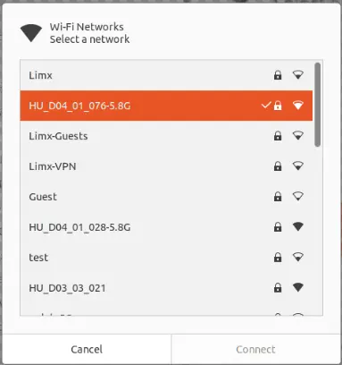
</figure>

2.  Open a web browser and navigate to `http://10.192.1.2:8080`. The page displays the SN (serial number) — for example, **HU_D03_03_001** — where **HU_D03_03** represents the robot model, as shown below.

<figure data-line="6997">
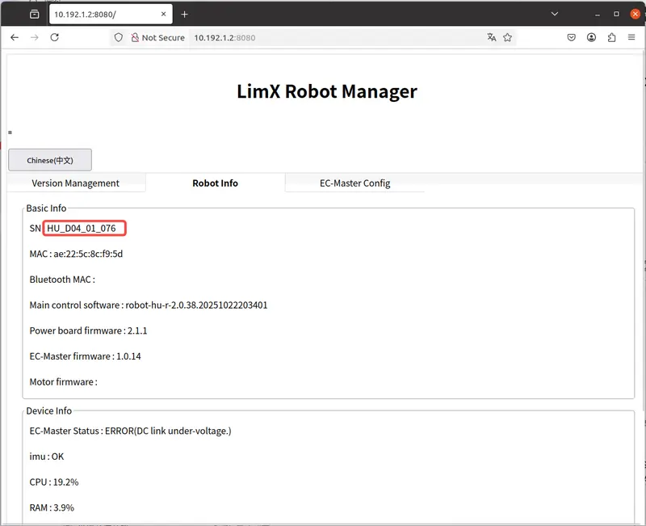
</figure>

3.  Set the robot model: Open a Bash terminal and run the following shell command to set the robot model. This ensures that the correct robot model information is recognized during secondary development.

``` bash
echo 'export ROBOT_TYPE=HU_D03_03' >> ~/.bashrc && source ~/.bashrc
```

# 7 Robot Simulator

**MuJoCo** is a lightweight, high-performance physics simulator designed for multi-joint robots and mechanical systems.  
It features an efficient physics engine capable of accurately simulating contact and friction, and can operate independently without relying on ROS.

## 7.1 Running the Simulator

1.  Environment Requirements: Python 3.8 or higher is recommended
2.  Open a Bash Terminal
3.  Download the MuJoCo Simulator Code:

``` bash
git clone --recurse git@github.com:limxdynamics/humanoid-mujoco-sim.git
```

4.  Install the Motion Control Development Library:

- Linux x86_64 Environment

``` bash
pip install humanoid-mujoco-sim/limxsdk-lowlevel/python3/amd64/limxsdk-*-py3-none-any.whl
```

- Linux aarch64 Environment

``` bash
pip install humanoid-mujoco-sim/limxsdk-lowlevel/python3/aarch64/limxsdk-*-py3-none-any.whl
```

5.  Set the Robot Model: Please refer to the “check and set the Robot Model” section to check your robot model. If not yet configured, please follow the steps below:

- List available robot types using the shell command tree -L 3 -P "meshes" -I "urdf\|world\|xml\|usd" humanoid-mujoco-sim/humanoid-description:

``` bash
limx@limx:~$ tree -L 3 -P "meshes" -I "urdf|world|xml|usd" humanoid-mujoco-sim/humanoid-description
humanoid-mujoco-sim/humanoid-description
├── HU_D03_description
│   └── meshes
│       └── HU_D03_03
└── HU_D04_description
    └── meshes
        └── HU_D04_01
```

- For example, to set the robot model type HU_D04_01 (replace with your actual model):

``` bash
echo 'export ROBOT_TYPE=HU_D04_01' >> ~/.bashrc && source ~/.bashrc
```

6.  Run the MuJoCo simulator：

``` bash
python humanoid-mujoco-sim/simulator.py
```

## 7.2 Demonstration Results

> Actual performance may vary depending on your system configuration.  
> 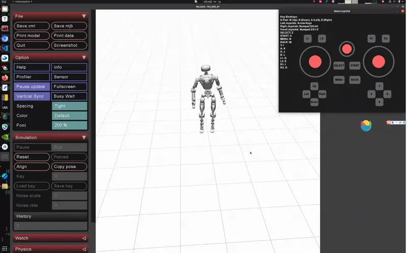

# 8 RL Algorithm Deployment

## 8.1 Deployment with Standard C++

- **Github Repository:** <https://github.com/limxdynamics/humanoid-rl-deploy-cpp>
- A lightweight algorithm framework implemented in standard C++, enabling fast deployment of trained models without requiring ROS1 or ROS2.

## 8.2 Deployment with Python

- **Github Repository:** <https://github.com/limxdynamics/humanoid-rl-deploy-python>
- A Python-based reinforcement learning deployment framework that simplifies the process of deploying trained models on Oli.

## 8.3 Deployment with ROS2

- **Github Repository:** <https://github.com/limxdynamics/humanoid-rl-deploy-ros2>
- A reinforcement learning deployment framework based on [ROS2](https://www.ros.org), allowing rapid deployment of trained models on Oli.

## 8.4 Deployment with ROS1

- **Github Repository:** <https://github.com/limxdynamics/humanoid-rl-deploy-ros>
- A reinforcement learning deployment framework based on [ROS1](https://www.ros.org), enabling efficient deployment of trained models on Oli.

# 9 Logs and Data Packages

- **Automatic Data Recording:** The robot system automatically records essential data, including IMU data (ImuData), state data (/joint/state), control data (/joint/cmd), and runtime logs. These records are critical for motion control analysis and performance evaluation.
- **Accessing and Downloading Data:** The robot stores runtime log data for troubleshooting and performance optimization. To access the data, connect your computer to the robot’s Wi-Fi hotspot, then open a browser at `http://10.192.1.2:8090` to download the desired datasets.

<figure data-line="7091">
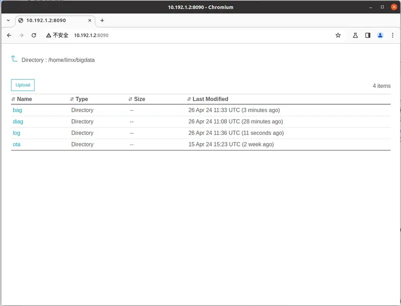
</figure>

9.1 Data Package Visualization and Analysis

- **Downloading Data Packages:** After downloading a `.bag` file, you can use PlotJuggler to visualize and analyze the data. If the downloaded file is in `.bag.active` format, run the following shell command to reindex it and generate a new `.bag` file for PlotJuggler to load properly.

  ``` bash
  rosbag reindex your_file.bag.active
  mv your_file.bag.active your_file.bag
```

- **Visualization:** Launch the PlotJuggler visualization tool using the shell command `rosrun plotjuggler plotjuggler -n`, then load the data packages as shown below:

  <figure data-line="7104">
  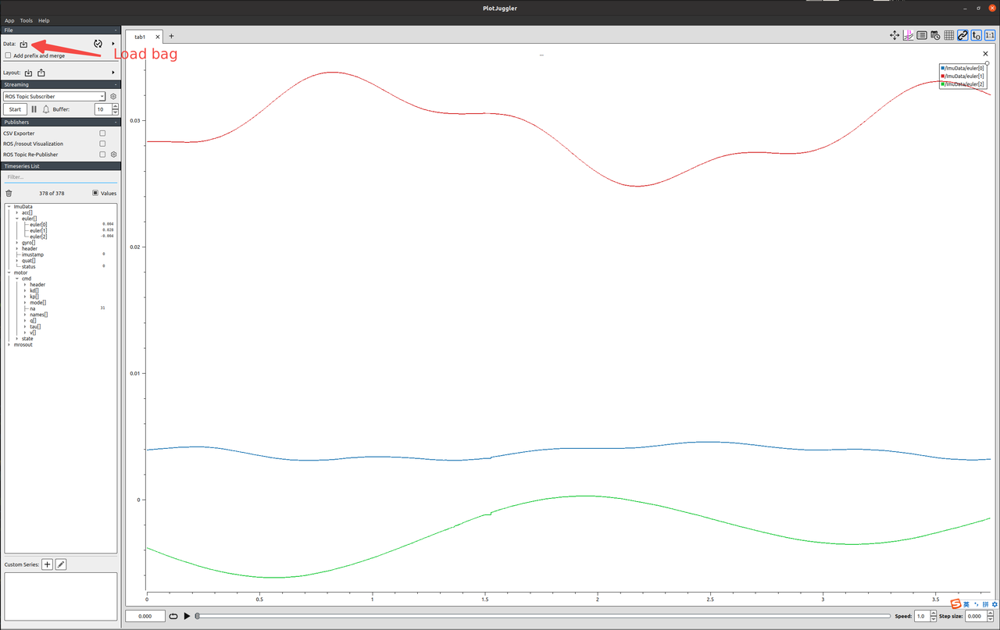
  </figure>

## 9.2 Logs and Diagnostic Trace Data

Structured log and diagnostic trace data are recorded for system monitoring, as shown below. These datasets can be used for troubleshooting and performance optimization when needed.

<figure data-line="7111">
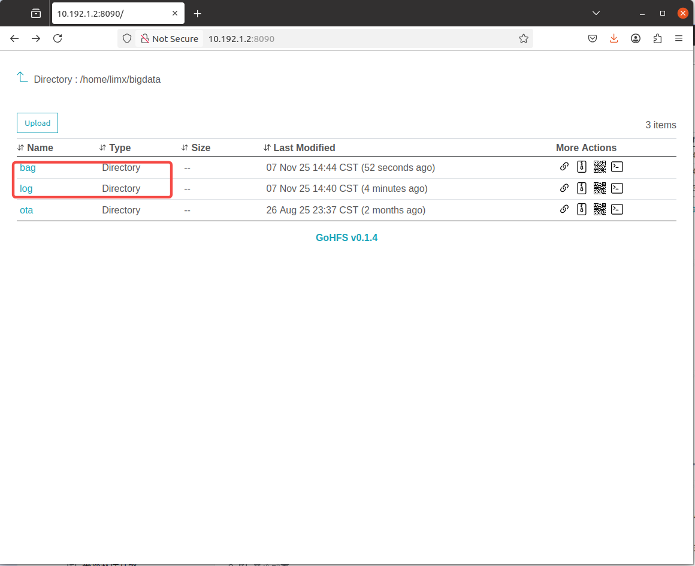
</figure>

# 10. Robot Software Upgrade

You can upgrade the robot software via the web management interface using a locally downloaded software package. The steps are as follows:

1.  **Connect to Wi-Fi:**

    - Connect to your robot's Wi-Fi hotspot, password: `12345678`

    <figure data-line="7123">
    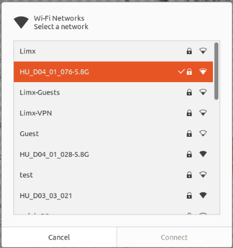
    </figure>

2.  **Access The Management Page:**

    - Open a browser and enter [http://10.192.1.2:8080](http://10.192.1.2:8080/) to access the robot management interface

3.  **Select and Upgrade Software：**

    - Navigate to "Version Management" -\> "Browse" -\> "Upgrade"

    - After the upgrade is complete, the robot's main control computer will restart automatically.

<figure data-line="7135">
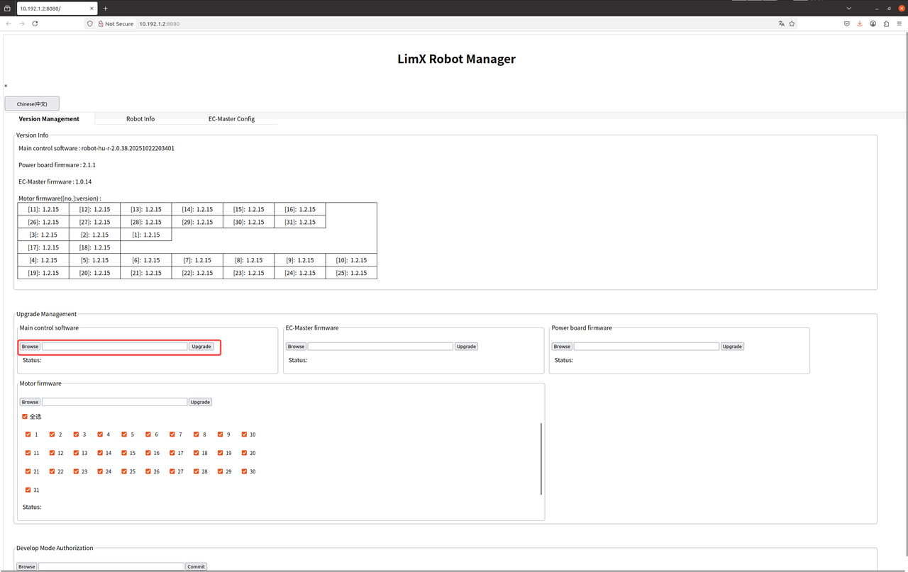
</figure>

# 11. Developer Computer

The developer computer is primarily used for developing robot-related algorithms and applications. It can be accessed via the robot’s onboard Wi-Fi network. The steps are as follows:

1.  **Connect to Wi-Fi:**

    - Connect to your robot's Wi-Fi hotspot, password: `12345678`

    <figure data-line="7147">
    
    </figure>

2.  **SSH Login：**

    - IP Address: `10.192.1.3`

    - Password: `123456`

    - Use the following command in the terminal (fingerprint confirmation needed on first login)

      ``` python
      ssh guest@10.192.1.3
```

    - System Configuration:

      - Operating System: Ubuntu 22.04 （Jetpack 6.2.1）

      - ROS2: ROS2 Humble (default installation)

      - ROS1: ROS1 Noetic (Docker-based environment), to enter the ROS1 Docker environment:

        ``` python
        sudo docker exec -it ros_noetic /bin/bash
```

# 12. RealSense Camera Data Acquisition

1.  **Log in to the Developer Computer：**

    - Please follow the procedures described in the *“Developer Computer”* section to log in to the computer

2.  **Launch the Realsense ROS Node to Acquire Camera Data：**

    - launch instructions address: <https://github.com/IntelRealSense/realsense-ros>

    - The computer is preinstalled with the RealSense Camera SDK:

      - version: v2.56.3, Official download link: <https://github.com/IntelRealSense/librealsense/releases/tag/v2.56.3>. You may develop your own applications based on this official SDK to acquire camera data.

3.  **Example Code Description：**

- **Camera Naming Convention:**

  - **Default Naming:** The script automatically assigns topic name prefixes for multiple cameras using the format *“camera”* followed by an index (e.g., *camera0*, *camera1*).

  - **Custom Naming:** The script can be modified to assign topic prefixes based on the camera's Serial Number instead of using the default *“camera + counter”* naming scheme.

**The following code example demonstrates how to acquire data from multiple cameras:**

1.  Save the script below as: `rs_camera.sh`

    ``` bash
    #!/bin/bash

    source /opt/ros/noetic/setup.bash

    # Function to detect connected RealSense cameras
    detect_cameras() {
        # List all connected RealSense cameras, excluding ASIC Serial Number
        serial_numbers=($(rs-enumerate-devices | grep "Serial Number" | grep -v "Asic" | awk '{print $NF}'))
        echo "${serial_numbers[@]}"
    }

    # Loop to check for the launch flag file and connected cameras
    while true; do
        serial_numbers=($(detect_cameras))

        # Check if any cameras were found
        if [ ${#serial_numbers[@]} -gt 0 ]; then
            echo "Detected ${#serial_numbers[@]} cameras."
            break  # Exit the loop if cameras are detected
        else
            echo "No RealSense cameras detected. Retrying in 5 seconds..."
            sleep 5  # Wait for a while before retrying
        fi
    done

    # Automatically start a ROS node for each detected camera
    if [ ${#serial_numbers[@]} -gt 0 ]; then
        for i in "${!serial_numbers[@]}"; do
            serial=${serial_numbers[$i]}
            
            # Default camera naming using index (camera0, camera1, ...)
            # Customize camera naming by modifying the code below
            camera_topic="camera$i"

            # Example: Custom camera naming based on serial number
            # Uncomment and replace with your actual serial numbers
            # if [[ "$serial" == "0123456789" ]]; then
            #     camera_topic="head"  # Name specific camera as "head"
            # elif [[ "$serial" == "9876543210" ]]; then
            #     camera_topic="chest" # Name another camera as "chest"
            # fi
            
            echo "Starting ROS node for camera $serial (topic prefix: $camera_topic)..."
            roslaunch realsense2_camera rs_camera.launch \
                serial_no:=$serial \
                camera:=$camera_topic \
                enable_pointcloud:=True \
                enable_accel:=True \
                enable_gyro:=True \
                enable_sync:=True \
                unite_imu_method:=linear_interpolation &
            sleep 10  # Optional: wait a bit before starting the next camera
        done

        # Wait for all background processes to finish
        wait
    else
        echo "No cameras to start."
    fi
```

2.  Execute the script in the terminal to launch the camera node

    ``` shell
    /bin/bash rs_camera.sh
```

3.  In another terminal, use `rostopic list` to verify the results

    ``` shell
    rostopic list
```

</div>
