

| Document Version | Revision Date | Revision Content | Applicable Main Control Software Version (If incompatible, please go to the Official Download Center to download and upgrade to the latest main control software package) |
|---|---|---|---|
| V1.4 | 2026.04.23 | Add content for the language settings section | V2.1.3 or later |
| V1.3 | 2026.04.16 | Added battery-related maintenance precautions | V2.1.3 and above |
| V1.2 | 2026.04.14 | 1. Deleted Studio operation instructions   2. Deleted voice dialogue model, dialogue roles, and wake-up word settings | V2.1.3 and above |
| V1.1 | 2026.03.30 | 1. Added operation precautions   2. Updated dance list | V2.1.3 and above |
| V1.0 | 2026.02.27 | Initial release | V2.1.21 and above |

# Disclaimer

To reduce the risk of legal liability, personal injury, or property damage, please read and fully understand the following terms and conditions before using this product.

1.  **Use and Acceptance:** Use of this product constitutes acceptance of this manual and all applicable terms, conditions, and instructions. The user assumes all risks arising from improper or unauthorized use.
2.  **Safety Distance:** <u>DO NOT</u> use this product in crowded areas. Maintain a minimum safety distance of at least 1m between any person and the device. LimX Dynamics disclaims all liability for injuries or damages resulting from failure to follow safety requirements.
3.  **Environmental Restrictions:** <u>DO NOT</u> operate this product in extreme or unsuitable environments, including but not limited to high or low temperatures, highly corrosive conditions, or strong magnetic fields. LimX Dynamics shall not be liable for any damage, malfunction, or abnormal performance esulting from operation under such environmental conditions.
4.  **Normal Wear and Tear:** Performance degradation resulting from natural wear, battery aging, or reasonable component depreciation is not considered a product defect and is not covered under warranty.
5.  **Product Updates:** This product is subject to continuous optimization and upgrades. The appearance, features, and configurations are subject to change. The actual product shall prevail.
6.  **Third-Party Components:** Purchased third-party components or accessories are not covered by the service or support described in this manual. Any issues related to such products should be addressed directly with the original manufacturer.
7.  **Data Access:** With user authorization and in compliance with applicable data protection laws, LimX Dynamics may access necessary data solely for maintenance, technical support, or service assurance.
8.  **Compliance with Laws:** Users must ensure product use complies with all applicable local, national, and international laws and regulations, including but not limited to import/export controls, data security, and national security requirements. Users bear full responsibility for any violations of such laws or regulations.
9.  **Prohibited Uses:** <u>DO NOT</u> use this product for any illegal, prohibited, or sensitive purposes, including but not limited to terrorist activities, military or defense-related applications, or the development of biological or chemical weapons. LimX Dynamics reserves the right to immediately terminate related services and take legal action against such misuse.
10. **Intellectual Property:** <u>DO NOT</u> use this product for resale, illegal disassembly, counterfeiting, or any other activities that infringe intellectual property rights. Use is limited to lawful and legitimate purposes only.
11. **Restricted Entities:** LimX Dynamics reserves the right to suspend product support and related services if the user is identified as a restricted or sanctioned entity.
12. **Right to Interpret and Modify:** LimX Dynamics reserves the right of final interpretation and revision of this disclaimer and the terms of use.

# Safety Precautions

1.  This product is a professional-grade device and is not recommended for independent use by individuals under 18 years of age. Users should possess the appropriate operational knowledge prior to use, or operate the device under the supervision or guidance of qualified personnel.
2.  Keep this device out of reach of children. When operating the product in environments where children are present, exercise heightened caution and ensure that the device remains in a safe and controlled state at all times.
3.  DO NOT directly touch any joints, moving parts, or actuators during transportation or after the device is powered on, as this may result in unintended pinching, impact, or other injuries.
4.  Ensure the device remains within the operator’s line of sight at all times, and maintain a minimum safety distance of 1m between the operator and the device during operation.
5.  Ensure the surrounding area is clear of obstacles and within the operator’s visual range during operation. When necessary, use auxiliary safety measures such as tethering or securing devices to prevent accidental movement, tipping, or injury to personnel.

# 1 LimX Oli EDU Overview

## 1.1 Component Description

The LimX Oli EDU is a full-sized humanoid robot featuring 31 degrees of freedom (DOF), including 6 DOF per leg, 7 DOF per arm, 3 DOF in the waist, and 2 DOF in the neck, providing highly biomimetic motion performance.

Its body is constructed from aerospace-grade aluminium and titanium alloys, offering an optimal balance of strength and lightness. The robot weighs approximately 55 kg, and key exterior areas are fitted with soft protective materials to improve impact and fall resistance.

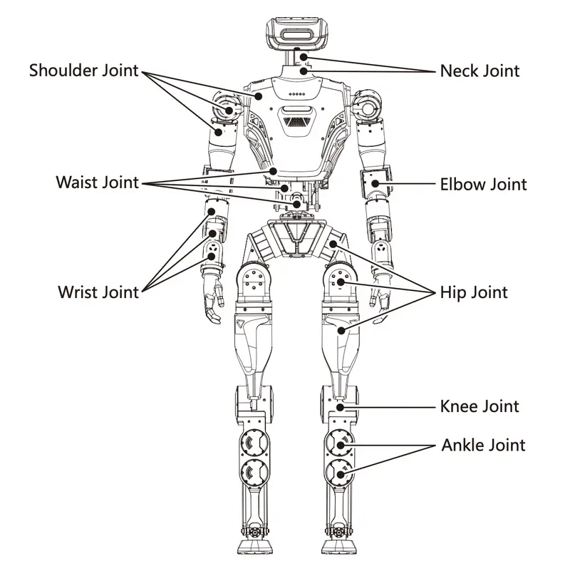  
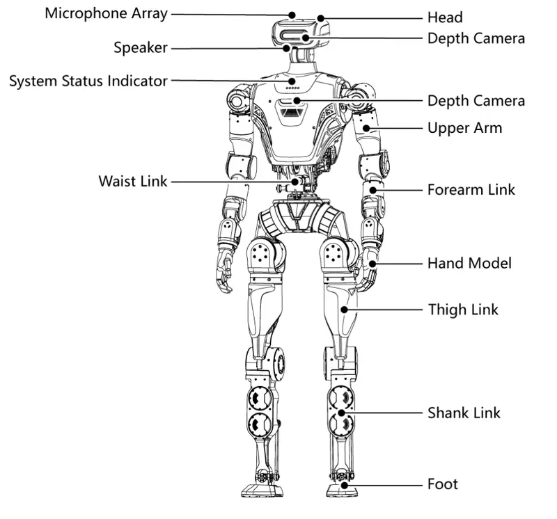  
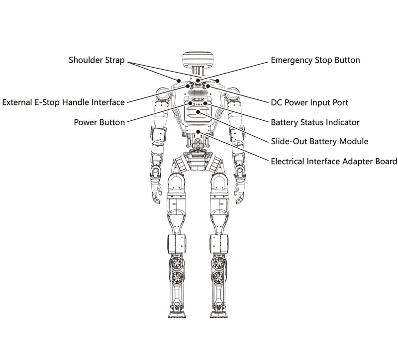

- **Rear Lower Electrical Interfaces**

<figure data-line="48">

</figure>

| **No.** | **Interface type** | **Abbr.**   | **Description**                           |
|---------|--------------------|-------------|-------------------------------------------|
| 1       | Type-C             | Type-C      | Supports USB3.2 Host 5V/1.5A Power Output |
| 2       | USB                | USB         | Supports USB3.2 Host 5V/1.5A Power Output |
| 3       | RJ45               | 1000 BASE-T | Gigabit Ethernet                          |
| 4       | RJ45               | 1000 BASE-T | Gigabit Ethernet                          |
| 5       | XT30PW-M30.G.Y     | 12V         | 12V/5A Power Output                       |
| 6       | XT30PW-M30.G.Y     | 12V         | 12V/5A Power Output                       |
| 7       | XT30PW-F20.G.Y     | 24V         | 24V/5A Power Output                       |
| 8       | XT30PW-F20.G.Y     | 24V         | 24V/5A Power Output                       |

- **Inner/Outer Hand Interface**

<figure data-line="63">
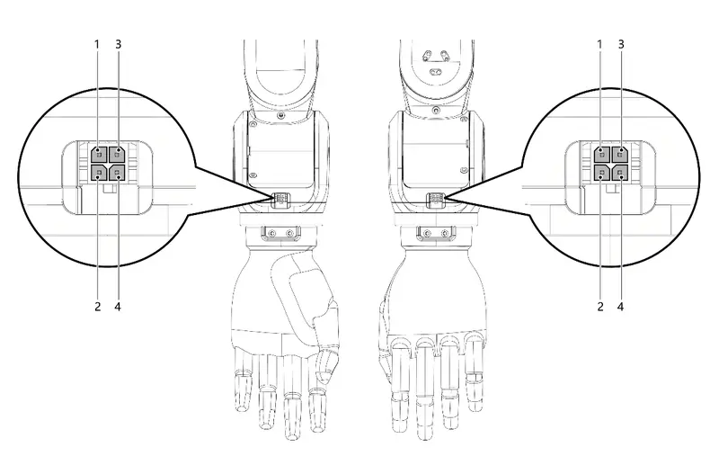
</figure>

| **No.** | **Interface type** | **Abbr.** | **Description**                         |
|---------|--------------------|-----------|-----------------------------------------|
| 1       | MX3.0              | DC +24V   | Power Positive Terminal 24V             |
| 2       | MX3.0              | DC GND    | Power Negative Terminal GND             |
| 3       | MX3.0              | RS485_A   | RS-485 Differential Positive Logic Line |
| 4       | MX3.0              | RS485_B   | RS-485 Differential Negative Logic Line |

> **Note：**  
> The **inner** hand interface is only compatible with\*\* \*\*BrainCo's Revo 2 dexterous hand.  
> The **outer** hand interface is only compatible with Inspire-Robots' EG2-4C2 electric gripper.

## 1.2 Onboard Computer

Oli EDU is equipped with 1「Development Computing Unit 」and 1「Motion Control Computing Unit」 as standard.

| **Parameters**     | **Development Computing Unit**                                |
|--------------------|---------------------------------------------------------------|
| Model              | Jetson Orin NX 16GB                                           |
| AI performance     | 157 TOPS                                                      |
| GPU                | 1024-core NVIDIA Ampere architecture GPU with 32 Tensor Cores |
| GPU max frequency  | 1173MHz                                                       |
| CPU                | 8-core Arm® Cortex®-A78AE v8.2 64-bit CPU 2MB L2 + 4MB L3     |
| CPU max frequency  | 2 GHz                                                         |
| DL accelerator     | 2x NVDLA v2                                                   |
| DLA max frequency  | 1.23 GHz                                                      |
| Vision Accelerator | 1x PVA v2                                                     |
| Memory             | 16GB 128-bit LPDDR5 102.4GB/s                                 |

### 1.2.1 Jetson Orin NX Network Setup:

To establish a stable network connection for the Orin NX module, please select your Wi-Fi configuration method and follow the corresponding setup steps:

#### 1.2.1.1 Wired Connection

##### 1.2.1.1.1 Built-in Wi-Fi

1.  **Prepare a Router:** Ensure a fully functional router is available, equipped with both WAN and LAN ports.
2.  **Connect the Robot to the Router:** Use an Ethernet cable to connect the router’s LAN port to the robot's lower rear Ethernet port.
3.  **Connect the Router to the Internet:** Connect the router’s WAN port to an active internet line.
4.  **Configure Router LAN Subnet:** 1. Access the router management interface and set the **LAN subnet** to `10.192.1.x`
5.  Assign the router’s **LAN IP address** to `10.192.1.1`.

Upon completing these steps, the Orin NX module will be able to access external networks through the router.

##### 1.2.1.1.2 External Wi-Fi

1.  **Prepare a Router:** Ensure a fully functional router is available, equipped with both WAN and LAN ports.
2.  **Connect the Robot to the Router:** Use an Ethernet cable to connect the router’s LAN port to the robot's lower rear Ethernet port.
3.  **Connect the Router to the Internet:** Connect the router’s WAN port to an active internet line.
4.  **Configure Router LAN Subnet:** 1. Access the router management interface and set the **LAN subnet** to `10.192.1.x`
5.  Assign the router’s **LAN IP address** to `10.192.1.10`, and set the Orin NX gateway address to `10.192.1.10`

Upon completing these steps, the Orin NX module will be able to access external networks through the router.

#### 1.2.1.2 Wireless Connection

1.  **Access the Web Interface:** Open a browser and navigate to `http://10.192.1.2:8080` to enter the **\[Config\]** page.
2.  **Configuration:** Enter the Wi-Fi SSID, Wi-Fi password, and the robot router’s administrator password as prompted.
3.  **Connect:** Click **\[Confirm\]** to enable external network access for the Orin NX.  
    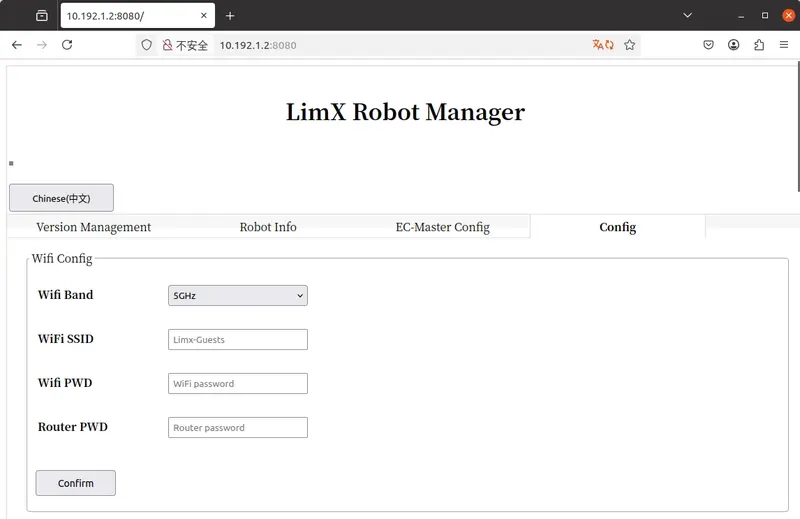

## 1.3 Battery Status Indicator

<figure data-line="128">

</figure>

| **Battery Status Indicator (Discharge)** | **Battery Level** | **Description**                            |
|------------------------------------------|-------------------|--------------------------------------------|
| 5 green LEDs on                          | 100%              | Fully charged                              |
| 4 green LEDs on, 1 half-lit              | 81%-99%           | Sufficient power                           |
| 3 green LEDs on, 1 half-lit              | 61%-80%           | Sufficient power                           |
| 2 green LEDs on, 1 half-lit              | 41%-60%           | Moderate power                             |
| 1 green LED on, 1 half-lit               | 21%-40%           | Low power, check battery                   |
| 1 red LED blinking slowly                | 6%-20%            | Insufficient power, recharge soon          |
| 1 red LED blinking rapidly               | 0%-5%             | Critically low power, recharge immediately |

| **Battery Status Indicator (Recharge)** | **Battery Level** | **Description**                                  |
|-----------------------------------------|-------------------|--------------------------------------------------|
| 1 green LED blinking rapidly            | 0%-5%             | Initial charging stage, critically low power     |
| 1 green LED blinking slowly             | 6%-20%            | Early charging stage, Insufficient power         |
| 1 green LED on, 1 blinking slowly       | 21%-40%           | Low power; not recommended to disconnect         |
| 2 green LEDs on, 1 blinking slowly      | 41%-60%           | Moderate power, suggested continuing charging.   |
| 3 green LEDs on, 1 blinking slowly      | 61%-80%           | Sufficient power, suggested continuing charging. |
| 4 green LEDs on, 1 blinking slowly      | 81%-99%           | Sufficient power, suggested continuing charging. |
| 5 green LEDs on                         | 100%              | Fully charged, safe to disconnect power.         |

## 1.4 Field of View of Cameras

Limx Oli EDU is equipped with Intel RealSense D435i depth cameras on its head and chest, providing exceptional visual perception capabilities that enable accurate sensing and understanding of the surrounding environment.

<figure data-line="154">
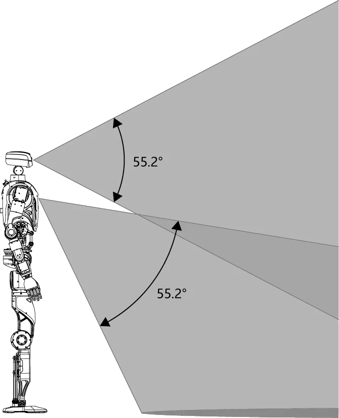
</figure>

### 1.4.1 Camera Position Coordinates

The installation positions and orientations of the chest camera and head camera in the **base_link** coordinate frame are as follows:

- **Chest Camera:** Positioned at \[0.092, 0.0175, 0.4336\] relative to *base_link*, with a 35° downward angle from the horizontal.
- **Head Camera:** Positioned at \[0.0615, 0.0175, 0.652\] relative to *base_link*, with a 0° angle to the horizontal.

## 1.5 Joint Index and Joint Limits

| **Joint Index** | **Joint Name**             | **Limit (rad)**      |
|-----------------|----------------------------|----------------------|
| 1               | left_hip_pitch_joint       | -2.617994 ~ 2.617994 |
| 2               | left_hip_roll_joint        | -0.872665 ~ 2.094395 |
| 3               | left_hip_yaw_joint         | -2.617994 ~ 2.617994 |
| 4               | left_knee_joint            | -0.087266 ~ 2.583087 |
| 5               | left_ankle_pitch_joint     | -1.012291 ~ 0.610865 |
| 6               | left_ankle_roll_joint      | -0.436332 ~ 0.436332 |
| 7               | right_hip_pitch_joint      | -2.617994 ~ 2.617994 |
| 8               | right_hip_roll_joint       | -2.094395 ~ 0.872665 |
| 9               | right_hip_yaw_joint        | -2.617994 ~ 2.617994 |
| 10              | right_knee_joint           | -0.087266 ~ 2.583087 |
| 11              | right_ankle_pitch_joint    | -1.012291 ~ 0.610865 |
| 12              | right_ankle_roll_joint     | -0.436332 ~ 0.436332 |
| 13              | waist_yaw_joint            | -2.617994 ~ 2.617994 |
| 14              | waist_roll_joint           | -0.523599 ~ 0.523599 |
| 15              | waist_pitch_joint          | -0.523599 ~ 0.785398 |
| 16              | head_yaw_joint             | -0.785398 ~ 0.785398 |
| 17              | head_pitch_joint           | -0.523599 ~ 0.785398 |
| 18              | left_shoulder_pitch_joint  | -2.792527 ~ 2.792527 |
| 19              | left_shoulder_roll_joint   | -0.087266 ~ 3.228859 |
| 20              | left_shoulder_yaw_joint    | -3.403392 ~ 1.570796 |
| 21              | left_elbow_joint           | -2.443～1.187        |
| 22              | left_wrist_yaw_joint       | -2.356194 ~ 0.785398 |
| 23              | left_wrist_pitch_joint     | -1.570796 ~ 1.570796 |
| 24              | left_wrist_roll_joint      | -1.570796 ~ 1.570796 |
| 25              | right_shoulder_pitch_joint | -2.792527 ~ 2.792527 |
| 26              | right_shoulder_roll_joint  | -3.228859 ~ 0.087266 |
| 27              | right_shoulder_yaw_joint   | -1.570796 ~ 3.403392 |
| 28              | right_elbow_joint          | -2.443～1.187        |
| 29              | right_wrist_yaw_joint      | -0.785398 ~ 2.356194 |
| 30              | right_wrist_pitch_joint    | -1.570796 ~ 1.570796 |
| 31              | right_wrist_roll_joint     | -1.570796 ~ 1.570796 |

------------------------------------------------------------------------

## 1.6 Coordinate Systems, Joint Rotation Axes, and Joint Zero Points

When all joints are at 0°, the coordinate systems are shown below.  
The **red**, **green**, and **blue** axes represent the **X**, **Y**, and **Z** axes, respectively.

<figure data-line="206">
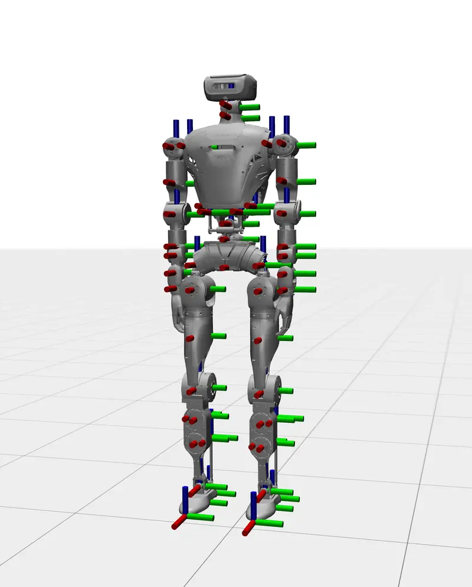
</figure>

## 1.7 Specifications

|                                          |                                                                                                          |
|------------------------------------------|----------------------------------------------------------------------------------------------------------|
| Model                                    | Oli EDU                                                                                                  |
| Mechanical Parameters                    |                                                                                                          |
| Height                                   | ≈165cm / 5'5"                                                                                            |
| Shoulder Width                           | ≈55cm / 21.7in                                                                                           |
| Arm Length                               | ≈70cm / 27.6in                                                                                           |
| Weight (Battery Included)                | ≈55kg / 121.3lbs                                                                                         |
| Active DoF (Total)\[1\]                  | 31～43                                                                                                   |
| Single Leg DoF                           | 6                                                                                                        |
| Single Arm DoF                           | 7                                                                                                        |
| Waist DoF                                | 3                                                                                                        |
| Neck DoF                                 | 2                                                                                                        |
| End Effectors                            |                                                                                                          |
| Hand Model                               | ✔️                                                                                                       |
| 2-Finger Gripper (1 DoF)                 | ✔️                                                                                                       |
| 5-Finger Hand (6 DoF）                   | o                                                                                                        |
| Self-Developed 3-Finger Gripper (4 DoF)  | o                                                                                                        |
| Joint Range of Motion                    |                                                                                                          |
| Neck Joint                               | P-30° ~ 45°、Y±45°                                                                                       |
| Shoulder Joint                           | P±160°、R-5°~185°、Y-90°~195°                                                                            |
| Elbow Joint                              | P-66°~137°                                                                                               |
| Wrist Joint                              | P±90°、R±90°、Y-45°~135°                                                                                 |
| Waist Joint                              | P-30°~45°、R±30° 、Y±150°                                                                                |
| Hip Joint                                | P±150°、R-50°~120°、Y±150°                                                                               |
| Knee Joint                               | P+5°-148°                                                                                                |
| Ankle Joint                              | P-35°~58°、R±25°                                                                                         |
| Controller                               |                                                                                                          |
| Remote Controller                        | ✔️                                                                                                       |
| Thermal Management                       |                                                                                                          |
| Air-Cooled Main Control Area             | ✔️ (Optimized)                                                                                           |
| Communication Interfaces                 |                                                                                                          |
| WiFi 6                                   | ✔️                                                                                                       |
| Bluetooth                                | ✔️                                                                                                       |
| USB3.0/3.2 (USB Hub Supported)           | ✔️                                                                                                       |
| Gigabit Ethernet (RJ45)                  | ✔️                                                                                                       |
| Power Supply Interfaces                  |                                                                                                          |
| 24V 5A                                   | ✔️ (x2)                                                                                                  |
| 12V 5A                                   | ✔️ (x2)                                                                                                  |
| Perception Sensors                       |                                                                                                          |
| IMU                                      | 6-Axis                                                                                                   |
| Head Depth Camera                        | ✔️                                                                                                       |
| Chest Depth Camera                       | ✔️                                                                                                       |
| Battery                                  |                                                                                                          |
| Battery Capacity                         | 9500mAH                                                                                                  |
| Battery Life \[2\]                       | About 1.5H                                                                                               |
| Charger                                  | 58.8V 10A                                                                                                |
| Slide-Out Battery Module                 | ✔️                                                                                                       |
| Capability                               |                                                                                                          |
| Maximum Load Capacity (Single Arm) \[3\] | 3kg / 6.6lbs                                                                                             |
| Maximum Moving Speed                     | 5km/h                                                                                                    |
| Maximum Joint Torque \[4\]               | 150N·m                                                                                                   |
| Computing Configuration                  | Motion Control：- RK3588 SoC + 8G RAM+ 64G Storage Perception ：- Orin NX SoC+16G RAM+1T Storage+157TOPS |
| Feature                                  |                                                                                                          |
| Voice Interaction Module                 | ✔️                                                                                                       |
| LED Indicators                           | ✔️                                                                                                       |
| System Status Monitoring                 | ✔️                                                                                                       |
| Basic Motion Library \[5\]               | ✔️                                                                                                       |
| Motion Library Expansion Service         | ✔️                                                                                                       |
| Developer Tools                          |                                                                                                          |
| Custom Development                       | ✔️                                                                                                       |
| Remote Control API                       | ✔️                                                                                                       |
| Sensor API                               | \- Visual Perception Data - IMU Data                                                                     |
| Low-Level Motion Control API \[6\]       | ✔️                                                                                                       |
| High-Level Motion Control API \[7\]      | ✔️                                                                                                       |
| OTA Updates                              | ✔️                                                                                                       |
| Studio Package (Optional) \[8\]          | o                                                                                                        |

> **Note:**  
> \***Products are continuously iterated and optimized; appearance and configuration are subject to change. Please refer to the actual product received.**  
> **\[1\]** Total Degrees of Freedom (DoF) refers to the combined DoF of the robot's base body and the installed end-effector (e.g., hand model, two-finger gripper, three-finger gripper, or five-finger dexterous hand).  
> **\[2\]** The data above was measured at the LimX Dynamics laboratory. Actual results may vary depending on environment, usage, device status, and software version. Please refer to the actual operating performance.  
> **\[3\]** The arm’s maximum load varies with its extension and posture. Values may differ under different configurations. Please refer to the actual operating performance.  
> **\[4\]** The maximum torque differs among motors. The value shown represents the maximum torque of the highest-torque motor.  
> **\[5\]** The action library includes three categories: Basic Interaction, Gestures, and Dance.  
> **\[6\]** Supports both joint-level control and end-effector control.  
> **\[7\]** Supports humanoid walking, mobile operation, stationary operation, and remote operation.  
> **\[8\]** Supports hardware status monitoring, voice configuration, data collection, motion choreography, and one-click simulation verification.

# 2 Remote Controller Description

## 2.1 Specifications

| Category | Description |
|---|---|
| Product Name | Humanoid Robot Remote Controller |
| Dimensions | ≈ 162 × 98 × 52mm (L × W × H) |
| Weight | ≈ 210g |
| Display Screen | - TFT display 1.47 inch   - Resolution 320 × 172 |
| Interface Configuration | Full-speed USB 2.0 port × 1 |
| Connection Method | 2.4G wireless connection |
| Charging Specifications | Input voltage: 5V / 500mA |
| Operating Temperature | 5°C – 35°C |
| Battery Life | Full charge: > 4 hours |
| Effective Control Distance | > 20m (In ideal unobstructed conditions) |

## 2.2 Component Description

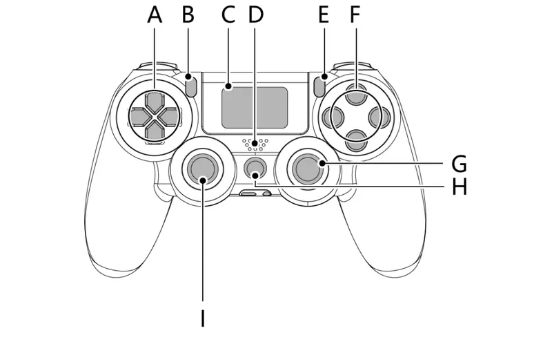  
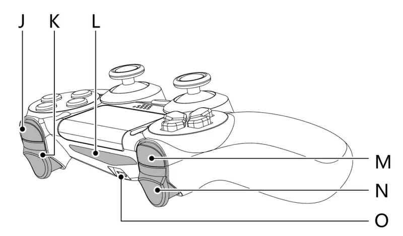

A ---- Directional Pad (D-Pad): UP, LEFT, DOWN, RIGHT  
B ---- SHARE Button  
C ---- Display Screen  
D ---- Speaker  
E ---- OPTIONS Button  
F ---- Δ / O / × / □ Buttons  
G ---- Right Joystick: Controls robot rotation direction  
H ---- Power Button: Power On / Off  
I ---- Left Joystick: Controls robot movement (forward, backward, left, right)  
J ---- R1 Button  
K ---- R2 Button  
L ---- Light Bar  
M ---- L1 Button  
N ---- L2 Button  
O ---- Type-C Charging Port

> **Note：**
>
> - The remote controller is pre-paired with the robot before shipment and is ready for use immediately after startup.
> - To control another Oli robot, please refer to the "Remote Controller Pairing" tutorial video available on the Limx Dynamics\*\* \*\*Support Center.
> - If the remote controller has been paired with another robot, it must be re-paired with the original unit to regain control.

## 2.3 Power On/Off Operation

<figure data-line="399">
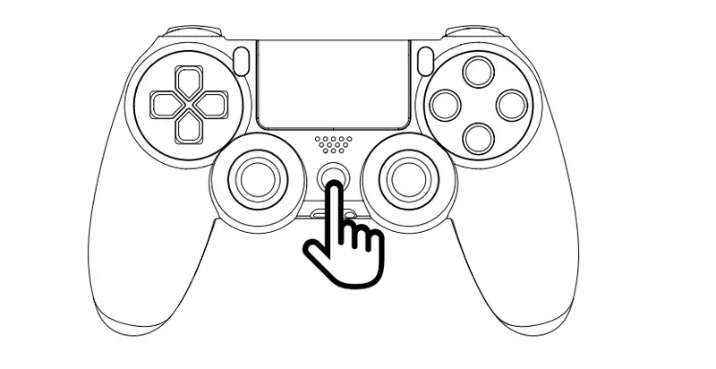
</figure>

- **Power On:**

Press and hold the 【Power button】for 3 seconds on the remote controller. A single beep indicates that the controller has powered on and entered the default interface. The controller is now ready for operation.

- **Power Off:**

Press and hold the【Power button】for 2 seconds on the remote controller. A single beep indicates that the controller has powered off and the display has turned off.

## 2.4 Display Screen Descriptions

After the remote controller is powered on, it automatically enters the Home Page interface.  
The display layout is shown below.

<figure data-line="414">
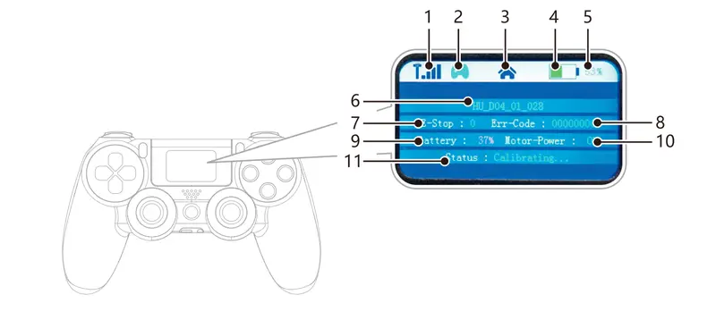
</figure>

| No. | Description | No. | Description |
|---|---|---|---|
| 1 | The connection signal strength between the remote controller and the robot. A higher number of bars indicates a stronger signal. | 7 | Emergency stop status :   - 0: Not triggered   - 1: Triggered |
| 2 | Current robot operating mode:   - Remote Control Mode   - Low-Level Developer Mode   - High-Level Developer Mode | 8 | Error code (32-bit) display   - 00000000: No error   - Other codes: Error present (see Section 4.2 Error Code List ) |
| 3 | - Home Page Icon (default display) | 9 | Robot Battery Level (real-time) |
| 4/5 | Remote controller battery level :   - 4: Icon display   - 5: Numeric display | 10 | Robot Motor Power Status:   - ON: Powered on   - OFF: Powered off |
| 6 | - Unique serial number (SN) of the currently connected robot | 11 | Robot real-time status (see Section 4.1 Robot Status List ) |

## 2.5 Language Settings

The remote control supports both Chinese and English interfaces, and you can switch the display language at any time by following the steps below. After changing the language, the remote control will automatically restart to apply the settings.

### 2.5.1 Switching from Chinese to English

1.  Power on the remote control, then double-press the power button to enter the function menu.
2.  Use the Up/Down arrow keys to select the 5th item: Setting rc system parameters, then press the Right arrow key to enter the settings page.
3.  Press the Up arrow key repeatedly to adjust the value to 1.
4.  Press the Left arrow key to exit the menu. The remote control will automatically restart, and the interface language will switch to English.

### 2.5.2 Switching from English to Chinese

1.  Power on the remote control, then double-press the power button to enter the function menu.
2.  Use the Up/Down arrow keys to select the 5th item: Setting rc system parameters, then press the Right arrow key to enter the settings page.
3.  Press the Up arrow key repeatedly to adjust the value to 0.
4.  Press the Left arrow key to exit the menu. The remote control will automatically restart, and the interface language will switch to Chinese.

# 3 Operation Guide

## 3.1 Startup Procedure

> **Note:**  
> **After powering on, ensure the robot is in Remote Control Mode.**  
> If in Developer Mode (purple system status indicator), press 【L2 + ○】 to enter Zero-Torque mode, then press 【R1 + Left】 to switch to **Remote Control Mode (enters Damping Mode automatically).**

### 3.1.1 Powering On in Packing Posture

**Step 1: Powering On**

1.  Insert one battery from the accessory layer into Oli. Briefly press and release the power button, then press and hold it for 2 seconds to power on.  
    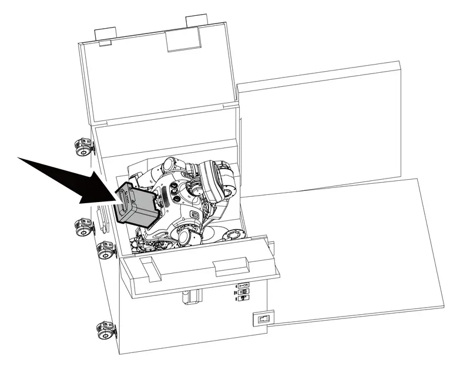

2.  The system status indicator will display a white, one-directional filling animation, accompanied by a system startup confirmation tone.

3.  When the system status indicator turns solid white, Oli enters Zero-Torque Mode.

**Step 2: Exit from the Flight Case**

1.  Press **\[R1 + Left\]** to enter Remote Control Mode in the Damping State
2.  Press **\[L2 + UP\]** to switch to the Standing Posture
3.  Push the left joystick on the remote controller forward to initiate Oli’s autonomous walk out of the case  
    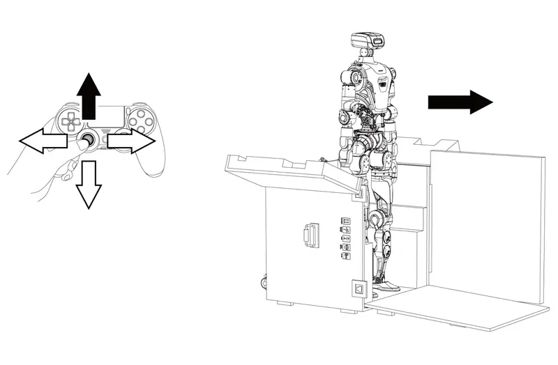

> **Note：**
>
> 1.  Ensure that the area around the flight case is clear and that the floor is level and free of obstacles.
> 2.  During the autonomous exit process, carefully **control the robot’s speed and direction** to avoid collisions between the arms and the case, and ensure the robot is **properly supported** to prevent accidental drops.

### 3.1.2 Powering On in Lying Position

**Step 1: Positioning the Robot**

Ensure Oli is placed flat on a stable and spacious surface. Keep its arms and legs naturally positioned.  

**Step 2: Powering On**

1.  Briefly press and release the power button, then press and hold it for 2 seconds to power on
2.  The system status indicator will display a white, one-directional filling animation, accompanied by a system startup confirmation tone
3.  When the indicator turns solid white, Oli enters **Zero Torque State:** 1. Press **\[R1 + Left\]** to switch to **Damping State**
4.  Press **\[L2 + △\]** to switch to **Standing Posture**

### 3.1.3 Powering On in Hanging Position

**Step 1: Suspend the Robot**  
Secure Oli using the protective frame in a natural hanging position. Ensure the feet are clear of the ground, with a minimum clearance of **15cm**.

<figure data-line="491">

</figure>

**Step 2: Powering On**

1.  Briefly press and release the power button, then press and hold it for 2 seconds to power on.
2.  The system status indicator will display a white, one-directional filling animation, accompanied by a system startup confirmation tone
3.  When the indicator turns solid white, Oli enters **Zero Torque State:** 1. Press **\[R1 + Left\]** to switch to **Damping State in remote control mode**.
4.  Press \*\*\[L2 + △\] \*\*to command Oli to stand up and enter **Standing State**.

**Step 3: Lowering the Suspension**

After Oli enters the Standing State, gradually lower the suspension rope until both feet are firmly on the ground.

**Step 4: Detach the Suspension**

Once Oli maintains stable motion, carefully detach the suspension rope. Oli is now ready for operation.

> **Note：**
>
> - If Oli encounters an unexpected condition, press **\[L2+DOWN+X\]** to switch to **Damping State**. Oli will gently lower itself to the ground in a controlled manner.
> - If the battery level is below **5%** during startup, the system will prevent normal powering on. Please charge it immediately.

### 3.1.4 Power On Self-Test

During power-on, Oli will automatically perform a self-test. The system status indicator will transition from a white, one-directional filling animation:

- If a malfunction is detected, the system status indicator will flash red, and a voice prompt will announce the specific faulty component.
- If everything is functioning well, the system status indicator will transition from a blue breathing light to a solid white, with the voice prompt "hi, I'm Oli".

**Power-On Self-Test Status Description**

| **Status Phase**          | **System Status Indicator Status**       | **Voice Prompt**                                          | **Description**                                                         |
|---------------------------|------------------------------------------|-----------------------------------------------------------|-------------------------------------------------------------------------|
| Power-on → Self-testing   | white, one-directional filling animation | \-                                                        | The system is starting and preparing for a self-test.                   |
| Self-test → function well | Solid White                              | "beep-beep"                                               | The system functions well and is ready for operation.                   |
| Self-test → Malfunction   | Flashing Red                             | Specific component fault (e.g., "Right knee motor error") | A malfunction has been detected; troubleshooting or repair is required. |

## 3.2 Remote Control Operation

### 3.2.1 Control Mode

#### 3.2.1.1 Remote Control Mode

When Oli is in Zero Torque Status, press **\[R1 + Left\]** to switch to **Remote Control Mode**.

#### 3.2.1.2 Developer Mode

- **<u>Switching</u> to Developer Mode**

When Oli is suspended and in **Zero Torque Status**:

- **<u>Exiting</u> Developer Mode**

While in Developer Mode, press **\[L2 + ○\]** to exit.

### 3.2.2 Mode/State Switching

<figure data-line="547">
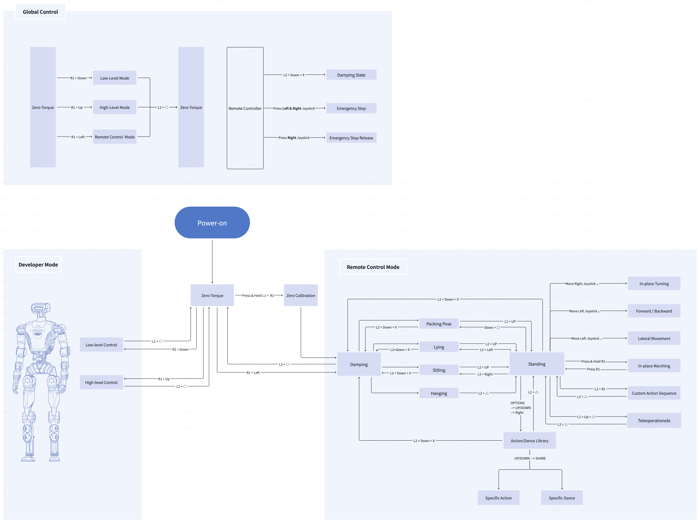
</figure>

- Before switching modes, ensure the robot is in Zero Torque State, then follow the global control instructions to switch modes. When switching to Damping State, the robot automatically enters Remote Control Mode.
- Oli will automatically enter Zero Torque State on startup if no mode is set. **The selected mode will be automatically saved and loaded at the next startup.**
- During transitions between standing and sitting, Oli will first enter a lying position. Maintain a minimum safety distance of 1m during operation.
- The global control buttons remain functional regardless of the robot’s current state.

> **Note：**  
> Please operate the robot on a flat, level surface when performing forward/backward movement, lateral movement, or in-place turning/marching to prevent potential damage.

### 3.2.3 Button Functions

|                                |                                         |                                                                                                                                                                                                        |                             |                                              |
|--------------------------------|-----------------------------------------|--------------------------------------------------------------------------------------------------------------------------------------------------------------------------------------------------------|-----------------------------|----------------------------------------------|
| Type                           | Mode/Action                             | Description                                                                                                                                                                                            | Button                      | Prerequisite States                          |
| Mode/State Switching           | Remote Control Mode                     | Enables robot movement/action control via the remote controller. (Voice interaction is available in this mode.)                                                                                        | R1 + Left                   | \-                                           |
|                                | Developer Mode - High-Level Control     | Allows advanced development, including high-level command execution and low-level joint control. Ensure Oli is securely suspended using a protective frame or equivalent equipment during development. | R1 + Up                     | Developer Mode only                          |
|                                | Developer Mode - Low-Level Control      |                                                                                                                                                                                                        | R1 + Down                   | Developer Mode only                          |
|                                | Zero-Torque State                       | All joints are torque-free and can be manually adjusted.                                                                                                                                               | L2 + ○                      | \-                                           |
|                                | Zero-Point Calibration                  | All joints reset to the mechanical zero position.                                                                                                                                                      | Press & Hold L1 + R1        | Zero Torque State                            |
|                                | Damping State                           | Applies damping torque to joints to prevent free swinging.                                                                                                                                             | L2 + Down + X               | \-                                           |
|                                | Lying State                             | Transitions the robot to a lying position (following a zero-torque or damping transition).                                                                                                             | L2 + Left                   | Damping State / Standing State               |
|                                | Standing State                          | Engages preload torque to maintain balance and await commands.                                                                                                                                         | L2 + △                      | Hanging State                                |
|                                |                                         |                                                                                                                                                                                                        | L2 + UP                     | Packing Pose State/Lying State/Sitting State |
|                                | Packing Pose State                      | Seated posture required during packing and transport                                                                                                                                                   | DOWN + □                    | Damping State / Standing State               |
|                                | Sitting State                           | Command the robot to sit in place via remote controller                                                                                                                                                | L2 + Right                  | Damping State / Standing State               |
| Movement Control               | Move Forward/Backwards                  | Moves the robot forward or backwards via the remote controller.                                                                                                                                        | Left Joystick ↕             | Standing State                               |
|                                | Lateral Movement                        | Moves the robot left or right via the remote controller.                                                                                                                                               | Left Joystick ↔             | Standing State                               |
|                                | In-place Turning                        | Rotates the robot on the spot via remote controller.                                                                                                                                                   | Right Joystick ↔︎            | Standing State                               |
|                                | In-place Marching                       | Performs marching motion in a standing position.                                                                                                                                                       | Press & Hold R1             | Standing State                               |
| Interactive Actions/ Functions | Action/Dance Library - Access           | Access the action library menu via the remote controller.                                                                                                                                              | Press OPTIONS               | Standing State                               |
|                                | Action/Dance Library - Select           | Select Action or Dance Library via remote controller                                                                                                                                                   | Press Right                 | Standing State                               |
|                                | Action/Dance Library - Switching        | Switches between actions/dances in the action/dance library.                                                                                                                                           | Press UP / DOWN             | Standing State                               |
|                                | Action/Dance Library - Select & Execute | Selects and executes between actions/dances in the action/dance library.                                                                                                                               | Press SHARE                 | Standing State                               |
|                                | Custom Action Sequence                  | Executes a customized action sequence via the remote controller; no action if none is available.                                                                                                       | L2 + R1                     | Standing State                               |
|                                | Voice Wake-Up                           | Forces activation of voice interaction.                                                                                                                                                                | Press & Hold R2             | \-                                           |
|                                | Teleoperation Initialization            | Switches to teleoperation and begins initialization via the remote controller.                                                                                                                         | L1 + Up + △                 | Standing State                               |
| Safety Protection              | Emergency Stop Active                   | Joints are immediately powered off and will not respond to any motion commands.                                                                                                                        | Press Left & Right Joystick | \-                                           |
|                                | Emergency Stop Released                 | Joints perform a self-check and power on again, then enter Zero-Torque Mode.                                                                                                                           | Press Right Joystick        | Emergency Stop Active                        |

> **Note：**  
> **Prerequisite States:** Indicates that switching to a new action or state is only permitted when the robot is in the required preceding state.  
> **Emergency stop activation is a high-risk operation** and may cause the robot to lose balance and fall. Before activation, ensure that a clear area with a minimum radius of **2m** around the robot is free of personnel and obstacles to avoid personal injury or property damage.

### 3.2.4 Motion Control Status, System Status Indicator and Buzzer Indications

| **Control Status / Mode**                         | **Indicator Status**                   | **Buzzer Prompt**           | **Voice Prompt**                |
|---------------------------------------------------|----------------------------------------|-----------------------------|---------------------------------|
| Powering On                                       | ⚪️ white unidirectional fill animation | –                           | Startup confirmation tone       |
| Basic State (Zero Torque / Calibrating / Damping) | ⚪️ Solid white                         | –                           |                                 |
| Remote Control Mode                               | 🔵 Solid blue                          | –                           |                                 |
| Developer Mode - Low Level                        | 🟣 Purple breathing                    | –                           |                                 |
| Developer Mode - High Level                       | 🟣 Solid purple                        |                             |                                 |
| Emergency Stop                                    | 🔴 Solid red                           | –                           |                                 |
| Low Battery Warning (≤ 20%)                       | 🟠 Orange breathing                    | –                           | "Low battery. Please recharge." |
| Critical Battery Warning (≤ 5%)                   | 🔴 Red slow flash                      | Intermittent "beep–beep"    | "Low battery. Please recharge." |
| System Abnormal Warning                           | 🟡 Yellow slow flashing                | –                           |                                 |
| System Critical Fault                             | 🔴 Red fast flash                      | Continuous "beep–beep–beep" |                                 |
| Voice Wake-up Standby                             | Cyan endpoint breathing                | –                           | "I’m here. Please speak."       |
| Voice Input Receiving                             | Cyan bidirectional scanning            | –                           |                                 |
| Voice Response Output                             | Cyan center-out expansion              |                             |                                 |

## 3.3 Shutdown Procedure

### 3.3.1 Shutdown in Packing Posture

**Step 1: Preparation**

1.  Place the flight case on a stable, level surface.
2.  Verify the internal padding is properly installed.
3.  Position the robot directly in front of the case, facing the opening, at a distance of at least **1m**.  
    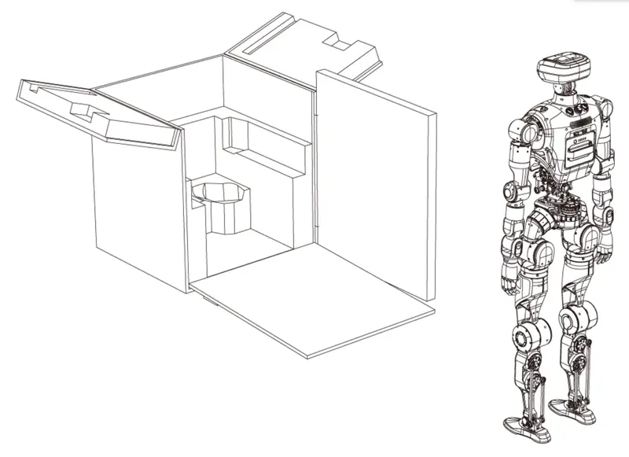

**Step 2: Move the Robot into the Flight Case**

1.  Push the left joystick forward to move the robot straight ahead.
2.  Continue until the robot is fully inside the case and standing stably.  
    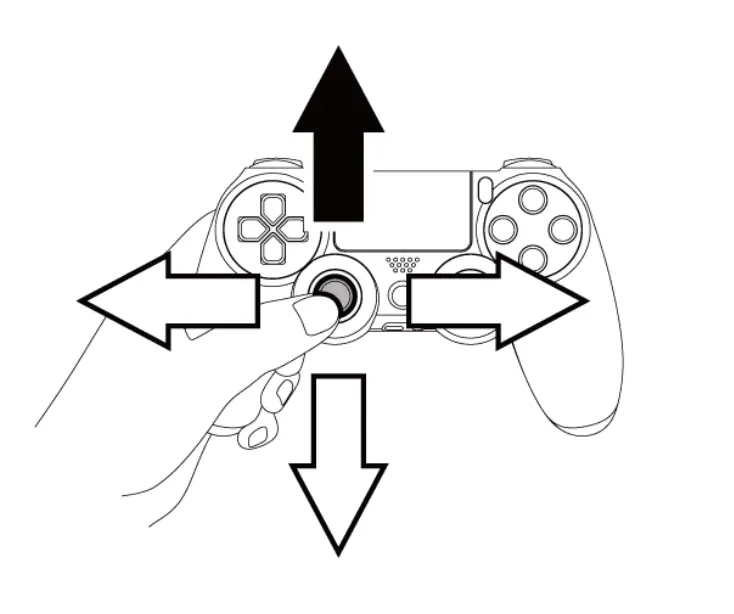  
    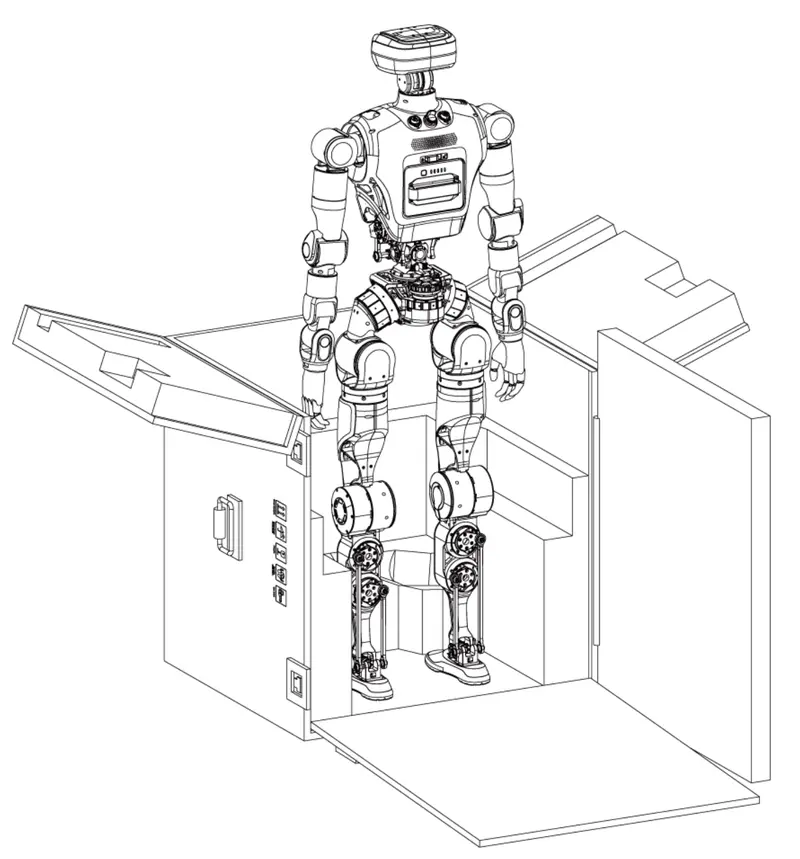

**Note：**

> 1.  Ensure that the area around the flight case is clear and that the floor is level and free of obstacles.
> 2.  During the placement process, carefully **control the robot’s speed and direction** to avoid collisions between the arms and the case, and ensure the robot is **properly supported** to prevent accidental drops.

**Step 3: Posture Adjustment**

1.  Push the right joystick left or right to rotate the robot in place until it faces the opening of the case.  
    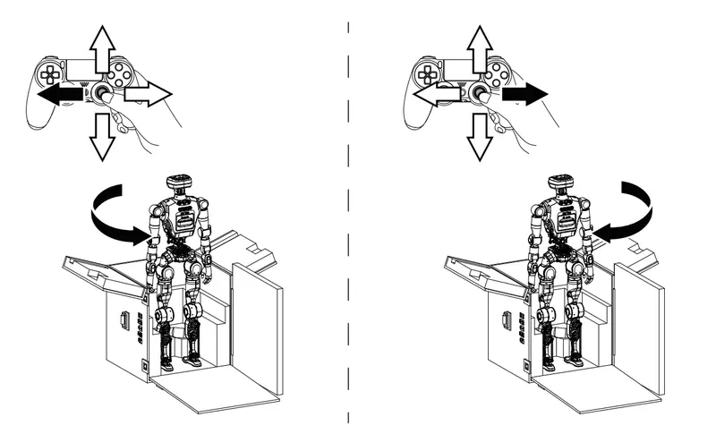

2.  Push the left joystick backwards to slowly move the robot rearward until the back of the feet are positioned near the internal foam padding  
    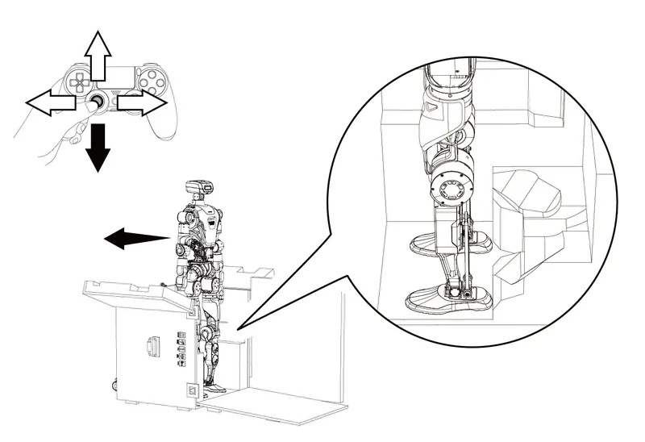

3.  Press **\[Down + □\]** to switch to the packing pose.

**Step 4: Power Off**

1.  After the robot is seated and stable, briefly press and release the power button, then press and hold for **2 seconds** to shut down.
2.  Align the robot’s feet with the designated positions at the bottom of the case.
3.  Remove the battery and store it in the accessory tray.

> **Note：**  
> Before closing the case, ensure that the robot’s arms are positioned correctly (as shown in the figure) to prevent equipment damage caused by compression or impact.  
> 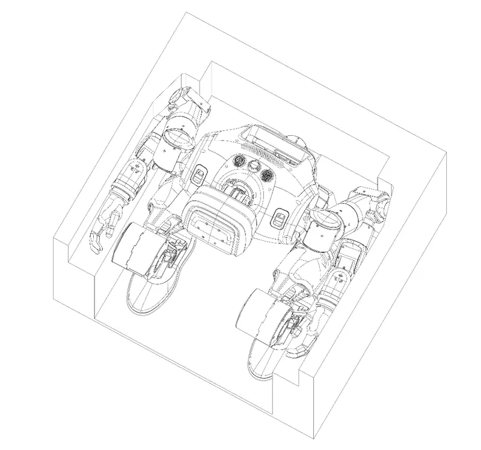

### 3.3.2 Shutdown in Sitting Position

**Step 1: Posture Adjustment**

1.  Ensure the robot is in the **Standing Position**.
2.  Press **\[L2 + Right\]** to switch Oli to the Sitting Posture.

> **Note：**  
> During the transition from <u>standing</u> to <u>sitting</u>, Oli will first move into a lying position and then adjust to the sitting posture. Please maintain a safety distance of **1m** from the robot during this process.  
> 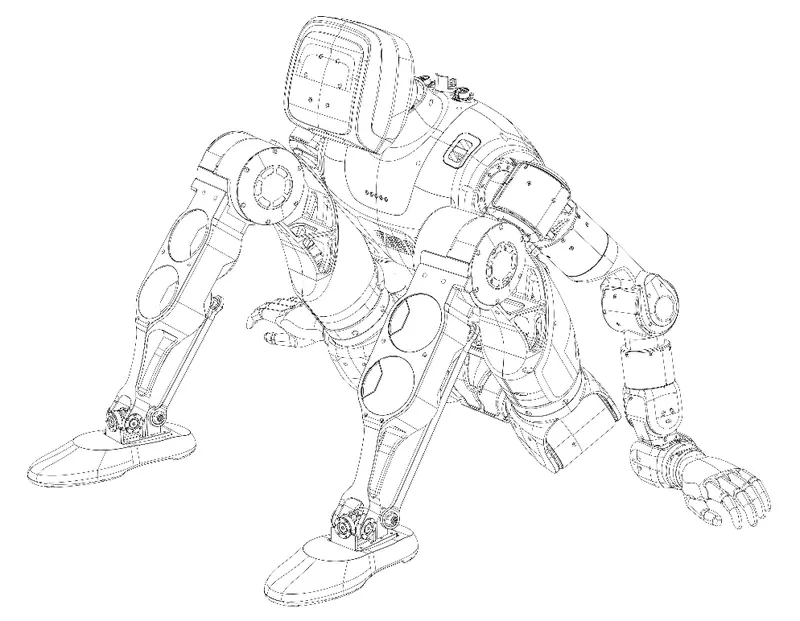

**Step 2: Power Off**

- After the robot is seated and stable, briefly press and release the power button, then press and hold for **2 seconds** to shut down.

### 3.3.3 Shutdown in Lying Position

**Step 1: State Adjustment**

1.  Ensure **Oli** is lying stably on a flat surface. Press **\[L2 + Down + X\]** to switch to the **Damping State**.
2.  Press **\[L2 + ○\]** to switch to **Zero-Torque Mode**.

**Step 2: Power Off**

- After Oli has entered the **Damping State**, briefly press and release the power button, then press and hold for **2 seconds** to shut down.

### 3.3.4 Shutdown in Hanging Position

**Step 1: Posture Adjustment**

1.  Press **\[L2 + △\]** to switch **Oli** to the **Standing Posture**.
2.  Press **\[L2 + Down + X\]** to switch to the **Damping State**.

**Step 2: Power Off**

- After **Oli** has entered the **Damping State**, briefly press and release the power button, then press and hold for **2 seconds** to shut down.

> **Note：**  
> The robot automatically shuts down when the battery level falls below 1%. Recharge the battery before it drops below **20%** to ensure normal operation.

## 3.4 Battery Replacement Procedure in Sitting Position

**Step 1: Power Off**

- Shut down Oli by following the procedure described in Section<u>「3.3.2 Shutdown in Sitting Position」</u>

**Step 2: Replace the Battery**

- Remove the battery from Oli, then insert a fully charged battery.

**Step 3: Power On**

- Briefly press and release the power button, then press and hold for **2 seconds** to power on.

**Step 4: Stand Up**

1.  When the system status indicator turns solid white, **Oli** enters **Zero-Torque Mode**.
2.  Press **\[R1 + Left\]** to enter **Remote Control Mode** in the **Damping State**.
3.  Press **\[L2 + UP\]** to switch to the **Standing Posture**.

> **Note：**  
> During the transition from <u>sitting</u> to standing, Oli will first move into a lying position and then adjust to the standing posture. Please maintain a safety distance of **1m** from the robot during this process.

## 3.5 Voice Interaction Instructions

Once connected to the Internet, the voice interaction feature enables conversational control and action execution. If the network connection fails, offline dialogue mode remains available.

<figure data-line="743">
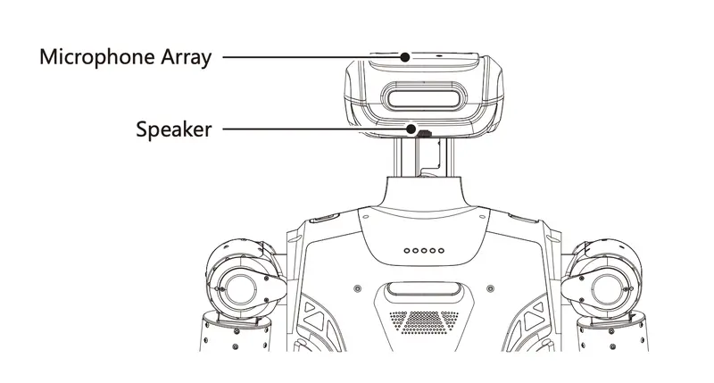
</figure>

------------------------------------------------------------------------

### 3.5.1 Mode Description

- **Online Mode:** Supports voice recognition, action control, and advanced conversational interaction.

- **Offline Mode:** Supports basic command execution (e.g., switching to lying posture).

- **Mode Switching:** - Automatically switches to Offline Mode when the network is disconnected or the detected network speed drops below 1 Mbps.

  - Automatically switches to Online Mode once the network connection is restored, accompanied by the voice prompt: "Network connected. Switched to Online Mode."

### 3.5.2 Wake-Up Methods

- **Remote Controller Wake-up:** Press and hold R2.
- **Wake-Up Feedback:** In Remote Mode while standing, after wake-up Oli automatically turns toward the speaker, responds with "I'm here, go ahead," and the chest status indicator displays a cyan breathing light.

### 3.5.3 Dialogue Mode

- **Conversation Mode:** After a successful wake-up, Oli supports continuous, multi-turn conversations. The dialogue will automatically end if no voice input is detected for **15 seconds**, requiring a re-wake-up.
- **Conversation Interruption:** If the response is interrupted by other sounds, the current reply will be terminated, and a new dialogue session will begin.

### 3.5.4 Voice-Based Motion Control

- Oli supports motion control via voice commands while operating in Remote Control Mode. The following motion categories are supported:
  1.  Custom action sequences
  2.  Action Library (e.g., “Perform a series of flying kisses”)
  3.  Dance Library (e.g., “Do a warm-up dance”)
  4.  Locomotion control (e.g., “Move forward two steps”)
  5.  Posture control (e.g., stand up, sit down)

### 3.5.5 Multilingual Switching

- Supports recognition and responses in **Chinese** and **English**.
- Language Switching: Automatically switches based on detected language or via voice command (e.g., “Switch to English”).

### 3.5.6 Multi-Audio Device Support

- **Head Microphone:** Default audio input and output device.
- **Lavalier Microphone:** Supports external audio input; audio output remains routed through the head microphone.
  - When **connected**, the audio input source automatically switches to the lavalier microphone.

  - When **disconnected**, the audio input source automatically switches back to the head microphone.

### 3.5.7 Interaction Deactivation

- **Automatic Deactivation:** When not in Dance Mode, voice interaction automatically ends if no valid voice input is detected within **15 seconds**.
- **Command-Based Deactivation:** Voice interaction can be deactivated by issuing termination commands, such as *“Turn off voice,” “Goodbye,”* or *“Stop.”*

After deactivation, the system enters a sleep state and stops audio recording. No audio data is collected or processed.

> **Note:**
>
> 1.  In noisy environments, if the system status indicator does not display a blue breathing light while speaking, it indicates a failed voice reception. In this case, please move closer to the robot and speak again.
> 2.  When the battery level drops below 20%, non-core response functions will be automatically disabled.

## 3.6 Action/Dance Library Interaction Instructions

### 3.6.1 Action Library List

|                    |           |                                         |          |           |                   |
|--------------------|-----------|-----------------------------------------|----------|-----------|-------------------|
| Category           | Action ID | Motion Name                             | Category | Action ID | Motion Name       |
| Basic Interactions | 1         | This way, please                        | Gestures | 7         | Blow kisses       |
|                    | 2         | Bow                                     |          | 8         | Left-Hand Heart   |
|                    | 3         | Wave                                    |          | 9         | Right-Hand Heart  |
|                    | 4         | Nod                                     |          | 10        | Hand Heart        |
|                    | 5         | Shake one's Head                        |          | 11        | High-Five Someone |
|                    | 6         | Take a bow                              |          | 12        | Clap              |
|                    | 18        | Shake hands                             | Dance    | 13        | Warm-Up Dance     |
|                    | 19        | Raise hand to introduce                 |          | 14        | Swag Dance        |
|                    | 20        | Casual Gesture 1 (40s）                 |          | 15        | Idol Dance 1      |
|                    | 21        | Casual Gesture 2 (10s）                 |          | 16        | Idol Dance 2      |
|                    | 22        | Take a photo (Dexterous hand required） |          | 17        | Power-up Dance    |

### 3.6.2 Dance Library List

| **No.** | Dance Name                    | **No.** | Dance Name                 |
|---------|-------------------------------|---------|----------------------------|
| **0**   | Victory Dance                 | **9**   | Gee                        |
| **1**   | One and Only Dance            | **10**  | Abracadabra Hip-Sway Dance |
| **2**   | Pulp Fiction Dance            | **11**  | Karla Forever OK           |
| **3**   | Smooth Sailing and Prosperity | **12**  | Let's Bounce               |
| **4**   | All Things Grow Dance         | **13**  | Egyptian Shake             |
| **5**   | Popping                       | **14**  | Gentleman                  |
| **6**   | Love Each Other Dance         | **15**  | Whatever the Music Is      |
| **7**   | APT                           | **16**  | Solo Shake                 |
| **8**   | Sweep Kick Dance              | \-      | \-                         |

> **Note：**  
> The action/dance library will be continuously updated, and the latest content can be obtained directly via **OTA updates**.

### 3.6.3 Action/Dance Display

- All actions and dances can be demonstrated and operated through the remote controller.

# 4 Status and Troubleshooting

## 4.1 Robot Status List

| **Index** | **Description**             | **Index** | **Description**                   |
|-----------|-----------------------------|-----------|-----------------------------------|
| **0**     | Calibrating...              | **18**    | Teleoperation Initialization      |
| **1**     | Developer Mode - Low_Level  | **19**    | Teleoperation Tracking            |
| **2**     | Developer Mode - High_Level | **20**    | Teleoperation Holding             |
| **3**     | Damping                     | **21**    | Human-Like Walking                |
| **4**     | Remote Mode                 | **22**    | Exception with LBWalk             |
| **5**     | Zero Torque                 | **23**    | Exception with Damped             |
| **6**     | Standing                    | **24**    | Packing Pose                      |
| **7**     | Lying                       | **25**    | Sitting                           |
| **8**     | Action Library              | **26**    | Action Library – Action Name      |
| **9**     | Turn Left                   | **27**    | Dance Library – Action Name       |
| **10**    | Turn Right                  | **28**    | Emergency Stop Active             |
| **11**    | Move Forward                | **29**    | Powering On                       |
| **12**    | Move Backward               | **30**    | Power On Successful               |
| **13**    | Strafe Left                 | **31**    | Stationary Teleoperation Tracking |
| **14**    | Strafe Right                | **32**    | Mobile Teleoperation Tracking     |
| **15**    | In-place March              | **33**    | Mobile Teleoperation Holding      |
| **16**    | Execute Action Sequence     | **34**    | Exit Mobile Teleoperation         |
| **17**    | Activate Voice              | **35**    | Exit Stationary Teleoperation     |

## 4.2 Error Code List

| **Error Code** | **Description**              | **Error Code**   | **Description**            |
|----------------|------------------------------|------------------|----------------------------|
| **0x0001**     | IMU abnormality              | **0x0080**       | Right-hand power fault     |
| **0x0002**     | Ethercat communication error | **0x0100**       | Left-hand power fault      |
| **0x0004**     | Low battery                  | **0x0200**       | Left leg power fault       |
| **0x0008**     | Battery fault                | **0x0400**       | Right leg power fault      |
| **0x0010**     | 24V power supply fault       | **0x0800**       | Motor pre-charge fault     |
| **0x0020**     | 15V power supply fault       | **0x8000000000** | Other hardware abnormality |
| **0x0040**     | 12V power supply fault       | **-**            | \-                         |

## 4.3 Remote Controller Pairing

To pair the remote controller with a different robot, follow the steps below:

1.  **Enter pairing preparation mode:** Before pairing, press the Emergency Stop (E-stop) button. Pairing can only be performed while the system is in the E-stop state. Successful pairing does not affect normal operation.

<figure data-line="893">
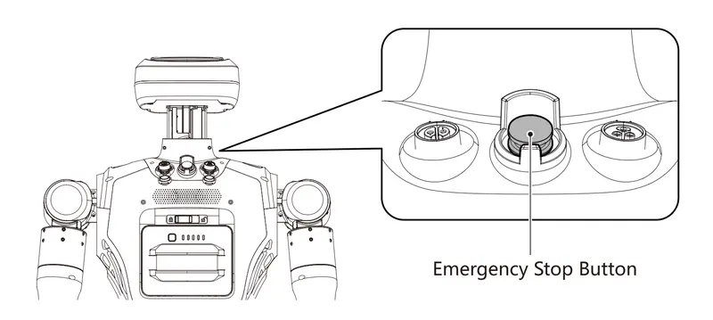
</figure>

2.  **Access the pairing interface:** Use the \*\*\[Up/Down\] button \*\*to select option 4, then press the **\[Right\] button** to enter the pairing interface.

<figure data-line="897">
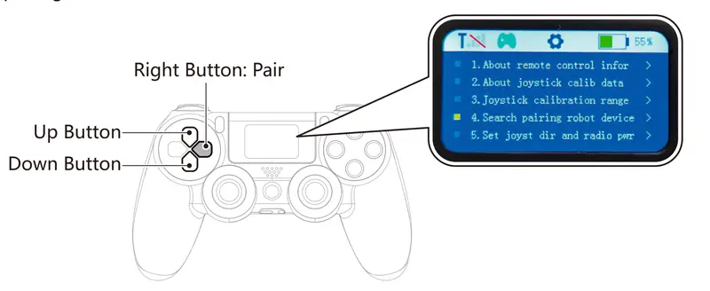
</figure>

3.  **Search for and select a device:** The controller automatically searches for robots within its frequency range, and detected devices are displayed in a list. If multiple devices are found, use the controls below:

- **\[Up/Down\] button:** Select the target robot
- **\[Right\] button:** Confirm selection and start pairing
- **\[Left\] button:** Exit

<figure data-line="904">

</figure>

4.  **Complete pairing and establish a connection:** After successful pairing, a confirmation message appears on the screen. Press the **\[Left\] button** to exit the pairing interface, and the controller will automatically establish a connection with the robot.

<figure data-line="908">
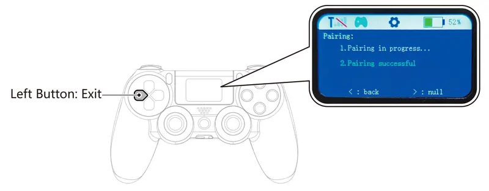
</figure>

## 4.4 Remote Controller Joystick Calibration

If the robot exhibits slight unintended movement when the joysticks are not being operated, this is typically caused by minor wear or joystick offset due to prolonged use. Follow the steps below to recalibrate the joysticks and restore control accuracy:

1.  **Access the calibration interface:** Use the **\[Up/Down\] button** to select option 3, then press the **\[Right\] button** to enter the calibration interface.

<figure data-line="916">
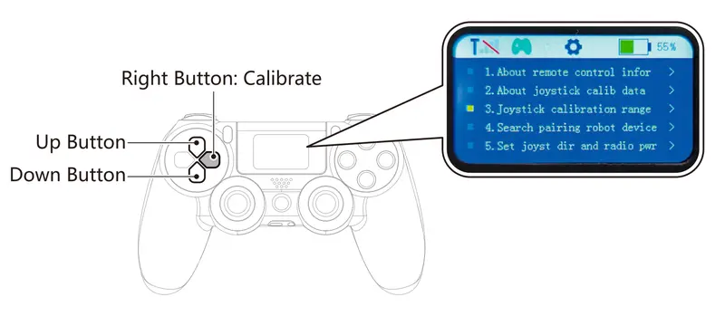
</figure>

2.  **Keep the joysticks stationary:** The screen will display "Please static the joystick." Do not touch the joysticks at this time.

<figure data-line="920">
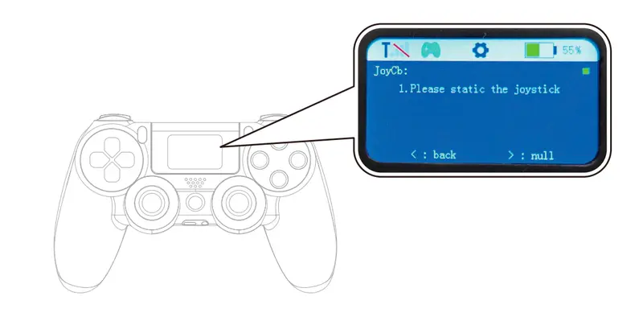
</figure>

2.  **Perform full-range calibration:** After approximately 3 seconds of inactivity, the prompt will indicate that the joysticks can be moved. Move both joysticks to their maximum range in all directions and rotate them fully several times.

<figure data-line="924">
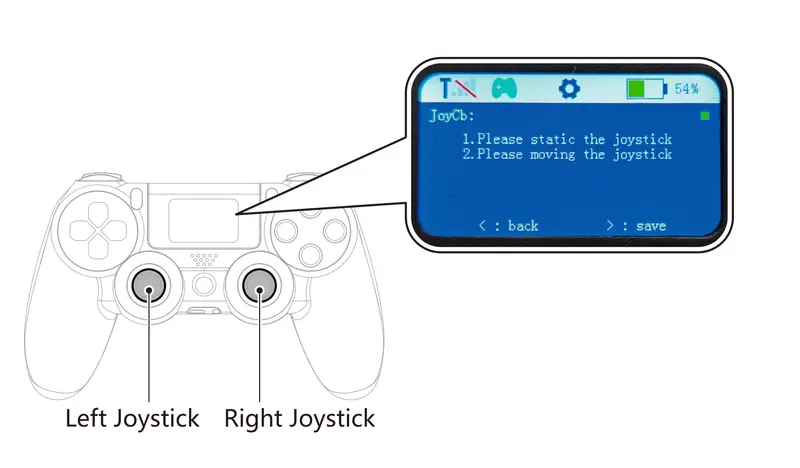
</figure>

4.  **Save calibration data:** Press the **\[Right\] button** to save the calibration data. A green "Calibration Successful" message will appear on the screen. The calibration process is then complete.

<figure data-line="928">
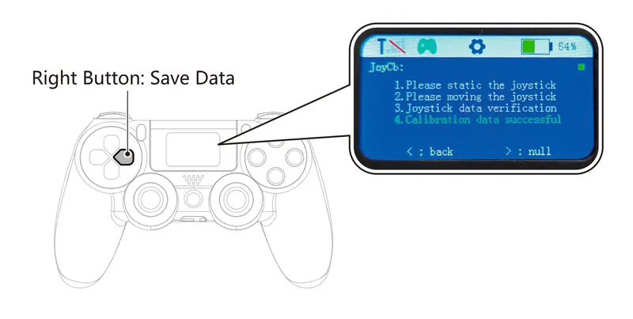
</figure>

# 5 Care and Maintenance

## 5.1 Power and Charging Management

### 5.1.1 Remote Controller Charging

- Low Battery Indicators: - **Battery level \< 20%:** The battery icon changes from green to red.
  - **Battery level \< 4%:** A red LED flashes at the bottom of the screen.
  - **Battery level = 0%:** The controller automatically powers off after approximately 5 seconds.

When the battery level is low, use the supplied Type-C charging cable to connect the controller to a power adapter for charging (as shown below).

<figure data-line="942">
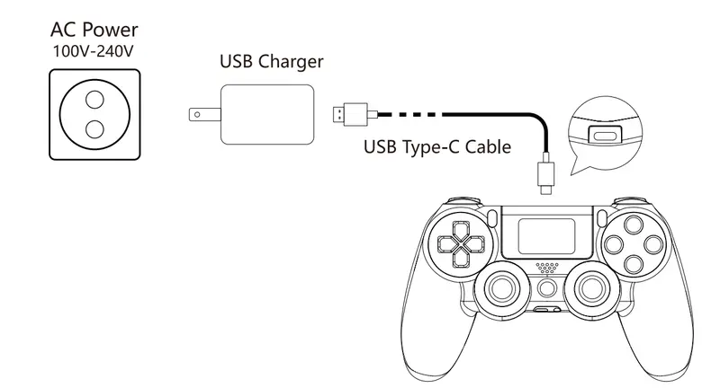
</figure>

### 5.1.2 Robot Charging

#### 5.1.2.1 Battery Charging

1.  Connect the charging dock to the power source.

<figure data-line="950">
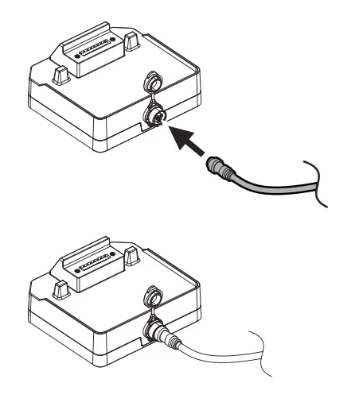
</figure>

2.  Insert the battery into the charging dock. A flashing green indicator light indicates that charging has started.

<figure data-line="954">
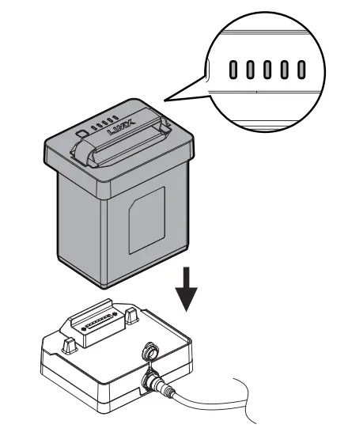
</figure>

#### 5.1.2.2 Direct Charging via Robot Charging Port (Only when not in operation)

1.  Open the charging port cover and ensure the port is dry and clean.

<figure data-line="960">
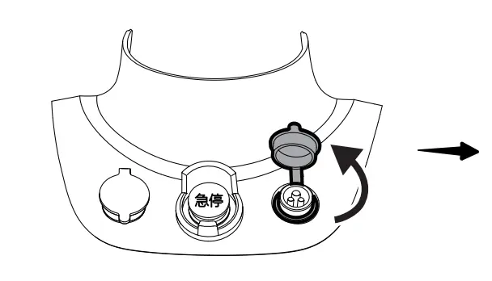
</figure>

2.  Align the aviation connector with the guide slot and insert it securely into the charging port.

<figure data-line="964">
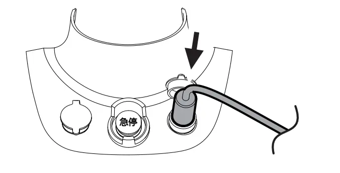
</figure>

3.  Plug the power adapter into an appropriate AC outlet (refer to adapter rating label).

<figure data-line="968">
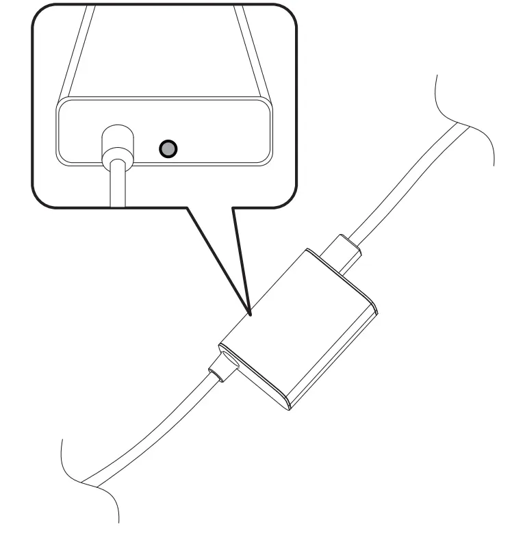
</figure>

> **Note：**  
> **Do not charge the robot via the charging port while it is in operation.** Ensure that the robot is completely stopped before charging.

### 5.1.3 Stop Charging

1.  Unplug the power adapter from the outlet to disconnect the power supply.

<figure data-line="977">
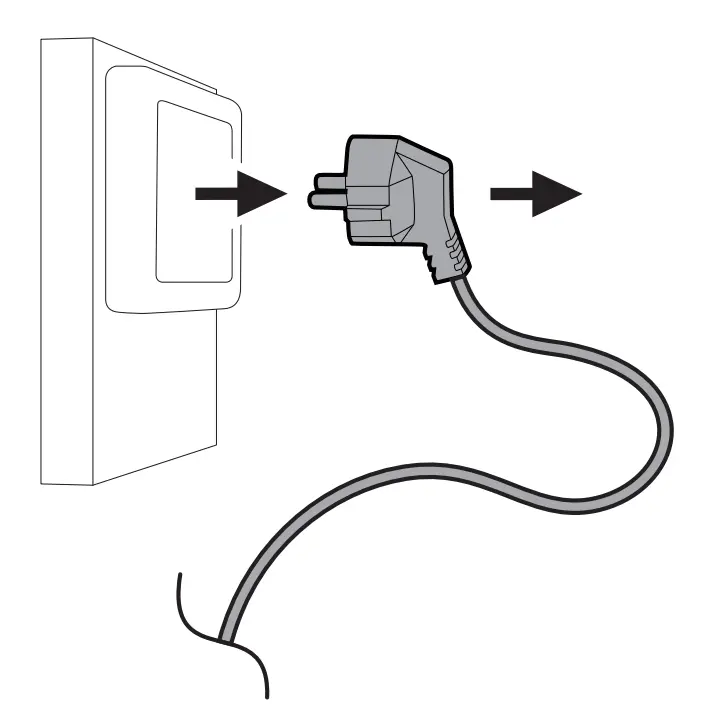
</figure>

2.  Carefully remove the charging connector.

<figure data-line="981">
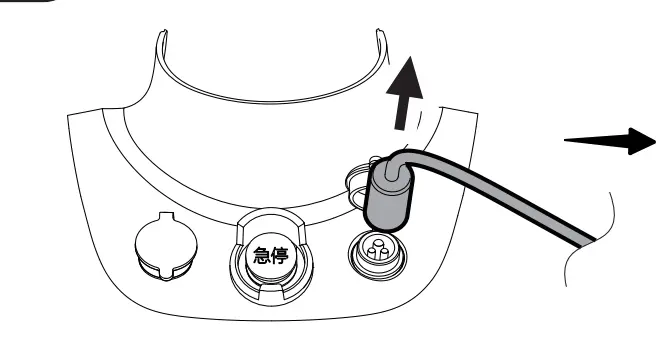
</figure>

3.  Close the charging port cover to prevent dust or foreign objects from entering.

<figure data-line="985">
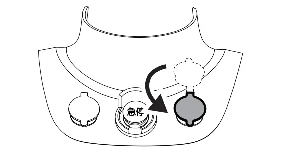
</figure>

### 5.1.4 Battery and Charging Maintenance

1.  Do not power on or operate the device while charging via the robot's charging port. This ensures a safe and stable charging process.
2.  While charging the battery, ensure that the power adapter is not subjected to pressure, stepping, tipping, or frequent movement, and keep it placed on a stable surface.
3.  If the system indicates that the battery level is critically low, promptly power off the device and recharge the battery to prevent system abnormalities caused by sudden power loss.
4.  Before long-term storage, maintain the battery level at 50%-60% (avoid storing the battery fully charged or fully discharged). During storage, perform a full charge-discharge cycle every three months, then restore the battery level to 50%-60% to help minimize performance degradation over time.
5.  Do not plug or unplug the battery while the robot is powered on or in operation. This prevents burn damage to the power connector pins and damage to the interface circuit.
6.  When plugging or unplugging the battery, apply steady, even force perpendicular to the interface. Do not pry with uneven force, pull violently, or wiggle the connector.

## 5.2 Exterior and Structural Maintenance

1.  Regularly clean dust from the robot’s exterior surfaces and joint areas, and verify that all screws and fasteners are securely tightened.
2.  If the robot is used in dusty environments, promptly wipe the housing with a clean microfiber cloth.

## 5.3 Storage and Transportation

1.  Use a transport case specifically designed for the robot during storage and transportation to minimize impact and vibration.
2.  When storing the remote controller, avoid applying external pressure to the joysticks and ensure that all ports remain clean.

## 5.4 Software and System Maintenance

1.  Regularly update the official firmware to resolve potential system issues and optimize motion control algorithms.
2.  If the device remains powered on but unused for an extended period, enable mechanical or software-based “suspension protection” to prevent unintended movement.

# 6 FAQ

|                             |                                    |                                                                                        |                                                                                                                                                                    |
|-----------------------------|------------------------------------|----------------------------------------------------------------------------------------|--------------------------------------------------------------------------------------------------------------------------------------------------------------------|
| **Issues Category**         | **Issue Description**              | **Possible Causes**                                                                    | **Troubleshooting & Solutions**                                                                                                                                    |
| **Power Related**           | **Failure to Power On**            | \- Depleted battery - Emergency stop button pressed                                    | \- Check charge status and recharge - Ensure the emergency stop button is released                                                                                 |
|                             | **Sudden Motor Shutdown**          | \- Safety protection triggered - Loose connection - Power supply abnormality           | \- Check the emergency stop status. - Reconnect the power cable or check connectors - Restart the system.                                                          |
|                             | **Failure to Charge**              | \- Incorrect connection sequence - Adapter malfunction - Loose connection              | \- Insert the aviation plug first, then power on. - Check the indicator light (Red = Charging, Green = Full) - Tighten screw sleeve, check contact                 |
| **Control & Execution**     | **No Buzzer Prompt After Startup** | \- Self-check incomplete - Remote controller pairing failed                            | \- Wait 1 minute for initialization. - Re-pair the remote controller                                                                                               |
|                             | **Remote Controller Unresponsive** | \- Pairing unsuccessful - Remote controller low battery - Severe wireless interference | \- Long-press the "Sync Button" for 3s to re-pair. - Replace the remote controller battery. - Move away from strong interference sources.                          |
|                             | **Motor No Response**              | \- No power applied - Pairing incomplete - Control signal lost                         | \- Confirm the remote controller is paired. - Press the right stick to power on - Check the remote controller status                                               |
|                             | **Zero Calibration Failure**       | \- Restricted space - Incorrect posture - Command not sent successfully                | \- Ensure no obstacles within 2m/6' 6.74" - Perform in a natural hanging position - Check the remote controller button operation                                   |
| **Communication & Network** | **Unable to connect to Wi-Fi**     | \- Weak signal - Incorrect password - Module malfunction                               | \- Move closer to the robot and reconnect. - Verify the password is \`12345678\` - Restart the robot                                                               |
|                             | **Unable to access 10.192.1.2**    | \- IP not on the same subnet - Network configuration error                             | \- For wired connection: manually set the IP to \`10.192.1.x\` subnet. - For wireless connection: automatic IP address assignment, no manual configuration needed. |

