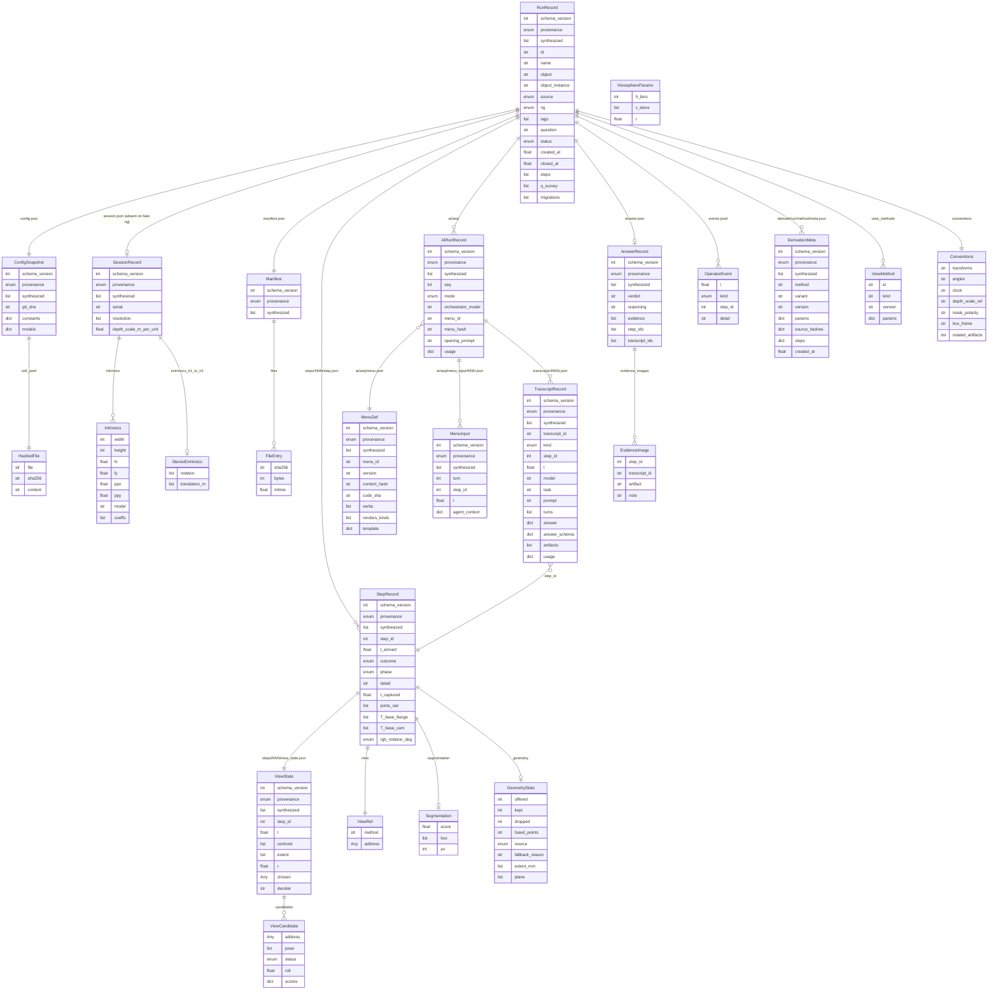

<!-- GENERATED from inspection/record/schema.py — do not edit. Regenerate: p inspection/record/docgen.py -->

# Single Recording schema — generated reference

`schema_version` = **1**. Source of truth: `inspection/record/schema.py` (validated by `inspection/tests/test_record_schema.py`).

## ER diagram

## Entities

### ViewsphereParams

Params for kind='viewsphere' (the current method, one among future ones).

| field | type | required | default |
|---|---|---|---|
| `h_bins` | `int` | yes | — |
| `v_elevs` | `list[float]` | yes | — |
| `r` | `float | None` | no | `None` |

### ViewMethod

How views are generated/addressed. Unknown kinds carry free params.

| field | type | required | default |
|---|---|---|---|
| `id` | `str` | yes | — |
| `kind` | `str` | yes | — |
| `version` | `str` | no | `'1'` |
| `params` | `dict[str, Any]` | no | `dict()` |

### ViewRef

A step's view identity: method + method-defined address.

address is None for free 6-DoF views — T_base_cam is then the only identity.

| field | type | required | default |
|---|---|---|---|
| `method` | `str` | yes | — |
| `address` | `Any | None` | no | `None` |

### Segmentation

Per-step segmentation result (trimmed by decision: score/box/px only).

`box` is in the RAW (unrotated) image frame — see RunRecord.conventions.

| field | type | required | default |
|---|---|---|---|
| `score` | `float` | yes | — |
| `box` | `list[int]` | yes | — |
| `px` | `int` | yes | — |

### GeometryStats

Per-step fusion accounting + table plane + cloud provenance.

`fused_points` = merged cloud size AFTER this step (replay's second anchor;
Σkept ≠ cloud size because voxel/outlier passes act on the merged cloud).
`source` records which branch produced the points — mask-exact vs
depth-growth clouds differ materially and benchmarks must filter on it.

| field | type | required | default |
|---|---|---|---|
| `offered` | `int` | yes | — |
| `kept` | `int` | yes | — |
| `dropped` | `int` | yes | — |
| `fused_points` | `int` | yes | — |
| `source` | `'mask' | 'depth'` | yes | — |
| `fallback_reason` | `str | None` | no | `None` |
| `extent_mm` | `list[float] | None` | no | `None` |
| `plane` | `list[float] | None` | no | `None` |

### StepRecord

One atomic step = one robot position. The universal join key.

Lifecycle (review B1/B2): `outcome` says how the step ended; `phase` is the
write-protocol discriminator — "captured" means geometry hasn't been written
yet (crash window is unambiguous), "fused" means the record is complete.
Pose/capture fields are required only when outcome == "captured".

| field | type | required | default |
|---|---|---|---|
| `schema_version` | `int` | no | `1` |
| `provenance` | `'native' | 'legacy'` | no | `'native'` |
| `synthesized` | `list[str]` | no | `list()` |
| `step_id` | `int` | yes | — |
| `view` | `ViewRef` | yes | — |
| `t_arrived` | `float` | yes | — |
| `outcome` | `'captured' | 'rejected' | 'failed'` | no | `'captured'` |
| `phase` | `'captured' | 'fused'` | no | `'fused'` |
| `detail` | `str | None` | no | `None` |
| `t_captured` | `float | None` | no | `None` |
| `joints_rad` | `list[float] | None` | no | `None` |
| `T_base_flange` | `list[list[float]] | None` | no | `None` |
| `T_base_cam` | `list[list[float]] | None` | no | `None` |
| `rgb_rotation_deg` | `0 | 180 | None` | no | `None` |
| `segmentation` | `Segmentation | None` | no | `None` |
| `geometry` | `GeometryStats | None` | no | `None` |

### ViewCandidate

One candidate view in a step's ViewState snapshot.

`unreachable` (hard constraint: no IK/collision-free branch) is distinct
from `blocked` (soft: planner refused from here, transient).

| field | type | required | default |
|---|---|---|---|
| `address` | `Any | None` | no | `None` |
| `pose` | `list[list[float]] | None` | no | `None` |
| `status` | `'available' | 'visited' | 'blocked' | 'unreachable' | 'current'` | yes | — |
| `roll` | `float | None` | no | `None` |
| `scores` | `dict[str, float]` | no | `dict()` |

### ViewState

Candidate view set as it existed at this step — PHYSICAL truth only.

Timing contract: this is the state in effect when the NEXT action was
chosen (computed at end-of-step after fusing/recentering). AI-tier context
(seen cells, findings) lives in MenuInput under the AIRun — menus are pure
functions of (ViewState, MenuInput).

| field | type | required | default |
|---|---|---|---|
| `schema_version` | `int` | no | `1` |
| `provenance` | `'native' | 'legacy'` | no | `'native'` |
| `synthesized` | `list[str]` | no | `list()` |
| `step_id` | `int` | yes | — |
| `t` | `float | None` | no | `None` |
| `candidates` | `list[ViewCandidate]` | yes | — |
| `centroid` | `list[float] | None` | no | `None` |
| `extent` | `list[float] | None` | no | `None` |
| `r` | `float | None` | no | `None` |
| `chosen` | `Any | None` | no | `None` |
| `decider` | `str | None` | no | `None` |

### Conventions

Self-description written in-band (run.json) — the facts that today live
only in code and would make the disk uninterpretable in a year.

| field | type | required | default |
|---|---|---|---|
| `transforms` | `str` | no | `'T_A_B is 4x4 row-major, maps B-frame points into A; base = UR controller base; meters'` |
| `angles` | `str` | no | `'radians'` |
| `clock` | `str` | no | `'unix wall seconds'` |
| `depth_scale_ref` | `str` | no | `'session.json depth_scale_m_per_unit; 0 = invalid'` |
| `mask_polarity` | `str` | no | `'255 = object, 0 = background'` |
| `box_frame` | `str` | no | `'segmentation.box is in the RAW (unrotated) image frame'` |
| `rotated_artifacts` | `list[str]` | no | `list()` |

### RunRecord

run.json — the datasheet: identity, motivation, status, view methods.

| field | type | required | default |
|---|---|---|---|
| `schema_version` | `int` | no | `1` |
| `provenance` | `'native' | 'legacy'` | no | `'native'` |
| `synthesized` | `list[str]` | no | `list()` |
| `id` | `str` | yes | — |
| `name` | `str` | yes | — |
| `object` | `str | None` | no | `None` |
| `object_instance` | `str | None` | no | `None` |
| `source` | `'live' | 'data-engine'` | yes | — |
| `rig` | `'real' | 'fake'` | no | `'real'` |
| `tags` | `list[str]` | no | `list()` |
| `question` | `str | None` | no | `None` |
| `status` | `'running' | 'completed' | 'aborted' | 'crashed'` | yes | — |
| `created_at` | `float` | yes | — |
| `closed_at` | `float | None` | no | `None` |
| `view_methods` | `list[ViewMethod]` | no | `list()` |
| `steps` | `list[int]` | no | `list()` |
| `q_survey` | `list[float] | None` | no | `None` |
| `conventions` | `Conventions` | no | `Conventions()` |
| `migrations` | `list[str]` | no | `list()` |

### Intrinsics

Camera intrinsics for one stream, resolution-bound.

| field | type | required | default |
|---|---|---|---|
| `width` | `int` | yes | — |
| `height` | `int` | yes | — |
| `fx` | `float` | yes | — |
| `fy` | `float` | yes | — |
| `ppx` | `float` | yes | — |
| `ppy` | `float` | yes | — |
| `model` | `str` | yes | — |
| `coeffs` | `list[float]` | no | `list()` |

### StereoExtrinsics

IR stereo pair mounting (rotation row-major 3x3 + translation).

| field | type | required | default |
|---|---|---|---|
| `rotation` | `list[float]` | yes | — |
| `translation_m` | `list[float]` | yes | — |

### SessionRecord

session.json — camera identity + calibration-level data, once per run.

Absent on fake-rig runs (RunRecord.rig == "fake" declares why).
The depth arrays' scale lives HERE — referenced, not repeated, per view.

| field | type | required | default |
|---|---|---|---|
| `schema_version` | `int` | no | `1` |
| `provenance` | `'native' | 'legacy'` | no | `'native'` |
| `synthesized` | `list[str]` | no | `list()` |
| `serial` | `str` | yes | — |
| `resolution` | `list[int]` | yes | — |
| `depth_scale_m_per_unit` | `float` | yes | — |
| `intrinsics` | `dict[str, Intrinsics]` | no | `dict()` |
| `extrinsics_ir1_to_ir2` | `StereoExtrinsics | None` | no | `None` |

### HashedFile

A file identified by name + content hash (calib artifact, cell.yaml...).

| field | type | required | default |
|---|---|---|---|
| `file` | `str | None` | no | `None` |
| `sha256` | `str` | yes | — |
| `content` | `str | None` | no | `None` |

### ConfigSnapshot

config.json — the world-in-effect at run start.

Makes "safe and doable" re-checkable and old runs renderable after
cell.yaml/calib edits. Model identities live HERE, not per step.

| field | type | required | default |
|---|---|---|---|
| `schema_version` | `int` | no | `1` |
| `provenance` | `'native' | 'legacy'` | no | `'native'` |
| `synthesized` | `list[str]` | no | `list()` |
| `git_sha` | `str` | yes | — |
| `cell_yaml` | `HashedFile` | yes | — |
| `calib` | `HashedFile` | yes | — |
| `constants` | `dict[str, Any]` | no | `dict()` |
| `models` | `dict[str, str]` | no | `dict()` |

### MenuDef

ai/<seq>/menu.json — the menu definition, snapshot + shared id.

The menu is the pure function (ViewState, MenuInput) -> LLM text; this is
its definition side. Provenance follows the scores.jsonl pattern:
version (semver) + code_sha (renderer code identity).
Rendered per-turn text lives in the AI trace.

| field | type | required | default |
|---|---|---|---|
| `schema_version` | `int` | no | `1` |
| `provenance` | `'native' | 'legacy'` | no | `'native'` |
| `synthesized` | `list[str]` | no | `list()` |
| `menu_id` | `str` | yes | — |
| `version` | `str` | yes | — |
| `content_hash` | `str` | yes | — |
| `code_sha` | `str` | yes | — |
| `verbs` | `list[str]` | yes | — |
| `renders_kinds` | `list[str]` | no | `list()` |
| `template` | `dict[str, Any]` | no | `dict()` |

### MenuInput

ai/<seq>/menu_input/<NNN>.json — AI-tier menu context, one per turn.

ViewState is physical truth; THIS carries what the agent-side rendering
additionally consumed (seen cells, findings count, recommendations).
`agent_context` tightens when the eyes wiring lands; the envelope is the
contract. Exact replay injects recorded text; menu experiments re-render
from (ViewState[step_id], MenuInput[turn]).

| field | type | required | default |
|---|---|---|---|
| `schema_version` | `int` | no | `1` |
| `provenance` | `'native' | 'legacy'` | no | `'native'` |
| `synthesized` | `list[str]` | no | `list()` |
| `turn` | `int` | yes | — |
| `step_id` | `int` | yes | — |
| `t` | `float` | yes | — |
| `agent_context` | `dict[str, Any]` | no | `dict()` |

### AIRunRecord

ai/<seq>/airun.json — one orchestrator session over the run.

| field | type | required | default |
|---|---|---|---|
| `schema_version` | `int` | no | `1` |
| `provenance` | `'native' | 'legacy'` | no | `'native'` |
| `synthesized` | `list[str]` | no | `list()` |
| `seq` | `int` | yes | — |
| `mode` | `'live' | 'replay'` | yes | — |
| `orchestrator_model` | `str` | yes | — |
| `menu_id` | `str` | yes | — |
| `menu_hash` | `str` | yes | — |
| `opening_prompt` | `str | None` | no | `None` |
| `usage` | `dict[str, float] | None` | no | `None` |

### TranscriptRecord

ai/<seq>/transcripts/<tNNN>.json — one VLM subagent run, stored ONCE.

The image-tier agent's full reasoning: verbatim prompt, every turn (each
carries a `type` discriminator; inner shapes tighten at wiring), final
answer. `kind` says what invoked it — the filename never has to. `step_id`
is the sync link to the atomic step whose capture it looked at.
Image-producing tool uses save under artifacts/ keyed
(transcript, turn, tool) — collisions impossible.

| field | type | required | default |
|---|---|---|---|
| `schema_version` | `int` | no | `1` |
| `provenance` | `'native' | 'legacy'` | no | `'native'` |
| `synthesized` | `list[str]` | no | `list()` |
| `transcript_id` | `str` | yes | — |
| `kind` | `'survey' | 'inspect' | 'move' | 'evidence'` | yes | — |
| `step_id` | `int` | yes | — |
| `t` | `float` | yes | — |
| `model` | `str` | yes | — |
| `task` | `str` | yes | — |
| `prompt` | `str` | yes | — |
| `turns` | `list[dict[str, Any]]` | no | `list()` |
| `answer` | `dict[str, Any] | list[Any] | str | None` | no | `None` |
| `answer_schema` | `dict[str, Any] | None` | no | `None` |
| `artifacts` | `list[str]` | no | `list()` |
| `usage` | `dict[str, float] | None` | no | `None` |

### EvidenceImage

One verdict->image citation in the answer.

| field | type | required | default |
|---|---|---|---|
| `step_id` | `int` | yes | — |
| `transcript_id` | `str` | yes | — |
| `artifact` | `str` | yes | — |
| `note` | `str | None` | no | `None` |

### AnswerRecord

answer.json — the verdict, with explicit back-references.

| field | type | required | default |
|---|---|---|---|
| `schema_version` | `int` | no | `1` |
| `provenance` | `'native' | 'legacy'` | no | `'native'` |
| `synthesized` | `list[str]` | no | `list()` |
| `verdict` | `str` | yes | — |
| `reasoning` | `str` | yes | — |
| `evidence` | `list[str]` | no | `list()` |
| `evidence_images` | `list[EvidenceImage]` | no | `list()` |
| `step_ids` | `list[int]` | no | `list()` |
| `transcript_ids` | `list[str]` | no | `list()` |

### OperatorEvent

One line of events.jsonl — run-level, append-only, both run kinds.

No per-line schema_version: the run's version covers the file.

| field | type | required | default |
|---|---|---|---|
| `t` | `float` | yes | — |
| `kind` | `'requested' | 'awaiting_approval' | 'approved' | 'redirected' | 'cancelled' | 'captured' | 'blocked' | 'stopped' | 'fault'` | yes | — |
| `step_id` | `int | None` | no | `None` |
| `detail` | `str | None` | no | `None` |

### FileEntry

One manifest entry: content hash + cheap-check fields.

| field | type | required | default |
|---|---|---|---|
| `sha256` | `str` | yes | — |
| `bytes` | `int` | yes | — |
| `mtime` | `float` | yes | — |

### Manifest

manifest.json — immutable BINARY artifacts (png/npy/ply), at close.

Schema-managed JSON is validated by re-validation, not byte hash — so the
additive migration gate never contradicts the integrity check (review B7).
bytes+mtime give an instant pre-pass; full re-hash is the deep check.
Migrations extend this add-only; existing entries never change.

| field | type | required | default |
|---|---|---|---|
| `schema_version` | `int` | no | `1` |
| `provenance` | `'native' | 'legacy'` | no | `'native'` |
| `synthesized` | `list[str]` | no | `list()` |
| `files` | `dict[str, FileEntry]` | no | `dict()` |

### DerivationMeta

derived/<run>/<method>[/<variant>]/meta.json — derivation provenance.

The scores.jsonl pattern made uniform: version = "<method>/<semver>+p:<code-hash>".
`steps` records an explicit ok/failed entry per step — never a silent gap
(the cup5 step-029 lesson). Staleness = recorded source_hashes vs current.

| field | type | required | default |
|---|---|---|---|
| `schema_version` | `int` | no | `1` |
| `provenance` | `'native' | 'legacy'` | no | `'native'` |
| `synthesized` | `list[str]` | no | `list()` |
| `method` | `str` | yes | — |
| `variant` | `str | None` | no | `None` |
| `version` | `str` | yes | — |
| `params` | `dict[str, Any]` | no | `dict()` |
| `source_hashes` | `dict[str, str]` | no | `dict()` |
| `steps` | `dict[int, str]` | no | `dict()` |
| `created_at` | `float` | yes | — |
