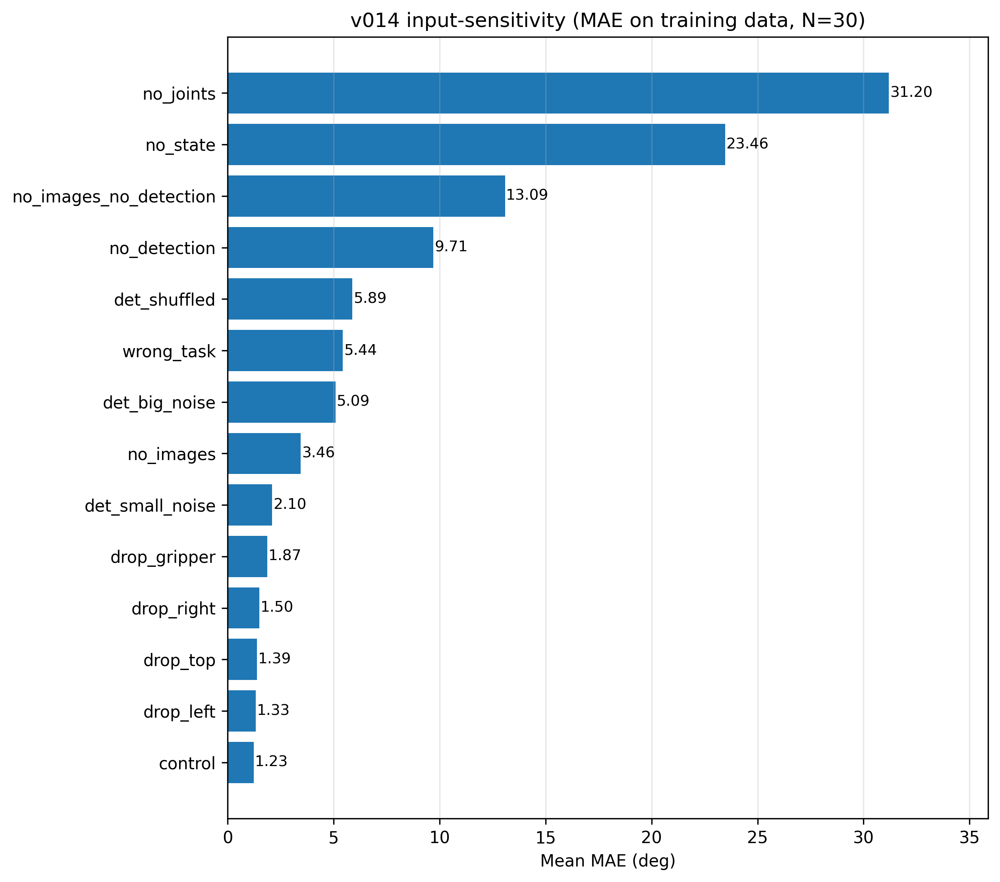
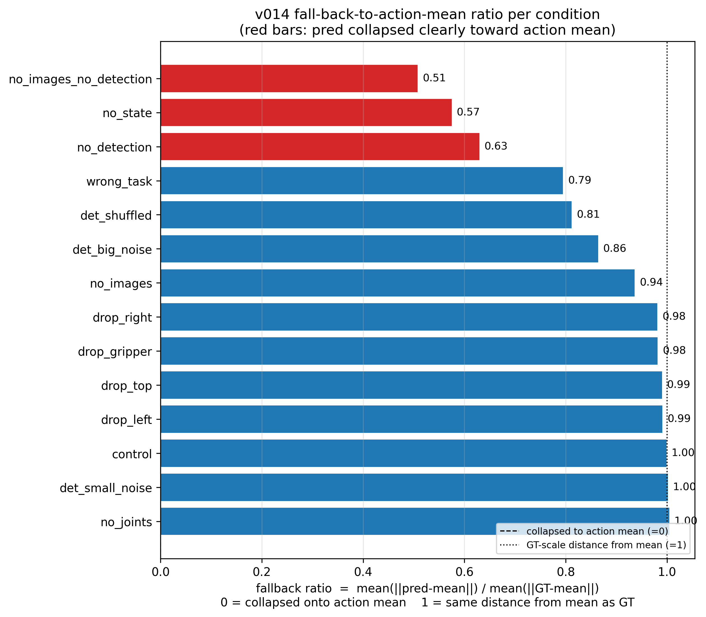
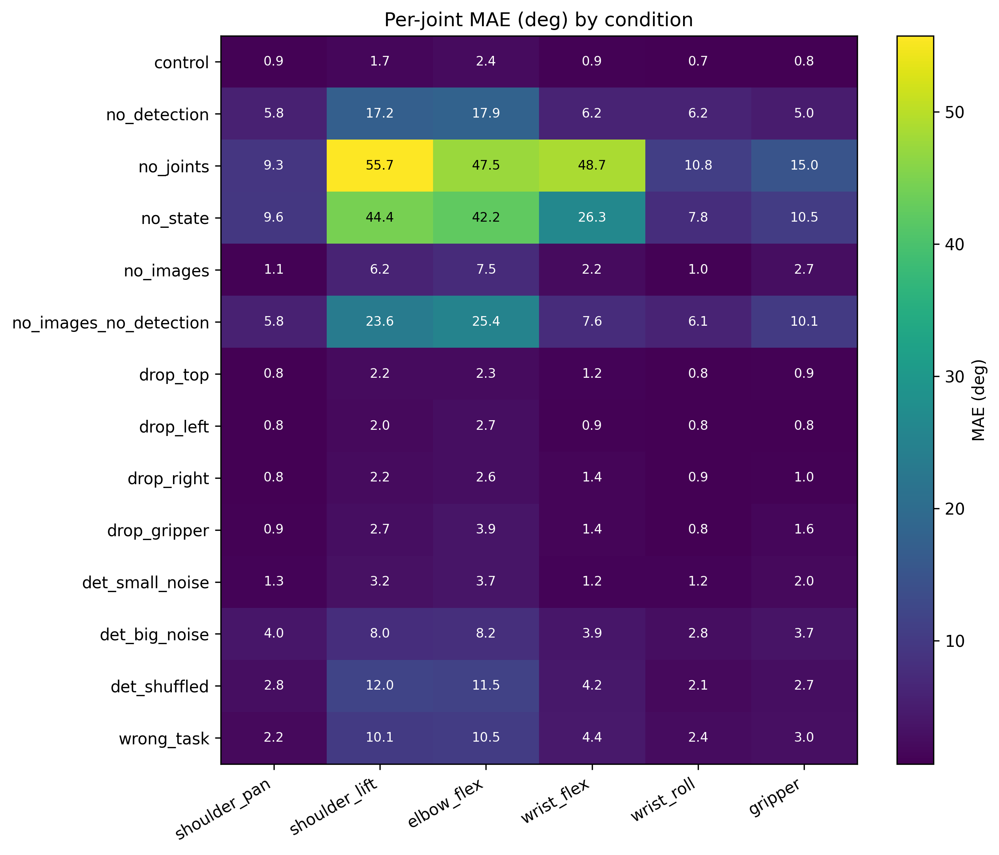
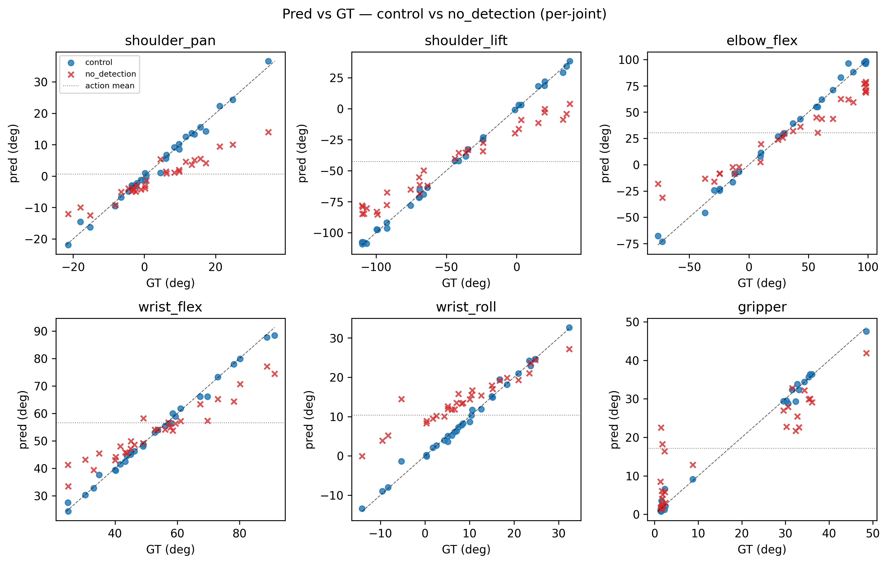

# v014 — Student Detection Coordinates

## Status
**Failed.** The detection-augmented state created an *easy-signal trap*: the policy collapsed onto the 16 detection coordinates and underused the 4 camera images. Brittle on real robot — jitters and drifts toward mean action even at 50k steps with perfectly aligned cameras.

## Hypothesis (initial)
Adding StudentDetector duck/cup cx/cy coords from 4 cameras as extra state improves grasping accuracy over pure-vision v013.

## Setup
- **Dataset**: `eternalmay33/01_02_03_merged_may-sim_detection`
- **State (22-d)**: `[0:6]` joints (deg) + `[6:22]` detection cx/cy normalized to [0,1]
  - canonical order: `[left, right, top, gripper] × [duck, cup] × [cx, cy]` — 16 dims
  - dataset uses `apply_confidence_hold`: when conf < threshold, replace cx/cy with previous good frame's values (verified: 153/153 conf=0 frames in episode 58 hold the immediately prior frame exactly)
- **Detection**: StudentDetector (MobileNetV3-Small, `m1_baseline`, per-camera)
- Same model + hyperparams as v013 (50k steps, batch 32, lr 1e-4, cosine schedule)

## A/B with v013
- **v013** — 6-d state, no detection. Works on real robot.
- **v014** — 22-d state, with detection. **Fails on real robot.**

## Inference pipeline lessons
Live inference must mirror the offline pipeline exactly. What got me to "policy can run without crashing":
- StudentDetector runs on **RGB** frames from `_capture_frames` — there was a stray `cv2.cvtColor(BGR2RGB)` doing a channel-swap on already-RGB. Fixed.
- Feed 22-d state to the preprocessor (config.json says `[6]` but `max_state_dim=32` pads internally — preprocessor expects 22).
- **`DetectionStateHolder`** in `vbti/logic/inference/run_real_inference.py` mirrors `apply_confidence_hold`: when conf < threshold, re-emits last known cx/cy instead of zeros. `eval_engine` resets it per trial.
- Camera order in the 16-d aug vector is canonical (`[left, right, top, gripper]`), NOT user-config order — re-ordering silently mis-aligns the normalizer's mean/std subtraction.
- `--detection=true` flag handles both state augmentation and the bbox/crosshair overlay (run_real_inference + eval_engine).

All of the above were prerequisites to running v014 at all — they're necessary but not sufficient. Real failure mode is below.

---

# Sensitivity Ablation

## TL;DR
Removing the 16 detection coords drives MAE from **1.23° (control) to 9.71°**, while removing all four images only goes to **3.46°**. v014 leans on detections, not pixels — **2.8× more sensitive** to losing detections than to losing all four cameras.

## Method
- Checkpoint: `lerobot_output_r1/checkpoints/020000/pretrained_model`
- Dataset: `eternalmay33/01_02_03_merged_may-sim_detection` (135 846 frames)
- N = 30 samples, evenly spaced indices in `[0, 135845]`, seed=0
- Action mean (deg): `[0.66, -42.7, 30.36, 56.6, 10.36, 17.18]`; mean GT L2 distance from action_mean = **74.00°**
- `fallback_ratio = mean(||pred − action_mean||) / mean(||GT − action_mean||)`
  - ~0.0 → prediction sits on the action mean (full collapse)
  - ~1.0 → prediction is as far from mean as GT is (right scale)
  - >1.0 → wandering further from mean than GT
- Single-frame eval: `policy.reset()` + `predict_action_chunk()`, take `chunk[0]`
- Joints in degrees throughout. Image normalizer is IDENTITY → "zero an image" = literal zeros tensor

## Results
| condition | mae (deg) | shoulder_pan | shoulder_lift | elbow_flex | wrist_flex | wrist_roll | gripper | fallback_ratio |
|---|---:|---:|---:|---:|---:|---:|---:|---:|
| control | 1.23 | 0.94 | 1.74 | 2.35 | 0.92 | 0.68 | 0.78 | 1.00 |
| no_detection | **9.71** | 5.81 | 17.24 | 17.90 | 6.19 | 6.16 | 4.97 | **0.63** |
| no_joints | 31.20 | 9.32 | 55.75 | 47.55 | 48.73 | 10.83 | 15.00 | 1.00 |
| no_state | 23.46 | 9.61 | 44.36 | 42.21 | 26.30 | 7.79 | 10.51 | 0.57 |
| no_images | **3.46** | 1.11 | 6.18 | 7.52 | 2.19 | 1.03 | 2.70 | **0.94** |
| no_images_no_detection | 13.09 | 5.82 | 23.61 | 25.36 | 7.61 | 6.06 | 10.05 | 0.51 |
| drop_top | 1.39 | 0.84 | 2.24 | 2.27 | 1.20 | 0.84 | 0.93 | 0.99 |
| drop_left | 1.33 | 0.81 | 1.97 | 2.68 | 0.91 | 0.78 | 0.81 | 0.99 |
| drop_right | 1.50 | 0.84 | 2.22 | 2.63 | 1.38 | 0.88 | 1.02 | 0.98 |
| drop_gripper | 1.87 | 0.90 | 2.73 | 3.86 | 1.40 | 0.80 | 1.55 | 0.98 |
| det_small_noise | 2.10 | 1.31 | 3.17 | 3.70 | 1.19 | 1.24 | 2.00 | 1.00 |
| det_big_noise | 5.09 | 4.00 | 7.98 | 8.16 | 3.95 | 2.79 | 3.66 | 0.86 |
| det_shuffled | 5.89 | 2.80 | 12.03 | 11.51 | 4.23 | 2.09 | 2.66 | 0.81 |
| wrong_task | 5.44 | 2.16 | 10.11 | 10.54 | 4.37 | 2.42 | 3.03 | 0.79 |

## Plots

## Reading the numbers
- **control** = 1.23°, fb=1.00 — sanity floor on training-distribution data; predictions hug GT.
- **no_detection** = 9.71° (fb=0.63) vs **no_images** = 3.46° (fb=0.94): zeroing 16 detection scalars is **2.8× more damaging** than blanking all four 3-channel image streams. The fb gap (0.63 vs 0.94) confirms `no_detection` pulls predictions toward the mean while `no_images` does not.
- **det_shuffled** = 5.89° (fb=0.81) — preserving detection magnitudes but breaking spatial cx/cy layout is *more* harmful than `det_big_noise` (5.09°) and only ~40% less harmful than zeroing detection (9.71°). Policy uses the *spatial* meaning of (cx, cy), not just the value distribution.
- **det_small_noise** = 2.10° vs **det_big_noise** = 5.09° — smooth degradation; even σ=0.05 (~5% of normalized range) lifts MAE 1.7× over control.
- **drop_one_cam**: top=1.39, left=1.33, right=1.50, gripper=1.87 (fb≈0.98–0.99). Per-camera deltas vs control ≤0.6°. No single camera is load-bearing — even dropping the wrist camera barely moves the policy.
- **no_images_no_detection** = 13.09° — joints+task only, lower bound. `no_detection` (9.71°) sits 3.4° below this, so once detection is removed, the four images recover only ~3.4° of the ~7.6° gap from control to floor. Images carry modest residual signal but are clearly underused.
- **no_joints** = 31.20° (fb=1.00) — zeroing joints is the single most damaging ablation, but fb≈1 means "wrong direction" not "collapse to mean". Joints are the dominant proprioceptive anchor.
- **wrong_task** = 5.44° (fb=0.79) — task token matters but isn't load-bearing the way detection is.

## Conclusion — easy-signal trap confirmed
- Detection-only removal (9.71°, fb=0.63) is **2.8× more damaging** than removing all four image streams (3.46°, fb=0.94), and **7.9× control** (1.23°). Pixels are nearly free vs detection inputs.
- Of the ~7.6° MAE gap between control and joints-only floor, **6.3° is recovered by detection alone** vs **only 3.4° by images alone**. Detection contributes ~2× the visual signal that images do.
- `det_shuffled` and `det_big_noise` confirm the policy uses *spatial* (cx, cy) structure — exactly what an easy-signal learner does.
- Per-joint damage from detection loss concentrates in shoulder_lift (17.2°) and elbow_flex (17.9°) — the joints with the largest task-relevant range.
- **Practical implication**: any drift in the live detection distribution (camera angle, lighting, MobileNetV3 student-detector failure on real robot) pushes `state[6:22]` off the training manifold; the underused image stream cannot compensate. Matches the observed real-robot failure mode (jitter + drift toward mean action).

## Decision
The detection-coords-as-state path doesn't help — and forcing it via training-time fixes may be a dead end. Three threads forward:

- **Drop detection from state** (preferred). v013 already shows that with a sufficiently diverse dataset, SmolVLA's frozen ViT extracts spatial understanding from images on its own. Detection-state may simply not be necessary.
- **Detection dropout** (fallback if v013-style hits a ceiling). Retrain v014 with `state[6:22]` randomly zeroed 30–50% of training steps to force image utilization while keeping detection available at inference.
- **Depth channel** (next axis to explore). Add a depth stream to the image inputs to give the encoder explicit 3D cues — could lift performance beyond what either v013 reach.
