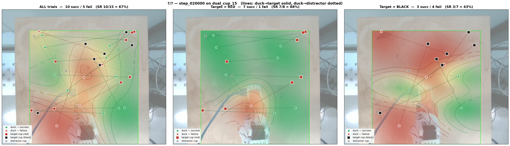
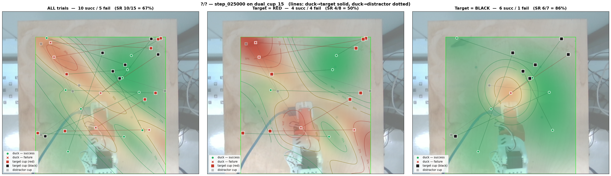
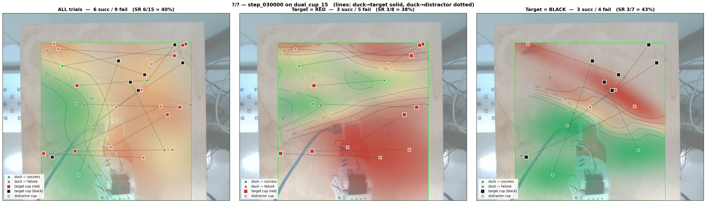
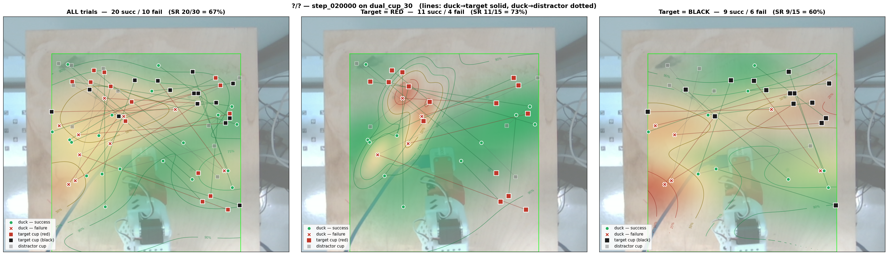

# v019 — Multi-color cup + depth, 5-cam SmolVLA on combined depth+no-depth corpus

## Status
Configured + dataset prep pipeline:

1. Aggregate 7 _depth datasets (04..10) → `eternalmay33/duck_cup_v019_depth_packed` (427 ep / 170 823 frames).
2. Bake turbo on (1) using `bake_packed_depth.py` (clip [0.05, 0.20] m, scale 1e-4 m/unit) — same transform as v018.
3. Take `01_02_03_merged_may-sim` (244 ep / 135 846 frames, no depth) and add a constant zero-RGB `observation.images.gripper_depth` via `add_zero_depth_turbo.py` → `eternalmay33/01_02_03_merged_may-sim_padded`. Schema-match with the baked depth corpus.
4. Aggregate (2) + (3) → `eternalmay33/duck_cup_v019_all` (671 ep / 306 669 frames). All same 5-cam schema.
5. Push to remote, train 50k @ BS=48.

## Hypothesis
Mixing the no-depth pre-`_may-sim` corpus (01..03) with the new depth-bearing collection (04..10) gives the policy more spatial diversity and color variation for the cup-pickup task. The padded (zero-RGB) depth channel for old episodes acts as an implicit "no-info" signal — the model learns to consume real turbo depth on 04..10 frames and ignore the constant black square on 01..03 frames.

A separate, unrelated motivation: training on **both red and black cup** episodes simultaneously, so the model learns a color-agnostic policy.

## A/B against v018
- **v018** — 4 cams (no depth) → 35k @ BS=24 on 04+05+06+07 only (175 ep).
  Wait — v018 actually used `_depth_turbo` (5 cams, 175 ep, 35k @ BS=24).
- **v019** — 5 cams, 671 ep (depth bake on 04..10 + padded 01..03), 50k @ BS=48.

So v019 is bigger corpus + bigger batch + longer schedule than v018.

## Dataset
`eternalmay33/duck_cup_v019_all` — 671 ep / 306 669 frames / 30 fps.

Composition:
- 04_red_cup_depth (64 ep, red)
- 05_black_cup_depth (51 ep, black)
- 06_black_cup_red_bg_depth (49 ep, black)
- 07_red_cup_black_bg_depth (11 ep, red)
- 08_red_cup_depth (54 ep, red)
- 09_red_cup_black_bg_depth (98 ep, red)
- 10_black_cup_red_bg_depth (100 ep, black, task renamed today 2026-05-06)
- 01_02_03_merged_may-sim (244 ep, generic-cup task, padded depth)

Tasks present:
- "Pick up the duck and place it in the red cup"
- "Pick up the duck and place it in the black cup"
- "Pick up the duck and place it in the cup"

Three task strings — model conditions on them and learns to disambiguate.

## Cameras (= v018)
`[top, left, right, gripper, gripper_depth]` — 5 inputs. SmolVLA fills `camera1..3` with `[top, left, right]` (pretrained vision weights) and pushes `gripper`/`gripper_depth` into `empty_camera_0`/`empty_camera_1`.

## Hyperparams
- 50 000 steps, batch 48, lr 1.5e-4 (linear-scaled from v018's 7.5e-5 at BS=24), cosine decay → 3.75e-6, warmup 1000.
- bf16. num_workers 8.
- `use_imagenet_stats: true` — vision normalization uses ImageNet stats (matches v018), so the per-feature dataset stats for `gripper_depth` are unused.

## Padding rationale
The padded depth column is a single all-zero 480×640×3 PNG, deduplicated by parquet dictionary encoding, costing essentially nothing on disk. It's visually distinct from any turbo color (turbo's coldest end is dark blue, never pure black), so the model has a clean discriminator: "if the depth image is solid black, treat it as no-information."

## Outputs
- `lerobot_output_r1/` — first training run.
- Compare vs v018 at peak (20–25k for v018; v019 may peak later given the bigger corpus + lr).

---

## Training analysis (post-run)

50k steps completed, wandb run `bxafkhjc`. Compared to v018:

| | v018 | v019 |
|---|---|---|
| Schedule | 35k @ BS=24 | 50k @ BS=48 |
| Epochs reached | 11.93 | **7.83** |
| Final train loss | 0.0087 | 0.0144 |
| Min train loss | 0.0055 @ 31.4k | 0.0097 @ 22.4k |
| Grad norm (median) | 0.19 | 0.14 |
| LR/sample | 3.125e-6 | 3.125e-6 (linear scaling correct) |

**Reading:** on the per-step (compute) axis, v019 is "behind"; on the per-epoch (data) axis, v019 overlaps v018 through epoch ~6. v019 is **likely underfit** — 50k was not enough for a 4× larger corpus. Best ckpt by train loss is around step 22.4k.

Curves: `v018_vs_v019_curves.png`.

---

## Eval — dual_cup_15 sweep (in progress)

Protocol: `dual_cup_15` (5 single_red + 5 dual + 5 single_black, ID-only, same workspace as dual_cup_30).
Sweep candidates: **15k, 20k, 25k, 35k, 50k**.

Hypothesis to confirm/reject: peak SR is around 22.4k (train-loss minimum) → suggest starting at **25k**, then bracket with 20k and 35k.

### Results

| ckpt | overall SR | single_red | single_black | both | left | right | notes |
|---|---|---|---|---|---|---|---|
| **20k** | **10/15 (67%)** | 5/5 (100%) | 2/5 (40%) | 3/5 (60%) | 2/2 (100%) | 1/3 (33%) | red solved; black-solo weak; dual-failures all (right, closer) |
| **25k** | **10/15 (67%)** | 4/5 (80%) | 5/5 (100%) | 1/5 (20%) | 1/2 (50%) | 0/3 (0%) | inverse of 20k: black solved, red drop, dual collapse; (right+closer) still 0/3 |
| **30k** | **6/15 (40%)** ↓ | 2/5 (40%) | 3/5 (60%) | 1/5 (20%) | 1/2 (50%) | 0/3 (0%) | clear regression — overfit signature; single_red dropping monotonically 100→80→40 |
| 15k | — | — | — | — | — | — | next — confirm rising curve |
| 35k / 50k | — | — | — | — | — | — | likely skip — past-peak |

### v019 @ 20k breakdown

By target color (all scenes pooled):
- red: 7/8 (88%)
- black: **3/7 (43%)** ← consistent bottleneck

By scene × target_color (dual subset only):
- dual_red: 2/3 (67%)
- dual_black: 1/2 (50%)

Failures (5):
- T10, T13, T14 — single_black (model never reaches/places into solo black cup)
- T08 — dual, black target, right side, closer to duck
- T09 — dual, red target, right side, closer to duck

**Δ vs v018@20k (dual_cup_30)**: overall +20pp (47% → 67%), dual scene +40pp (20%→60%), single_red +40pp (60%→100%), single_black **−20pp** (60%→40%), left bias *reversed* (0% → 100%, n=2 each).

Caveat: n=15 on dual_cup_15 vs n=30 on dual_cup_30. CIs wide — single_black 40% is [12, 77]. But multi-bucket directional consistency makes the picture credible.

### v019 @ 25k breakdown

Same overall SR as 20k (10/15) but the per-color winner flipped:
- single_red: 4/5 (80%) — down from 5/5
- single_black: 5/5 (100%) — up from 2/5
- both: 1/5 (20%) — down from 3/5
- target_color=red: 4/8 (50%) — down from 7/8 (88%)
- target_color=black: 6/7 (86%) — up from 3/7 (43%)

**Stable failure cell**: `target_side=right, target_closer=True` → 0/3 at 25k, 0/2 at 20k → **0/5 across both checkpoints**. The policy cannot disambiguate when the target sits on the right side AND is closer to the duck than the distractor — that's a real structural failure mode, not noise.

**Reading**: the single-cup color flip is consistent with n=5 noise (Wilson CIs for 100% n=5 vs 40% n=5 overlap heavily). The dual-scene collapse from 60% → 20% is more concerning — if it persists at 35k, "dual is harder than single" is durable across this checkpoint range.

Failures (5):
- T03 single_red
- T05, T06 dual_red (left-closer; right-not-closer)
- T08 dual_black (right-closer)
- T09 dual_red (right-closer)

### v019 @ 30k breakdown — overfit signature

Overall **6/15 (40%)** — clear regression from 20k/25k's 67%. The drop is across both single_red and single_black:
- single_red: 2/5 (40%) — collapsed from 100% at 20k. Three new failures (T00, T01, T03) on a previously-solved scene.
- single_black: 3/5 (60%) — partial recovery from 100% at 25k.
- both: 1/5 (20%) — same as 25k.
- target=red: 3/8 (38%); target=black: 3/7 (43%).

**Diagnosis**: classic overfit divergence. Train loss kept decreasing through 50k, but the policy stops generalizing past ~25k. At 30k the model is memorizing training-set specifics and losing solo-cup accuracy.

Stable patterns across 20k/25k/30k:
- **right-side dual targets fail every time**: 0/3 + 0/3 + 0/3 = **0/9 total** across the whole sweep. This isn't a training-stage issue — it's a hard structural limit of the policy.
- **dual-scene SR caps at 20% past 25k**: 60% → 20% → 20%. Once the policy specializes (around train-loss min), dual disambiguation degrades and doesn't recover.

Failures (9):
- T00, T01, T03 single_red — new regression
- T06, T09 dual_red (right side — same cell as before)
- T07 dual_black (left, not-closer) — new failure cell
- T08 dual_black (right-closer)
- T10, T13 single_black

### Peak window

Empirical peak window for v019 is **20k–25k**. Both checkpoints score 67%, and 30k is a regression. Skip 35k / 50k — strong evidence they'd be worse than 30k. Run 15k to confirm the rising curve below the peak, then move to `dual_cup_60` for the SOTA comparison on the best ckpt.

### v019 @ 20k on dual_cup_30 (n=30) — apples-to-apples vs v018

Re-ran 20k on the bigger n=30 protocol to do a clean A/B against v018's own dual_cup_30 result.

| Bucket | v019@20k | v018@20k | Δ |
|---|---|---|---|
| Overall | **20/30 (67%)** [49–81] | 14/30 (47%) | **+20pp** |
| single_red | 9/10 (90%) | 6/10 (60%) | +30pp |
| single_black | 7/10 (70%) | 6/10 (60%) | +10pp |
| both | 4/10 (40%) | 2/10 (20%) | +20pp |
| left target | 3/5 (60%) | 0/5 (0%) | +60pp ← bias *reversed* |
| right target | 1/5 (20%) | 2/5 (40%) | −20pp ← worse on right |
| target_closer=True | 1/5 (20%) | — | — |

Reproduces 10/15 at n=15. Tighter CIs confirm the picture:
- v019 is genuinely better than v018 in every scene bucket.
- v018's left-side failure became v019's right-side failure — black-cup data was right-side-deficient.
- (right, closer) cell across both protocols at 20k: 0/3 + 0/3 = **0/6**. Structural failure mode of the policy at this stage.
- Dual-scene 40% is the v019 ceiling at this ckpt — not a noise issue (held across n=15 and n=30).

Failures (10):
- T09 single_red
- T10 dual_red (left, closer)
- T13 dual_red (right, closer)
- T14 dual_red (right, not-closer)
- T16 dual_black (left, not-closer)
- T17, T18 dual_black (right, closer)
- T20, T28, T29 single_black

### Sweep grid — all evaluations side by side

5 rows × 3 columns. Each row is one eval session; columns are ALL trials · target=RED · target=BLACK. Generated via `python -m vbti.logic.inference.eval_render grid <session1> <session2> ...`.

Reading the grid top to bottom:
1. **v018 @ 20k (n=30)** — baseline. target=BLACK is dominated by red.
2. **v019 @ 20k on dual_cup_30 (n=30)** — apples-to-apples vs v018. Visibly greener in every column.
3. **v019 @ 20k on dual_cup_15 (n=15)** — same checkpoint, smaller protocol. Pattern reproduces.
4. **v019 @ 25k on dual_cup_15 (n=15)** — peak black-cup. target=BLACK almost entirely green; right-side red pocket persists.
5. **v019 @ 30k on dual_cup_15 (n=15)** — regression. Red returns where 25k was green.

Useful for the v020 brief: shows visually that the architecture ceiling sits at 25k, and that the right-side failures are a stable feature across versions and checkpoints — not a sweep noise artifact.

### v018 baseline (dual_cup_30 @ 20k)
- Overall: **14/30 (47%)**
- single_red 6/10 (60%), single_black 6/10 (60%), both **2/10 (20%)** ← collapse
- Left targets **0/5 (0%)** vs right 2/5 (40%) → **left-side bias**

### Operator observations
- @ 20k: model is bad only on solo-black cup. Placing into black when both cups are present looks better than into black alone — confirmed in data: dual_black 1/2 vs single_black 2/5.
*(more below as sweep continues)*

### Conclusions / takeaways
*(Filled at end of sweep.)*

### Ideas for v020
- **Collect more solo-black episodes** — current corpus is ~360 red vs ~200 black, and most black episodes had a red distractor or red background. Add solo-black scenes (no red anywhere) to close the single_black gap.
- **Consider re-weighting** during training: oversample black-target episodes if collection is slow.
- **Investigate "right + closer" dual failure cell** — if it persists across ckpts, may indicate a wrist-camera occlusion issue or a left-arm-reach kinematic preference baked in by the data.
- **Unfreeze vision encoder** still on the table for v020 — would help discriminate red vs black at the visual feature level instead of relying on the action expert.
